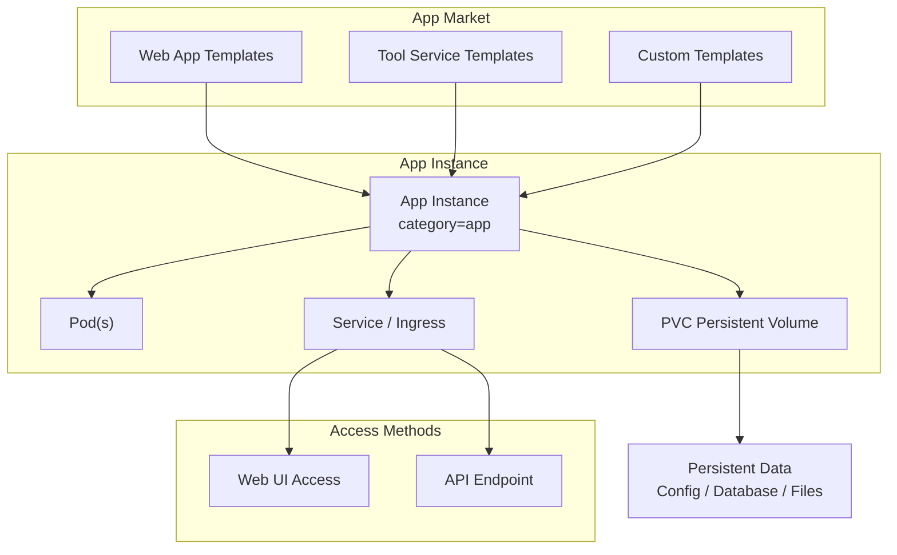
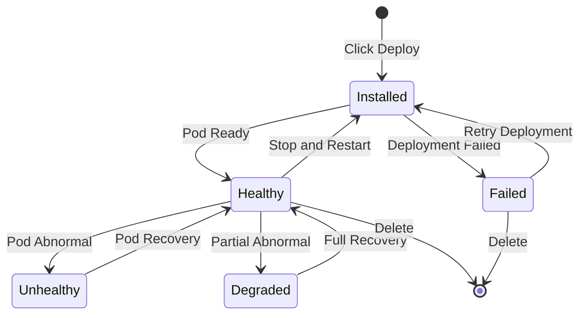

# App Management

## Feature Overview

App Management is a feature module in the Rune platform for deploying and managing various AI application instances. Unlike inference services (focused on model inference APIs) and fine-tuning services (focused on model training), App Management provides more general application deployment capabilities, supporting one-click deployment of various web applications, tool services, and custom workloads through the template market.

App Management services belong to the `category=app` category in the Instance architecture, sharing the same underlying instance model and deployment mechanism with inference, fine-tuning, experiment, and evaluation services. The app detail page provides an additional **PVC (Persistent Volume Claim) list** on top of standard instance information for managing application persistent storage.

### Core Capabilities

- **Template-Driven Deployment**: Select templates from the App Market for one-click deployment of various AI applications
- **Persistent Storage**: Manage application data persistence through PVC (PersistentVolumeClaim)
- **Web Access**: Access application web interface via URL after deployment
- **Full Lifecycle**: Supports create, start, stop, edit, delete operations
- **Multi-Dimensional Monitoring**: Integrated Prometheus monitoring panel, log viewer, and K8s event stream

### Application Deployment Architecture

## Navigation Path

Rune Workbench → Left Navigation → **Applications**

---

## Application List

The list page displays all application instances in the current workspace, providing quick overview and operation entry points.

### List Column Description

| Column | Description | Example |
|--------|-------------|---------|
| Name | Instance name (K8s resource name), click to enter details | `label-studio` |
| Status | Current running status badge | 🟢 Healthy |
| Flavor | Readable compute resource specification description | `4C8G` |
| Template | Application template and version used | `Label Studio v1.12` |
| Created At | Instance creation time | `2025-07-01 10:00` |
| Actions | Available actions | Web Access / Start-Stop / Edit / Delete |

### Status Badge Description

| Status | Color | Meaning |
|--------|-------|---------|
| Installed | 🔵 Blue | Helm Chart installed, resources being created |
| Healthy | 🟢 Green | Application running normally, accessible |
| Unhealthy | 🟡 Yellow | Some Pods not ready, application may be unavailable |
| Degraded | 🟠 Orange | Application running in degraded mode |
| Failed | 🔴 Red | Deployment failed or application crashed |

### Web Access Button

The application list provides a **Web Access** button (UrlSelectButton) for accessing the application's web interface directly through the browser.

> 💡 Tip: The Web Access button is only available when the instance status is Healthy. When the application exposes multiple endpoints, the button will provide an endpoint selection dropdown list.

### List Operations

- **Search**: Supports keyword search by instance name
- **Status Filter**: Dropdown to select status values for quick filtering of instances by specific status
- **Refresh**: Click the refresh button to get the latest status
- **Batch Operations**: Select multiple applications to batch start, stop, or delete

---

## Deploy Application

### Steps

1. Click the **Deploy** button in the upper right corner of the list page
2. Select an application template on the deployment page, can also jump from the App Market
3. Fill in basic information and template parameters
4. Configure storage volumes (as needed)
5. Confirm resource specifications and submit

### Basic Information Fields

| Field | Type | Required | Description |
|-------|------|----------|-------------|
| ID (Name) | Text | ✅ | K8s resource name, only lowercase letters, numbers, and hyphens, 1-63 characters |
| Display Name | Text | ✅ | Human-readable name for the instance, may include Chinese characters |
| Template | Select | ✅ | Application deployment template |
| Template Version | Select | ✅ | Template version number |
| Flavor | Select | ✅ | Compute resource specification (choose CPU or GPU flavor based on application needs) |
| Storage Volume | Select | — | Persistent storage volume for saving application data |

### Template Parameter Configuration

Template parameters are dynamically rendered through SchemaForm. Configurable parameters vary by selected template. Common parameters include:

| Parameter Category | Example Parameters | Description |
|-------------------|-------------------|-------------|
| App Settings | `admin_username`, `admin_password` | Application initial admin account |
| Network Config | `port`, `ingress_enabled` | Service port and exposure method |
| Database | `database_url`, `redis_url` | External database connection configuration |
| Environment Variables | Custom key-value pairs | Additional application runtime parameters |

> ⚠️ Note: Before deploying an application, confirm that the selected flavor has sufficient resource quota. If GPU is needed (e.g., AI drawing applications), select a GPU-enabled flavor.

---

## Application Detail Page

Click the application name to enter the detail page to view the following information:

### Basic Information

- **Instance Name**: K8s resource name and display name
- **Status**: Current running status
- **Template Info**: Template name and version used
- **Flavor**: Allocated compute resources (CPU / Memory / GPU)
- **Access URL**: Web URL exposed by the application
- **Created/Updated Time**: Lifecycle timestamps

### PVC List (Persistent Volume Claims)

The app detail page features a unique **PVC List** (InstancePVCList) displaying all persistent volume claims associated with the application:

| Field | Description |
|-------|-------------|
| PVC Name | K8s name of the persistent volume claim |
| Status | Bound / Pending / Lost |
| Capacity | Storage capacity requested by the PVC |
| Storage Class | StorageClass used |
| Access Mode | ReadWriteOnce / ReadWriteMany |
| Created At | PVC creation time |

> 💡 Tip: PVC lifecycle is independent of the application instance. When deleting an application, you can choose whether to retain associated PVC data. This is very useful in scenarios where application data needs to be preserved (such as database files, uploaded files, etc.).

### Pod List

Displays all Kubernetes Pods associated with the application instance:

| Field | Description |
|-------|-------------|
| Pod Name | K8s Pod name |
| Status | Running / Pending / Failed, etc. |
| Node | K8s node where the Pod is running |
| Restart Count | Container restart count |
| Created At | Pod creation time |

### Monitoring and Logs

- **Monitoring Panel**: Prometheus/Grafana-style instance monitoring panel displaying CPU, memory, network, and other metrics
- **Log Viewer**: Supports real-time and historical log queries with LogQL syntax
- **K8s Events**: Displays Kubernetes event stream related to the instance

---

## Application Types and Use Cases

Through different templates available in the App Market, users can deploy various types of AI applications:

| Application Type | Typical Templates | Use Cases |
|-----------------|-------------------|-----------|
| Data Labeling | Label Studio, Doccano | Training data labeling and management |
| Visualization Tools | TensorBoard, Weights & Biases | Training process visualization |
| Model Registry | Model Registry | Model version management and distribution |
| Web Applications | Gradio, Streamlit | AI application prototypes and demos |
| Data Processing | Apache Spark, Dask | Large-scale data processing |
| Custom Services | Custom Helm Chart | Any user-defined services |

---

## Application Lifecycle

### Lifecycle Operations

| Operation | Description | Prerequisites |
|-----------|-------------|---------------|
| Deploy | Create a new application instance | Sufficient resource quota |
| Start | Start a stopped application | Application is stopped |
| Stop | Stop a running application, release compute resources | Application is running |
| Edit | Modify application parameters or flavor | — |
| Delete | Delete application instance | — |

> ⚠️ Note: Stopping an application releases CPU/GPU compute resources, but PVC data is preserved. After restarting, the application can continue using previous persistent data.

---

## PVC Management Best Practices

### When to Use PVC

- **Database Applications**: Need to persist database files
- **File Management Applications**: Need to save user-uploaded files
- **Stateful Services**: Need to restore state after restart
- **Shared Data**: Multiple application instances need to share data (use ReadWriteMany mode)

### PVC Capacity Planning

| Application Type | Recommended Capacity | Description |
|-----------------|---------------------|-------------|
| Data Labeling Tools | 50-200 Gi | Store labeling data and uploaded raw data |
| Visualization Tools | 10-50 Gi | Store logs and cache |
| Model Registry | 200-1000 Gi | Store model weight files |
| General Web Applications | 10-50 Gi | Store configuration and runtime data |

> 💡 Tip: PVC capacity typically cannot be reduced after creation. It is recommended to allocate adequate space during planning. If using a StorageClass that supports dynamic expansion, capacity can be increased on demand later.

---

## Permission Requirements

| Operation | Required Role |
|-----------|--------------|
| View application list | ADMIN / DEVELOPER / MEMBER |
| Deploy new application | ADMIN / DEVELOPER |
| Web access application | ADMIN / DEVELOPER |
| Start/Stop/Edit | ADMIN / DEVELOPER |
| Delete application | ADMIN / DEVELOPER |
