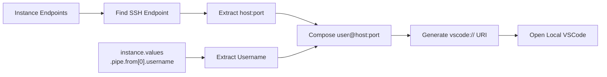
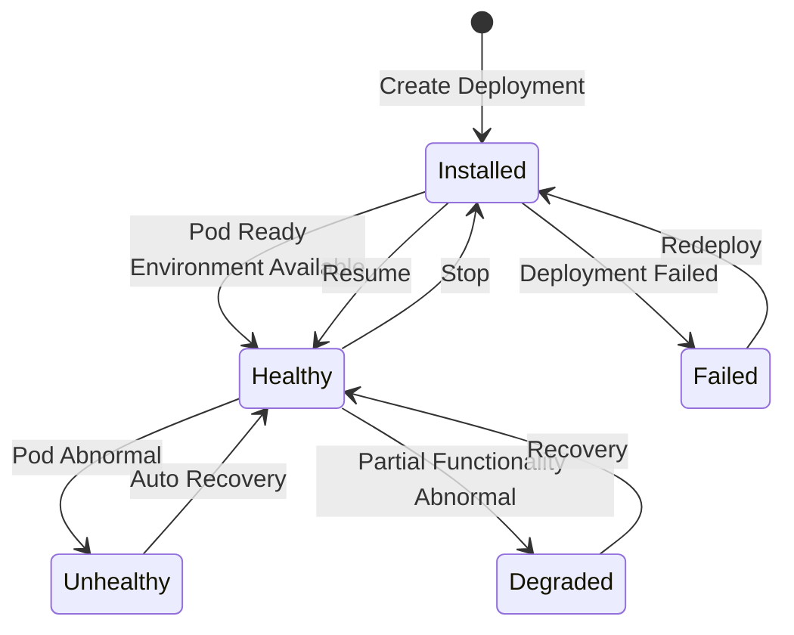

# Dev Environments

## Feature Overview

Dev Environments (Interactive Machine Learning, `category=im`) allow users to launch interactive AI development environments on the Rune platform for model development, data exploration, algorithm prototyping, and debugging. The platform supports two access methods: **VSCode SSH remote connection** and **JupyterLab Web access**, catering to both professional development and interactive exploration needs.

Dev environments are built on the unified Instance architecture (`category=im`), sharing the same template-driven deployment mechanism and lifecycle management with inference and fine-tuning services.

### Core Capabilities

- **VSCode SSH Remote Development**: Connect directly to the cloud development environment from local VSCode via SSH for a complete IDE experience
- **JupyterLab Web Access**: Access JupyterLab through the browser for interactive data analysis and model debugging
- **GPU-Accelerated Computing**: GPU resources can be allocated for large-scale model training and inference debugging
- **Persistent Storage**: Persistent code and data through mounted storage volumes, no data loss on environment restart
- **Elastic Start/Stop**: Support start and stop at any time, releasing GPU resources when stopped to save costs

## Navigation Path

Rune Workbench → Left Navigation → **Dev Environments**

---

## Dev Environment List


The list page displays all dev environment instances in the current workspace.

### List Column Description

| Column | Description | Example |
|--------|-------------|---------|
| Name | Instance name (K8s resource name), click to enter details | `my-jupyter-dev` |
| Status | Current running status badge | 🟢 Healthy |
| Flavor | Compute resource specification description | `8C16G 1GPU` |
| Template | Dev environment template and version used | `JupyterLab v3.6` |
| Created At | Instance creation time | `2025-06-15 09:00` |
| Actions | Available action buttons | SSH Connect / Web Access / Stop / Delete |

### Status Description

| Status | Color | Meaning |
|--------|-------|---------|
| Installed | 🔵 Blue | Helm Chart installed, environment initializing/stopped |
| Healthy | 🟢 Green | Environment running normally, ready for connection |
| Unhealthy | 🟡 Yellow | Environment has issues, may affect usage |
| Degraded | 🟠 Orange | Environment running in degraded mode |
| Failed | 🔴 Red | Environment deployment or startup failed |

---

## Create Dev Environment

### Steps

1. Click the **Deploy** button in the upper right corner of the list page
2. Select a dev environment template (e.g., JupyterLab, VSCode Server, etc.)
3. Fill in basic information (ID, name, description)
4. Select compute flavor
5. Configure template parameters in SchemaForm
6. Mount storage volumes for persistent code and data (recommended)
7. Confirm and submit


### Configuration Fields

| Field | Type | Required | Description |
|-------|------|----------|-------------|
| ID | Text | ✅ | K8s resource name, only lowercase letters, numbers, and hyphens, 1-63 characters |
| Display Name | Text | ✅ | Human-readable name for the environment |
| Description | Text Area | — | Environment description |
| Template | Select | ✅ | Dev environment type template |
| Flavor | Select | ✅ | Compute resource specification (CPU/Memory/GPU) |
| Storage Volume | Select | — | Persistent storage volume to mount |

> 💡 Tip: Strongly recommended to mount a storage volume. Dev environments themselves are stateless — files inside the container will be lost after stopping or rebuilding. Only data in storage volumes will persist.

### Template Parameters (SchemaForm)

Like inference and fine-tuning services, dev environment template parameters are dynamically rendered through SchemaForm, supporting both graphical mode and JSON edit mode. Different templates provide different configurable parameters.

---

## Using Dev Environments

After the dev environment starts successfully (status **Healthy**), two access methods are supported:

### Method 1: VSCode SSH Remote Connection

VSCode SSH connection is the core feature of dev environments, allowing users to connect directly to the remote dev environment from local VSCode for a complete IDE experience (code completion, debugging, terminal, etc.).


#### Connection Mechanism

The system obtains SSH connection information through the following process:

1. Find SSH-type endpoints from the instance's endpoints list
2. Extract connection address information: `user@host:port`
3. Parse the username from the `instance.values.pipe.from[0].username` field
4. Generate `vscode://` URI protocol link



#### Steps

1. Ensure **Visual Studio Code** and the **Remote - SSH** extension are installed locally
2. Find the VSCode SSH connection button in the dev environment list or detail page
3. The button uses a split button design with two functions:

| Action | Description |
|--------|-------------|
| **Connect (Main Button)** | Directly opens local VSCode and initiates SSH connection, equivalent to triggering a `vscode://` URI |
| **Copy Command (Dropdown)** | Copies command to clipboard: `code --new-window --remote ssh-remote+user@host:port` |

4. After clicking **Connect**, the browser may show a "Open Visual Studio Code?" confirmation prompt — click confirm
5. VSCode will open a new window and automatically establish the SSH connection

> 💡 Tip: For manual connection, you can use the copied command in the terminal, or press `Ctrl+Shift+P` in VSCode → `Remote-SSH: Connect to Host` and enter the connection address.

#### Multiple SSH Endpoint Handling

When the instance exposes multiple SSH endpoints, the button will display as a dropdown menu, allowing users to select the target endpoint to connect to.

> ⚠️ Note: VSCode SSH connection is only available when the instance status is **Healthy**. The button will be disabled in Installed, Failed, and other states.

### Method 2: JupyterLab Web Access

JupyterLab provides an in-browser interactive development experience through web endpoints, using the same **UrlSelectButton** component as fine-tuning services.


#### Steps

1. Click the **Web Access** button in the list or detail page
2. JupyterLab interface opens in a new browser tab
3. Start writing code and running Notebooks

#### URL Priority Rules

Consistent with fine-tuning services — when the instance exposes multiple web endpoints, selection follows this priority:

1. **External + UI/Web/Console type endpoints** (highest priority)
2. **External other endpoints**
3. **Internal endpoints** (lowest priority)

---

## File Persistence

Pay special attention to the persistence strategy for dev environments:

| Storage Location | Persistent? | Description |
|-----------------|-------------|-------------|
| Mounted storage volume path | ✅ Yes | Data preserved after stopping/restarting/deleting the environment |
| Other paths inside container | ❌ No | Data lost after environment stops or is rebuilt |

> ⚠️ Note: Be sure to save important code files, datasets, and training outputs to the mounted storage volume path. Unmounted paths inside the container (such as `/tmp`, `/home/user`, etc.) will be cleared after the environment stops.

### Recommended Directory Organization

```
/mnt/storage/          # Storage volume mount point
├── code/              # Project source code
├── datasets/          # Training/test datasets
├── models/            # Model weight files
├── outputs/           # Experiment output results
└── notebooks/         # Jupyter Notebook files
```

---

## Environment Lifecycle

Dev environments support elastic start/stop, suitable for intermittent usage scenarios:



### Lifecycle Operations

| Operation | Pre-condition Status | Target Status | Description |
|-----------|---------------------|---------------|-------------|
| Create | — | Installed | Install Helm Chart, create environment resources |
| Resume | Installed (stopped) | Healthy | Resume environment, recreate Pods |
| Stop | Healthy | Installed | Release GPU/CPU resources, Pods are cleared |
| Delete | Any | — | Permanently delete environment and all K8s resources |

> 💡 Tip: The stop operation only releases compute resources (GPU/CPU/Memory) and does not affect mounted storage volume data. After resuming, the environment configuration remains the same, and you can continue your previous work. **Please stop promptly when not in use** to release valuable GPU resources for other users.

---

## Detail Page

Click the instance name to enter the detail page, which includes the following tabs:

### Overview

- **ServiceInfoCard**: Instance ID, name, status, template, flavor, creation time, endpoint addresses
- **PodList**: Associated Pod names, status, restart count, node location

### Monitoring

Integrated Prometheus dashboard displaying resource usage:
- GPU utilization and memory usage
- CPU usage
- Memory usage
- Disk I/O
- Network traffic

### Logging

Real-time Pod container log viewing, with multi-container switching and log search support.

### Events

Kubernetes event stream including Pod scheduling, image pulling, container startup events.

---

## Permission Requirements

| Operation | Required Role |
|-----------|--------------|
| View list and details | ADMIN / DEVELOPER / MEMBER |
| Create dev environment | ADMIN / DEVELOPER |
| SSH connect / Web access | ADMIN / DEVELOPER |
| Start/Stop | ADMIN / DEVELOPER |
| Delete | ADMIN / DEVELOPER |
| View monitoring and logs | ADMIN / DEVELOPER / MEMBER |

---

## Troubleshooting

### SSH Connection Failed

1. **Confirm instance status is Healthy**: SSH service is only available in Healthy status
2. **Check Remote-SSH Extension**: Ensure VSCode has the `Remote - SSH` extension installed
3. **Check Network Connectivity**: Confirm local network can access the SSH endpoint address and port
4. **Check Firewall**: Some corporate networks may block SSH connections on non-standard ports
5. **Check SSH Endpoint**: In the instance detail's endpoint list, confirm the SSH endpoint is properly exposed
6. **Manual Connection Test**: Run `ssh user@host -p port` in the terminal to test connectivity

### Cannot Access JupyterLab

1. Confirm instance status is Healthy
2. Check if the browser is blocking pop-up windows
3. Try entering the endpoint URL directly in the address bar
4. Clear browser cache and retry

### Slow Environment Startup

- First startup requires pulling container images, which may take longer
- Check image pull progress on the events page
- Large dev environment images (containing CUDA toolchains, etc.) may exceed 10GB

### Storage Volume Data Not Visible

- Confirm the storage volume is properly mounted to the instance
- Check if the mount path matches expectations
- Confirm storage volume status is Bound

---

## Best Practices

- **Choose Appropriate Flavors**: Use smaller CPU flavors for daily development, and GPU environments only during training debugging
- **Stop Idle Environments Promptly**: Stop environments when off work or not in use to release resources
- **Use Storage Volumes Wisely**: Put all project files in storage volumes with a well-organized directory structure
- **Save Work Regularly**: Use Git for version management to avoid accidental code loss
- **Use SSH Key Authentication**: Upload public keys in the platform's SSH Key management to avoid entering passwords each time
- **Use VSCode Extensions**: Install Python, Jupyter, and other extensions to enhance the remote development experience
