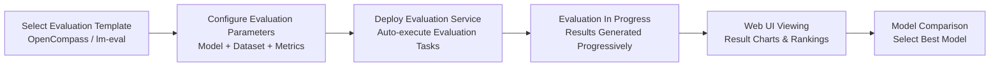
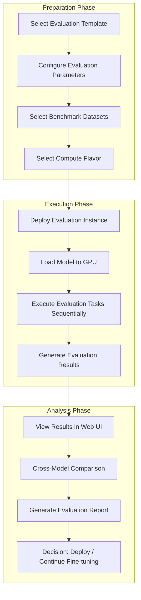

# Evaluation Management

## Feature Overview

Evaluation Management is a feature module in the Rune platform for systematic performance evaluation of AI models. After model training or fine-tuning, users need to measure model performance across different tasks through standardized benchmarks, such as language understanding, reasoning ability, code generation, knowledge Q&A, etc. The evaluation management service automates and visualizes this process.

Evaluation management services belong to the `category=evaluation` category in the Instance architecture, sharing the same underlying instance model and deployment mechanism with inference, fine-tuning, and experiment services. Benchmark datasets, evaluation metrics, and result displays are all provided by the template-embedded web application, allowing users to view and compare evaluation results intuitively through the Web UI.

### Core Capabilities

- **Template-Driven Deployment**: One-click deployment of evaluation tools (such as OpenCompass, lm-evaluation-harness, etc.) based on Helm Chart templates
- **Multi-Dimensional Evaluation**: Supports various evaluation benchmarks and metric types for comprehensive model capability assessment
- **Web Visualization**: View evaluation results, compare model performance through template-embedded web applications
- **Automated Workflow**: System automatically executes evaluations and generates reports after configuring evaluation parameters
- **Full Lifecycle Management**: Supports create, start, stop, delete, and other full lifecycle operations

### Evaluation Workflow

## Navigation Path

Rune Workbench → Left Navigation → **Evaluations**

---

## Evaluation Task List

The list page displays all evaluation task instances in the current workspace, providing quick overview and operation entry points.

### List Column Description

| Column | Description | Example |
|--------|-------------|---------|
| Name | Instance name (K8s resource name), click to enter details | `llama3-eval-mmlu` |
| Status | Current running status badge | 🟢 Healthy |
| Flavor | Readable compute resource specification description | `8C16G 1GPU` |
| Template | Evaluation template and version used | `OpenCompass v0.3` |
| Created At | Task creation time | `2025-06-22 14:00` |
| Actions | Available actions | Web Access / Stop / Delete |

### Status Badge Description

| Status | Color | Meaning |
|--------|-------|---------|
| Installed | 🔵 Blue | Helm Chart installed, evaluation environment initializing |
| Healthy | 🟢 Green | Evaluation service running normally, results viewable via Web UI |
| Unhealthy | 🟡 Yellow | Some Pods not ready |
| Succeeded | ⚪ Gray | Evaluation task completed ✅ |
| Failed | 🔴 Red | Evaluation failed ❌ |
| Degraded | 🟠 Orange | Service running in degraded mode |

### Web Access Button

The evaluation service list provides a **Web Access** button (UrlSelectButton) for accessing the evaluation tool's Web UI to view evaluation results, leaderboards, and detailed reports.

> 💡 Tip: The Web Access button is only available when the instance status is Healthy. The evaluation tool's web interface is provided by the template, so different templates may have different interface styles.

---

## Create Evaluation Task

### Steps

1. Click the **Deploy** button in the upper right corner of the list page
2. Select an evaluation template (e.g., OpenCompass, lm-evaluation-harness) on the deployment page, can also jump from the App Market
3. Fill in basic information and template parameters
4. Confirm resource specifications and submit

### Basic Information Fields

| Field | Type | Required | Description |
|-------|------|----------|-------------|
| ID (Name) | Text | ✅ | K8s resource name, only lowercase letters, numbers, and hyphens, 1-63 characters |
| Display Name | Text | ✅ | Human-readable name for the instance, may include Chinese characters |
| Template | Select | ✅ | Evaluation template (OpenCompass / lm-eval, etc.) |
| Template Version | Select | ✅ | Template version number |
| Flavor | Select | ✅ | Compute resource specification; evaluating large models typically requires GPU |
| Storage Volume | Select | — | Persistent storage for saving evaluation data and results |

### Template Parameter Configuration

Template parameters are dynamically rendered through SchemaForm. Common evaluation parameter categories include:

| Parameter Category | Example Parameters | Description |
|-------------------|-------------------|-------------|
| Model Configuration | `model_path`, `model_name` | Path or name of the model to evaluate |
| Datasets | `datasets`, `benchmark_suite` | Evaluation datasets or benchmark suites |
| Evaluation Settings | `batch_size`, `num_fewshot` | Inference batch size, few-shot example count |
| Output Configuration | `output_dir`, `report_format` | Result output directory and report format |
| Environment Variables | Custom key-value pairs | Additional environment variables |

> ⚠️ Note: Evaluating large language models typically requires loading the full model into GPU memory. Please select a sufficiently large GPU flavor based on model parameter count. For example, evaluating a 70B model typically requires at least 4×A100 80G.

---

## Evaluation Benchmark Datasets

Templates supported by the platform typically pre-integrate mainstream evaluation benchmarks covering multi-dimensional model capability assessment:

### General Language Capabilities

| Benchmark | Evaluation Dimension | Description |
|-----------|---------------------|-------------|
| MMLU | Knowledge Understanding | Multiple-choice questions across 57 subjects, assessing model knowledge breadth |
| C-Eval | Chinese Knowledge | Chinese evaluation benchmark across 52 subjects |
| HellaSwag | Common Sense Reasoning | Common sense reasoning in everyday scenarios |
| ARC | Science Reasoning | Science Q&A at elementary to middle school level |

### Specialized Capabilities

| Benchmark | Evaluation Dimension | Description |
|-----------|---------------------|-------------|
| HumanEval | Code Generation | Python programming problems, evaluating code generation quality |
| GSM8K | Math Reasoning | Elementary math word problems |
| TruthfulQA | Factual Accuracy | Evaluating truthfulness and accuracy of model responses |
| BBH | Complex Reasoning | BIG-Bench subset, evaluating more challenging reasoning capabilities |

---

## Evaluation Metric Types

Different types of evaluation metrics are used depending on the evaluation task:

| Metric Type | Common Metrics | Applicable Scenarios |
|-------------|---------------|---------------------|
| Accuracy | Accuracy, Top-K Accuracy | Classification tasks, multiple-choice evaluations |
| Generation Quality | BLEU, ROUGE, METEOR | Text generation, translation, summarization |
| Code Ability | Pass@K, Execution Rate | Code generation evaluation |
| Reasoning Ability | Exact Match, F1 Score | Reading comprehension, math reasoning |
| Safety | Toxicity Score, Bias Score | Safety and bias assessment |

---

## Evaluation Detail Page

Click the evaluation task name to enter the detail page to view the following information:

### Basic Information

- **Instance Name**: K8s resource name and display name
- **Status**: Current running status
- **Template Info**: Template name and version used
- **Flavor**: Allocated compute resources (CPU / Memory / GPU)
- **Created/Updated Time**: Lifecycle timestamps

### Pod List

Displays all Kubernetes Pods associated with the instance:

| Field | Description |
|-------|-------------|
| Pod Name | K8s Pod name |
| Status | Running / Pending / Failed, etc. |
| Node | K8s node where the Pod is running |
| Restart Count | Container restart count |

### Monitoring and Logs

- **Monitoring Panel**: Prometheus/Grafana-style instance monitoring panel
- **Log Viewer**: Supports real-time and historical log queries
- **K8s Events**: Displays Kubernetes event stream related to the instance

---

## Viewing Evaluation Results via Web UI

The evaluation service's Web UI is provided by the template and supports the following features:

### Results Overview

- **Overall Score/Ranking**: Model's comprehensive score across benchmarks
- **Dimension Scores**: Detailed scores by knowledge, reasoning, code, math, and other dimensions
- **Radar Chart**: Visual comparison of multi-dimensional capabilities

### Model Comparison

Multiple model evaluation results can be compared in the Web UI:

1. Select models to compare (at least 2)
2. View side-by-side score comparison across dimensions
3. View detailed performance differences on each benchmark dataset
4. Export comparison reports

> 💡 Tip: It is recommended to run evaluations before and after fine-tuning, and measure fine-tuning effectiveness by comparing score changes. If scores decrease in certain dimensions, there may be a "Catastrophic Forgetting" issue.

---

## Full Evaluation Process

---

## Best Practices

### Evaluation Strategy

1. **Baseline Comparison**: Always retain evaluation results from the baseline model (original model without fine-tuning) as a reference for fine-tuning effectiveness
2. **Comprehensive Evaluation**: Evaluate not only fine-tuning task-related metrics but also monitor whether capabilities in other dimensions have decreased
3. **Multi-Round Evaluation**: For different checkpoints during the fine-tuning process, evaluate separately to observe training trends
4. **Unified Environment**: Ensure different evaluations use the same evaluation template and version to guarantee result comparability

### Resource Planning

- Evaluations typically require GPU resources for model inference but don't need the same resource level as training
- For large-parameter models, quantized versions (e.g., INT8/INT4) can be used for evaluation to reduce resource requirements
- It is recommended to schedule evaluation tasks separately from inference services to avoid resource contention

### Result Analysis

- Focus on both absolute scores and relative rankings, comparing with published Leaderboard results
- Analyze performance differences across difficulty-level subsets to identify weaknesses and optimize accordingly
- Retain evaluation configuration and data version information to ensure result reproducibility

> ⚠️ Note: Evaluation results from different evaluation tools and versions may not be fully comparable. When comparing models, ensure the same evaluation template and configuration are used.

---

## Permission Requirements

| Operation | Required Role |
|-----------|--------------|
| View evaluation list | ADMIN / DEVELOPER / MEMBER |
| Create evaluation task | ADMIN / DEVELOPER |
| Web access evaluation UI | ADMIN / DEVELOPER |
| Stop/Delete evaluation | ADMIN / DEVELOPER |
