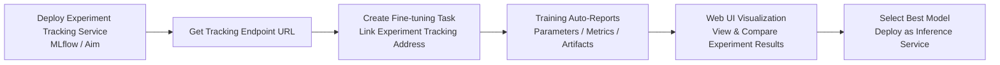
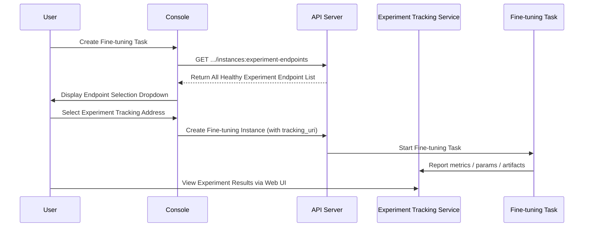

# Experiment Management

## Feature Overview

Experiment Management (Experiment Tracking) is a core feature module in the Rune platform for tracking, recording, and comparing machine learning experiments. During model development, researchers and engineers typically need to repeatedly adjust hyperparameters, swap datasets, and try different model architectures. The experiment management service provides a unified platform to record each experiment's Parameters, Metrics, and Artifacts, enabling experiment traceability and reproducibility.

Experiment management services belong to the `category=experiment` category in the Instance architecture, sharing the same underlying instance model and deployment mechanism with inference and fine-tuning services. The platform provides mainstream experiment tracking tools (such as MLflow, Aim, etc.) through the template market, allowing users to deploy experiment tracking services with one click and manage experiments through the Web UI.

### Core Capabilities

- **Template-Driven Deployment**: One-click deployment of mainstream experiment tracking tools like MLflow and Aim based on Helm Chart templates
- **Metrics and Parameter Tracking**: Record hyperparameters, loss curves, evaluation metrics, and other key data for each training run
- **Artifact Management**: Store and version-manage model files, dataset snapshots, configuration files, and other experiment artifacts
- **Experiment Comparison**: Visually compare multiple experiment results through the embedded Web UI to quickly identify optimal configurations
- **Fine-tuning Integration**: Experiment tracking service endpoints can be used as the Experiment Tracking Server address when creating fine-tuning tasks
- **Full Lifecycle Management**: Supports create, start, stop, edit, delete, and other full lifecycle operations

### Experiment Tracking Workflow

## Navigation Path

Rune Workbench → Left Navigation → **Experiments**

---

## Experiment Service List

The list page displays all experiment tracking service instances in the current workspace, providing quick overview and operation entry points.

### List Column Description

| Column | Description | Example |
|--------|-------------|---------|
| Name | Instance name (K8s resource name), click to enter details | `mlflow-tracking` |
| Status | Current running status badge | 🟢 Healthy |
| Flavor | Readable compute resource specification description | `4C8G` |
| Template | Experiment template and version used | `MLflow v2.10` |
| Created At | Instance creation time | `2025-06-20 09:00` |
| Actions | Available actions | Web Access / Stop / Delete |

### Status Badge Description

| Status | Color | Meaning |
|--------|-------|---------|
| Installed | 🔵 Blue | Helm Chart installed, resources being created |
| Healthy | 🟢 Green | Service running normally, accessible via Web UI |
| Unhealthy | 🟡 Yellow | Some Pods not ready, service may be unavailable |
| Degraded | 🟠 Orange | Service running in degraded mode |
| Failed | 🔴 Red | Deployment failed or service crashed |

### Web Access Button

The experiment service list provides a **Web Access** button (UrlSelectButton) for accessing the experiment tracking tool's Web UI directly through the browser (e.g., MLflow Dashboard, Aim Explorer).

> 💡 Tip: The Web Access button is only available when the instance status is Healthy. Clicking will open the experiment tracking web interface in a new tab.

---

## Create Experiment Tracking Service

### Steps

1. Click the **Deploy** button in the upper right corner of the list page
2. Select an experiment template (e.g., MLflow, Aim) on the deployment page, can also jump from the App Market
3. Fill in basic information and template parameters
4. Confirm resource specifications and submit

### Basic Information Fields

| Field | Type | Required | Description |
|-------|------|----------|-------------|
| ID (Name) | Text | ✅ | K8s resource name, only lowercase letters, numbers, and hyphens, 1-63 characters |
| Display Name | Text | ✅ | Human-readable name for the instance, may include Chinese characters |
| Template | Select | ✅ | Experiment tracking template (MLflow / Aim, etc.) |
| Template Version | Select | ✅ | Template version number |
| Flavor | Select | ✅ | Compute resource specification |
| Storage Volume | Select | — | Persistent storage for saving experiment data and artifacts |

### Template Parameter Configuration

Template parameters are dynamically rendered through SchemaForm. Configurable parameters vary by selected template. Common parameters include:

| Parameter Category | Example Parameters | Description |
|-------------------|-------------------|-------------|
| Backend Storage | `artifact_root` | Artifact storage path (local or S3) |
| Database | `backend_store_uri` | Metadata database connection address |
| Authentication | `auth_enabled` | Whether to enable access authentication |
| Environment Variables | Custom key-value pairs | Additional environment variable configuration |

> ⚠️ Note: It is recommended to mount a persistent storage volume for experiment tracking services to prevent experiment data loss after instance restart.

---

## Experiment Endpoints and Fine-tuning Integration

One of the core values of experiment tracking services is integration with fine-tuning tasks. The platform provides a dedicated API `listExperimentEndpoints` to retrieve all healthy experiment tracking service endpoints.

### How It Works

### Endpoint Query API

- **Interface**: `GET /api/v1/tenants/{tenant}/clusters/{cluster}/workspaces/{workspace}/instances:experiment-endpoints`
- **Returns**: Endpoint list of all experiment tracking instances with Healthy status
- **Usage**: Used as a candidate list for the Experiment Tracking Server address when creating fine-tuning tasks

> 💡 Tip: In the fine-tuning task creation form, the "Experiment Tracking Address" field will automatically call this API and display available experiment endpoints as a dropdown list. Once selected, the training process will automatically report metric data to the corresponding tracking service.

---

## Experiment Detail Page

Click the experiment service name to enter the detail page to view the following information:

### Basic Information

- **Instance Name**: K8s resource name and display name
- **Status**: Current running status
- **Template Info**: Template name and version used
- **Flavor**: Allocated compute resources (CPU / Memory / GPU)
- **Created/Updated Time**: Lifecycle timestamps

### Pod List

Displays all Kubernetes Pods associated with the instance:

| Field | Description |
|-------|-------------|
| Pod Name | K8s Pod name |
| Status | Running / Pending / Failed, etc. |
| Node | K8s node where the Pod is running |
| Restart Count | Container restart count |
| Created At | Pod creation time |

### Monitoring and Logs

- **Monitoring Panel**: Prometheus/Grafana-style instance monitoring panel displaying CPU, memory, network, and other metrics
- **Log Viewer**: Supports real-time and historical log queries with LogQL syntax
- **K8s Events**: Displays Kubernetes event stream related to the instance

---

## Managing Experiments via Web UI

### MLflow

MLflow is the most commonly used experiment tracking tool. After deployment, the following operations can be performed through the Web UI:

- **Experiments View**: View all Runs grouped by experiment
- **Run Details**: View parameters, metric curves, and artifact list for each training run
- **Comparison View**: Select multiple Runs for visual metric comparison
- **Model Registration**: Register excellent models to the MLflow Model Registry

### Aim

Aim provides richer visualization capabilities:

- **Metrics Explorer**: Interactive metric exploration with grouping and aggregation support
- **Params Explorer**: Hyperparameter space visualization
- **Images/Audio Explorer**: Multimedia artifact browsing
- **Runs Comparison**: Multi-dimensional comparison of different experiment runs

---

## Experiment Tracking Data Types

Through the experiment tracking tools embedded in templates, the following types of data can be recorded:

| Data Type | Description | Example |
|-----------|-------------|---------|
| Parameters | Training hyperparameters and configuration | `learning_rate=0.001`, `batch_size=32` |
| Metrics | Evaluation metrics during training | `loss`, `accuracy`, `f1_score` |
| Artifacts | Model files and other outputs | Model weights, confusion matrix charts, configuration files |
| Tags | Custom labels | `best_model`, `production_ready` |

---

## Best Practices

### Experiment Management Standards

1. **Naming Conventions**: Use meaningful experiment names like `llama3-sft-medical-v2`, including model, method, and domain information
2. **Parameter Recording**: Ensure all hyperparameters that affect results are completely recorded for reproducibility
3. **Metric Selection**: Choose appropriate evaluation metrics for different tasks (F1 for classification, BLEU/ROUGE for generation, etc.)
4. **Artifact Preservation**: Save model checkpoints, training configurations, data preprocessing scripts, and other key artifacts

### Resource Planning

- Experiment tracking services (like MLflow Server) typically don't need GPU — CPU flavors are sufficient
- Mount enough storage space for tracking services, especially when using local artifact storage
- It is recommended to deploy one shared experiment tracking service per workspace for multiple fine-tuning tasks to use

### Collaboration with Fine-tuning Services

1. Deploy the experiment tracking service first and confirm its status is Healthy
2. Select the corresponding experiment endpoint when creating a fine-tuning task
3. After training completes, compare different fine-tuning results through the Web UI
4. Select the best model and deploy it as an inference service

> 💡 Tip: In many fine-tuning templates, integration logic with MLflow/Aim is already pre-configured — just fill in the correct tracking server address when creating, and experiment data will be automatically reported.

---

## Permission Requirements

| Operation | Required Role |
|-----------|--------------|
| View experiment list | ADMIN / DEVELOPER / MEMBER |
| Create experiment service | ADMIN / DEVELOPER |
| Web access experiment UI | ADMIN / DEVELOPER |
| Start/Stop/Edit | ADMIN / DEVELOPER |
| Delete experiment service | ADMIN / DEVELOPER |
