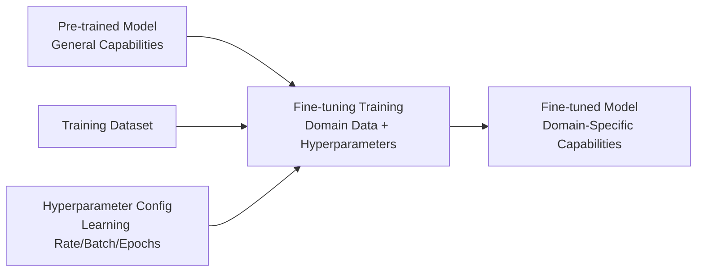
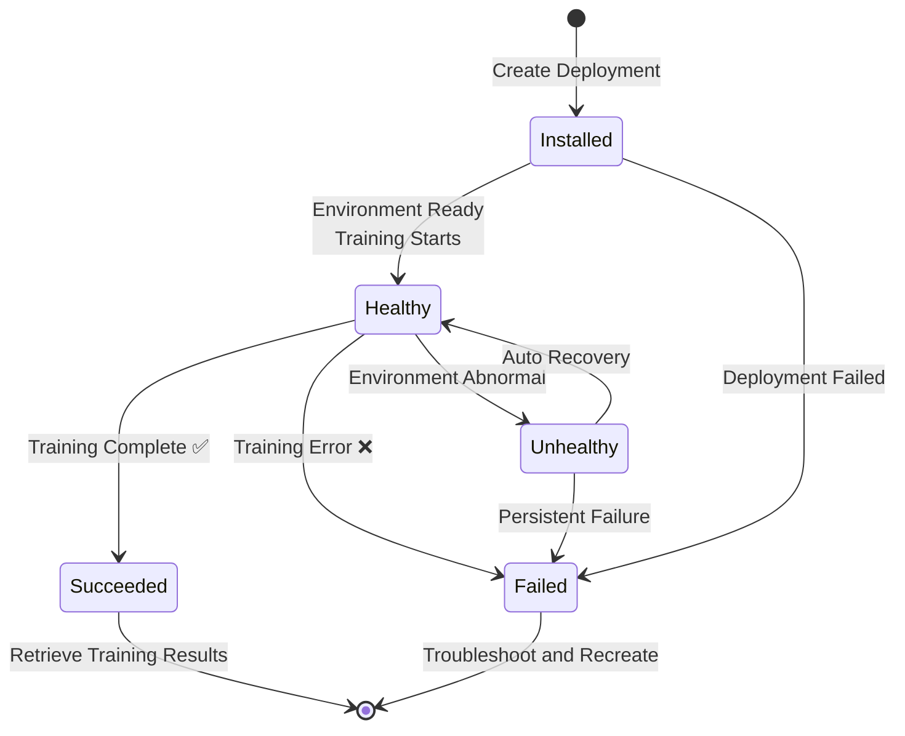

# Fine-tuning Services

## Feature Overview

Fine-tuning is a core feature in the Rune platform for performing secondary training on pre-trained models. Through fine-tuning, users can adapt models to specific domain tasks (such as domain Q&A, code generation, text classification, etc.) while preserving the general capabilities of the pre-trained model.

Fine-tuning services belong to the `category=tune` category in the Instance architecture, sharing the same underlying instance model and deployment mechanism with inference services. All hyperparameters for fine-tuning tasks (learning rate, batch size, training epochs, base model, training dataset, etc.) are defined through the Helm Chart's Schema and dynamically rendered in SchemaForm.

### Core Capabilities

- **Template-Driven**: Fine-tuning toolchains (such as LLaMA-Factory, Swift, etc.) are defined via Helm Chart templates, with all parameters configured through SchemaForm
- **Full Workflow Management**: Complete workflow from data preparation, parameter configuration, task submission to result evaluation
- **Training Web UI**: Supports accessing the training tool's visual UI through a web interface (e.g., LLaMA-Factory WebUI)
- **Task-Based Lifecycle**: Automatically enters Succeeded status upon training completion, marked as Failed on errors
- **Multi-Dimensional Monitoring**: Integrated Prometheus monitoring, log viewing, and K8s event stream

### What is Model Fine-tuning?

In simple terms, fine-tuning is "teaching" an existing large model to complete specific tasks using your own data. For example:
- Fine-tune LLaMA with medical Q&A data to create a medical assistant
- Fine-tune CodeLlama with code repository data to improve code generation in specific languages
- Fine-tune ChatGLM with customer service conversation data to build an intelligent customer service agent

## Navigation Path

Rune Workbench → Left Navigation → **Fine-tuning Services**

---

## Fine-tuning Service List

The list page displays all fine-tuning task instances in the current workspace.

### List Column Description

| Column | Description | Example |
|--------|-------------|---------|
| Name | Instance name (K8s resource name), click to enter details | `llama3-sft-medical` |
| Status | Current running status badge | 🟢 Healthy |
| Flavor | Compute resource specification description | `8C16G 1GPU` |
| Model Name | Base model identifier | `Meta-Llama-3-8B` |
| Template | Fine-tuning template and version used | `LLaMA-Factory v0.8` |
| Created At | Task creation time | `2025-06-15 14:00` |
| Actions | Available actions | Web Access / Delete |

### Status Description

| Status | Meaning |
|--------|---------|
| Installed | Helm Chart installed, training environment initializing |
| Healthy | Training environment ready, training task running |
| Succeeded | Training task completed ✅ |
| Failed | Training failed ❌ |
| Unhealthy | Training environment abnormal |
| Degraded | Training environment running in degraded mode |

### Web Access Button

The fine-tuning task list provides a **Web Access** button (UrlSelectButton) for accessing the training tool's Web UI through the browser, such as LLaMA-Factory's visual training interface.

> 💡 Tip: The Web Access button is only available when the instance status is Healthy. The button automatically selects the best access address based on endpoint URL priority.

#### URL Priority Rules

When an instance exposes multiple endpoints, the system selects the Web access address in the following priority order:

1. **External + UI/Web/Console type endpoints** (highest priority)
2. **External other endpoints**
3. **Internal endpoints** (lowest priority)

---

## Create Fine-tuning Task

### Steps

1. Click the **Deploy** button in the upper right corner of the list page
2. Select a fine-tuning template (e.g., LLaMA-Factory, Swift, etc.)
3. Fill in basic information (ID, name, description)
4. Select compute flavor
5. Configure fine-tuning parameters in SchemaForm
6. Mount storage volumes for training data and output models
7. Confirm and submit

### Basic Information

| Field | Type | Required | Description |
|-------|------|----------|-------------|
| ID | Text | ✅ | K8s resource name, only lowercase letters, numbers, and hyphens, 1-63 characters |
| Display Name | Text | ✅ | Human-readable name for the task |
| Description | Text Area | — | Task description |

### Configure Hyperparameters (SchemaForm)

All hyperparameters for fine-tuning templates are defined in the Helm Chart's `values.schema.json` and dynamically rendered through SchemaForm. Both **graphical mode** and **JSON edit mode** are supported.

#### Common Hyperparameters

| Parameter | Description | Example Value |
|-----------|-------------|---------------|
| base_model | Base pre-trained model path | `/models/llama3-8b` |
| dataset | Training dataset path | `/datasets/medical-qa` |
| learning_rate | Learning rate | `2e-5` |
| batch_size | Training batch size | `4` |
| num_epochs | Training epochs | `3` |
| lora_rank | LoRA rank | `8` |
| lora_alpha | LoRA scaling factor | `16` |
| max_length | Maximum sequence length | `2048` |
| gradient_accumulation | Gradient accumulation steps | `4` |
| warmup_ratio | Warmup ratio | `0.1` |
| output_dir | Output directory | `/output/llama3-sft` |

> ⚠️ Note: Different templates may have different hyperparameters. The above are common parameter examples only; the actual configurable parameters are determined by the Schema definition of the selected template.

### Training Data Preparation

Before submitting a fine-tuning task, ensure training data is ready:

1. **Create Storage Volume**: Create a storage volume in storage volume management to store training data
2. **Upload Data**: Upload training datasets (JSON/JSONL/CSV format) through the file manager
3. **Mount to Fine-tuning Instance**: Select the storage volume during deployment

> 💡 Tip: Training data format requirements depend on the selected fine-tuning template. For example, LLaMA-Factory supports both Alpaca and ShareGPT data formats — refer to the template documentation for details.

---

## Fine-tuning Task Lifecycle

> 💡 Tip: Unlike inference services, fine-tuning tasks are **one-time tasks**. After training completes, the status changes to Succeeded and does not support "stop/start" cycling. To retrain, you need to create a new fine-tuning task instance.

---

## Monitoring Training Progress

### Monitor via Web UI

For fine-tuning templates that support Web UI (e.g., LLaMA-Factory), you can open the training interface through the **Web Access** button in the list:

The Web UI typically provides:

- Real-time training metrics (Loss curves, learning rate changes)
- Training progress percentage
- Current Epoch / Step information
- Evaluation metric display

### Monitor via Detail Page

#### Overview

Displays the instance's ServiceInfoCard and PodList, consistent with the inference service overview page structure.

#### Monitoring

Integrated Prometheus monitoring dashboard:

- **GPU Utilization**: GPU usage curves during training
- **GPU Memory Usage**: Memory consumption during training
- **Training Loss Trend** (if the template reports custom Metrics)
- **CPU / Memory Usage**

#### Logging

Real-time training log output, including:

- Training progress information (epoch, step, loss values)
- Model loading and initialization logs
- Dataset loading logs
- Error and warning messages

#### Events

Kubernetes event stream displayed in reverse chronological order.

---

## Retrieving Training Results

After training completes (Succeeded):

1. Fine-tuned model weights are saved in the configured output directory (typically within the mounted storage volume)
2. Enter the storage volume file manager to browse and download the training output model files
3. Training logs and checkpoint files are also saved in the output directory

### Using the Output Model

The fine-tuned model can be used in the following ways:

- **Deploy as Inference Service**: Use the storage volume containing the fine-tuned model in an inference service, configuring the model path to point to the fine-tuning output
- **Continue Fine-tuning**: Use the fine-tuning output as a new base model for the next round of fine-tuning
- **Download Locally**: Download through the file manager for use in local environments

---

## Permission Requirements

| Operation | Required Role |
|-----------|--------------|
| View list and details | ADMIN / DEVELOPER / MEMBER |
| Create fine-tuning task | ADMIN / DEVELOPER |
| Web access | ADMIN / DEVELOPER |
| Delete task | ADMIN / DEVELOPER |
| View monitoring and logs | ADMIN / DEVELOPER / MEMBER |

---

## Troubleshooting

### Training Task Failed (Status Failed)

1. **Check Events Page**: Check for insufficient resources, image pull failures, and other K8s-level errors
2. **Check Logs**: Review error messages in training logs
3. **Common Causes**:
   - **GPU Memory Insufficient (OOM)**: Reduce batch_size or enable gradient accumulation
   - **Data Format Error**: Check if training data format meets template requirements
   - **Model Path Error**: Confirm the base model path is correct and the storage volume is properly mounted
   - **Disk Space Insufficient**: Confirm the storage volume has enough space for model checkpoints

### Slow Training Speed

- Check if GPU is being used correctly (logs should show CUDA device information)
- Increase batch_size appropriately to improve GPU utilization
- Enable mixed precision training (fp16 / bf16)
- Check if data loading is the bottleneck (increase dataloader workers)

### Cannot Access Web UI

- Confirm instance status is Healthy
- Check if the browser is blocking pop-up windows
- Try copying the endpoint URL and opening it directly in a new tab
- Check if network proxy settings are affecting access

---

## Best Practices

- **Start Small**: First verify the workflow with a small amount of data and fewer training epochs, then proceed with full-scale training once confirmed
- **Set Checkpoints Properly**: Enable periodic checkpoint saving to avoid losing training progress due to unexpected interruptions
- **Monitor Loss Changes**: Observe whether Loss is converging normally through the Web UI or logs
- **Prepare Validation Set**: Set up a validation set to evaluate model performance during training to avoid overfitting
- **Use LoRA Fine-tuning**: For large models, LoRA/QLoRA and other parameter-efficient fine-tuning methods are recommended, significantly reducing GPU resource requirements
- **Preserve Training Logs**: Training logs and metric outputs after completion are important references for hyperparameter tuning
