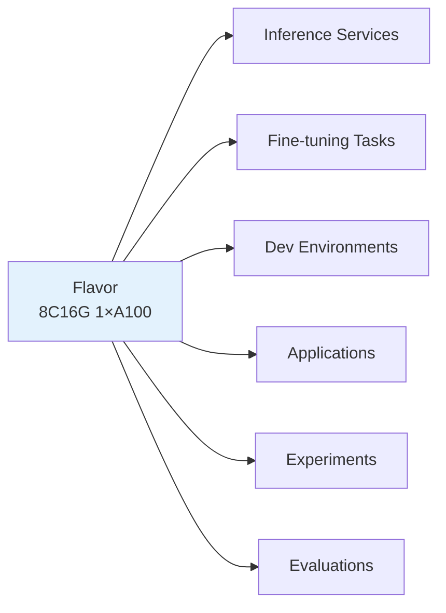
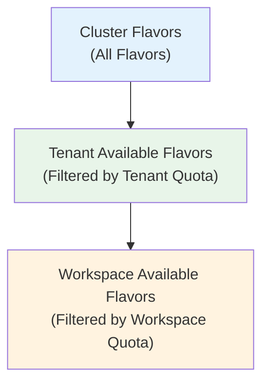

# Flavor Management

## Feature Overview

Flavor is a standardized template in the Rune platform used to define compute resource combinations. Each flavor describes a specific set of compute resource configurations — including CPU core count, memory size, GPU type and quantity, etc. — for users to select when deploying instances such as inference services, fine-tuning tasks, dev environments, and applications. Through flavor standardization, the platform achieves unified resource management and rational scheduling.

### Core Capabilities

- **Standardized Resource Templates**: Package CPU, memory, GPU, and other resources into flavors so users don't need to worry about underlying resource details
- **Three-Level Visibility Scope**: Flavors are displayed at cluster, tenant, and workspace levels, with different visible flavors at each level
- **Multi-Accelerator Support**: Supports GPU (NVIDIA/AMD), NPU (Huawei Ascend), DCU (Hygon), MLU (Cambricon), vGPU, and more
- **Sold-Out Mechanism**: Automatically marked as sold out when cluster resources for a flavor are exhausted
- **Unified Association**: All Instance type lists display the Flavor column for easy resource usage identification

### Relationship Between Flavors and Instances

> 💡 Tip: Flavors are created and managed by platform administrators in BOSS. Console users can only view and select available flavors, they cannot create or modify flavors.

## Navigation Path

Path: `/rune/tenants/:tenant/flavors`

---

## Flavor Data Model

Each flavor contains the following core fields:

| Field | Description | Example Value |
|-------|-------------|---------------|
| name | Flavor name | `8c16g-1gpu-a100` |
| cluster | Associated cluster | `gpu-cluster-bj` |
| enabled | Whether enabled | `true` |
| type | Flavor type | `gpu` / `cpu` |
| model | Accelerator model | `NVIDIA-A100` |
| vendor | Accelerator vendor | `nvidia` |
| resourcePool | Associated resource pool | `default-pool` |
| nodeSelector | Node selector | `{"accelerator": "a100"}` |
| status.soldOut | Whether sold out | `false` |
| resources.limits | Resource limits | `{cpu: 8, memory: 16Gi, nvidia.com/gpu: 1}` |
| resources.requests | Resource requests | `{cpu: 8, memory: 16Gi, nvidia.com/gpu: 1}` |
| config | Additional configuration | Model-related extra parameters |

---

## Flavor List

### List Column Description

| Column | Description | Example |
|--------|-------------|---------|
| Name | Flavor name | `8c16g-1gpu-a100` |
| Type | CPU or GPU flavor | 🟢 GPU |
| CPU | CPU core count | `8` |
| Memory | Memory size | `16 GiB` |
| Accelerator | Accelerator type and quantity | `1× NVIDIA A100 80G` |
| Resource Pool | Associated resource pool | `default-pool` |
| Status | Available / Sold Out | 🟢 Available / 🔴 Sold Out |

### Flavor Format Display

Flavors are displayed in a unified readable format across all pages, such as:

| Format | Description |
|--------|-------------|
| `4C8G` | 4 CPU cores + 8G memory (CPU flavor) |
| `8C16G 1GPU` | 8 CPU cores + 16G memory + 1 GPU |
| `16C32G 2GPU` | 16 CPU cores + 32G memory + 2 GPUs |
| `32C64G 4GPU` | 32 CPU cores + 64G memory + 4 GPUs |
| `8C16G 1NPU` | 8 CPU cores + 16G memory + 1 NPU |

> 💡 Tip: In instance lists for inference services, fine-tuning tasks, etc., the Flavor column uses this unified readable format to help users quickly understand the resource usage of each instance.

---

## Flavor Types

### CPU Flavors

Suitable for workloads that don't require GPU acceleration:

| Typical Flavor | Use Cases |
|---------------|-----------|
| 2C4G | Lightweight services, experiment tracking, web applications |
| 4C8G | Data processing, API services, medium-load applications |
| 8C16G | Large-scale data processing, CPU-intensive tasks |
| 16C32G | Ultra-large-scale data processing |

### GPU Flavors

Suitable for AI workloads requiring GPU acceleration:

| Typical Flavor | Use Cases |
|---------------|-----------|
| 8C16G 1GPU | Small model inference, single-card fine-tuning |
| 16C32G 2GPU | Medium model inference, dual-card fine-tuning |
| 32C64G 4GPU | Large model inference, multi-card parallel fine-tuning |
| 64C128G 8GPU | Ultra-large model inference, full fine-tuning |

---

## Accelerator Types

The platform supports multiple AI accelerator hardware:

| Accelerator Type | Vendor | Representative Models | K8s Resource Name | Use Cases |
|-----------------|--------|----------------------|-------------------|-----------|
| GPU | NVIDIA | A100, H100, V100, A10, L40S, RTX 4090 | `nvidia.com/gpu` | General AI training and inference |
| GPU | AMD | MI300X, MI250X | `amd.com/gpu` | High-performance computing, AI training |
| NPU | Huawei (Ascend) | Ascend 910B, 310P | `ascend.com/npu` | Domestic AI training and inference |
| DCU | Hygon | Z100, Z100L | `hygon.com/dcu` | Domestic high-performance computing |
| MLU | Cambricon | MLU370, MLU590 | `cambricon.com/mlu` | Domestic AI inference acceleration |
| vGPU | NVIDIA (Virtualized) | Based on physical GPU slicing | `nvidia.com/vgpu` | GPU sharing, suitable for small model inference |

> ⚠️ Note: Different clusters may have different accelerator types installed. Before selecting a flavor, please confirm the target cluster supports the required accelerator type.

---

## Three-Level Flavor Query

The visibility scope of flavors is divided into three levels, and the flavor lists returned at each level may differ:

### Cluster Level

- **Scope**: All flavors defined in the cluster
- **Management**: Managed by platform administrators in BOSS
- **Usage**: Global flavor management

### Tenant Level

- **Scope**: Flavors available to the tenant in the specified cluster
- **Filtering**: Available flavors filtered based on tenant quota allocation
- **Usage**: Tenants view the range of flavors they can use

### Workspace Level

- **Scope**: Flavors available to the workspace
- **Filtering**: Filtered based on workspace quota and available cluster resources
- **Usage**: Flavor selection when deploying instances

> 💡 Tip: When deploying instances, the system automatically calls the workspace-level flavor list API, only showing flavors that the current workspace has quota for and that are not sold out in the cluster.

---

## Sold-Out Mechanism

When all hardware resources corresponding to a flavor type in a cluster are occupied, that flavor will be marked as **Sold Out**.

### Sold-Out Conditions

- Available resources for that accelerator model in the cluster is 0
- Or the tenant/workspace quota for that resource type has been exhausted

### Behavior When Sold Out

| Behavior | Description |
|----------|-------------|
| List Display | Flavor row shows 🔴 Sold Out marker |
| Deployment Selection | Flavor is not selectable (or shown as disabled) when deploying instances |
| Auto Recovery | Sold-out status is automatically cleared when resources are released |

> ⚠️ Note: If all GPU flavors are sold out, you may need to wait for other instances to release resources, or contact the administrator to add cluster hardware.

---

## Node Selector

The `nodeSelector` field in a flavor is used to schedule workloads to specific K8s nodes. This is particularly important in heterogeneous clusters:

| Scenario | nodeSelector Example | Description |
|----------|---------------------|-------------|
| Specify GPU Model | `{"accelerator": "a100"}` | Ensure scheduling to nodes with A100 GPUs |
| Specify Resource Pool | `{"pool": "high-perf"}` | Schedule to high-performance resource pool nodes |
| Specify Region | `{"zone": "az-1"}` | Schedule to a specified availability zone |

---

## Using Flavors in Instances

### Selecting Flavor During Deployment

When creating any type of instance (inference/fine-tuning/dev/app/experiment/evaluation), **Flavor** is a required field:

1. Enter the deployment page
2. View available flavors in the flavor dropdown list
3. Select an appropriate flavor based on workload requirements
4. Flavor information will be displayed in the Flavor column of the list after instance creation

### Flavor Selection Recommendations

| Workload | Recommended Flavor Range | Description |
|----------|-------------------------|-------------|
| Small Model Inference (<7B) | 4C8G ~ 8C16G 1GPU | Single GPU is typically sufficient |
| Large Model Inference (7B-70B) | 16C32G 2GPU ~ 64C128G 8GPU | Choose based on model parameter count |
| Model Fine-tuning (SFT) | 16C32G 2GPU ~ 32C64G 4GPU | Fine-tuning memory requirements are slightly lower than full inference |
| Dev Environments | 4C8G ~ 16C32G 1GPU | Interactive development, select GPU as needed |
| Experiment Tracking / Apps | 2C4G ~ 4C8G | Typically don't need GPU |

---

## Permission Requirements

| Operation | Required Role |
|-----------|--------------|
| View flavor list | ALL |
| Select flavor during deployment | ADMIN / DEVELOPER |
| Create/Edit/Delete flavors | Platform Admin (BOSS side) |
