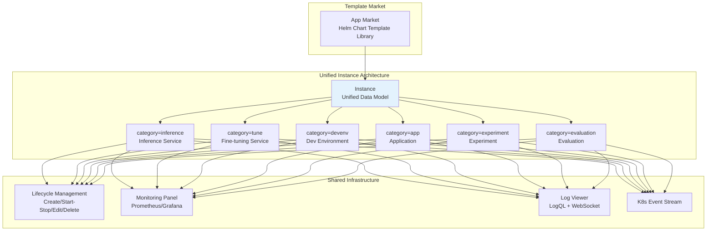
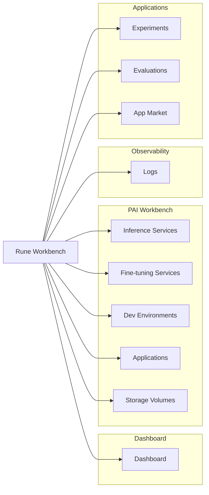
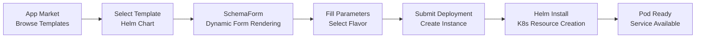
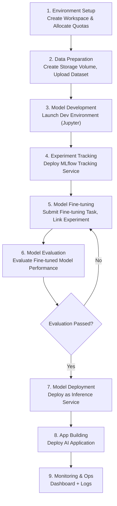

# Rune AI Workbench

## Introduction

The Rune AI Workbench is the core module of the Console platform, providing AI engineers and researchers with comprehensive full-lifecycle AI workload management capabilities. From model inference deployment, fine-tuning training, development debugging, to experiment tracking, model evaluation, and application delivery, Rune covers every critical stage of AI development.

Rune adopts a **unified Instance architecture** and a **template-driven deployment model**. All workload types (inference, fine-tuning, dev environments, apps, experiments, evaluations) share the same underlying resource management, lifecycle control, and monitoring system, significantly reducing learning costs and operational complexity.

### Design Philosophy

### Core Advantages

- **Unified Architecture**: All workload types share the Instance model with consistent operations — learn once, master everything
- **Template-Driven**: Helm Chart-based template system with SchemaForm dynamic form generation, no YAML writing required
- **Multi-Level Resource Management**: Cluster → Tenant → Workspace three-tier quota system for fine-grained resource control
- **Multi-Accelerator Support**: Supports NVIDIA GPU, AMD GPU, Huawei NPU, Hygon DCU, Cambricon MLU, and other accelerators
- **Full-Stack Observability**: Complete observability with Prometheus monitoring + Loki logging + K8s events

## Navigation Structure

After entering the Rune Workbench, the left navigation bar displays the following modules:

## Context Selection

Resource operations in the Rune Workbench require selecting the correct context:

1. **Region/Cluster**: The region selector in the top navigation, for selecting the target compute cluster
2. **Workspace**: Adjacent to the region selector, for selecting the specific workspace

> 💡 Tip: After selecting a different region and workspace, the page will automatically refresh to load resources for the corresponding context. All workloads (inference, fine-tuning, apps, etc.) run within the workspace scope — switching workspaces lets you manage different team resources.

---

## Unified Instance Architecture

All workload types on the Rune platform are built on the unified **Instance** data model, distinguished by the `category` field. This means:

### Capabilities Shared by All Instance Types

| Capability | Description |
|-----------|-------------|
| Template Deployment | Based on Helm Chart templates + SchemaForm dynamic forms |
| Flavor Selection | Flavor specifications (CPU/GPU/Memory) |
| Lifecycle | Create, start, stop, edit, delete |
| State Management | Installed → Healthy → Succeeded/Failed |
| Monitoring Panel | Prometheus metrics + Grafana-style panels |
| Log Viewing | Instance-level logs + Pod-level logs |
| K8s Events | Kubernetes event stream |
| Pod Management | Pod list, status viewing |

### Unique Features by Category

| Category | Unique Features |
|----------|----------------|
| `inference` | Gateway registration, API endpoints, model name display |
| `tune` | Web UI access, auto-mark Succeeded upon training completion |
| `devenv` | Web UI access (Jupyter/VS Code) |
| `app` | PVC list, general web application deployment |
| `experiment` | Experiment endpoint API, integration with fine-tuning tasks |
| `evaluation` | Evaluation Web UI, benchmark results |

---

## Template-Driven Deployment Model

All instance deployments in Rune follow a unified template-driven workflow:

1. **Template Definition**: Each template is a Helm Chart containing `values.schema.json` that defines configurable parameters
2. **Form Rendering**: The Console frontend dynamically generates configuration forms through the SchemaForm component based on the Schema
3. **Parameter Entry**: Users fill in parameters in the form (model path, hyperparameters, resource flavors, etc.)
4. **Instance Creation**: After submission, the backend executes Helm Install, creating resources in the workspace's K8s Namespace
5. **State Synchronization**: The system continuously syncs K8s resource states, displaying the instance's operational status

---

## Module Overview

| Module | Description | Category | Permission Required |
|--------|-------------|----------|-------------------|
| [Inference Services](./inference.md) | Deploy model inference APIs with gateway registration and multi-replica support | `inference` | ADMIN / DEVELOPER |
| [Fine-tuning Services](./finetune.md) | Submit model fine-tuning training tasks with Web UI support | `tune` | ADMIN / DEVELOPER |
| [Dev Environments](./devenv.md) | Launch Jupyter/VS Code interactive development environments | `devenv` | ADMIN / DEVELOPER |
| [App Management](./app.md) | Deploy various AI applications with PVC management | `app` | ADMIN / DEVELOPER |
| [Experiment Management](./experiment.md) | Deploy MLflow/Aim experiment tracking services | `experiment` | ADMIN / DEVELOPER |
| [Evaluation Management](./evaluation.md) | Model performance benchmarking | `evaluation` | ADMIN / DEVELOPER |
| [Storage Volume Management](./storage.md) | Manage PVC persistent storage volumes | — | ADMIN / DEVELOPER |
| [Log Viewing](./logging.md) | Log querying and real-time streaming | — | ADMIN / DEVELOPER |
| [App Market](./app-market.md) | Browse and manage deployment templates | — | ADMIN / DEVELOPER |
| [Workspace Management](./workspace.md) | Manage workspaces and members | — | ADMIN |
| [Quota Management](./quota.md) | View and manage resource quotas | — | ALL |
| [Flavor Viewing](./flavor.md) | View available compute resource flavors | — | ALL |

---

## Full AI Development Workflow

The Rune platform covers the complete AI development workflow. Here is a typical workflow example:

---

## Quick Start

### First-Time Use

1. **Select Context**: Choose the target cluster and workspace in the top navigation
2. **Browse Market**: Enter the App Market to explore available templates
3. **Deploy Service**: Select template → Fill parameters → Submit deployment
4. **Check Status**: View instance status in the corresponding module list
5. **Access Service**: Once the instance is ready, use the Web access button or API endpoint to use the service

### Recommended Learning Path

1. Start by reading the [Inference Services](./inference.md) documentation to understand the common operation patterns of the Instance architecture
2. Read specific documentation such as [Fine-tuning Services](./finetune.md) and [Dev Environments](./devenv.md) based on your needs
3. Learn about [Workspace](./workspace.md) and [Quota](./quota.md) management
4. Learn [Log](./logging.md) viewing and troubleshooting methods

> 💡 Tip: Since all workload types share the unified Instance architecture, once you master the inference service operation workflow, using fine-tuning, dev environments, apps, and other features will be very similar — just focus on each type's unique characteristics.
