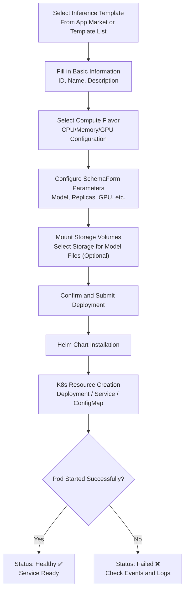
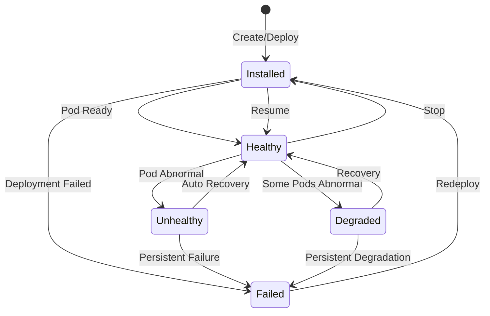
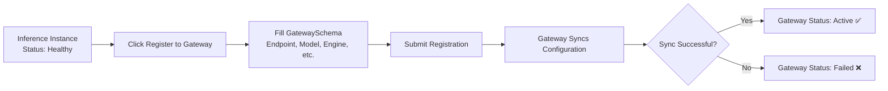

# Inference Services

## Feature Overview

Inference service is one of the core features of the Rune platform, used to deploy trained AI models as online inference (prediction) services. The platform adopts a Helm Chart-based template-driven deployment architecture, dynamically rendering deployment forms through SchemaForm, supporting multiple inference engines such as vLLM and OpenAI-compatible interfaces. After deployment, standardized API endpoints are available for business system integration.

Inference services are built on the unified **Instance** model. All inference instances share the same lifecycle management mechanism and can be exposed to broader users through the gateway registration feature.

### Core Capabilities

- **Template-Driven Deployment**: One-click deployment based on product templates (Helm Charts) from the App Market, no manual YAML writing required
- **Dynamic Parameter Configuration**: SchemaForm automatically generates configuration forms based on the template's `values.schema.json`
- **Full Lifecycle Management**: Supports create, start, stop, edit, delete, and other full lifecycle operations
- **Gateway Registration**: Register inference services to the API gateway with multiple access levels and adapter configurations
- **Multi-Dimensional Monitoring**: Integrated Prometheus monitoring dashboards, log viewer, and Kubernetes event stream

## Navigation Path

Rune Workbench → Left Navigation → **Inference Services**

---

## Inference Service List

The list page displays all inference service instances in the current workspace, providing quick overview and operation entry points.

### List Column Description

| Column | Description | Example |
|--------|-------------|---------|
| Name | Instance name (i.e., K8s resource name), click to enter details | `llama3-70b-chat` |
| Status | Current running status, displayed as a badge | 🟢 Healthy |
| Flavor | Readable description of compute resource specifications | `8C16G 1GPU` |
| Model Name | Currently deployed model identifier | `Meta-Llama-3-70B` |
| Replicas | Number of running replica instances | `2` |
| Template | Product template name and version used | `vLLM v1.2.0` |
| Created At | Instance creation timestamp | `2025-06-15 10:30` |
| Actions | Available action buttons | Start / Stop / Delete |

### Status Badge Description

Instance status is displayed with different colored badges for quick identification:

| Status | Color | Meaning |
|--------|-------|---------|
| Installed | 🔵 Blue | Helm Chart installed, resources being created |
| Healthy | 🟢 Green | Service running normally, all Pods ready |
| Unhealthy | 🟡 Yellow | Some Pods not ready, service may be affected |
| Degraded | 🟠 Orange | Service running in degraded mode with limited functionality |
| Failed | 🔴 Red | Deployment failed or service crashed |
| Succeeded | ⚪ Gray | Task completed (typically for one-time tasks) |

### List Operations

- **Search**: Supports keyword search by instance name
- **Status Filter**: Dropdown to select status values for quick filtering of instances by specific status
- **Refresh**: Click the refresh button or enable auto-refresh to get the latest status
- **Batch Operations**: Select multiple instances to batch start, stop, or delete

---

## Create Inference Service

### Steps

1. Click the **Deploy** button in the upper right corner of the list page
2. Select an inference template on the deployment page (can also jump from the App Market)
3. Fill in basic information and template parameters
4. Confirm resource specifications and submit

### Step 1: Fill in Basic Information

| Field | Type | Required | Description |
|-------|------|----------|-------------|
| ID (Name) | Text | ✅ | K8s resource name, only lowercase letters, numbers, and hyphens, 1-63 characters |
| Display Name | Text | ✅ | Human-readable name for the instance, may include Chinese characters |
| Description | Text Area | — | Additional notes about the inference service |

> ⚠️ Note: The ID field cannot be modified once created and must be unique within the same namespace. Use meaningful naming, such as `llama3-70b-vllm`.

### Step 2: Configure Template Parameters (SchemaForm)

Template parameters are dynamically rendered through the **SchemaForm** component. Each inference template's Helm Chart contains a `values.schema.json` defining all configurable parameters. SchemaForm supports two editing modes:

#### Graphical Mode

Presents parameters with intuitive form controls, including:
- **Dropdown Selectors**: Enumeration parameters like model selection, GPU type
- **Number Inputs**: Numerical parameters like replica count, GPU count
- **Text Inputs**: Text parameters like model path, endpoint name
- **Toggle Switches**: Feature switches (e.g., quantization on/off)
- **Nested Forms**: Complex multi-level parameter structures

#### JSON Edit Mode

Click the toggle button in the upper right corner of the editor to enter JSON raw edit mode, suitable for advanced users to directly modify `values.yaml` content.

> 💡 Tip: Data between the two modes is synchronized in real-time. After modifying parameters in graphical mode, switch to JSON mode to verify actual values, and vice versa.

#### Common Template Parameter Examples

| Parameter | Description | Example Value |
|-----------|-------------|---------------|
| model | Model name or path to load | `/models/llama3-70b` |
| replicas | Number of service replicas | `2` |
| gpu_count | Number of GPUs per replica | `4` |
| tensor_parallel | Tensor parallelism degree | `4` |
| max_model_len | Maximum model context length | `8192` |
| quantization | Quantization method | `awq` / `gptq` / `none` |
| dtype | Compute precision | `float16` / `bfloat16` |

### Deployment Flow

---

## Instance Lifecycle

Inference service instances follow the unified Instance lifecycle model:

### Lifecycle Operations

| Operation | Pre-condition Status | Target Status | Description |
|-----------|---------------------|---------------|-------------|
| Create | — | Installed | Submit deployment configuration, install Helm Chart |
| Resume | Installed (stopped) | Healthy | Restore a stopped instance, reallocate resources |
| Stop | Healthy / Unhealthy | Installed | Release compute resources but retain configuration, Pods are cleared |
| Edit | Any | Unchanged | Modify instance configuration, some parameters require restart to take effect |
| Delete | Any | — | Permanently delete the instance and all associated K8s resources |

> 💡 Tip: The stop operation releases GPU and other compute resources but retains the Helm Release configuration. When resources are tight, you can temporarily stop infrequently used inference services and resume them anytime.

---

## Managing Inference Services

### Start and Stop

- **Stop Service**: Click the instance action menu in the list → **Stop**, after confirmation the instance status becomes `Installed`, all Pods are reclaimed
- **Start Service**: Click **Start** on a stopped instance, the platform recreates Pods and allocates resources

> ⚠️ Note: Stop and start operations do not change the instance's configuration parameters, but will cause a brief service interruption. Please perform these operations during off-peak hours.

### Edit Instance

Click **Edit** in the instance detail page or list action menu to modify the following configurations:

- Display name, description
- Template parameters in SchemaForm (such as replica count, model path, etc.)
- Mounted storage volumes

> ⚠️ Note: The instance ID and template used cannot be modified. Modifying certain parameters (such as GPU count) may require restarting the instance to take effect.

### Delete Instance

The delete operation will uninstall the Helm Release and clean up all associated Kubernetes resources (Deployment, Service, ConfigMap, etc.).

> ⚠️ Note: The delete operation is irreversible. Mounted storage volumes will not be deleted, and model files within them are preserved.

### Model Decryption

Some encrypted models need to be decrypted before they can be loaded properly. Click **Decrypt Model** in the instance action menu, and the system will decrypt using pre-configured keys.

---

## Gateway Registration

The gateway registration feature allows exposing inference services to the API gateway, enabling other users or external systems to call model inference interfaces through a unified gateway entry.

### Registration Flow

### GatewaySchema Configuration Fields

| Field | Type | Required | Description |
|-------|------|----------|-------------|
| endpoint | URL | ✅ | API endpoint address of the inference service, supports auto-completion from instance endpoints |
| accessLevel | Enum | ✅ | Access level: `public` / `tenant` (within tenant) / `private` |
| models | Array | ✅ | List of model names exposed through the gateway |
| key | Text | — | API authentication key |
| engine | Enum | ✅ | Inference engine type: `openai` / `vllm` |
| adapters | Array | — | LoRA adapter configuration list |

#### Access Level Details

| Level | Meaning | Use Case |
|-------|---------|----------|
| `public` | All users can access through the gateway | General model services, such as base LLMs |
| `tenant` | Only users within the same tenant can access | Tenant-specific customized models |
| `private` | Only the creator can access | Models in development and testing phase |

#### Adapter Configuration

Adapters are used to load LoRA fine-tuned weights with dynamic switching support:

| Field | Description |
|-------|-------------|
| name | Adapter name, specified when calling |
| path | Path to LoRA weight files (usually mounted in a storage volume) |

### Gateway Status

After registration, the gateway continuously syncs and monitors service status:

| Status | Meaning |
|--------|---------|
| Pending | Registration request submitted, waiting for gateway processing |
| Active | Gateway configuration is effective, service accessible through gateway |
| Warning | Service has alerts (e.g., high response latency) |
| Failed | Gateway sync failed, check configuration |
| Syncing | Gateway is syncing latest configuration |
| Paused | Gateway route has been paused/deregistered |

### Deregister from Gateway

To cancel gateway registration, click **Deregister from Gateway** in the instance action menu. After deregistration, the gateway will stop routing traffic to this instance.

---

## Inference Service Details

Click the instance name in the list to enter the detail page, which contains multiple functional tabs.

### Overview

The overview page contains two core areas:

#### ServiceInfoCard — Service Information Card

Displays key information summary of the instance:

| Field | Description |
|-------|-------------|
| Instance ID | K8s resource name |
| Display Name | Human-readable name set by user |
| Status | Current running status |
| Template | Product template and version used |
| Flavor | Compute resource specification description (e.g., `8C16G 1GPU`) |
| Created At | Instance creation time |
| Endpoint Address | List of API endpoints exposed by the service |

#### PodList — Pod List

Displays all Kubernetes Pods associated with the instance in table format:

- Pod name
- Running status (Running / Pending / Error / CrashLoopBackOff)
- Restart count
- Node location
- Uptime

### Monitoring

Integrated Prometheus monitoring dashboard displaying real-time and historical performance metrics:

- **GPU Utilization**: Usage curves for each GPU card
- **GPU Memory Usage**: Memory usage and available memory
- **CPU Usage**: CPU core utilization
- **Memory Usage**: RSS memory usage
- **Network I/O**: Inbound/outbound traffic
- **Inference Throughput**: Requests per second (RPS)
- **Inference Latency**: P50 / P95 / P99 latency distribution

> 💡 Tip: Monitoring page data comes from the Prometheus instance deployed in the cluster. Initial loading may take a few seconds. Custom time range queries are supported.

### Logging

The Log Viewer displays real-time log output from Pod containers:

- Multi-container switching support
- Real-time streaming logs
- Log search and highlighting
- Log download

### Events

Kubernetes event stream displayed in reverse chronological order:

- Pod scheduling events (Scheduled / FailedScheduling)
- Image pull events (Pulling / Pulled / Failed)
- Container start events (Started / BackOff)
- Health check events (Unhealthy / Healthy)
- Resource quota events (Quota exceeded)

> 💡 Tip: When the instance status is Failed, the events page usually contains the most valuable error information and is the preferred starting point for troubleshooting.

---

## Permission Requirements

| Operation | Required Role |
|-----------|--------------|
| View list and details | ADMIN / DEVELOPER / MEMBER |
| Deploy new service | ADMIN / DEVELOPER |
| Edit instance | ADMIN / DEVELOPER |
| Start/Stop | ADMIN / DEVELOPER |
| Delete instance | ADMIN / DEVELOPER |
| Gateway register/deregister | ADMIN / DEVELOPER |
| Model decryption | ADMIN / DEVELOPER |
| View monitoring and logs | ADMIN / DEVELOPER / MEMBER |

---

## Troubleshooting

### Deployment Failed (Status Failed)

1. **Check Events Page**: Go to instance details → Events tab to check for insufficient resources, image pull failures, etc.
2. **Check Logs**: Go to the logs tab to review error messages in container startup logs
3. **Common Causes**:
   - GPU resource quota insufficient: Contact admin to expand quota or select a smaller flavor
   - Image pull failed: Check image registry address and pull credential configuration
   - Model files missing: Check if the storage volume contains model files at the specified path
   - Port conflict: Check if service port configuration conflicts with existing services

### Unhealthy Service (Status Unhealthy / Degraded)

1. **Check Pod List**: Confirm which Pods are in abnormal status
2. **Check Resource Usage**: Review monitoring page for GPU memory overflow or CPU overload
3. **Check Container Logs**: Look for OOM (Out of Memory) or model loading errors

### Gateway Registration Failed

1. **Check Endpoint Address**: Confirm the inference service's API endpoint is accessible
2. **Check Engine Type**: Confirm the engine parameter matches the actually deployed inference engine
3. **Check Model Names**: Confirm model names in the models list match the actually loaded models

---

## Best Practices

- **Choose Appropriate Flavors**: Select suitable GPU memory based on model size. For example, a 70B parameter model requires approximately 140GB of GPU memory at FP16 precision
- **Use Multiple Replicas**: For production environments, deploy at least 2 replicas to ensure high availability
- **Enable Quantization**: For resource-constrained scenarios, use AWQ or GPTQ quantization to reduce GPU memory usage
- **Set Appropriate Access Levels**: Use `private` during development phase, switch to `tenant` or `public` after testing passes
- **Monitor Alerts**: Regularly monitor metrics, especially GPU memory utilization and inference latency
- **Stop Idle Services Promptly**: Stop unused inference services in time to release GPU resources for other users
