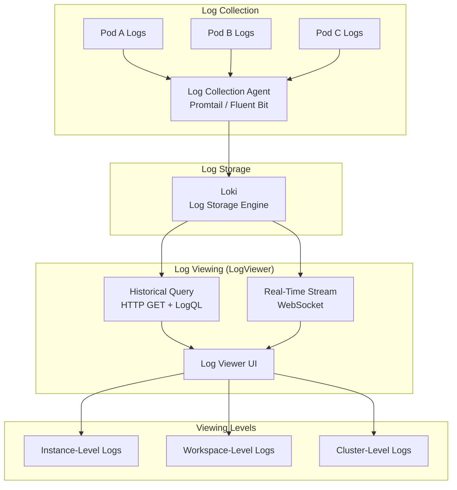
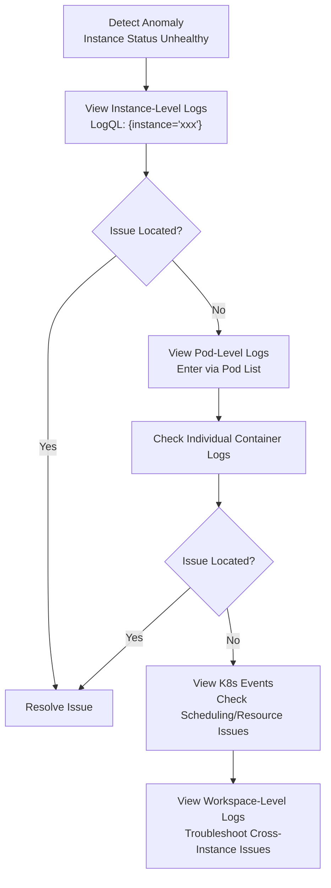

# Log Management

## Feature Overview

Log Management (Logging) is a core observability feature in the Rune platform for viewing and analyzing workload runtime logs. The platform provides a feature-rich Log Viewer (LogViewer) supporting **historical log queries** (via HTTP GET using LogQL syntax) and **real-time log streaming** (via WebSocket push), covering instance-level, workspace-level, and cluster-level log viewing needs.

Whether it's inference services, fine-tuning tasks, dev environments, apps, or experiment/evaluation services, all Instance types support log viewing. Additionally, users can drill down to individual Pod-level logs for precise troubleshooting.

### Core Capabilities

- **Historical Log Query**: Query historical logs within a specified time range through HTTP GET interface, supporting LogQL syntax
- **Real-Time Log Stream**: Receive real-time log push through WebSocket connections, auto-scrolling to show the latest logs
- **Label Filtering**: Precisely filter logs by and Pod, container, namespace, and other label dimensions
- **Three-Level Viewing**: Supports instance-level, workspace-level, and cluster-level log viewing
- **Pod-Level Logs**: Supports viewing logs from specific containers within a specified Pod

### Log Architecture



## Navigation Paths

- **Instance-Level Logs**: Instance detail page → Logs tab
- **Workspace-Level Logs**: Rune Workbench → Left Navigation → **Logs**
- **Cluster-Level Logs**: BOSS → Cluster Management → Logs

---

## Log Viewer (LogViewer)


### Viewer Configuration

The LogViewer component supports the following default configurations:

| Configuration | Default Value | Description |
|--------------|---------------|-------------|
| defaultLimit | 100 | Maximum number of log entries returned per query |
| showQueryBuilder | true | Whether to show the query builder |
| showStreamButton | true | Whether to show the real-time stream toggle button |

### Interface Layout

| Area | Function |
|------|----------|
| Top Toolbar | Time range selection, query input box, refresh button, real-time stream toggle |
| Label Sidebar | Label selection panel, supporting hierarchical filtering |
| Log Main Area | Log content display area, sorted by time |
| Bottom Status Bar | Log entry count statistics, loading status |

---

## Historical Log Query

Historical logs are queried through HTTP GET interface using **LogQL** query syntax (compatible with Grafana Loki syntax).

### LogQL Syntax Examples

#### Basic Label Queries

```logql
# View logs for a specific Pod
{pod="llama3-inference-0"}

# View logs for a specific container
{container="vllm", namespace="workspace-nlp"}

# View logs for multiple Pods
{pod=~"llama3-inference-.*"}
```

#### Log Content Filtering

```logql
# Contains specific keyword
{pod="llama3-inference-0"} |= "error"

# Exclude specific keyword
{pod="llama3-inference-0"} != "healthcheck"

# Regex match
{pod="llama3-inference-0"} |~ "ERROR|WARN"

# Multiple filters (AND logic)
{pod="llama3-inference-0"} |= "request" |= "timeout"
```

#### JSON Log Parsing

```logql
# Parse fields from JSON logs
{pod="api-server-0"} | json | level="error"

# Filter by field
{pod="api-server-0"} | json | status_code >= 500
```

> 💡 Tip: LogQL syntax is consistent with Grafana Loki's query language. If you are familiar with PromQL or Loki, you can directly use advanced query syntax. For simple log viewing needs, label filtering and keyword search are sufficient.

### Time Range Selection

| Quick Option | Description |
|-------------|-------------|
| Last 15 minutes | Logs from the last 15 minutes |
| Last 1 hour | Logs from the last 1 hour |
| Last 3 hours | Logs from the last 3 hours |
| Last 12 hours | Logs from the last 12 hours |
| Last 24 hours | Logs from the last 24 hours |
| Custom | Custom start and end time |

---

## Real-Time Log Stream

Click the **Real-Time Stream** button to enable WebSocket connection and receive real-time log push.

### Real-Time Stream Features

| Feature | Description |
|---------|-------------|
| Protocol | WebSocket |
| Auto-Scroll | Automatically scrolls to bottom when new logs arrive |
| Pause/Resume | Supports pausing auto-scroll for reviewing history |
| Label Filtering | Real-time stream also supports label filtering |
| Auto-Reconnect | Automatically reconnects after WebSocket disconnection |

> ⚠️ Note: Real-time log streaming continuously consumes network bandwidth. In scenarios with very high log volume (e.g., many Pods outputting logs simultaneously), it is recommended to use label filtering to precisely focus on target Pods to avoid receiving excessive irrelevant logs.

---

## Label Filtering

Labels are metadata dimensions of logs. Through label filtering, you can precisely locate target logs.

### Common Labels

| Label | Description | Example Values |
|-------|-------------|---------------|
| namespace | K8s namespace | `workspace-nlp` |
| pod | Pod name | `llama3-inference-0` |
| container | Container name | `vllm`, `sidecar` |
| instance | Instance name | `llama3-inference` |
| node | K8s node name | `gpu-node-01` |

### Label Query API

Each log level provides the following label-related APIs:

| API | Description |
|-----|-------------|
| labels | Get list of all available label names |
| label values | Get all selectable values for a specified label |
| series | Get log series information |

### Using Label Filtering

1. Select a label name from the label panel on the left side of the log viewer
2. Select one or more values from the label value list
3. Log query conditions update automatically
4. Click query or wait for auto-refresh

---

## Three-Level Log Viewing

### Instance-Level Logs

- **Entry**: Instance (inference/fine-tuning/dev/app/experiment/evaluation) detail page → Logs tab
- **Scope**: All Pod logs associated with the instance
- **Scenario**: Troubleshooting specific instance runtime anomalies

All Instance types support instance-level log viewing:

| Instance Type | Description |
|--------------|-------------|
| Inference Services | View inference engine (vLLM, etc.) runtime logs |
| Fine-tuning Tasks | View training process output logs |
| Dev Environments | View Jupyter/VS Code startup and runtime logs |
| Applications | View application service runtime logs |
| Experiments | View experiment tracking service (MLflow, etc.) logs |
| Evaluations | View evaluation task execution logs |

### Pod-Level Logs

- **Entry**: Instance detail page → Pod list → Click Pod name → Logs
- **Scope**: Logs from specific containers within the specified Pod
- **Scenario**: Precisely locating issues to a specific Pod or container

> 💡 Tip: An instance may have multiple Pods (e.g., multi-replica inference services), and each Pod may contain multiple containers (e.g., business container and sidecar container). When precise troubleshooting is needed, enter Pod-level log viewing.

### Workspace-Level Logs

- **Entry**: Rune Workbench → Left Navigation → Logs
- **Scope**: All Pod logs within the current workspace (K8s Namespace)
- **Scenario**: Global search for specific types of errors, cross-instance analysis

### Cluster-Level Logs

- **Entry**: BOSS → Cluster Management → Logs
- **Scope**: Logs across all namespaces in the entire cluster
- **Scenario**: Platform administrators troubleshooting cluster-level issues

---

## Three-Level Log API

Each level provides the same structured log APIs:

| API | Method | Description |
|-----|--------|-------------|
| query | GET | Historical log query (supports LogQL) |
| labels | GET | Get available label list |
| label values | GET | Get label value list |
| series | GET | Get log series information |
| stream | WebSocket | Real-time log stream push |

### API Level Paths

| Level | Path Prefix |
|-------|------------|
| Instance-Level | `/api/v1/.../instances/{instance}/logging/` |
| Workspace-Level | `/api/v1/.../workspaces/{workspace}/logging/` |
| Cluster-Level | `/api/v1/.../clusters/{cluster}/logging/` |

---

## Log Search and Filtering Tips

### Common Search Scenarios

| Scenario | Query Example | Description |
|----------|--------------|-------------|
| Find Error Logs | `{pod="xxx"} \|= "error"` | Search for logs containing error |
| Find OOM Exceptions | `{pod="xxx"} \|~ "OOM\|OutOfMemory\|killed"` | Memory overflow related |
| Find GPU Errors | `{pod="xxx"} \|~ "CUDA\|nccl\|GPU"` | GPU-related errors |
| Find Request Timeouts | `{pod="xxx"} \|= "timeout"` | Timeout-related logs |
| Exclude Health Checks | `{pod="xxx"} != "healthz" != "readyz"` | Filter out health check logs |

### Log Analysis Workflow



---

## Troubleshooting Guide

### Common Log Issues and Solutions

| Issue | Possible Cause | Troubleshooting |
|-------|---------------|-----------------|
| Logs are empty | Pod not started or already deleted | Check Pod status, confirm time range |
| Logs load slowly | Query scope too large | Narrow time range, add label filters |
| Real-time stream disconnected | WebSocket connection timeout | Check network connection, refresh page and retry |
| Cannot find labels | Pod has not yet produced logs | Wait for Pod to start and produce logs, then refresh |
| Logs show garbled characters | Log encoding issue | Check container's log output encoding settings |

### Checklist When Logs Cannot Be Displayed

1. ✅ Confirm instance status is not `Installed` (Pod may still be creating)
2. ✅ Confirm time range includes the log generation period
3. ✅ Check if label filters are too restrictive
4. ✅ Try removing all filters to view complete logs
5. ✅ Check if the log collection Agent is running normally

> ⚠️ Note: The log system has a storage retention limit. Historical logs beyond the retention period will be automatically cleaned up. The specific retention period depends on platform configuration, typically 7-30 days.

---

## Permission Requirements

| Operation | Required Role |
|-----------|--------------|
| View instance-level logs | ADMIN / DEVELOPER |
| View workspace-level logs | ADMIN / DEVELOPER |
| View cluster-level logs | Platform Admin (BOSS side) |
| Use real-time log stream | ADMIN / DEVELOPER |
