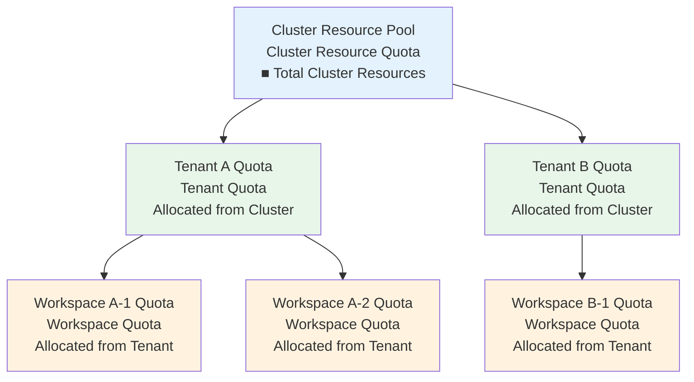
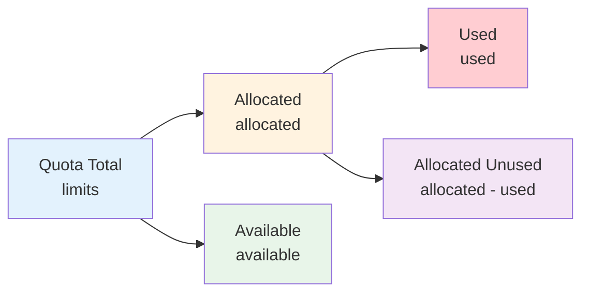

# Quota Management

## Feature Overview

Quota Management is a core feature in the Rune platform for controlling and allocating compute resource usage limits. The platform adopts a **three-level quota hierarchy** — from Cluster to Tenant to Workspace — to achieve progressive resource allocation and fine-grained control. Through the quota mechanism, platform administrators can ensure fair resource distribution in multi-tenant environments, preventing any single tenant or workspace from monopolizing cluster resources.

### Core Capabilities

- **Three-Level Hierarchical Management**: Cluster → Tenant → Workspace, progressive resource allocation
- **Multiple Resource Types**: Supports CPU, memory, GPU, vGPU, NPU, storage, and other resource types
- **GPU Model Management**: Independent quota control by GPU model (NVIDIA A100, AMD MI300, etc.)
- **Real-Time Monitoring**: View allocated, used, and available amounts at each level
- **Overuse Protection**: Automatically reject new deployment requests when resource usage reaches quota limits

### Three-Level Quota Hierarchy

> 💡 Tip: Cluster-level quotas are managed by platform administrators in BOSS, tenant-level quotas are allocated by platform administrators to each tenant, and workspace-level quotas are allocated by tenant administrators in Console from tenant quotas to each workspace.

## Navigation Paths

- **Tenant Quota View**: `/rune/tenants/:tenant/quotas`
- **Workspace Quota Management**: Workspace overview page → Quota Management

---

## Quota Resource Types

### QuotaResource Data Model

Each quota record contains the following core fields:

| Field | Description | Example Value |
|-------|-------------|---------------|
| resourceName | K8s resource name | `cpu`, `memory`, `nvidia.com/gpu` |
| name | Resource display name | `CPU`, `NVIDIA A100 GPU` |
| type | Resource category | `cpu`, `gpu`, `vgpu`, `storage` |
| model | Accelerator model | `NVIDIA-A100`, `NVIDIA-H100` |
| vendor | Accelerator vendor | `nvidia`, `intel`, `ascend` |
| ratio | Resource overcommit ratio | `1.0` (no overcommit), `1.5` (1.5x overcommit) |
| candidates | Available value list | Selectable specification values |
| default | Default value | Default allocation amount |
| max | Maximum value | Maximum allowed allocation |
| min | Minimum value | Minimum allocation amount |
| nodeSelector | Node selector | Schedule to specific nodes |

### Resource Type Details

| Type | Description | K8s Resource Name | Unit |
|------|-------------|-------------------|------|
| CPU | Central processing unit cores | `cpu` | Core |
| Memory | Runtime memory | `memory` | GiB |
| GPU | Physical GPU cards | `nvidia.com/gpu`, `amd.com/gpu` | Card |
| vGPU | Virtual GPU (GPU memory slicing) | `nvidia.com/vgpu` | Virtual Card |
| NPU | Neural processing unit | `ascend.com/npu` | Card |
| Storage | Persistent storage capacity | `requests.storage` | GiB |

### GPU Model Support

The platform supports multiple GPU/accelerator vendors and models:

| Vendor | Accelerator Type | Typical Models | vendor Value |
|--------|-----------------|----------------|--------------|
| NVIDIA | GPU | A100 40G/80G, H100, V100, A10, L40S, RTX 4090 | `nvidia` |
| AMD | GPU | MI300X, MI250X | `amd` |
| Huawei | NPU | Ascend 910B, Ascend 310P | `ascend` |
| Hygon | DCU | Z100, Z100L | `hygon` |
| Cambricon | MLU | MLU370, MLU590 | `cambricon` |
| Intel | GPU | Gaudi2, Gaudi3 | `intel` |

---

## Quota Data Display

### Quota Response Model

The quota query interface returns the following information:

| Field | Description |
|-------|-------------|
| cluster | Associated cluster |
| resourcePool | Resource pool name |
| type | Resource type (cpu/gpu/vgpu/storage) |
| model | Accelerator model |
| vendor | Vendor |
| config[] | Resource configuration array (containing resourceName, min, max, default, etc.) |
| limits | Quota cap (maximum allocatable amount) |
| requests | Quota request amount (actually requested resources) |
| status.allocated | Allocated amount (resources allocated to sub-levels or instances) |
| status.available | Available amount (remaining unallocated resources) |
| status.used | Used amount (resources actually in use) |
| status.usedLimits | Used Limits amount (Limits values currently in use) |

### Quota Status Interpretation

| Status Metric | Calculation | Description |
|--------------|-------------|-------------|
| Allocated | Sum of resources allocated to sub-levels | Tenant level: total allocated to workspaces |
| Available | limits - allocated | Remaining amount that can be allocated to sub-levels |
| Used | Actual running Pod usage | Real resource consumption |
| Utilization | used / limits × 100% | Actual resource utilization rate |

---

## Tenant Quota View

On the Console side, tenant members can view their tenant's quota allocation across clusters.

### Quota List

| Column | Description |
|--------|-------------|
| Cluster | Associated cluster name |
| Resource Pool | Resource pool name |
| Resource Type | CPU / GPU / Memory / Storage |
| GPU Model | GPU model (displayed for GPU-type quotas) |
| Allocated | Amount allocated to workspaces |
| Used | Current actual usage |
| Quota Cap | Maximum available amount allocated by admin |
| Utilization | Usage progress bar |

> 💡 Tip: Tenant quotas are allocated by platform administrators in BOSS. If you need to increase quotas, please contact the platform administrator.

---

## Workspace Quota Management

Tenant administrators can create and edit quotas at the workspace level, allocating tenant quotas to workspaces.

### Create Workspace Quota

1. Enter the workspace overview page
2. Click the **Quota** tab
3. Click the **Create Quota** button
4. Select resource type and set quota values
5. Submit and save

### Quota Creation Form

| Field | Description |
|-------|-------------|
| Resource Type | Select the resource type to allocate (CPU / GPU / Memory, etc.) |
| GPU Model | If GPU type is selected, specify the model |
| Requests | Resource request amount (regular guaranteed amount) |
| Limits | Resource limit amount (maximum available amount) |

### Edit Quota

1. Find the quota item to modify in the quota list
2. Click the **Edit** button
3. Adjust Requests / Limits values
4. Submit and save

> ⚠️ Note: The sum of workspace quotas cannot exceed the tenant's available quota for that cluster. When creating or increasing quotas, if it exceeds the tenant's available amount, the system will show an error.

---

## Three-Level Quota API

The platform provides quota management APIs at all three levels:

### Cluster Level (BOSS Side)

| API | Method | Description |
|-----|--------|-------------|
| Cluster Resource Quota List | GET | View cluster resource pool total quotas |
| Cluster Resource Quota Details | GET | View specific resource pool detailed quotas |

### Tenant Level

| API | Method | Description |
|-----|--------|-------------|
| Tenant Quota List | GET | View tenant quotas across clusters |
| Tenant Quota Details | GET | View specific cluster quota details |

### Workspace Level

| API | Method | Description |
|-----|--------|-------------|
| Workspace Quota List | GET | View workspace quotas |
| Create Workspace Quota | POST | Allocate quota to workspace |
| Edit Workspace Quota | PUT | Modify workspace quota |
| Delete Workspace Quota | DELETE | Remove workspace quota |

---

## Quota Usage Monitoring

### Monitoring Metrics

The following quota usage metrics are recommended for monitoring:

| Metric | Recommended Threshold | Description |
|--------|----------------------|-------------|
| GPU Utilization | > 80% alert | GPU is the scarcest resource, needs close attention |
| CPU Utilization | > 85% alert | High CPU usage may affect scheduling |
| Memory Utilization | > 90% alert | Insufficient memory may cause OOM Kill |
| Storage Utilization | > 85% alert | Insufficient storage will cause write failures |

### Handling Quota Insufficiency

When quotas are insufficient, the following operations will be affected:

1. **New instance deployments rejected**: System returns quota insufficient error
2. **Instance scaling restricted**: Cannot increase replica count or upgrade flavors
3. **PVC creation failed**: Cannot create new persistent volumes when storage quota is insufficient

Handling methods:
- Clean up unused instances and storage volumes to release used quota
- Contact tenant administrator to increase workspace quota
- Contact platform administrator to increase tenant-level quota

---

## Best Practices

### Quota Planning

1. **Allocate On Demand**: Distribute quotas based on actual team needs, avoiding excessive reservation that leads to idle resources
2. **Reserve Buffer**: Reserve 10-20% quota headroom for each workspace to handle burst demands
3. **Categorize Management**: Allocate GPU-intensive tasks (inference, fine-tuning) and CPU-intensive tasks (data processing) to different workspaces

### Resource Optimization

1. **Release Promptly**: Delete completed fine-tuning tasks promptly to release GPU quota
2. **Flavor Selection**: Choose appropriate Flavor specifications to avoid over-allocating resources
3. **Regular Audits**: Periodically review quota usage across workspaces and reclaim idle quotas

### GPU Quota Management

1. **Manage by Model**: Different GPU models have independent quota management, e.g., A100 and V100 are metered separately
2. **Priority Planning**: Production inference services get GPU quota priority, experimental tasks use resources during idle periods
3. **vGPU Utilization**: For tasks with smaller memory requirements, use vGPU to improve resource utilization

---

## Permission Requirements

| Operation | Required Role |
|-----------|--------------|
| View tenant quota | ALL |
| View workspace quota | ALL |
| Create/Edit workspace quota | ADMIN (Tenant Admin / Workspace Admin) |
| Delete workspace quota | ADMIN |
| Manage cluster/tenant-level quota | Platform Admin (BOSS side) |
