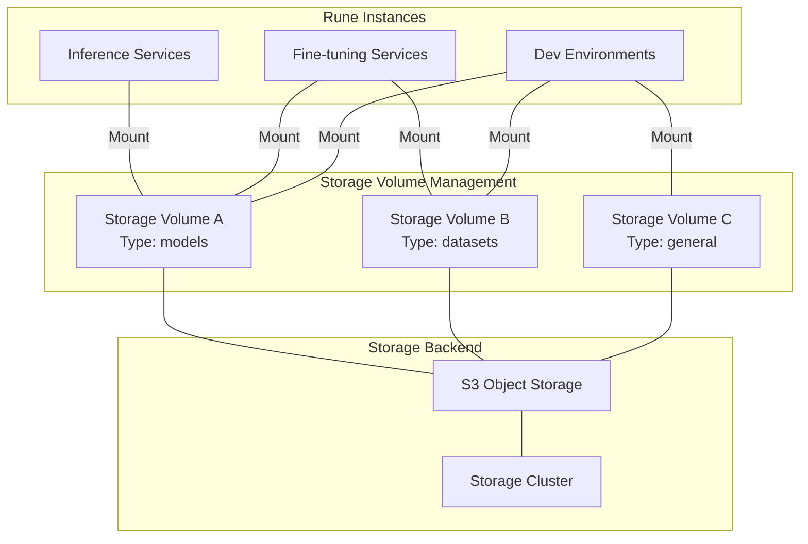
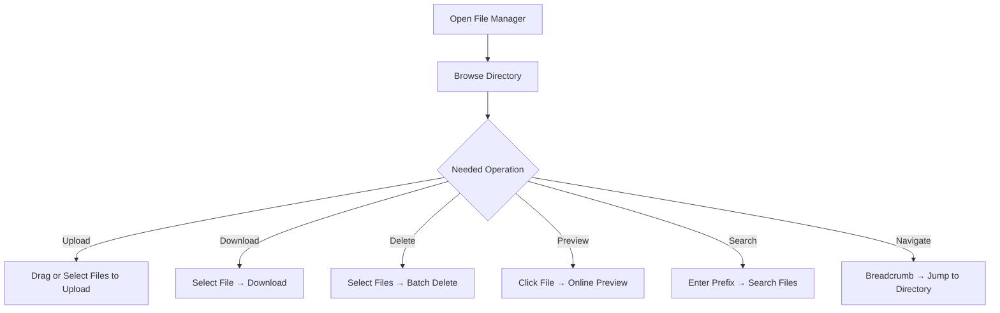
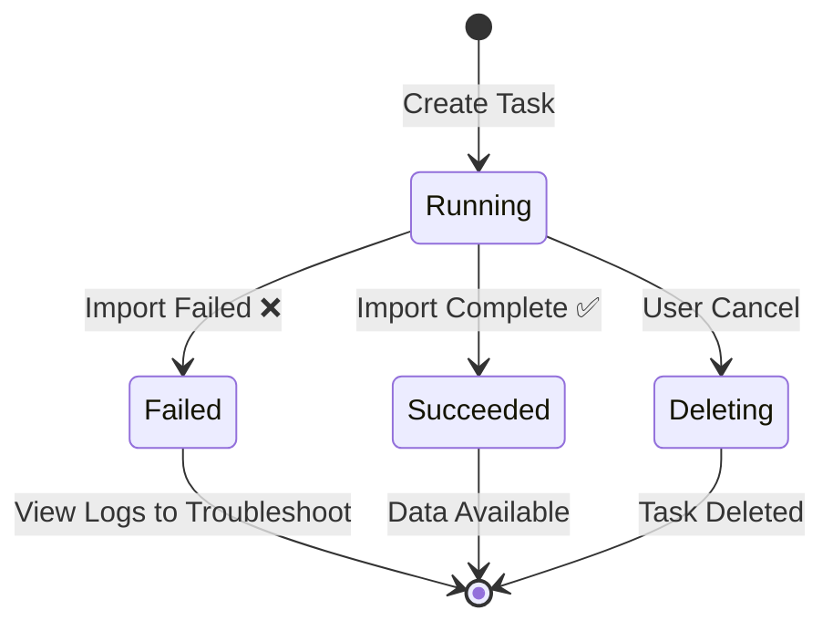

# Storage Volume Management

## Feature Overview

Storage Volumes (StorageVolume) are the persistent data layer of the Rune platform, providing model files, datasets, and work output storage capabilities for instances such as inference services, fine-tuning training, and dev environments. Each storage volume corresponds to an S3-compatible object storage space underneath, with a built-in full-featured file manager and multi-source data import task system.

### Core Capabilities

- **Typed Management**: Supports models and datasets volume type labels for categorized management
- **Full-Featured File Manager**: Web-based file browser via S3 proxy, supporting upload, download, delete, preview, search, and more
- **Multi-Source Data Import**: Supports importing data from Git, HuggingFace, ModelScope, Python environments, Moha, and other sources
- **S3 Account Management**: Built-in S3 AccessKey/SecretKey management with read-only and read-write permissions
- **Elastic Capacity Expansion**: Supports online expansion (increase only) without service interruption
- **README Support**: Supports rendering and uploading storage volume README.md documentation

### Architecture Overview

## Navigation Path

Rune Workbench → Left Navigation → **Storage Volumes**

---

## Storage Volume List

The list page displays all storage volumes in the current workspace, providing quick overview and management entry points.

### List Column Description

| Column | Description | Example |
|--------|-------------|---------|
| Name | Storage volume name, click to enter details | `llama3-weights` |
| Status | Storage volume status | 🟢 Bound |
| Storage Cluster | Associated storage cluster name | `cluster-main` |
| Usage/Capacity | Used space/total capacity | `45Gi / 100Gi` |
| File Count | Total number of files in the storage volume | `1,234` |
| Mount Mode | Read-write or read-only | `ReadWrite` / `ReadOnly` |
| Volume Type | Storage volume type label | `models` / `datasets` |
| Actions | Available actions | File Manager / Edit / Delete |

### Status Description

| Status | Meaning |
|--------|---------|
| Bound | Storage volume bound and ready, available for normal use |
| Pending | Storage volume is being created |
| Failed | Storage volume creation or binding failed |

### List Operations

- **Search**: Search storage volumes by name keyword
- **Type Filter**: Filter by volume type (models / datasets / all)
- **Refresh**: Manually refresh list to get latest status

---

## Create Storage Volume

### Steps

1. Click the **Create** button in the upper right corner of the list page
2. Fill in the storage volume configuration form
3. Confirm and submit

### Configuration Fields

| Field | Type | Required | Validation Rules | Description |
|-------|------|----------|-----------------|-------------|
| Name | Text | ✅ | 1-63 characters, only lowercase letters, numbers, hyphens, K8s naming convention | Storage volume unique identifier |
| Storage Cluster | Autocomplete Select | ✅ | Select from available storage clusters | Target storage cluster |
| Capacity Value | Number | ✅ | ≥ 1 | Storage capacity value |
| Capacity Unit | Select | ✅ | Mi / Gi / Ti | Storage capacity unit |
| Read-Only Flag | Radio | ✅ | Read-Write / Read-Only | Whether to set as read-only volume |
| Volume Type | Radio | ✅ | Unset / models / datasets | Storage volume type label |
| Description | Text Area | — | — | Storage volume supplementary notes |

> 💡 Tip: The name must comply with Kubernetes naming convention `[a-z0-9]([-a-z0-9]*[a-z0-9])?`, cannot start or end with a hyphen, and must not duplicate within the same namespace.

#### Volume Type Description

| Type | Meaning | Typical Use |
|------|---------|-------------|
| Unset | General storage volume | Code, configuration files, mixed use |
| models | Model storage volume | Store pre-trained model weights, fine-tuned output weights |
| datasets | Dataset storage volume | Store training data, validation data, test data |

> 💡 Tip: Volume type serves only as a classification label for management and organization and does not affect actual storage volume behavior. However, when deploying inference/fine-tuning instances, templates may filter and recommend based on volume type.

#### Read-Only Mode Description

- **Read-Write Mode** (default): Mounted instances can read and write files
- **Read-Only Mode**: Mounted instances can only read files, cannot modify or delete

> ⚠️ Note: The read-only flag is stored as a Label on the StorageVolume resource. When switching an existing read-write volume to read-only, already-mounted instances may need to restart for the change to take effect.

---

## File Manager

The file manager is the core interactive feature of storage volumes, providing web-based file browsing and operation capabilities through S3 proxy.

> ⚠️ Note: Only **managed storage volumes** (hosted on platform storage clusters) support the file manager feature. Externally mounted storage volumes do not provide this feature.

### Entry Points

- Click the **File Manager** button in the actions column of the storage volume list
- Switch to the **File Manager** tab in the storage volume detail page

### Feature Details

#### File Browsing

- Displays files and subdirectories in the current directory in list format
- Supports breadcrumb navigation for quick switching to parent directories
- Shows file name, size, modification time, and other information

#### File Upload

- Supports drag-and-drop upload and click-to-select upload
- Supports simultaneous multi-file upload
- Real-time upload progress display

#### File Download

- Click the **Download** button in the file action menu
- Supports single-file download

#### File Deletion

- Supports batch selection and deletion
- Delete operation requires confirmation to prevent accidental deletion

> ⚠️ Note: File deletion is irreversible. Please operate with caution. It is recommended to download and backup important files before deletion.

#### File Preview

- **Text Files**: Online preview of text content (`.txt`, `.json`, `.yaml`, `.py`, `.md`, etc.)
- **Image Files**: Online preview of images (`.png`, `.jpg`, `.gif`, `.svg`, etc.)
- Other format files do not support online preview and need to be downloaded for viewing

#### File Search

- Supports file name prefix search
- Search input has a built-in **300ms debounce** to avoid frequent requests
- Search scope covers current directory and subdirectories

#### Path Navigation

- **Breadcrumb Navigation**: Shows the full current path, click any level to quickly jump
- **Path Copy**: Click the copy button to copy the current path to clipboard for reference elsewhere

### File Manager Operations Summary

---

## Storage Volume Details

Click the storage volume name in the list to enter the detail page.

### Basic Information

The detail page displays core storage volume information, some fields support inline editing:

| Field | Description | Editable? |
|-------|-------------|-----------|
| Name | Storage volume name | ❌ Cannot modify |
| Description | Supplementary description text | ✅ Editable |
| Capacity | Current storage capacity | ✅ Expansion only (increase), cannot shrink |
| Read-Write Mode | ReadWrite / ReadOnly | ✅ Can toggle |
| Volume Type | models / datasets / unset | ✅ Can toggle |
| Storage Cluster | Associated storage cluster | ❌ Cannot modify |
| S3 Address | S3-compatible access address | ❌ Read-only |
| Bucket Name | S3 bucket name | ❌ Read-only |
| Status | Current status (Bound, etc.) | ❌ Read-only |

> ⚠️ Note: Capacity changes only support **expansion** operations. Due to underlying storage mechanism limitations, allocated space cannot be reduced. Please properly evaluate required capacity when creating.

### S3 Account Management

Each storage volume contains one or more S3 access accounts for directly accessing storage content through S3-compatible interfaces:

| Field | Description |
|-------|-------------|
| accessKey | S3 Access Key ID |
| secretKey | S3 Secret Access Key (hidden by default, click to reveal) |
| role | Account role (read-write/read-only) |

- Key information is hidden by default as `***`, click the "Show" button to view the full key
- Supports copying keys to clipboard

> 💡 Tip: S3 accounts can be used to directly access storage volume files in external tools (such as `s3cmd`, `rclone`, `boto3`), suitable for scenarios requiring batch operations or automation.

### README.md Support

The storage volume detail page supports README.md document rendering and management:

- If a `README.md` file exists in the storage volume's root directory, the detail page will automatically render and display it
- Supports uploading a new `README.md` file to describe the storage volume's contents, purpose, and usage
- Markdown rendering supports standard syntax (headings, lists, code blocks, tables, images, etc.)

> 💡 Tip: It is recommended to write a README.md for each important storage volume, describing the source, version, format, and usage instructions of stored models or datasets, facilitating team collaboration.

---

## Storage Volume Tasks

Storage Volume Tasks (Storage Jobs) allow automated data import from multiple external sources into storage volumes. This is the core feature for batch acquisition of model weights, datasets, and dependency environments.

### Entry Point

Switch to the **Tasks** tab in the storage volume detail page.

### Task Types

The platform supports the following 5 data import sources:

#### 1. Git Repository

Clone code or data from a Git repository:

| Field | Type | Required | Description |
|-------|------|----------|-------------|
| url | Text | ✅ | Git repository address (HTTPS) |
| branch | Text | — | Branch name (default main) |
| username | Text | — | Authentication username (private repository) |
| password | Password | — | Authentication password or Token |

#### 2. HuggingFace

Download models or datasets from HuggingFace Hub:

| Field | Type | Required | Description |
|-------|------|----------|-------------|
| type | Enum | ✅ | Resource type: model / dataset |
| repo | Text | ✅ | Repository ID (e.g., `meta-llama/Llama-3-8B`) |
| branch | Text | — | Branch/version (default main) |
| token | Password | — | HuggingFace API Token (required for gated models) |

#### 3. ModelScope

Download models or datasets from ModelScope:

| Field | Type | Required | Description |
|-------|------|----------|-------------|
| type | Enum | ✅ | Resource type: model / dataset |
| repo | Text | ✅ | Repository ID (e.g., `ZhipuAI/chatglm3-6b`) |
| branch | Text | — | Branch/version |
| token | Password | — | ModelScope API Token |

#### 4. Python Environment

Configure Python virtual environment and dependencies:

| Field | Type | Required | Description |
|-------|------|----------|-------------|
| reset | Boolean | — | Whether to reset existing environment |
| requires | Text | — | pip requirements content |
| version | Text | — | Python version requirement |
| pip | Text | — | pip mirror source configuration |
| condas | Text | — | conda channel configuration |

#### 5. Moha (Internal Platform)

Import models or datasets from the internal Moha repository:

| Field | Type | Required | Description |
|-------|------|----------|-------------|
| type | Enum | ✅ | Resource type: model / dataset |
| visibility | Enum | — | Visibility: public / private |
| repo | Text | ✅ | Repository ID |
| branch | Text | — | Branch/version |
| token | Password | — | Authentication Token |
| endpoint | Text | — | Moha service endpoint address |

### Task Lifecycle

### Task Status Description

| Status | Meaning |
|--------|---------|
| Running | Task is executing |
| Succeeded | Task completed successfully |
| Failed | Task failed, check logs for troubleshooting |
| Deleting | Task is being deleted |

### Task List

| Column | Description |
|--------|-------------|
| Task Name | Unique identifier |
| Type | Task source type (Git / HuggingFace / ModelScope / PythonEnv / Moha) |
| Status | Running status |
| Created At | Task creation time |
| Actions | View Logs / Delete |

### Steps to Create a Task

1. Go to storage volume detail page → **Tasks** tab
2. Click the **Create Task** button
3. Select task type (Git / HuggingFace / ModelScope / PythonEnv / Moha)
4. Fill in the corresponding configuration fields
5. Confirm and submit

> 💡 Tip: Downloading gated models from HuggingFace (such as the Llama series) requires providing an authorized API Token. Please first agree to the model license agreement on the HuggingFace website and generate an Access Token.

> ⚠️ Note: Downloading large model files (e.g., 70B parameter models may exceed 140GB) takes a long time. Please ensure sufficient storage volume capacity and follow network bandwidth limitations. Do not delete the storage volume while a task is running.

---

## Capacity Monitoring

Storage volume capacity usage is monitored through Prometheus metrics:

- **Used Capacity**: Total size of all files in the storage volume
- **Total Capacity**: Allocated capacity limit of the storage volume
- **Utilization Rate**: Used capacity / total capacity percentage
- **File Count**: Total number of files in the storage volume

> 💡 Tip: When utilization exceeds 80%, it is recommended to promptly expand capacity or clean up files that are no longer needed to avoid write failures.

---

## Permission Requirements

| Operation | Required Role |
|-----------|--------------|
| View storage volume list | ADMIN / DEVELOPER / MEMBER |
| Create storage volume | ADMIN / DEVELOPER |
| Edit storage volume (description/capacity/type) | ADMIN / DEVELOPER |
| Delete storage volume | ADMIN / DEVELOPER |
| File management (upload/download/delete) | ADMIN / DEVELOPER |
| Create/delete tasks | ADMIN / DEVELOPER |

---

## Troubleshooting

### Storage Volume Creation Failed

1. **Check Name Format**: Confirm the name complies with K8s naming convention (1-63 characters, only lowercase letters, numbers, hyphens)
2. **Check Storage Cluster**: Confirm the target storage cluster is available and has sufficient capacity
3. **Check Quota**: Confirm the workspace's storage quota is sufficient

### File Upload Failed

- Check if file size exceeds the limit
- Confirm network connection is stable
- Check if remaining storage volume capacity is sufficient
- Try refreshing the page and re-uploading

### Storage Task Failed

- **Git Clone Failed**: Check if repository URL is correct and authentication credentials are valid
- **HuggingFace Download Failed**: Check if repo ID is correct, Token has permissions, and network is reachable
- **ModelScope Download Failed**: Similar to HuggingFace, check authentication and network
- **Python Environment Configuration Failed**: Check if requirements format is correct and package versions are compatible

### Cannot Write After Mounting to Instance

- Confirm whether the storage volume is set to read-only mode
- Check mount path permission settings
- Confirm the user in the instance has write permissions

---

## Best Practices

- **Plan Capacity Wisely**: Estimate capacity based on storage content. For example, a 7B parameter model is approximately 13-15GB (FP16), a 70B parameter model is approximately 130-140GB
- **Use Type Labels**: Set the correct models / datasets type for storage volumes for categorized management and quick selection during deployment
- **Write README**: Write a README.md for each storage volume documenting source, version, format, and other information
- **Clean Up Regularly**: Delete unneeded model checkpoints and temporary files to free storage space
- **Leverage S3 API**: For batch operations on large numbers of files, use S3 accounts through tools like `rclone`, `s3cmd` for higher efficiency
- **Avoid Frequent Resizing**: Since capacity can only increase and not decrease, reserve adequate space during creation
- **Use Read-Only Mode to Protect Data**: Set shared model weights and other important data to read-only mode to prevent accidental modification
- **Use Storage Tasks for Data Import**: Prioritize automated import through storage tasks over manual upload of large files for better stability
