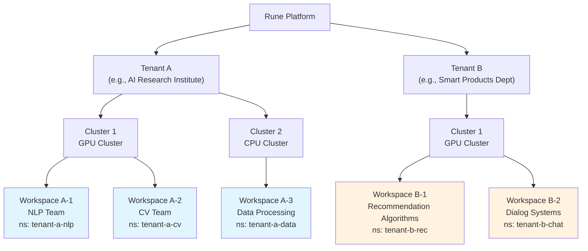
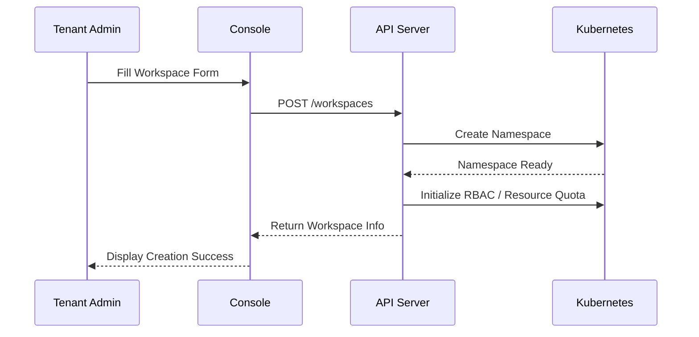
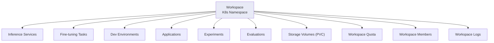
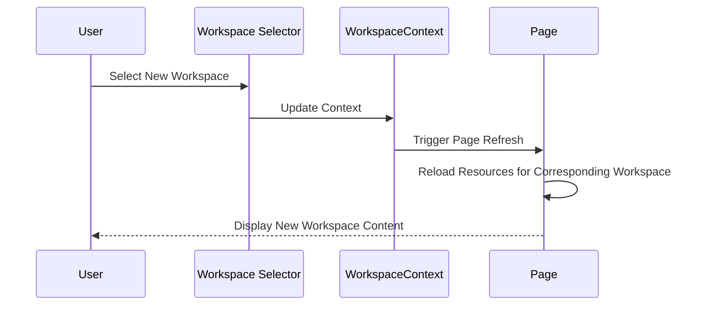
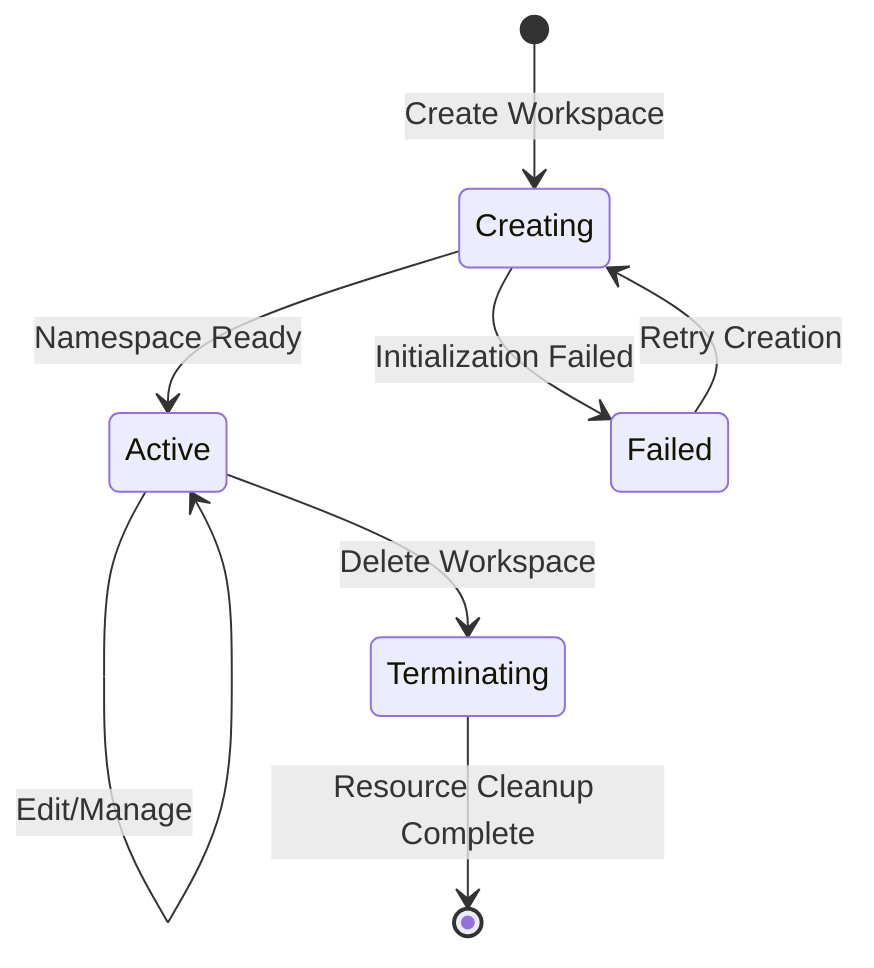

# Workspace Management

## Feature Overview

Workspace is the smallest resource isolation unit in the Rune platform and the basic operational scope for users' daily AI workload usage. Each workspace is bound to a specific **Tenant** and **Cluster**, and has an independent Kubernetes Namespace, achieving complete isolation of resources, permissions, and networking.

In the multi-tenant architecture, organizations use tenants to divide different business lines or departments. Each tenant can create multiple workspaces across multiple clusters. All resources within a workspace — inference services, fine-tuning tasks, dev environments, applications, storage volumes, etc. — run in their independent namespace without interference.

### Core Capabilities

- **Resource Isolation**: Each workspace binds to an independent K8s Namespace, achieving compute, storage, and network isolation
- **Member Management**: Independent member and role system with fine-grained permission control
- **Quota Management**: Allocate resource quotas from tenant level down to workspace level
- **Context Switching**: Quick switching between different workspaces through the top context selector
- **Lifecycle Management**: Complete create, edit, delete lifecycle operations

### Multi-Tenant Hierarchy Architecture

## Navigation Path

Rune Workbench → Workspace Management (direct URL access)

Path: `/rune/tenants/:tenant/clusters/:cluster/workspaces`

---

## Workspace List

The list page displays all workspaces for the current tenant in the specified cluster, providing overview and management entry points.

### List Column Description

| Column | Description | Example |
|--------|-------------|---------|
| Name | Workspace display name, click to enter overview | `NLP R&D Team` |
| ID | Workspace unique identifier | `nlp-team` |
| Status | Current workspace status | 🟢 Active |
| Cluster | Associated cluster name | `gpu-cluster-bj` |
| Namespace | Bound K8s namespace | `tenant-a-nlp` |
| Created At | Creation timestamp | `2025-05-01 09:00` |
| Actions | Available actions | Overview / Edit / Delete |

### Workspace Status

| Status | Meaning |
|--------|---------|
| Active | Workspace running normally, can host workloads |
| Creating | Workspace is being created (K8s Namespace initializing) |
| Failed | Workspace creation failed |
| Terminating | Workspace is being deleted |

---

## Create Workspace

### Steps

1. Click the **Create** button in the upper right corner of the list page
2. Fill in workspace information
3. Submit creation

### Form Fields

| Field | Type | Required | Description |
|-------|------|----------|-------------|
| Name | Text | ✅ | Workspace display name, supports Chinese characters, for UI display |
| ID | Text | ✅ | Workspace unique identifier, only lowercase letters, numbers, and hyphens |
| Cluster | Select | ✅ | Target cluster for the workspace |
| Description | Text Area | — | Description of workspace purpose |

### Creation Flow

> ⚠️ Note: The workspace ID cannot be modified once created — it will be used as part of the K8s Namespace name. Please use meaningful and concise naming, such as `nlp-team`, `cv-prod`.

> 💡 Tip: After creating a workspace, the system automatically creates the corresponding K8s Namespace and initializes necessary RBAC rules. The workspace is ready for use once the status becomes Active.

---

## Resource Isolation Mechanism

Workspaces achieve multi-dimensional resource isolation through Kubernetes Namespaces:

### Isolation Dimensions

| Dimension | Isolation Method | Description |
|-----------|-----------------|-------------|
| Compute Resources | ResourceQuota | Limit workspace CPU/GPU/memory usage caps through K8s ResourceQuota |
| Storage Resources | PVC + StorageClass | Each workspace's storage volumes are in independent Namespaces |
| Network Isolation | NetworkPolicy | Network between different workspaces is isolated by default (depends on cluster configuration) |
| Permission Isolation | RBAC | Workspace members can only access resources within their own workspace |
| Instance Isolation | Namespace Isolation | All Instances (inference/fine-tuning/dev/apps, etc.) run in the workspace Namespace |

### Resources Within a Workspace

The following resources all exist within the workspace scope:

---

## Workspace Overview

Click the workspace name to enter the overview page, displaying comprehensive workspace information:

### Basic Information

| Field | Description |
|-------|-------------|
| Name | Workspace display name |
| ID | Unique identifier |
| Cluster | Associated cluster |
| Namespace | K8s namespace name |
| Status | Current status (phase + message) |
| Description | Workspace description |
| Created At | Creation timestamp |

### Resource Usage Overview

- **CPU Usage**: Used / quota limit, progress bar display
- **Memory Usage**: Used / quota limit, progress bar display
- **GPU Usage**: Used / quota limit, grouped by GPU model
- **Storage Usage**: Used / quota limit

### Instance Statistics

Displays quantity statistics cards for each instance type in the workspace:

| Instance Type | Statistics Content |
|--------------|-------------------|
| Inference Services | Total / Running |
| Fine-tuning Tasks | Total / Running / Completed |
| Dev Environments | Total / Running |
| Applications | Total / Running |
| Experiments | Total / Running |
| Evaluations | Total / Running |

---

## Workspace Quota

Manage resource quotas available to the workspace. Quotas are allocated from tenant level down to workspace level.

### Quota List

| Field | Description |
|-------|-------------|
| Resource Type | CPU / GPU / vGPU / Memory / Storage |
| GPU Model | GPU model (e.g., NVIDIA-A100) |
| Used | Current workspace usage |
| Allocated | Quota cap allocated to the workspace |
| Utilization | Current usage percentage |

### Create/Edit Quota

1. Click the **Create Quota** or the **Edit** button on an existing quota row
2. Select resource type (CPU / GPU / Storage, etc.)
3. Set quota cap value
4. Submit and save

> ⚠️ Note: Workspace quota cannot exceed the tenant's available quota for that cluster. If the tenant quota is insufficient, please contact the platform administrator to increase tenant quota in BOSS.

> 💡 Tip: When workspace resource usage reaches the quota cap, new instance deployment requests will be rejected. Plan quotas wisely and reserve some headroom for burst demands.

---

## Workspace Members

Workspaces independently manage their members and roles for fine-grained permission control.

### Member List

| Field | Description |
|-------|-------------|
| Username | Member's username |
| User Info | Display name, email, etc. |
| Role | Role(s) in the workspace (can be multiple) |
| Joined At | Time of joining the workspace |
| Actions | Edit Role / Remove Member |

### Member Roles

| Role | Description | Permission Scope |
|------|-------------|-----------------|
| ADMIN | Workspace administrator | All operations: member management, quota management, all instance operations |
| DEVELOPER | Developer | Create, edit, start/stop, delete instances; view quotas and members |
| MEMBER | Regular member | View only: list viewing, detail viewing, no editing permissions |

### Add Member

1. Click the **Add Member** button
2. Search and select a user (from the tenant-level user list)
3. Assign one or more roles
4. Click confirm to add

### Edit Member Role

1. Find the target member in the member list
2. Click the **Edit** button
3. Modify role assignments
4. Save changes

### Remove Member

1. Find the target member in the member list
2. Click the **Remove** button
3. Confirm the removal operation

> ⚠️ Note: After removing a member, the user will immediately lose access to all resources within the workspace. Please operate with caution.

### Member API

The platform provides a complete member management API:

| API | Method | Description |
|-----|--------|-------------|
| Member List | GET | Get all workspace members |
| Member Details | GET | Get specific member information |
| Update Member | PUT | Modify member roles and other information |
| Delete Member | DELETE | Remove member from workspace |
| Role List | GET | Get available roles for the workspace |

---

## Workspace Switching

In daily use, users may belong to multiple workspaces. The platform enables quick workspace switching through the context provider (`useWorkspaceContext`).

### Switching Methods

1. **Top Navigation Bar**: Click the workspace selector in the top bar, select the target workspace from the dropdown list
2. **Direct URL Access**: Jump directly by modifying the workspace parameter in the URL

### Switching Behavior

> 💡 Tip: After switching workspaces, all feature modules in the left navigation (inference, fine-tuning, dev environments, etc.) will automatically load resource data from the new workspace. The context selector also shows region/cluster selection — ensure the cluster selection matches the workspace.

---

## K8s Namespace Binding

Each workspace automatically binds a Kubernetes Namespace when created, with the following internal properties:

| Property | Description |
|----------|-------------|
| tenant | Associated tenant identifier |
| cluster | Associated cluster identifier |
| namespace | K8s Namespace name |
| status.phase | Workspace status phase (Active / Creating / Failed / Terminating) |
| status.message | Status additional information, showing reason when status is abnormal |

### Namespace Naming Rules

The system automatically generates the Namespace name based on tenant ID and workspace ID to ensure global uniqueness. Users do not need to manually manage Namespaces.

---

## Workspace Lifecycle

| Phase | Description |
|-------|-------------|
| Creating | System is creating K8s Namespace and initializing RBAC rules |
| Active | Workspace ready, available for normal use |
| Failed | Creation failed, check error message |
| Terminating | Deleting workspace and all resources underneath |

> ⚠️ Note: Deleting a workspace will simultaneously delete **all resources** underneath it, including inference services, fine-tuning tasks, dev environments, applications, storage volumes, etc. This operation is irreversible — please confirm before executing.

---

## Best Practices

### Workspace Planning

1. **Divide by Team**: Create a workspace for each independent team for easier member management and resource accounting
2. **Divide by Environment**: Use separate workspaces for production and development to prevent experimental workloads from affecting production services
3. **Divide by Project**: Large projects can create dedicated workspaces to centrally manage all AI resources for the project

### Member Management

1. **Principle of Least Privilege**: Only assign necessary roles to users, avoiding excessive authorization
2. **Regular Review**: Periodically check the member list and promptly remove users who no longer need access
3. **Role Layering**: Workspace administrators handle resource and member management, developers handle specific AI tasks

### Quota Management

1. **Allocate Reasonably**: Distribute quotas based on actual team needs, avoiding over-concentration or over-dispersion
2. **Monitor Utilization**: Regularly monitor quota utilization and expand capacity when utilization is too high
3. **Reserve Buffer**: Reserve 10-20% quota headroom for burst tasks

### Naming Conventions

- Workspace IDs should use the format: `{team}-{environment}`, e.g., `nlp-dev`, `cv-prod`
- Short, meaningful, all lowercase, avoid special characters

---

## Permission Requirements

| Operation | Required Role |
|-----------|--------------|
| View workspace list | ALL |
| Create workspace | ADMIN (Tenant Admin) |
| Edit workspace | ADMIN |
| Delete workspace | ADMIN |
| View overview/quota/statistics | ALL |
| Manage quotas | ADMIN |
| Add/Edit/Remove members | ADMIN |
