# Platform Architecture

This document provides a comprehensive introduction to the overall technical architecture of the XiaoShi AI Platform (Rune Console), including front-end and back-end design, multi-tenancy model, resource management, authentication and authorization, LLM gateway, storage architecture, and observability modules.

---

## Overall Platform Architecture

The XiaoShi AI Platform is an enterprise-grade full-stack management platform for AI workloads, covering inference deployment, model fine-tuning, development environments, Model Hub, LLM gateway, and more. The platform adopts a front-end/back-end separation architecture: the front-end is a React-based Single Page Application (SPA), and the back-end consists of 5 independent microservice domains.

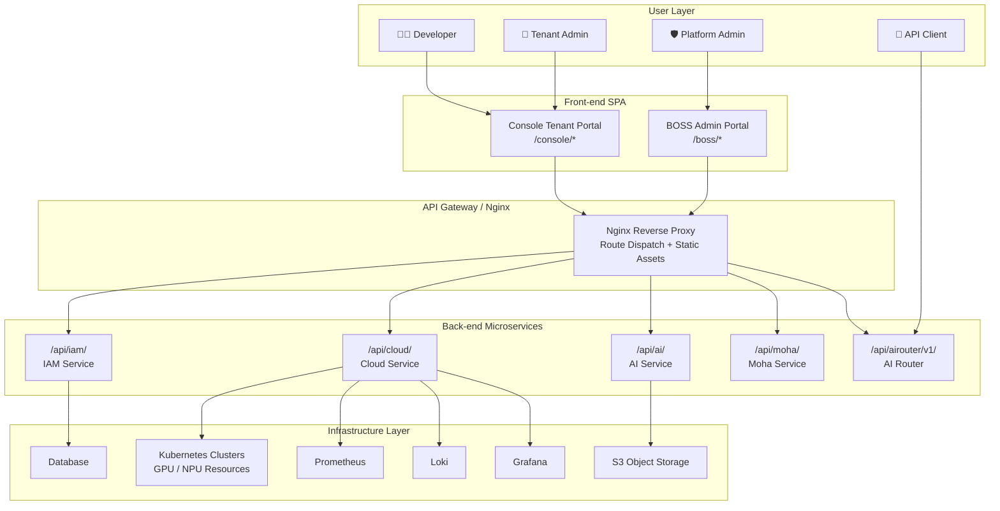

> 💡 Tip: The front-end communicates with the back-end through an Nginx reverse proxy. All API requests are routed to the corresponding microservice via the `/api/` path prefix.

---

## Dual Control Plane Architecture

Rune Console adopts a **single codebase, dual control plane** design. The same React application builds two completely independent management portals, each with its own route tree, navigation configuration, and permission model.

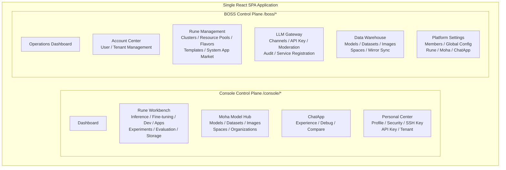

### Console (Tenant Portal)

Designed for **workspace operators** and **developers**, providing day-to-day AI workload management capabilities:

| Module | Core Features | Target Users |
|--------|---------------|--------------|
| **Rune** | Inference services, fine-tuning, dev environments, app deployment, experiment tracking, model evaluation, storage volume management | Developers |
| **Moha** | Model Hub, dataset management, image management, Space applications, organization management | Developers / Data Engineers |
| **ChatApp** | AI chat experience, prompt debugging, multi-model comparison, Token usage statistics | All users |
| **Personal Center** | Profile settings, security configuration (password/MFA), SSH keys, API Keys, tenant switching, theme settings | All users |

### BOSS (Admin Portal)

Designed for **platform administrators**, providing platform-level global management and operations capabilities:

| Module | Core Features | Target Users |
|--------|---------------|--------------|
| **Account Center** | User CRUD, tenant CRUD, member role assignment | Platform admins |
| **Rune Management** | Cluster management, resource pool partitioning, GPU/NPU flavor management, template/product management, system app market | Platform admins |
| **LLM Gateway** | Channel configuration, API Key management, content moderation policies, audit records, service registration, operations panel | Platform admins |
| **Data Warehouse** | Platform-level model/dataset/image/Space management, mirror synchronization | Platform admins |
| **Platform Settings** | System members, global configuration (Rune/Moha/ChatApp/Platform), dynamic dashboards | Platform admins |

> ⚠️ Note: Although Console and BOSS share the same codebase and component system, their route trees are completely isolated. Users cannot navigate directly from one portal to the other. Permission validation is independently enforced at both the route guard and API layers.

---

## Multi-Tenancy Hierarchy in Detail

The platform employs a **Platform → Tenant → Region/Cluster → Workspace → Instance** five-level resource isolation model, with each level having clear responsibility boundaries and data isolation policies.

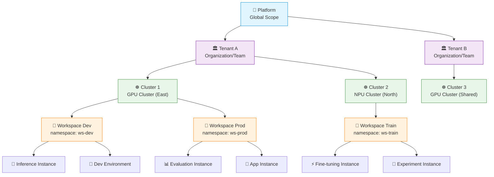

### Responsibilities and Data Boundaries per Level

#### Platform Level

- **Scope**: Global — the top level of the entire XiaoShi AI Platform
- **Manager**: System Admin
- **Data Boundary**: Global user registry, global tenant list, global cluster registry, global configuration, system-level members and roles
- **Core Responsibilities**:
  - Platform user creation and management (cross-tenant)
  - Cluster registration and global scheduling
  - Publishing system-level templates and products
  - LLM gateway global policy configuration (rate limiting, caching, CIDR whitelists, etc.)
  - Platform-level monitoring and operations dashboards

#### Tenant Level

- **Scope**: Organization/team level
- **Manager**: Tenant Admin
- **Data Boundary**: Member list within the tenant, workspace list, tenant-level quotas, tenant-level keys, Moha repositories (models/datasets/Spaces); data is completely isolated between different tenants
- **Core Responsibilities**:
  - Managing members and roles within the tenant
  - Creating and managing workspaces
  - Allocating tenant quotas to workspaces
  - Managing tenant-level Moha repositories and organizations
  - Managing the tenant's API Keys (LLM Gateway)

#### Region/Cluster Level

- **Scope**: Kubernetes cluster level
- **Manager**: System Admin
- **Data Boundary**: Cluster kubeconfig connection info, cluster nodes and resource status, resource pool definitions, Flavor configurations, cluster-level quota allocation
- **Core Responsibilities**:
  - Maintaining connections to Kubernetes clusters (kubeconfig management, dry-run validation)
  - Resource pool partitioning (GPU/NPU/CPU zones)
  - Flavor management (supporting multi-vendor detection: NVIDIA, Ascend, Cambricon, etc.)
  - Cluster-level quota allocation (GPU card count, CPU, memory limits)
  - K8s API pass-through proxy

> 💡 Tip: Cluster onboarding supports dry-run validation, where the system verifies kubeconfig validity and cluster connectivity without actually creating resources.

#### Workspace Level

- **Scope**: Kubernetes namespace level
- **Manager**: Tenant Admin / Workspace Admin
- **Data Boundary**: All K8s resources under that namespace (Pod, Service, Secret, etc.), workspace-level quotas, workspace member list, instance list
- **Core Responsibilities**:
  - Instance lifecycle management (create/start/stop/resume/delete)
  - Quota consumption and tracking
  - Workspace member permission management
  - Mounting storage volumes to instances

#### Instance Level

- **Scope**: Single workload
- **Manager**: Developer
- **Data Boundary**: Instance configuration (Flavor/template/parameters), instance state (running/stopped/failed), instance logs, instance monitoring metrics, mounted storage volumes
- **Instance Types**:

| Type | Description | Typical Use Cases |
|------|-------------|-------------------|
| **Inference** | Deploy model inference services as APIs | Model serving |
| **Fine-tuning** | Model fine-tuning training tasks | LoRA, full-parameter fine-tuning |
| **Dev Environment** | JupyterLab / VS Code remote development | Interactive model development and debugging |
| **App** | Custom containerized applications | Gradio / Streamlit apps |
| **Experiment** | Trackable training experiments | Hyperparameter search, A/B comparison |
| **Evaluation** | Model performance evaluation | Benchmark testing, comparative assessment |

---

## Resource Management Full Workflow

From cluster onboarding to developer instance deployment, a series of management operations driven by different roles are involved:

```mermaid
flowchart TD
    subgraph "Phase 1: Infrastructure Preparation (System Admin)"
        A1["Import Cluster<br/>Upload kubeconfig<br/>Dry-run connectivity validation"] --> A2["Create Resource Pool<br/>Partition GPU/NPU zones<br/>Bind node labels"]
        A2 --> A3["Create Flavors<br/>Define GPU model/count/CPU/memory<br/>Vendor detection: NVIDIA / Ascend / Cambricon"]
        A3 --> A4["Publish Templates/Products<br/>Upload Helm Chart<br/>Configure versions & parameters"]
    end

    subgraph "Phase 2: Quota Allocation (System Admin)"
        A4 --> B1["Create Cluster Quota<br/>Allocate cluster-level resource limits to tenants<br/>GPU cards / CPU cores / Memory"]
        B1 --> B2["Create Tenant-level Flavors<br/>Specify the list of flavors available to the tenant"]
    end

    subgraph "Phase 3: Workspace Management (Tenant Admin)"
        B2 --> C1["Create Workspace<br/>Associate with cluster<br/>Auto-create K8s namespace"]
        C1 --> C2["Configure Workspace Quota<br/>Carve sub-quotas from tenant quota"]
        C2 --> C3["Add Workspace Members<br/>Assign role permissions"]
        C3 --> C4["Configure Workspace-level Flavors<br/>Select from tenant flavors"]
    end

    subgraph "Phase 4: Instance Deployment (Developer)"
        C4 --> D1["Select Instance Type<br/>Inference/Fine-tuning/Dev/App/Experiment/Evaluation"]
        D1 --> D2["Select Flavor<br/>Consume workspace quota"]
        D2 --> D3["Select Template or Image<br/>Configure parameters"]
        D3 --> D4["Mount Storage Volumes<br/>Bind models/datasets"]
        D4 --> D5["Create Instance<br/>Dispatch Pod to K8s"]
    end

    style A1 fill:#e3f2fd
    style A2 fill:#e3f2fd
    style A3 fill:#e3f2fd
    style A4 fill:#e3f2fd
    style B1 fill:#f3e5f5
    style B2 fill:#f3e5f5
    style C1 fill:#e8f5e9
    style C2 fill:#e8f5e9
    style C3 fill:#e8f5e9
    style C4 fill:#e8f5e9
    style D1 fill:#fff3e0
    style D2 fill:#fff3e0
    style D3 fill:#fff3e0
    style D4 fill:#fff3e0
    style D5 fill:#fff3e0
```

### Flavor Three-Level Inheritance

Flavors adopt a Cluster → Tenant → Workspace three-level inheritance model:

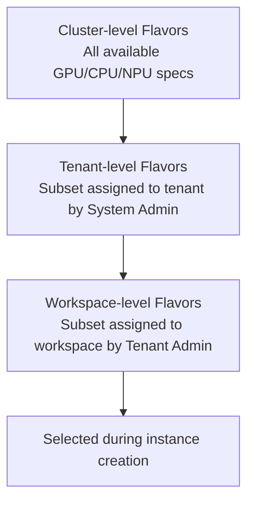

> ⚠️ Note: Quotas follow the same three-level inheritance model. Workspace quotas cannot exceed tenant quotas, and tenant quotas cannot exceed the total available cluster resources.

---

## Back-end Microservice Architecture

The back-end consists of 5 independent microservice domains, each with its own database, independent API path prefix, and clear domain responsibilities.

```mermaid
graph TB
    subgraph "Front-end SPA"
        FE["Rune Console"]
    end

    subgraph "IAM Domain /api/iam/"
        IAM_Auth["Authentication Module<br/>Login/Register/Logout/MFA/CAPTCHA"]
        IAM_User["User Management<br/>CRUD/Avatar Upload"]
        IAM_Tenant["Tenant Management<br/>CRUD/Switching"]
        IAM_Member["Members & Roles<br/>Three-level role system"]
        IAM_SSH["SSH Key Management"]
        IAM_Config["Global Configuration"]
    end

    subgraph "Cloud Domain /api/cloud/"
        Cloud_Cluster["Cluster Management<br/>CRUD/Dry-run/K8s Proxy"]
        Cloud_WS["Workspace Management<br/>CRUD/Namespace"]
        Cloud_Instance["Instance Management<br/>Create/Stop/Resume/Decrypt"]
        Cloud_Flavor["Flavor Management<br/>Three-level inheritance"]
        Cloud_Quota["Quota Management<br/>Three-level inheritance"]
        Cloud_RP["Resource Pool Management"]
        Cloud_Template["Template/Product Management<br/>Helm Chart"]
        Cloud_Monitor["Monitoring/Logs/Metrics<br/>Prometheus/Loki/Grafana"]
        Cloud_Gateway["LLM Gateway<br/>Service Registration"]
    end

    subgraph "AI Domain /api/ai/"
        AI_Volume["Storage Volume Management<br/>CRUD/S3 Backend"]
        AI_S3["S3 File Proxy<br/>Upload/Download/Delete"]
        AI_Job["Storage Tasks<br/>Git/HuggingFace/ModelScope<br/>PythonEnv/Moha Sync"]
    end

    subgraph "Moha Domain /api/moha/"
        Moha_Repo["Repository Management<br/>Models/Datasets/Spaces"]
        Moha_Git["Git Operations<br/>refs/commits/diff/reset"]
        Moha_Discussion["Discussion/PR System"]
        Moha_Image["Image Registry<br/>Scanning/Tags"]
        Moha_Org["Organization Management"]
        Moha_Mirror["Mirror Sync"]
        Moha_Fav["Favorites/Ratings"]
    end

    subgraph "AI Router Domain /api/airouter/v1/"
        AR_Token["API Token Management<br/>Admin + User side"]
        AR_Channel["Channel Management<br/>LLM Routing Rules"]
        AR_Audit["Audit Records"]
        AR_Mod["Content Moderation<br/>Log/Replace/Webhook/Block<br/>Dictionary Management"]
        AR_Stats["Usage Statistics"]
        AR_Settings["Global Settings<br/>Rate Limiting/Cache/Fallback/CIDR"]
    end

    FE --> IAM_Auth
    FE --> Cloud_Cluster
    FE --> AI_Volume
    FE --> Moha_Repo
    FE --> AR_Token

    Cloud_Instance --> Cloud_Flavor
    Cloud_Instance --> Cloud_Quota
    Cloud_Instance --> Cloud_Template
    Cloud_Instance --> AI_Volume
    Cloud_Cluster -.->|K8s API Proxy| Cloud_Instance

    AI_Job --> Moha_Repo
    AR_Channel -.->|Route Forwarding| Cloud_Gateway
```

### Microservice Details

#### 1. IAM Service (`/api/iam/`)

Identity authentication and access management service — the security foundation of the platform.

| Capability | Description |
|------------|-------------|
| Authentication | User login/register/logout, JWT Token issuance and refresh, CAPTCHA, MFA (Multi-Factor Authentication) |
| User Management | User CRUD, avatar upload, password reset |
| Tenant Management | Tenant CRUD, tenant switching, tenant selection |
| Members & Roles | Three-level role system (system/tenant/workspace), permission list generation |
| SSH Keys | Public key upload and management for Git operations and dev environments |
| Global Configuration | Platform-level settings management |

#### 2. Cloud Service (`/api/cloud/`)

Compute resource and workload management service — the core scheduling engine of the platform.

| Capability | Description |
|------------|-------------|
| Cluster Management | Cluster CRUD (including dry-run validation), cluster status monitoring |
| K8s Resource Proxy | Arbitrary K8s API pass-through, supporting Pod/Service/Secret and other resource operations |
| Workspace Management | Workspace CRUD, automatic association with K8s namespaces |
| Instance Management | Full-type instance lifecycle (create/update/delete/stop/resume/decrypt) |
| Flavor Management | Three-level Flavors (cluster/tenant/workspace), GPU model support for NVIDIA, Ascend, Cambricon, etc. |
| Quota Management | Three-level quotas (cluster/tenant/workspace), precise metering of GPU cards/CPU/memory |
| Resource Pools | Cluster resource partition management |
| Templates/Products | Admin products, user products, system products, Helm Chart version management |
| Monitoring | Pod logs, Pod exec (terminal), Pod metrics, Prometheus queries, Grafana dynamic dashboards |
| Log Queries | Loki-compatible log query interface, WebSocket log streaming |
| Service Registration | Upstream service registration for the LLM gateway |

#### 3. AI Service (`/api/ai/`)

Storage and data management service, providing an abstraction layer over S3 object storage.

| Capability | Description |
|------------|-------------|
| Storage Volume Management | Storage volume CRUD (S3 backend, size, storageClass) |
| S3 File Proxy | Proxy interface for file listing/upload/download/deletion |
| Storage Tasks | Supports data synchronization from multiple sources: Git repos, HuggingFace Hub, ModelScope, Python environments, Moha repositories |

#### 4. Moha Service (`/api/moha/`)

Model Hub and asset management service, similar to a privately deployed version of HuggingFace Hub.

| Capability | Description |
|------------|-------------|
| Repository Management | Model/dataset/Space repository CRUD with version support |
| Git Operations | Full Git operations: refs, contents, commits, diff, reset, revert |
| Discussion/PR | In-repository discussion and merge request system |
| Image Management | Container image registry with security scanning and tag management |
| Organization Management | Organization creation, member management, organization repositories |
| Mirror Sync | Synchronize images from external registries (Docker Hub, etc.) |
| Community Features | Favorites, ratings |

#### 5. AI Router (`/api/airouter/v1/`)

LLM gateway service providing a unified large model access layer.

| Capability | Description |
|------------|-------------|
| API Token | Admin-side + user-side Token management with tiered permissions |
| Channel Management | LLM routing rule configuration, model matching, priority, fallback |
| Audit | Full request audit records |
| Content Moderation | Four moderation modes (log/replace/webhook/block), custom dictionaries |
| Usage Statistics | Token usage, request counts, latency statistics |
| Global Settings | Rate limiting, caching, channel fallback, routing preferences, CIDR whitelists |

---

## Authentication and Authorization Flow

The platform implements secure access control through JWT Tokens and a three-level role permission system.

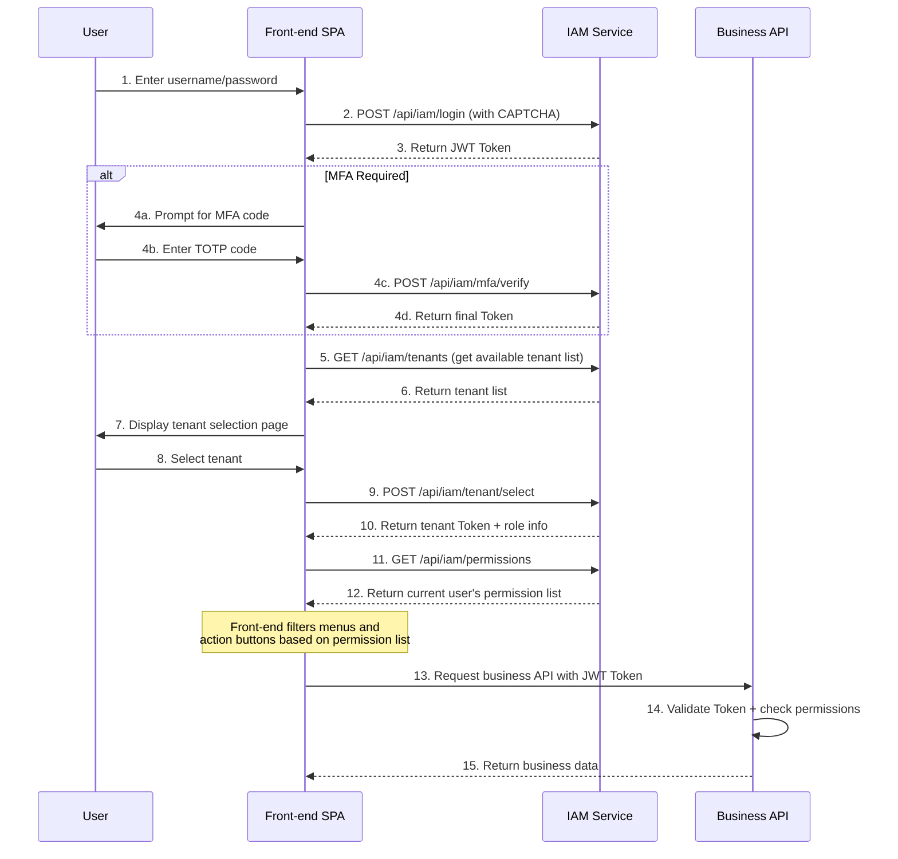

### Three-Level Role System

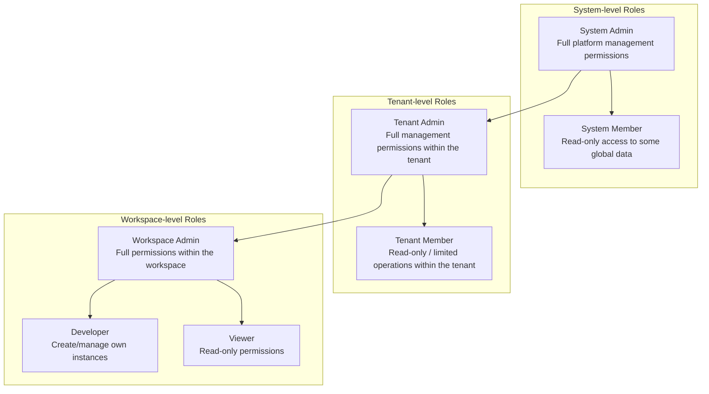

The permission list is generated once when the user selects a tenant, and the front-end filters accordingly:
- **Menu visibility** — Navigation items without permission are hidden
- **Action buttons** — Buttons without permission are disabled or hidden
- **Route guards** — Routes without permission redirect to a 403 page

> 💡 Tip: Users may have different roles in different tenants and workspaces. When switching tenants or workspaces, the permission list is recalculated.

---

## LLM Gateway Request Routing

AI Router provides a unified LLM access gateway that exposes OpenAI-compatible API endpoints externally and routes requests to the corresponding upstream LLM services internally based on channel configuration.

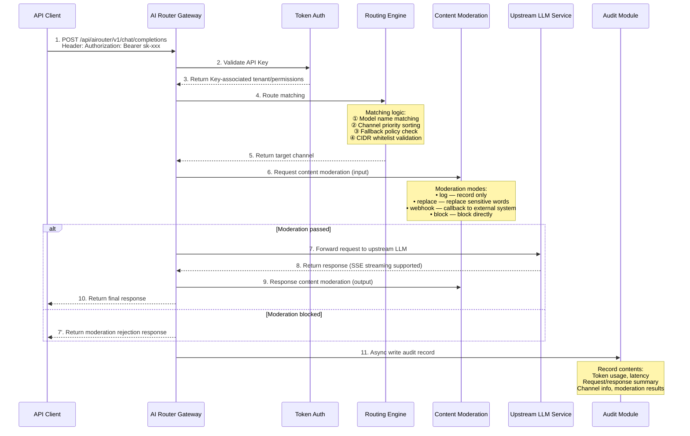

### Channel Configuration Elements

| Configuration | Description |
|---------------|-------------|
| Model Matching | Supports exact matching and wildcards, e.g., `gpt-4*`, `qwen-*` |
| Priority | Higher numbers mean higher priority; when multiple channels serve the same model, selection follows priority |
| Fallback Policy | Automatically switches to backup channels when the primary channel is unavailable |
| Rate Limiting | Global rate limiting and per-Key rate limiting (QPM/TPM) |
| Caching | Caches identical requests for a period to reduce upstream pressure |
| Routing Preference | Supports round-robin, lowest latency, lowest usage strategies |
| CIDR Whitelist | Restricts the source IP of API Keys |

---

## Front-end Architecture

### Tech Stack

| Technology | Version | Purpose |
|------------|---------|---------|
| **React** | 19 | UI Framework |
| **TypeScript** | 5.x | Type Safety |
| **Vite** | 6 | Build Tool + Dev Server |
| **MUI (Material UI)** | 7 | UI Component Library |
| **React Router** | 7 | Client-side Routing |
| **SWR** | 2.x | Server State Management (Data Caching/Revalidation) |
| **i18next** | 23.x | Internationalization (Chinese/English) |
| **Axios** | 1.x | HTTP Client |

### Routing System

The front-end uses React Router 7 for client-side routing, with `lazy()` for **per-module code splitting** so only the code needed for the current route is loaded on initial render.

```mermaid
graph TD
    Root["/"] --> Auth["/auth/*<br/>AuthLayout"]
    Root --> ConsoleTree["/console/*<br/>DashboardLayout"]
    Root --> BossTree["/boss/*<br/>DashboardLayout"]

    Auth --> Login["/auth/login"]
    Auth --> Register["/auth/register"]
    Auth --> Reset["/auth/reset-password"]
    Auth --> SelectTenant["/auth/select-tenant"]
    Auth --> MFA["/auth/mfa"]

    ConsoleTree --> CDash["/console/dashboard"]
    ConsoleTree --> CRune["/console/rune/*<br/>lazy loaded"]
    ConsoleTree --> CMoha["/console/moha/*<br/>lazy loaded"]
    ConsoleTree --> CChat["/console/chatapp/*<br/>lazy loaded"]
    ConsoleTree --> CIAM["/console/iam/*<br/>lazy loaded"]

    BossTree --> BDash["/boss/dashboard"]
    BossTree --> BIAM["/boss/iam/*<br/>lazy loaded"]
    BossTree --> BRune["/boss/rune/*<br/>lazy loaded"]
    BossTree --> BGW["/boss/gateway/*<br/>lazy loaded"]
    BossTree --> BMoha["/boss/moha/*<br/>lazy loaded"]
    BossTree --> BSet["/boss/settings/*<br/>lazy loaded"]

    style Auth fill:#ffebee
    style ConsoleTree fill:#e3f2fd
    style BossTree fill:#fce4ec
```

### Layout System

The platform uses three layout modes to accommodate different scenarios:

| Layout | Use Case | Structure |
|--------|----------|-----------|
| **AuthLayout** | Login, registration, password reset, MFA, tenant selection | Centered card + branded background |
| **DashboardLayout** | Main working interface for Console and BOSS | Header + Sidebar + Content three-column layout |
| **MinimalLayout** | Compact views, embedded pages | Content only |

DashboardLayout supports multiple navigation variants:

- **Vertical** — Standard left sidebar navigation
- **Horizontal** — Top horizontal navigation bar
- **Mini** — Collapsed mini sidebar (icons only)

### State Management

Front-end state management uses a **layered strategy**: React Context manages global UI state, while SWR manages server-side data state.

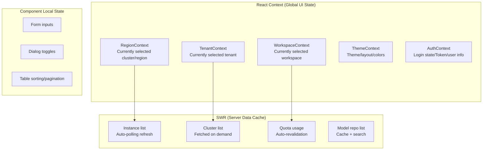

> 💡 Tip: Switching clusters (RegionContext) clears the SWR cache for workspace lists and instance lists to ensure data consistency. Switching tenants triggers a page-level reload.

### Theme System

The platform features rich built-in theme customization capabilities:

| Configuration | Options |
|---------------|---------|
| **Color Mode** | Light / Dark |
| **Contrast** | Default / High Contrast |
| **Navigation Color** | Multiple presets (dark, light, colored) |
| **Navigation Layout** | Vertical / Horizontal / Mini |
| **Preset Colors** | Multiple brand color sets available |
| **Font Size** | Adjustable |
| **Compact Layout** | On / Off |

---

## Storage Architecture

The platform's storage system is based on S3 object storage, providing a unified storage abstraction layer through the AI Service.

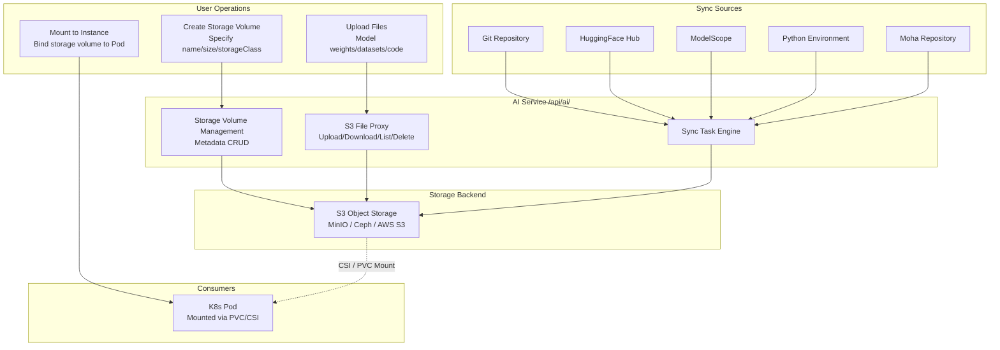

### Storage Volume Lifecycle

1. **Create**: Specify name, capacity, and storageClass; the system creates a corresponding Bucket/Prefix on S3
2. **Upload Data**: Upload model files, datasets, etc. via the S3 file proxy interface
3. **Sync Import**: Batch synchronize from sources like Git/HuggingFace/ModelScope via storage tasks
4. **Mount & Use**: Associate storage volumes when creating instances; Pods mount them via CSI drivers at startup
5. **Delete**: Unmount from all associated instances, then delete the storage volume and underlying S3 data

> ⚠️ Note: Storage volumes that are mounted to running instances cannot be deleted directly. You must first stop or delete the associated instances before performing this operation.

---

## Observability Architecture

The platform provides comprehensive observability at the instance, cluster, and gateway levels.

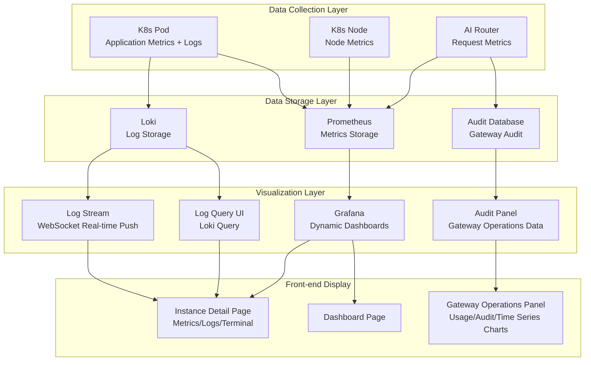

### Three-Level Observability

#### Instance Level

| Capability | Data Source | Description |
|------------|------------|-------------|
| **Pod Metrics** | Prometheus | GPU utilization, GPU memory usage, CPU, memory, network I/O |
| **Pod Logs** | Loki | Container stdout/stderr logs with keyword search support |
| **Log Stream** | WebSocket | Real-time log push, similar to `kubectl logs -f` |
| **Terminal** | WebSocket (exec) | Direct access to Pod container terminal, similar to `kubectl exec` |
| **Grafana Panels** | Grafana API | Dynamically generated instance-level monitoring dashboards |

#### Cluster Level

| Capability | Data Source | Description |
|------------|------------|-------------|
| **Cluster Dashboard** | Grafana | Node overview, resource utilization, Pod scheduling status |
| **Log Queries** | Loki | Cluster-wide log search with LogQL support |
| **Resource Monitoring** | Prometheus | GPU/NPU pool utilization, quota consumption trends |

#### Gateway Level

| Capability | Data Source | Description |
|------------|------------|-------------|
| **Usage Records** | AI Router DB | Detailed records for each API call (Token/latency/model/channel) |
| **Audit Records** | AI Router DB | Complete request/response audit trail |
| **Operations Panel** | AI Router Stats API | Time series charts: QPM, Token usage trends, channel distribution, error rates |

---

## High Availability Considerations

### Front-end High Availability

- **Static Asset CDN**: Build artifacts can be deployed to CDN; Nginx only serves as a reverse proxy
- **Code Splitting**: Lazy loading by route; fast initial load with fault isolation
- **SWR Caching**: Displays cached data during network interruptions; auto-revalidates upon recovery
- **Error Boundaries**: React Error Boundaries catch component crashes, preventing full-page white screens

### Back-end High Availability

- **Independent Microservice Deployment**: 5 domains deployed and scaled independently; single service failure does not affect the entire platform
- **Stateless Design**: All business services are stateless and horizontally scalable
- **JWT Tokens**: Tokens are self-contained; logged-in users are unaffected by brief IAM unavailability
- **K8s Proxy Fault Tolerance**: Automatic retry on cluster connection failure; dry-run protects against misoperations

### Gateway High Availability

- **Channel Fallback**: Automatically switches to backup channels on primary channel failure
- **Rate Limiting Protection**: Global + per-Key rate limiting prevents resource exhaustion
- **Cache Layer**: Reduces upstream LLM call pressure
- **Async Audit**: Audit logs are written asynchronously without blocking the main request pipeline

### Storage High Availability

- **S3 Backend**: Relies on S3 object storage's native redundancy (MinIO erasure coding / AWS S3 multi-AZ)
- **Storage Volume Metadata**: Stored in database with backup and recovery support

---

## Context Switching Mechanism

Before operating on resources in the Console, users need to switch to the correct context environment:

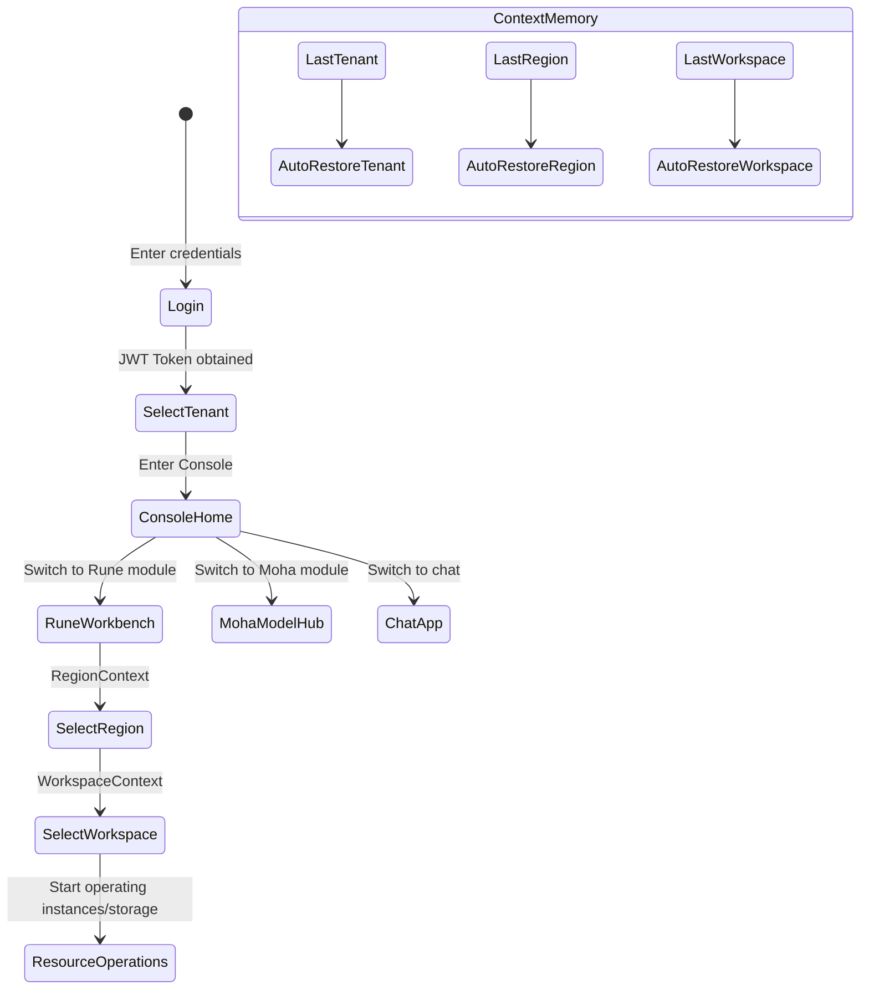

1. **Tenant Selection** — Select the target tenant on the tenant selection page after login, or switch via the top navigation
2. **Region/Cluster Selection** — After entering the Rune workbench, switch clusters via the top region selector
3. **Workspace Selection** — After selecting a cluster, switch to the target workspace via the workspace selector

> 💡 Tip: The system persists your last used tenant, region, and workspace to local storage, automatically restoring context on your next visit.

---

## Technical Architecture Summary

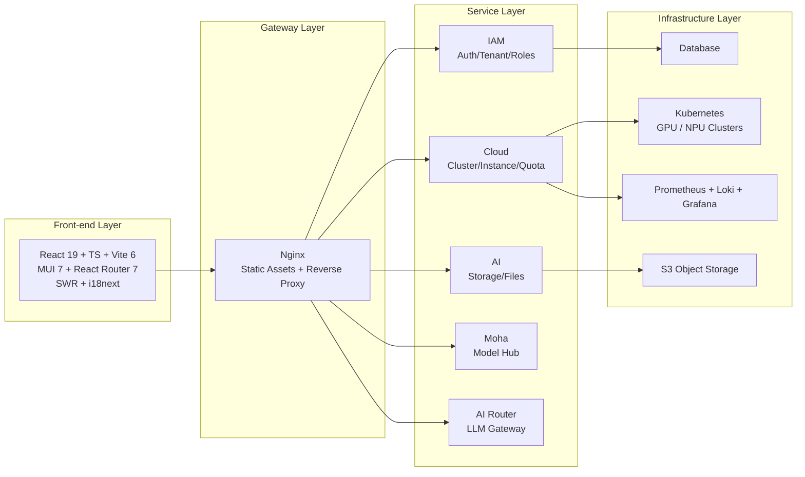

| Dimension | Key Design |
|-----------|------------|
| **Dual Control Planes** | Same codebase generates Console + BOSS portals with isolated routes and independent permissions |
| **Multi-Tenancy** | Five-level isolation: Platform → Tenant → Cluster → Workspace → Instance |
| **Resource Management** | Three-level inheritance for quotas/flavors, progressively refined from cluster to workspace |
| **Heterogeneous Compute** | Supports multi-vendor hardware: NVIDIA GPU, Ascend NPU, Cambricon MLU, etc. |
| **Gateway Routing** | Full pipeline: model matching + priority + fallback + rate limiting + caching + moderation |
| **Storage Abstraction** | Unified S3 backend with multi-source sync (Git/HF/ModelScope/Moha) |
| **Observability** | Prometheus metrics + Loki logs + Grafana dashboards + WebSocket real-time streaming |

---

## Next Steps

- [Glossary](./glossary.md) — Learn about core platform terms and concept definitions
- [Roles & Permissions](../auth/roles.md) — Deep dive into the three-level permission system
- [Console Overview](../console/) — Start using the Console portal
- [Quick Start](./quick-start.md) — Step-by-step getting started guide
