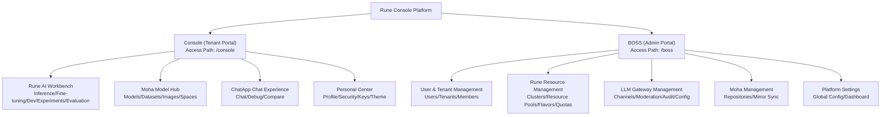

# Product Overview

## What is Rune Console

**Rune Console** is the enterprise-grade AI platform unified control center developed by **XiaoShi AI**. It provides AI teams with an end-to-end workflow covering model training, fine-tuning, inference deployment, and online conversational experiences, equipped with comprehensive multi-tenant isolation, resource quotas, permission systems, and a unified LLM gateway to help enterprises securely and efficiently manage GPU/NPU computing resources and AI model assets.

Rune Console consists of **three sub-products** and **two control planes**, covering the needs of various roles throughout the entire AI lifecycle.

---

## Three Sub-Products

### Rune — AI Workbench

Rune is the platform's core compute engine, designed for ML engineers and data scientists, providing rich AI workload management capabilities:

| Module | Description | Typical Use Cases |
|--------|-------------|-------------------|
| **Inference Service** | One-click deployment of trained models with automatic GPU resource allocation and RESTful API endpoint exposure | Deploy large language models like LLaMA, ChatGLM for online inference |
| **Fine-tuning Service** | Submit SFT/LoRA fine-tuning tasks based on pre-trained models and track training metrics | Fine-tune base models with private data for domain adaptation |
| **Dev Environment** | Launch JupyterLab / VS Code Server / SSH remote development environments with direct GPU access | Interactive model code debugging and data exploration |
| **Application Management** | Deploy and manage custom AI applications (e.g., web demos, API services) | Deploy Gradio/Streamlit demo applications |
| **Experiment Management** | Track ML experiment parameters, metrics, and artifacts; compare different experiments | Record multi-round hyperparameter search results and select optimal configurations |
| **Evaluation Management** | Perform systematic benchmark evaluations on models | Evaluate model accuracy/latency using standard evaluation datasets |
| **Storage Volumes** | S3-compatible persistent storage that can be mounted to any instance, with built-in file manager | Store model weights, training data, and checkpoints |
| **App Market** | Platform-provided application template library with one-click deployment | Quickly deploy mainstream frameworks like vLLM, TGI, LLaMA-Factory |

> 💡 **Tip**: All workload types (inference, fine-tuning, dev environments, applications, experiments, evaluations) share a unified deployment workflow: select template → configure parameters → choose flavor → submit deployment. Differences between types are reflected in available templates and parameter configurations.

### Moha — Model Hub

Moha is the platform's built-in AI asset repository, providing a HuggingFace-like model/dataset/Space management experience, but designed for enterprise private deployment:

| Module | Description | Typical Use Cases |
|--------|-------------|-------------------|
| **Model Management** | Git-style version control with file browsing, branch management, commit history, and Pull Requests | Manage and distribute enterprise private models, control model version iterations |
| **Dataset Management** | Dataset upload, version management, and format preview | Manage training and evaluation datasets |
| **Image Registry** | Container image management with security scanning and visibility control | Manage custom training/inference container images |
| **Space** | Online showcase space supporting Gradio/Streamlit and other frontend application hosting | Create model experience demos or interactive documentation |
| **Organization Management** | Manage repositories and members at the organization level with role assignment | Divide model asset ownership by team/department |
| **Discussions & PRs** | Community-style discussions, code reviews, and merge requests | Model version review and merge management |
| **Mirror Sync** | Automatically sync models and datasets from external sources (HuggingFace/ModelScope, etc.) | Automatically sync public models to enterprise intranet |
| **Favorites & Ratings** | Model/dataset favoriting and rating system | Help teams discover high-quality internal models |

> 💡 **Tip**: Every Moha repository (model/dataset/Space) has an independent Git repository supporting Git LFS for large file storage, operable via Web UI or command line.

### ChatApp — Conversational Experience

ChatApp provides business users and developers with a ready-to-use large model chat interface, allowing them to experience deployed AI models without writing any code:

| Module | Description | Typical Use Cases |
|--------|-------------|-------------------|
| **AI Chat Experience** | Select a model and API Key to have streaming conversations with AI, supporting deep thinking (CoT) | Business users experiencing privately deployed large models |
| **Chat Debugging** | Left-side parameter panel + right-side chat area with real-time adjustment of Temperature/TopP/MaxTokens and other parameters | Developers tuning prompts and parameters for optimal output |
| **Multi-Model Comparison** | Side-by-side dual-column chat, sending the same input to two models simultaneously for output quality comparison | Evaluating answer quality across different models (or different versions) |
| **Token Management** | Manage personal or team API access tokens with usage limits and IP whitelisting | Control API call frequency and access scope |

> 💡 **Tip**: ChatApp's conversation parameters include Temperature (0-1.999), Top P (0.1-1.0), Max Tokens (0-32768), System Prompt, and Stop Words. It also supports Deep Thinking (Reasoning) mode, displaying the model's reasoning chain during streaming responses.

---

## Two Control Planes

Rune Console provides two completely independent management interfaces for different user groups and management responsibilities:

### Console — Tenant Portal

Designed for **tenant administrators, developers, and general members**. This is the daily work interface for most users.

**Core Responsibilities**:
- Deploy and manage various AI workloads within assigned workspaces
- Manage models, datasets, and other AI assets
- Experience and invoke deployed models through ChatApp and LLM Gateway API
- Manage personal account information, security settings, API Keys, and SSH Keys

**Target Roles**: Tenant Admin, Developer, Member

### BOSS — Platform Admin Portal

Designed for **platform administrators (System Admin)**. Provides global platform operations and resource management capabilities.

**Core Responsibilities**:
- Manage the lifecycle of all platform users and tenants
- Manage GPU/NPU compute clusters, resource pools, and Flavors (hardware specifications)
- Allocate tenant quotas (GPU count, storage capacity, etc.)
- Manage the unified LLM gateway (channel routing, content moderation, audit logs)
- Configure platform-wide settings (login methods, branding, dashboards, etc.)

**Target Roles**: System Admin only

### Responsibility Matrix

| Management Function | Console | BOSS |
|---------------------|:-------:|:----:|
| Deploy inference/fine-tuning/dev environments | ✅ | — |
| Manage models/datasets/Spaces | ✅ | ✅ (audit) |
| ChatApp conversational experience | ✅ | — |
| Personal account & security settings | ✅ | — |
| Workspace CRUD | ✅ | — |
| User registration & management | — | ✅ |
| Tenant creation & quota allocation | — | ✅ |
| Cluster onboarding & resource pool management | — | ✅ |
| Flavor management | — | ✅ |
| LLM gateway channel configuration | — | ✅ |
| Content moderation policies | — | ✅ |
| Audit log viewing | — | ✅ |
| Platform-wide settings | — | ✅ |
| Dynamic dashboard configuration | — | ✅ |

---

## Target Users & Use Cases

### ML Engineers / Algorithm Engineers

**Typical Operations**:
1. Upload private models to Moha → Select model template in Rune → Deploy inference service → Invoke via API
2. Submit fine-tuning tasks → View training metrics and logs → Register fine-tuned models to Moha
3. Launch JupyterLab dev environment → Mount storage volumes → Interactive development and debugging

**Recommended Usage**: All Rune Workbench features + Moha Model Hub

### Data Scientists / Data Engineers

**Typical Operations**:
1. Manage training datasets in Moha → Mount to dev environments for data preprocessing
2. Submit experiment tasks → Compare different experiment results → Select optimal configuration
3. Use evaluation features to perform standardized model assessments

**Recommended Usage**: Moha dataset management + Experiments/Evaluations + Storage Volumes

### Platform Administrators

**Typical Operations**:
1. Onboard GPU clusters → Create resource pools → Define Flavor specifications → Allocate tenant quotas
2. Create tenants → Invite members → Assign roles
3. Configure LLM gateway channels → Set content moderation policies → Monitor API call volume

**Recommended Usage**: All BOSS features

### Business Teams / Product Managers

**Typical Operations**:
1. Experience deployed large models directly through ChatApp
2. Use comparison mode to evaluate answer quality across different models
3. View dashboards to understand model usage and business metrics

**Recommended Usage**: ChatApp conversational experience + Dashboards

---

## Core Platform Advantages

| Advantage | Details |
|-----------|---------|
| **Multi-Tenant Isolation** | Platform → Tenant → Workspace three-level isolation, each with independent resource quotas and member permissions, with no data or resource interference |
| **GPU/NPU Intelligent Scheduling** | Supports NVIDIA GPUs, Huawei Ascend NPUs, Cambricon MLUs, and other accelerators with automatic detection and scheduling |
| **Full Model Lifecycle** | End-to-end management from model development, training, and fine-tuning to inference deployment, with Git-based model version management |
| **Unified LLM Gateway** | OpenAI API-compatible unified gateway supporting multi-channel routing, failover retry, rate limiting, and content moderation |
| **Flexible Deployment Templates** | App Market with pre-built templates for mainstream frameworks (vLLM, TGI, LLaMA-Factory, etc.), plus support for custom Helm Charts |
| **Enterprise-Grade Security** | RBAC role permissions + MFA multi-factor authentication + API Key management + IP whitelisting + audit logs |
| **Built-in File Management** | S3-compatible object storage with built-in web file manager supporting upload/download/preview/directory browsing |
| **Rich Observability** | Prometheus monitoring metrics + Loki log aggregation + custom dashboards + event streams |
| **Bilingual Support** | Full Chinese and English language support across all functional modules |
| **Open-Source Tech Stack** | Frontend built with React 19 + TypeScript + MUI 7 + Vite 6, high-performance and modern |

---

## Platform Capability Overview

### Workload Types

| Type | Category ID | Description | Status Transitions |
|------|-------------|-------------|-------------------|
| Inference Service | `inference` | Online model inference deployment | Installed → Healthy / Unhealthy / Failed |
| Fine-tuning Task | `tune` | Model fine-tuning training task | Installed → Healthy → Succeeded / Failed |
| Dev Environment | `im` | Interactive development environment | Installed → Healthy |
| Application | `app` | Custom AI application | Installed → Healthy / Failed |
| Experiment | `experiment` | ML experiment tracking | Installed → Healthy |
| Evaluation | `evaluation` | Model evaluation | Installed → Healthy → Succeeded |

### Resource Flavor Examples

| Flavor Name | CPU | Memory | GPU | Use Case |
|-------------|-----|--------|-----|----------|
| cpu-4c8g | 4C | 8G | — | Data processing, lightweight tasks |
| gpu-a100-1 | 8C | 32G | 1× A100 40G | Medium model inference |
| gpu-a100-4 | 32C | 128G | 4× A100 80G | Large model training, inference |
| gpu-a100-8 | 64C | 256G | 8× A100 80G | Ultra-large distributed model training |
| npu-910b-8 | 192C | 1.5T | 8× Ascend 910B | Domestic hardware adaptation scenarios |

> ⚠️ **Note**: Actual available flavors depend on the Flavors configured by the platform administrator in the cluster. Available flavors may differ across clusters.

---

## Environment Requirements

### Browser Support

| Browser | Minimum Version | Recommended Version |
|---------|-----------------|---------------------|
| Google Chrome | 90+ | Latest |
| Mozilla Firefox | 90+ | Latest |
| Microsoft Edge | 90+ | Latest |
| Safari | 15+ | Latest |
| Internet Explorer | ❌ Not supported | — |

### Recommended Screen Resolution

- **Best**: 1920 × 1080 (Full HD) and above
- **Minimum**: 1366 × 768
- **Mobile**: Basic browsing supported; use a desktop browser for full functionality

> 💡 **Tip**: The platform will display a "Not suitable for mobile" prompt on narrow-screen devices. Desktop devices are recommended for daily operations.

---

## Next Steps

| Recommended Reading | Description |
|--------------------|-------------|
| [Quick Start](./quick-start.md) | Complete guide from login to deploying your first inference service |
| [Platform Architecture](./architecture.md) | Deep dive into multi-tenant architecture, microservices, and system design |
| [Glossary](./glossary.md) | Familiarize yourself with core platform concepts and terminology |
| [Login](../auth/login.md) | Learn about the login process and authentication methods |
| [Inference Service](../console/rune/inference.md) | Go directly to the inference service documentation |
