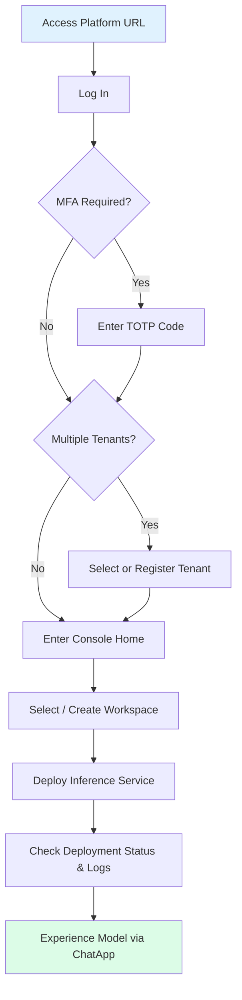
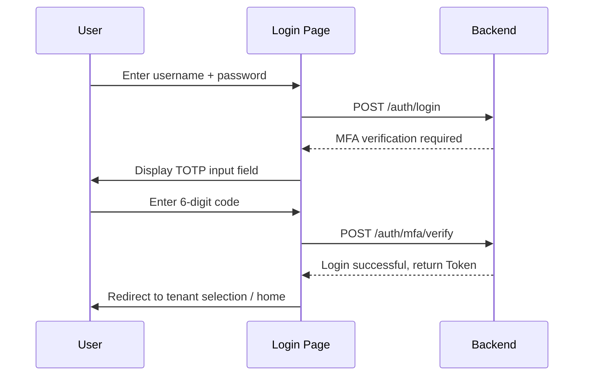
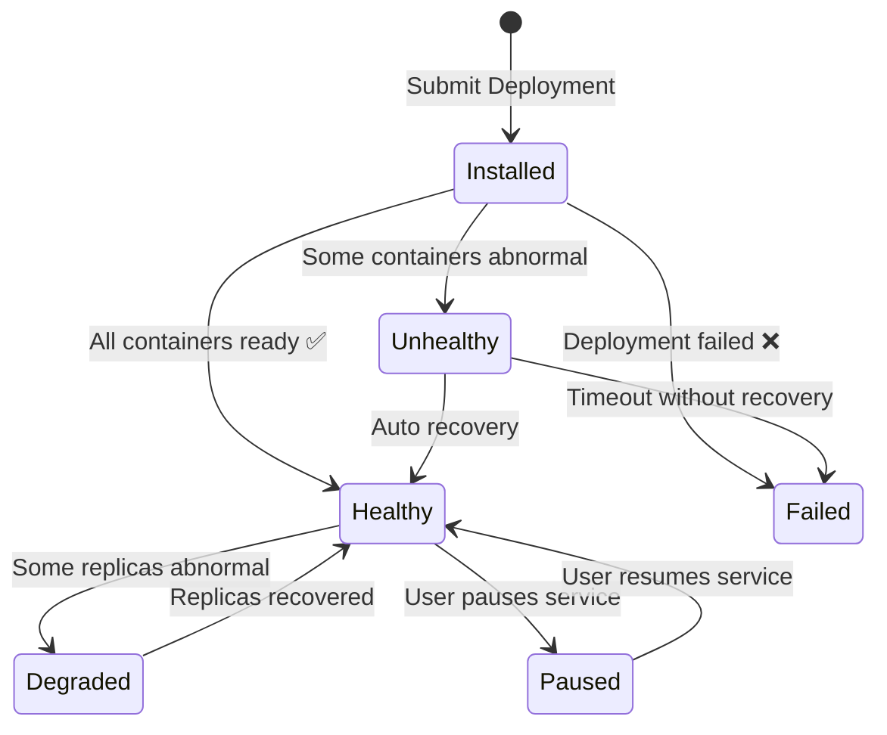

# Quick Start

This guide will walk you through the complete process step by step, from scratch: **Login → Select Tenant → Explore the Interface → Create Workspace → Deploy Inference Service → Check Status → Experience AI Chat**. Even if this is your first time using Rune Console, you can complete all steps in **15–30 minutes**.

---

## Full Process Overview



---

## Prerequisites

Before getting started, please confirm you have met the following conditions:

| Condition | Description |
|-----------|-------------|
| **Browser** | Chrome ≥ 90, Firefox ≥ 88, Edge ≥ 90, or Safari ≥ 15 (latest Chrome recommended) |
| **Network** | Able to access the platform domain (e.g., `https://your-domain/console`), ensure no proxy interception |
| **Account** | Login username and password obtained (assigned by admin or self-registered via the registration page) |
| **MFA (Optional)** | If the platform has MFA enabled, install **Google Authenticator**, **Microsoft Authenticator**, or another TOTP-compatible app on your phone in advance |

> 💡 Tip: If you don't have an account yet, contact the platform administrator or visit the registration page at `/auth/register` for self-registration. See [Register an Account](../auth/register.md) for the registration process.

---

## Step 1: Log In to the Platform {#step-login}

### 1.1 Access the Login Page

Enter the platform URL in your browser's address bar, for example:

```
https://your-domain/console
```

The system will automatically redirect to the login page at `/auth/login`.


### 1.2 Enter Credentials

Fill in the login form:

| Field | Description |
|-------|-------------|
| **Username** | Your platform login account |
| **Password** | Your login password |

### 1.3 CAPTCHA

When the platform detects security risks (e.g., multiple failed login attempts, unfamiliar IP), a **CAPTCHA** will appear below the login form:

1. View the characters shown in the CAPTCHA image
2. Enter the CAPTCHA correctly in the input field
3. If you can't read it clearly, click the CAPTCHA image to **refresh** with a new one

> ⚠️ Note: CAPTCHAs are case-sensitive, so read carefully. If you enter it incorrectly multiple times in a row, the system may temporarily lock login — please wait a few minutes before trying again.


### 1.4 Multi-Factor Authentication (MFA / TOTP)

If your account has MFA bound, after entering your username and password you will be directed to the **MFA verification page**:

1. Open the Authenticator app on your phone (e.g., Google Authenticator)
2. Find the Rune Console entry
3. Enter the current **6-digit dynamic code** (refreshes every 30 seconds)
4. Click the **Verify** button to complete login



> 💡 Tip: If you haven't bound MFA yet but the platform requires it, the system will guide you to scan a QR code during your first login to complete the binding. Please securely store recovery codes in case you lose your phone.

> ⚠️ Note: TOTP verification codes are time-sensitive (30 seconds). Wait for the next new code before entering when the current code is about to expire, to avoid verification failure.

---

## Step 2: Select or Create a Tenant {#step-tenant}

### 2.1 What is a Tenant?

A **Tenant** is the top-level resource isolation unit in Rune Console. Each tenant has independent:

- Members and role permissions
- Workspaces and resource quotas
- Models, datasets, and other assets
- Billing and usage statistics

You can think of a tenant as an **"organization"** or **"team"**. A user can belong to multiple tenants, but can only operate under one tenant at a time.

### 2.2 Select a Tenant

If you belong to **multiple tenants**, after successful login the system will automatically redirect to the **tenant selection page**:

1. The page displays all tenants you have access to in a list format
2. Each tenant shows its name and description
3. Click the target tenant to enter


> 💡 Tip: If you only belong to one tenant, the system will **automatically skip** this step and go directly to the console home page.

### 2.3 Register a New Tenant

If you are a new user, you may not have joined any tenant yet. In this case, you can choose to **register a new tenant**:

1. Click the **"Register New Tenant"** button on the tenant selection page
2. Fill in the tenant name and description
3. After submission, you will automatically become the **administrator** of that tenant
4. The system will then redirect to the console home page

> ⚠️ Note: After registering a new tenant, the platform administrator needs to allocate resource quotas to it. Otherwise, you will temporarily be unable to create workspaces or deploy services. Please contact the administrator promptly.

---

## Step 3: Explore the Console Layout {#step-layout}

After entering the console, you will see the following overall layout:


### 3.1 Top Navigation Bar

The top navigation bar spans the entire page and contains the following elements:

| Area | Description |
|------|-------------|
| **Sub-product Tabs** | `Rune` · `Moha` · `ChatApp` three tabs for switching between sub-products |
| **Language Switcher** | Click to switch the interface language (Chinese / English) |
| **Theme Switcher** | Toggle between light / dark theme |
| **User Avatar** | Click to expand the dropdown menu with access to personal center, security settings, tenant switching, logout, etc. |

#### Three Sub-Products at a Glance

- **Rune (AI Workbench)**: Core workbench for managing inference services, fine-tuning tasks, dev environments, experiments, evaluations, applications, etc.
- **Moha (Model Hub)**: Model asset management center for managing models, datasets, images, Spaces, etc.
- **ChatApp (Chat Experience)**: Chat interaction with deployed AI models, supporting parameter tuning, model comparison, etc.

### 3.2 Left Navigation Menu

The left navigation menu changes dynamically based on the current sub-product:

**Rune Module Menu Example:**

```
📊 Dashboard
📦 Inference Services
🔧 Fine-tuning Services
💻 Dev Environments
🧪 Experiment Management
📐 Evaluation Tasks
🏪 App Market
📁 Storage Volumes
```

**Moha Module Menu Example:**

```
🤖 Model Management
📊 Datasets
🖼️ Image Management
🌐 Spaces
🏢 Organization Management
```

### 3.3 Workspace Selector

At the **top** of the left menu, there is a **workspace selector** consisting of two dropdown selectors:

| Selector | Description |
|----------|-------------|
| **Cluster** | Select the target cluster you want to operate on; different clusters have different compute resources |
| **Workspace** | Under the selected cluster, choose the specific workspace |

> 💡 Tip: A workspace is the basic unit for resource isolation and permission control in Rune Console. Multiple workspaces can be created under the same tenant, with services and data isolated between different workspaces.


---

## Step 4: Select or Create a Workspace {#step-workspace}

### 4.1 Select an Existing Workspace

If the administrator has already assigned a workspace to you, simply select it from the workspace selector dropdown.

### 4.2 Create a New Workspace

If there is no workspace yet, or you wish to create a new independent space:

1. Click the **"+"** button next to the workspace selector (or navigate to the workspace management page)
2. Fill in the following information in the creation form:

| Field | Required | Description | Validation Rules |
|-------|----------|-------------|-----------------|
| **Name** | ✅ | Unique identifier for the workspace | Follows K8s naming convention: only lowercase letters `a-z`, digits `0-9`, and hyphens `-`; cannot start or end with a hyphen; maximum **63** characters |
| **Description** | ❌ | Brief description of the workspace's purpose | Free text, can be left empty |

3. Click the **"Create"** button
4. After successful creation, the workspace selector will automatically switch to the newly created workspace

**Name Examples:**

```
✅ Valid names: my-workspace, team-a-dev, inference-prod-01
❌ Invalid names: My_Workspace (contains uppercase and underscores), -start-dash (starts with hyphen), workspace.test (contains period)
```

> ⚠️ Note: Workspace names **cannot be modified** once created, so please choose carefully. The name will be part of the K8s Namespace and will affect subsequent service URL paths.


---

## Step 5: Deploy Your First Inference Service {#step-deploy}

This is the core step of this tutorial. We will demonstrate the complete process of selecting a template from the App Market, configuring parameters, and completing the deployment.

### 5.1 Navigate to the Inference Service Page

1. Confirm the top tab is switched to **Rune**
2. Click **"Inference Services"** in the left menu
3. Enter the inference service list page


### 5.2 Initiate Deployment

Click the **"Deploy"** button in the upper right corner of the page to enter the deployment wizard.

### 5.3 Select a Product Template

The first step of deployment is selecting a product template from the **App Market (Marketplace)**:

- Templates are displayed as **cards**, each containing: template icon, name, description, and category tags
- The top of the page has a **category filter** for quick filtering: `All` / `LLM Inference` / `Vector Database` / `Image Generation` / `Speech Recognition`, etc.
- Click the target template card to enter the configuration page


> 💡 Tip: If you're unsure which template to choose, we recommend starting with **vLLM** or **TGI (Text Generation Inference)** — they are the most commonly used LLM inference engines.

### 5.4 Configure Basic Information

After selecting a template, enter the configuration page and first fill in the basic information:

| Field | Required | Description |
|-------|----------|-------------|
| **Name** | ✅ | Instance name, following K8s naming convention (lowercase letters, digits, hyphens, max 63 characters) |
| **Description** | ❌ | Description for this deployment |

### 5.5 Select Template Version

In the **Version Selector (VersionPopover)**, select the template version to deploy:

- The dropdown displays all available version numbers (e.g., `v1.2.0`, `v1.1.3`, etc.)
- It is generally recommended to select the **latest stable version**
- Different versions may correspond to different underlying Helm Charts and default parameters

> 💡 Tip: Version numbers may have labels such as `latest` or `recommended` — prioritize these versions.

### 5.6 Select Flavor

The **Flavor** determines the compute resource configuration for the service instance. The selection page displays **resource cards**:

| Flavor Type | Typical Configuration Example | Use Case |
|-------------|-------------------------------|----------|
| **GPU Flavors** | 1×A100 80GB, 2×A100 80GB, 4×A100 80GB | Large model inference (7B, 13B, 70B, etc.) |
| **CPU Flavors** | 4C8G, 8C16G, 16C32G | Lightweight services or vector databases |

Each flavor card displays:

- GPU type and count (e.g., `NVIDIA A100 × 2`)
- CPU cores and memory size
- Available inventory status


> ⚠️ Note: Flavor selection is limited by **workspace quotas**. If a flavor appears grayed out or unselectable, it means the current workspace's resource quota is insufficient — please contact your tenant administrator to adjust the quota.

### 5.7 Configure Dynamic Parameters

Rune Console automatically generates a parameter configuration form (SchemaForm) based on the **JSON Schema** defined in the Helm Chart. Parameters vary by template; common configuration items include:

| Parameter | Description | Example Value |
|-----------|-------------|---------------|
| **Model Path** | Path to the model files in storage | `/models/llama-2-7b-chat` |
| **Max Sequence Length** | Maximum Token count the model can process | `4096` |
| **Tensor Parallel Size** | Number of parallel splits across GPUs | `2` (for dual-GPU) |
| **Quantization Method** | Model quantization method | `awq` / `gptq` / `none` |
| **Replicas** | Number of service replicas | `1` |

#### Switching Between Form Mode and JSON Editor

Parameter configuration supports two editing modes, switchable via a **toggle button** on the page:

- **Form Mode** (default): SchemaForm automatically renders form controls with labels, descriptions, and validation, suitable for most users
- **JSON Editor Mode**: Uses Monaco Editor (the same editor as VS Code) to directly edit JSON, suitable for advanced users or bulk parameter modifications

```json
{
  "model": {
    "path": "/models/llama-2-7b-chat",
    "maxSequenceLength": 4096,
    "tensorParallelSize": 2
  },
  "resources": {
    "replicas": 1
  }
}
```


> 💡 Tip: In form mode, each parameter has a help icon `ℹ️` — hover over it to view detailed descriptions and default values.

### 5.8 Mount Storage Volumes (Optional)

If your model files are stored in a **Persistent Volume Claim (PVC)**, you need to configure storage mounting during deployment:

1. Find the **"Storage Mounts"** section in the deployment form
2. Click the **"Add Mount"** button
3. Select an existing storage volume
4. Specify the mount path (e.g., `/models`)

| Field | Description |
|-------|-------------|
| **Storage Volume** | Select an existing PVC in the current workspace from the dropdown |
| **Mount Path** | The mount path inside the container where models or data will be accessed |
| **Read/Write Mode** | Read-only `ReadOnly` or read-write `ReadWrite` |

> 💡 Tip: If you don't have a storage volume yet, you need to first go to **Rune → Storage Volumes** to create one, or use the model reference feature in Moha Model Management.

### 5.9 Configure Environment Variables (Optional)

Some services may require additional environment variable configuration:

1. Find the **"Environment Variables"** section in the deployment form
2. Click the **"Add Variable"** button
3. Enter key-value pairs

```
HUGGING_FACE_HUB_TOKEN = hf_xxxxxxxxxxxx
CUDA_VISIBLE_DEVICES   = 0,1
```

### 5.10 Submit Deployment

Once all parameters are confirmed:

1. Click the **"Submit"** button at the bottom of the page
2. The system begins creating the inference service instance
3. The page automatically redirects to the **instance detail page**
4. The initial status is `Installed`, waiting for container image pull and startup



> ⚠️ Note: The first deployment may take a longer time (5–15 minutes) because the system needs to pull container images. Subsequent deployments will start significantly faster if images are already cached.

---

## Step 6: Check Deployment Status and Logs {#step-status}

After deployment submission, the system automatically redirects to the **instance detail page**, which contains multiple tabs providing comprehensive runtime monitoring.

### 6.1 Overview Tab

The overview tab is the default page of instance details, containing two core components:

#### ServiceInfoCard — Service Information Card

Displays key summary information about the service:

| Item | Description |
|------|-------------|
| **Name** | Service instance name |
| **Status** | Current runtime status (`Healthy` / `Unhealthy` / `Failed` / `Degraded` / `Paused`) |
| **Access Endpoint** | Service API access URL (Endpoint URL) |
| **Resource Flavor** | GPU/CPU flavor information in use |
| **Template Version** | Corresponding product template and version number |
| **Created At** | Timestamp when the service was created |

#### InstancePodList — Container Instance List

Displays runtime details of all containers (Pods) under this service:

| Column | Description |
|--------|-------------|
| **Pod Name** | Container name identifier |
| **Status** | `Running`, `Pending`, `CrashLoopBackOff`, `ImagePullBackOff`, etc. |
| **Restart Count** | Cumulative container restart count |
| **Uptime** | Duration the container has been running |
| **Node** | Physical/virtual node where the container is located |


### 6.2 Monitoring Tab

Displays real-time and historical metric charts of service runtime:

- **GPU Utilization**: Usage percentage of each GPU
- **GPU Memory Usage**: Used / total GPU memory
- **CPU Usage**: CPU core usage percentage
- **Memory Usage**: Memory consumption trend chart
- **Network Traffic**: Inbound / outbound traffic
- **Request Throughput**: Requests per second (RPS)
- **Request Latency**: P50 / P95 / P99 latency distribution

> 💡 Tip: You can adjust the monitoring chart time range (last 15 minutes, 1 hour, 6 hours, 24 hours, 7 days, etc.) to view trends at different time granularities.

### 6.3 Logging Tab

The Log Viewer supports two modes:

| Mode | Description | Use Case |
|------|-------------|----------|
| **Query Mode** | Search historical logs by time range with keyword search and filtering | Troubleshoot past issues |
| **Stream Mode** | Real-time push of latest logs, similar to `kubectl logs -f` | Real-time service output monitoring |

Log operation tips:

- Use keyword search to quickly locate error messages (e.g., search for `error`, `OOM`, `CUDA`)
- Select a specific container to view (e.g., `main` container or `sidecar` container)
- Supports log download/export


### 6.4 Events Tab

Displays the Kubernetes event stream related to this instance:

- Image pull events (`Pulling image...`, `Successfully pulled image...`)
- Scheduling events (`Scheduled to node xxx`)
- Health check events
- Anomaly alert events

> 💡 Tip: When deployment fails, the **Events tab** is usually the first place to look for troubleshooting. Focus on `Warning` type events.

### 6.5 Pause and Resume Services

Rune Console supports **pausing** and **resuming** inference services. When paused, the service releases compute resources (GPU/CPU) but retains configuration information for easy one-click restoration later.

- **Pause**: Click the **"Pause"** button on the instance detail page or list page. The system releases resources by setting `values.global.paused = true`
- **Resume**: Click the **"Resume"** button on a paused instance. The service will reallocate resources and restart

> 💡 Tip: Pausing services when not in use can effectively conserve GPU resource quotas, making resources available for other team members.

---

## Step 7: Experience the Model via ChatApp {#step-chatapp}

After the inference service is successfully deployed and its status changes to `Healthy`, you can interact with the model directly through the **ChatApp** sub-product.

### 7.1 Enter ChatApp

1. Click the **"ChatApp"** tab in the top navigation bar
2. Enter the chat experience page

### 7.2 Select a Model

In the top or side panel of the chat page:

1. Click the **model selection dropdown**
2. Select the inference service you just deployed from the list (the list shows all deployed models with `Healthy` status under the current tenant)
3. Once selected, you can start chatting


### 7.3 Configure API Key

ChatApp requires API Key authentication to invoke model interfaces:

1. Find the **API Key** selector on the chat page
2. Select an existing API Key from the dropdown list
3. If no Key is available, go to **Personal Center → API Key Management** to create one

> ⚠️ Note: API Keys have permission scopes — ensure the selected Key has permission to access the target model.

### 7.4 Adjust Inference Parameters

In the side panel of the chat interface, you can adjust the following inference parameters to control model output behavior:

| Parameter | Default | Range | Description |
|-----------|---------|-------|-------------|
| **Temperature** | `0.7` | `0.0 – 2.0` | Controls output randomness. Lower values are more deterministic (good for code generation), higher values are more diverse (good for creative writing) |
| **Top P** | `1.0` | `0.0 – 1.0` | Nucleus sampling probability threshold. Used with Temperature — typically modify only one |
| **Max Tokens** | `2048` | `1 – model max` | Maximum Token count per response. Increase for longer answers |
| **System Prompt** | Empty | Free text | System prompt to set the model's role and behavioral instructions |

**System Prompt Example:**

```
You are a professional AI assistant skilled at answering technical questions.
Please respond concisely and accurately, using code examples where appropriate.
```


### 7.5 Start Chatting

1. **Type your message** in the input box at the bottom
2. Click the **Send** button (or press `Enter`)
3. The model will respond in **streaming** mode, word by word
4. After the response completes, you can continue the conversation for multi-turn dialogue

### 7.6 Deep Thinking Mode

ChatApp supports a **Deep Thinking** feature (requires model support):

1. Find the **"Deep Thinking"** toggle on the chat interface
2. When enabled, the model will display its reasoning process, similar to "chain of thought" output
3. You can adjust thinking depth via the `reasoning_effort` parameter:
   - `low`: Quick response, fewer thinking steps
   - `medium`: Balanced mode
   - `high`: Deep reasoning, suitable for complex math or logic problems

> 💡 Tip: Deep Thinking mode increases response time and Token consumption — it is recommended to enable it only when complex reasoning is needed.

---

## Troubleshooting {#troubleshooting}

### Login Issues

| Problem | Possible Cause | Solution |
|---------|----------------|----------|
| Cannot access login page | Network unreachable or DNS resolution failure | Check network connection and DNS configuration; try `ping your-domain` |
| Incorrect username or password | Credentials entered incorrectly | Verify capitalization; try resetting password |
| MFA code invalid | Phone time not synchronized | Ensure phone system time is synced with network time (auto-sync) |
| Account locked | Multiple incorrect password attempts | Wait for the lock period to expire (usually 15 minutes), or contact admin to unlock |

### Deployment Issues

| Problem | Possible Cause | Solution |
|---------|----------------|----------|
| Cannot select a flavor | Workspace quota insufficient | Contact tenant admin to increase quota |
| Stuck in `Installed` status for a long time | Slow or failed image pull | Check the Events tab; verify the image address is correct and network is accessible |
| Status changes to `Failed` | Container startup failure | Check the Logging tab; common causes: GPU out of memory (OOM), model file not found |
| Status changes to `Unhealthy` | Health check failure | Check container logs; verify the service port and health check path are configured correctly |
| `CrashLoopBackOff` | Container crashes and restarts repeatedly | Check log error messages; common: CUDA version mismatch, model loading failure |

### ChatApp Issues

| Problem | Possible Cause | Solution |
|---------|----------------|----------|
| Model list is empty | No inference service with `Healthy` status | Confirm the inference service is successfully deployed with `Healthy` status |
| No response to chat | API Key invalid or insufficient permissions | Replace the API Key or contact admin for authorization |
| Response truncated | Max Tokens set too low | Increase the Max Tokens parameter value |
| Poor response quality | Unreasonable parameter settings | Adjust Temperature (lower for better accuracy); refine the System Prompt |

---

## Quick Reference Table

| Operation | Navigation Path | Description |
|-----------|-----------------|-------------|
| Deploy Inference Service | `Rune → Inference Services → Deploy` | Deploy a new inference service from marketplace templates |
| Create Fine-tuning Task | `Rune → Fine-tuning Services → Create` | Perform instruction fine-tuning on a base model |
| Launch Dev Environment | `Rune → Dev Environments → Launch` | Launch JupyterLab / VS Code Server |
| Manage Storage Volumes | `Rune → Storage Volumes → Create` | Create persistent storage for models and data |
| Upload Model | `Moha → Models → New` | Upload or register a model to the Model Hub |
| Manage Datasets | `Moha → Datasets → New` | Upload training or evaluation datasets |
| AI Chat Experience | `ChatApp → Chat Experience` | Chat with deployed models |
| Model Comparison | `ChatApp → Comparison` | Side-by-side multi-model chat comparison |
| Personal Settings | `Top-right Avatar → Personal Center` | Change password, bind MFA, manage API Keys |
| Switch Tenant | `Top-right Avatar → Switch Tenant` | Switch between multiple tenants |
| Switch Theme | `Top Navigation Bar → Theme Icon` | Light / dark mode toggle |

---

## Recommended Further Reading

After completing the quick start, we recommend continuing your learning in the following order:

| Section | Link | Description |
|---------|------|-------------|
| Platform Architecture | [Platform Architecture Overview](./architecture.md) | Understand the hierarchy of multi-tenancy, clusters, workspaces and the resource model |
| Core Concepts | [Glossary](./glossary.md) | Familiarize yourself with platform terminology and core concepts |
| Inference Service | [Inference Service Detailed Guide](../console/rune/inference.md) | Deep dive into advanced inference service configuration, elastic scaling, and operations management |
| Fine-tuning Task | [Fine-tuning Service Guide](../console/rune/finetune.md) | Learn how to perform LoRA / Full fine-tuning on base models |
| Dev Environment | [Dev Environment Guide](../console/rune/devenv.md) | Use JupyterLab or VS Code Server for interactive development |
| Model Management | [Model Hub](../console/moha/model.md) | Learn about model upload, version management, and sharing |
| Roles & Permissions | [Permission Guide](../auth/roles.md) | Understand your role's permission scope and how to request permissions |
| API Reference | [API Overview](../reference/api-overview.md) | Programmatically manage platform resources via API |
| FAQ | [FAQ](../reference/faq.md) | Browse frequently asked questions and answers |
