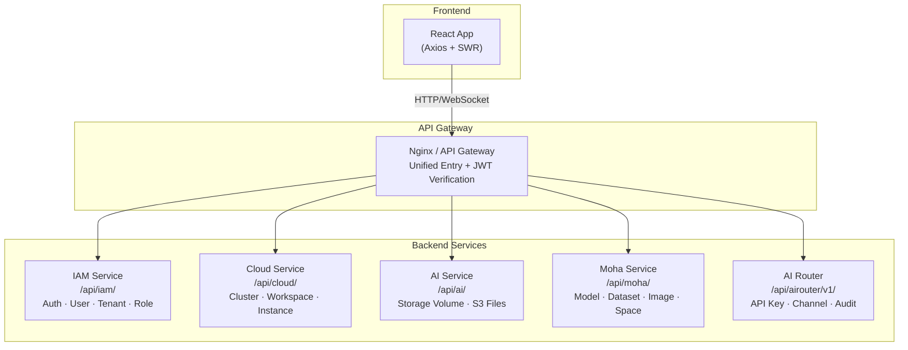
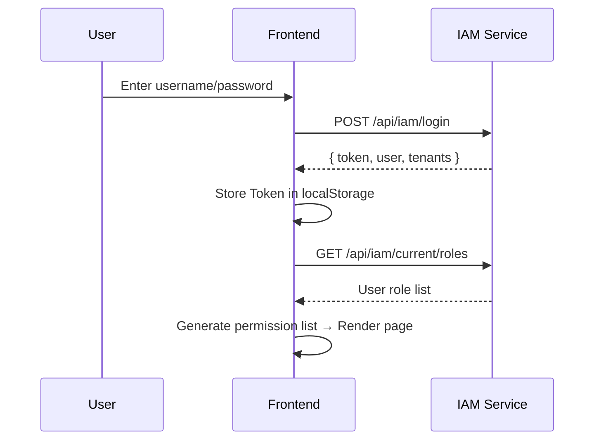

# API Service Layer Overview

The Rune Console frontend communicates with the backend through **5 core backend service domains + 1 file proxy**. All requests are based on the **Axios + SWR** architecture — each service function returns a `Request<T>` configuration object, driven by `useCacheFetch` (SWR cached reads) or `useFetch` (manually triggered write operations).

---

## Architecture Overview



### Request Architecture Flow

```mermaid
sequenceDiagram
    participant C as Frontend Component
    participant S as Service Function
    participant H as useCacheFetch / useFetch
    participant A as Axios Instance
    participant B as Backend API

    C->>S: Call service function
    S-->>C: Return Request&lt;T&gt; config
    C->>H: Pass in Request&lt;T&gt;
    H->>A: Send HTTP request
    A->>A: Inject Authorization / X-Tenant and other Headers
    A->>B: HTTP request
    B-->>A: JSON response
    A-->>H: Response data
    H-->>C: data / error / loading
```

---

## Authentication and Common Request Headers

All API requests must carry the following headers:

| Header | Description | Example Value | Required |
|--------|-------------|---------------|:---:|
| `Authorization` | JWT authentication token | `Bearer eyJhbGci...` | ✅ |
| `Content-Type` | Request body format | `application/json` | ✅ |
| `X-Tenant` | Current tenant ID being operated on | `tenant-abc123` | As needed |
| `X-Workspace` | Current workspace ID being operated on | `ws-dev-001` | As needed |

> 💡 Tip: JWT Token is obtained through the login endpoint `POST /api/iam/login` and stored in the browser's `localStorage`. When the token expires, the frontend automatically redirects to the login page.

### Authentication Flow



---

## Error Response Format

All backend services use a unified error response format:

```typescript
interface APIError {
  error?: string;       // Error type identifier
  message: string;      // Human-readable error description
  status?: 'Failure' | 'Success';  // Status identifier
  code?: string;        // Error code
  reason?: string;      // Error reason
}
```

### Common HTTP Status Codes

| Status Code | Meaning | Frontend Handling |
|-------------|---------|-------------------|
| `200` | Request successful | Process response data normally |
| `201` | Created successfully | Show success message, refresh list |
| `204` | Deleted successfully (no response body) | Show deletion success, refresh list |
| `400` | Bad request parameters | Display error message, prompt correction |
| `401` | Unauthenticated / Token expired | Redirect to login page |
| `403` | No permission | Show 403 page |
| `404` | Resource not found | Show 404 page |
| `409` | Resource conflict (duplicate name, etc.) | Prompt that resource already exists |
| `422` | Validation failed | Display field-level errors |
| `429` | Rate limit exceeded | Prompt to retry later |
| `500` | Internal server error | Show generic error message |

### Error Response Example

```json
{
  "status": "Failure",
  "message": "Instance name 'my-instance' already exists",
  "reason": "AlreadyExists",
  "code": "409"
}
```

---

## Common Data Structures

### ObjectMeta — Object Metadata

The base structure for all REST resource objects:

```typescript
interface ObjectMeta {
  id: string;                          // Unique identifier
  name?: string;                       // Resource name (unique key)
  uid?: string;                        // Globally unique ID
  apiVersion?: string;                 // API version
  scopes?: Array<Scope>;               // Scope information
  resource?: string;                   // Resource type
  resourceVersion?: number;            // Optimistic lock version number
  creationTimestamp?: Date;            // Creation time (ISO 8601)
  deletionTimestamp?: Date;            // Deletion time (soft delete marker)
  labels?: Record<string, string>;     // Labels
  annotations?: Record<string, string>;// Annotations
  finalizers?: Array<string>;          // Finalizers
  ownerReferences?: Array<OwnerReference>; // Owner references
  description?: string;               // Description
  alias?: string;                      // Alias / Display name
}
```

> 💡 Tip: K8s native resources use the `ObjectMetadata` type (containing `namespace`, `kind`, and other fields), while platform custom resources use the `ObjectMeta` type (containing `id`, `scopes`, and other fields). The two structures differ slightly but serve the same purpose.

### K8s ObjectMetadata

Resources returned by the K8s proxy layer use the standard Kubernetes metadata structure:

```typescript
interface ObjectMetadata {
  apiVersion?: string;
  kind?: string;
  name: string;
  namespace?: string;
  uid?: string;
  resourceVersion?: string;
  creationTimestamp?: Date;
  deletionTimestamp?: Date;
  labels?: Record<string, string>;
  annotations?: Record<string, string>;
  finalizers?: Array<string>;
  ownerReferences?: Array<OwnerReference>;
  description?: string;
  alias?: string;
  generateName?: string;
  clusterName?: string;
  selfLink?: string;
}
```

### Status Pattern — Resource Status

Resource status uses the `phase + conditions[]` pattern:

```typescript
interface ObjectStatus {
  phase?: string;           // Current phase: Pending, Running, Succeeded, Failed, Unknown
  message?: string;         // Human-readable status message
  conditions?: Condition[]; // Detailed condition list
}

interface Condition {
  type: string;             // Condition type, e.g., "Ready", "Available"
  status: string;           // "True", "False", "Unknown"
  lastTransitionTime?: Date;// Last transition time
  lastHeartbeatTime?: Date; // Last heartbeat time
  reason?: string;          // Machine-readable reason, e.g., "ImagePullBackOff"
  message?: string;         // Human-readable message
}
```

#### Common Phase Values

| Resource Type | Possible Phases | Description |
|---------------|-----------------|-------------|
| Instance | `Pending` → `Running` → `Succeeded` / `Failed` | Instance lifecycle |
| StorageVolume | `Pending` → `Bound` → `Released` | Storage volume binding status |
| Workspace | `Active` / `Terminating` | Workspace status |

### Pagination Request and Response

```typescript
// Request parameters
interface PageRequest {
  page?: number;           // Page number, starting from 1 (default 1)
  size?: number;           // Items per page (default 20)
  continue?: string;       // Cursor pagination token (K8s style)
  sort?: string;           // Sort field, e.g., "creationTimestamp", prefix "-" for descending
  search?: string;         // Full-text search
  fieldSelector?: string;  // Field filtering, e.g., "status.phase=Running"
  labelSelector?: string;  // Label filtering, e.g., "app=nginx,env=prod"
}

// Response structure
interface Page<T> {
  page?: number;     // Current page number
  size?: number;     // Items per page
  total?: number;    // Total record count
  continue?: string; // Next page cursor token
  items?: Array<T>;  // Data list
}
```

> ⚠️ Note: K8s proxy layer APIs (such as Pod, Service, and other native resources) use `continue` cursor pagination; platform custom APIs (such as tenants, users, etc.) use `page/size` numeric pagination. The two approaches cannot be mixed.

---

## IAM Domain `/api/iam/`

Identity authentication, user management, tenant management, role management, global configuration.

### Authentication

| Method | Endpoint | Description | Request Body / Parameters |
|--------|----------|-------------|--------------------------|
| `POST` | `/login` | User login | `{ username, password, captcha? }` |
| `POST` | `/logout` | User logout | — |
| `POST` | `/register` | User registration | `{ username, password, email?, phone? }` |
| `GET` | `/login-config` | Get login page configuration | — |
| `GET` | `/captcha` | Get CAPTCHA image | Returns CAPTCHA ID + image |
| `POST` | `/verify-captcha` | Verify CAPTCHA | `{ id, code }` |
| `POST` | `/reset-password` | Reset password | `{ token, newPassword }` |

### Current User (Account)

| Method | Endpoint | Description |
|--------|----------|-------------|
| `GET` | `/current/profile` | Get current user info |
| `PATCH` | `/current/profile` | Update current user info |
| `PUT` | `/current/password` | Change password |
| `GET` | `/current/roles` | Get current user's roles |
| `POST` | `/current/apikeys` | Create API Key |
| `GET` | `/current/apikeys` | List API Keys |
| `DELETE` | `/current/apikeys/{id}` | Delete API Key |
| `POST` | `/current/sshkeys` | Add SSH Key |
| `GET` | `/current/sshkeys` | List SSH Keys |
| `DELETE` | `/current/sshkeys/{fingerprint}` | Delete SSH Key |
| `POST` | `/init-mfa` | Initialize MFA (returns TOTP secret and QR code) |
| `POST` | `/enable-mfa` | Enable MFA |
| `POST` | `/disable-mfa` | Disable MFA |
| `GET` | `/current/preferences` | Get user preferences |
| `PUT` | `/current/preferences` | Update user preferences |

### User Management (Admin)

| Method | Endpoint | Description |
|--------|----------|-------------|
| `GET` | `/users` | List all users |
| `POST` | `/users` | Create user |
| `GET` | `/users/{name}` | Get user details |
| `PUT` | `/users/{name}` | Update user info |
| `DELETE` | `/users/{name}` | Delete user |
| `POST` | `/users/{name}/password` | Admin reset user password |
| `POST` | `/users/{name}/disable-mfa` | Admin unbind user MFA |

### Tenant Management

| Method | Endpoint | Description |
|--------|----------|-------------|
| `GET` | `/tenants` | List all tenants |
| `POST` | `/tenants` | Create tenant |
| `GET` | `/tenants/{id}` | Get tenant details |
| `PUT` | `/tenants/{id}` | Update tenant info |
| `DELETE` | `/tenants/{id}` | Delete tenant |
| `POST` | `/tenant-register` | User self-service tenant registration |

### Tenant Members and Roles

| Method | Endpoint | Description |
|--------|----------|-------------|
| `GET` | `/tenants/{tenant}/members` | List tenant members |
| `POST` | `/tenants/{tenant}/members` | Add tenant member |
| `GET` | `/tenants/{tenant}/members/{member}` | Get member info |
| `PUT` | `/tenants/{tenant}/members/{member}` | Update member role |
| `DELETE` | `/tenants/{tenant}/members/{member}` | Remove member |
| `GET` | `/tenants/{tenant}/roles` | List available tenant roles |

### System Members and Roles

| Method | Endpoint | Description |
|--------|----------|-------------|
| `GET` | `/members` | List system members |
| `PUT` | `/members/{member}` | Update system member role |
| `DELETE` | `/members/{member}` | Remove system member |
| `GET` | `/roles` | List system roles |

### Global Configuration

| Method | Endpoint | Description |
|--------|----------|-------------|
| `GET` | `/global-config` | Get platform global configuration |
| `PUT` | `/global-config` | Update global configuration |
| `POST` | `/logo/avatar` | Upload platform Logo |

---

## Cloud Domain `/api/cloud/`

K8s cluster infrastructure management, containing a three-level path structure.

### URL Path Structure

```
/api/cloud/
├── clusters/                                          # Cluster level
│   └── {cluster}/
│       ├── resourcepools/                             # Resource pools
│       ├── schedulers/                                # Schedulers
│       ├── monitoring/                                # Cluster monitoring
│       ├── logging/                                   # Cluster logging
│       └── tenants/{tenant}/                          # Tenant level
│           ├── workspaces/                            # Workspaces
│           │   └── {workspace}/
│           │       ├── instances/                     # Instances
│           │       ├── members/                       # Workspace members
│           │       ├── logging/                       # Workspace logging
│           │       └── {group}/{version}/{resource}/  # K8s resource proxy
│           ├── quotas/                                # Tenant quotas
│           └── flavors/                               # Flavors
└── tenants/{tenant}/clusters/{cluster}/...            # Equivalent path
```

### Cluster Management

| Method | Endpoint | Description |
|--------|----------|-------------|
| `GET` | `/clusters` | List all clusters |
| `POST` | `/clusters` | Register cluster |
| `GET` | `/clusters/{id}` | Get cluster details |
| `PUT` | `/clusters/{id}` | Update cluster configuration |
| `DELETE` | `/clusters/{id}` | Remove cluster |

> 💡 Tip: Cluster create/update operations support the `?dry-run=true` parameter for validating configuration without actually executing it.

### Workspace Management

| Method | Endpoint | Description |
|--------|----------|-------------|
| `GET` | `.../workspaces` | List workspaces |
| `POST` | `.../workspaces` | Create workspace |
| `GET` | `.../workspaces/{id}` | Get workspace details |
| `PUT` | `.../workspaces/{id}` | Update workspace |
| `DELETE` | `.../workspaces/{id}` | Delete workspace |

### Instance Management

Instance is the most core resource in Rune, covering three types: inference services, development environments, and model fine-tuning.

| Method | Endpoint | Description |
|--------|----------|-------------|
| `GET` | `.../instances` | List instances |
| `POST` | `.../instances` | Create instance |
| `GET` | `.../instances/{id}` | Get instance details |
| `PUT` | `.../instances/{id}` | Update instance |
| `DELETE` | `.../instances/{id}` | Delete instance |
| `POST` | `.../instances/{id}/stop` | Stop instance |
| `POST` | `.../instances/{id}/resume` | Resume instance |
| `POST` | `.../instances/{id}/decrypt` | Decrypt instance sensitive info |
| `GET` | `.../instances/{id}/dashboard` | Get instance dashboard |
| `GET` | `.../instances/{id}/metrics` | Get instance metrics |
| `GET` | `.../instances/{id}/events` | Get instance events |
| `GET` | `.../instances/{id}/logs` | Get instance logs |

#### Instance Full URL Example

```
GET /api/cloud/tenants/acme/clusters/gpu-cluster-1/workspaces/ws-dev/instances/my-inference
```

### Flavor Management

Flavors define the hardware resource allocation available to instances:

| Method | Endpoint | Description |
|--------|----------|-------------|
| `GET` | `/clusters/{c}/flavors` | Cluster-level Flavor list |
| `GET` | `.../tenants/{t}/flavors` | Tenant-level Flavor list |
| `GET` | `.../workspaces/{w}/flavors` | Workspace-level Flavor list |
| `POST` | `/clusters/{c}/flavors` | Create Flavor |
| `PUT` | `/clusters/{c}/flavors/{id}` | Update Flavor |
| `DELETE` | `/clusters/{c}/flavors/{id}` | Delete Flavor |

### Quota Management

| Method | Endpoint | Description |
|--------|----------|-------------|
| `GET` | `/clusters/{c}/quotas` | Cluster quotas |
| `GET` | `.../tenants/{t}/quotas` | Tenant quotas |
| `GET` | `.../workspaces/{w}/quotas` | Workspace quotas |
| `PUT` | `.../quotas/{id}` | Update quota limits |

### Resource Pools

| Method | Endpoint | Description |
|--------|----------|-------------|
| `GET` | `/clusters/{c}/resourcepools` | List resource pools |
| `POST` | `/clusters/{c}/resourcepools` | Create resource pool |
| `PUT` | `/clusters/{c}/resourcepools/{id}` | Update resource pool |
| `DELETE` | `/clusters/{c}/resourcepools/{id}` | Delete resource pool |

### Application Templates / App Market

| Method | Endpoint | Description |
|--------|----------|-------------|
| `GET` | `/admin-products` | Admin template list |
| `GET` | `/products` | User-facing template list |
| `GET` | `/system-products` | System built-in templates |
| `POST` | `/admin-products` | Upload new template |
| `PUT` | `/admin-products/{id}` | Update template |
| `DELETE` | `/admin-products/{id}` | Delete template |
| `GET` | `/admin-products/{id}/versions` | Get Chart version list |
| `POST` | `/admin-products/{id}/versions` | Upload new version |

### LLM Gateway Service Registration

| Method | Endpoint | Description |
|--------|----------|-------------|
| `GET` | `.../service-registrations` | List registered inference services |
| `POST` | `.../service-registrations` | Register inference service to gateway |
| `PUT` | `.../service-registrations/{id}` | Update service registration |
| `DELETE` | `.../service-registrations/{id}` | Unregister service |
| `PUT` | `.../service-registrations/{id}/access-level` | Update access level (public/private) |

### K8s Resource Proxy

The Cloud domain provides a generic Kubernetes resource proxy interface:

```
GET/POST/PUT/PATCH/DELETE
  .../workspaces/{ws}/{group}/{version}[/namespaces/{ns}]/{resource}[/{name}]
```

**Common K8s Resource Access**:

| Resource | Path Example |
|----------|-------------|
| Pod | `.../core/v1/namespaces/{ns}/pods/{name}` |
| Service | `.../core/v1/namespaces/{ns}/services/{name}` |
| Deployment | `.../apps/v1/namespaces/{ns}/deployments/{name}` |
| PVC | `.../core/v1/namespaces/{ns}/persistentvolumeclaims/{name}` |
| Ingress | `.../networking.k8s.io/v1/namespaces/{ns}/ingresses/{name}` |

### Monitoring

| Method | Endpoint | Description |
|--------|----------|-------------|
| `GET` | `/clusters/{c}/monitoring/dashboards` | Get cluster dashboard list |
| `POST` | `/clusters/{c}/monitoring/query` | Execute monitoring query |
| `GET` | `/clusters/{c}/monitoring/dynamic-dashboards` | Dynamic dashboard configuration and data |

### Log Query (Loki)

| Method | Endpoint | Description | Protocol |
|--------|----------|-------------|----------|
| `GET` | `.../logging/query` | Query historical logs | HTTP |
| `GET` | `.../logging/labels` | Get log labels | HTTP |
| `GET` | `.../logging/series` | Query log series | HTTP |
| `GET` | `.../logging/stream` | **Real-time log stream** | **WebSocket** |

---

## AI Domain `/api/ai/`

Storage volume management and file operation proxy.

### Storage Volume Management

| Method | Endpoint | Description |
|--------|----------|-------------|
| `GET` | `.../storagevolumes` | List storage volumes |
| `POST` | `.../storagevolumes` | Create storage volume |
| `GET` | `.../storagevolumes/{id}` | Get storage volume details |
| `PUT` | `.../storagevolumes/{id}` | Update storage volume |
| `DELETE` | `.../storagevolumes/{id}` | Delete storage volume |
| `GET` | `.../storage-jobs` | List storage jobs (import/export) |
| `POST` | `.../storage-jobs` | Create storage job |

### S3 File Proxy

Directly operate files in storage volumes through the proxy layer, without directly accessing S3:

```
/api/ai/tenants/{tenant}/clusters/{cluster}/workspaces/{workspace}/storagevolumes/{sv}/files/
```

| Method | Endpoint | Description |
|--------|----------|-------------|
| `GET` | `.../files/?prefix={path}` | List files/directories |
| `POST` | `.../files/upload` | Upload file (multipart/form-data) |
| `GET` | `.../files/download?key={path}` | Download file |
| `DELETE` | `.../files/?key={path}` | Delete file |

> ⚠️ Note: Large file uploads use the multipart chunked upload protocol. The browser page must remain open, otherwise the upload will be interrupted. For files over 10GB, it is recommended to use object storage CLI tools (such as `s3cmd` or `mc`) for direct upload.

---

## Moha Domain `/api/moha/`

AI asset repository management: model repository, datasets, Space applications, container images.

### Repository Types

| Type Identifier | Description | Path Prefix |
|----------------|-------------|-------------|
| `models` | Model repository | `/api/moha/organizations/{org}/models/{repo}/` |
| `datasets` | Dataset repository | `/api/moha/organizations/{org}/datasets/{repo}/` |
| `spaces` | Space application | `/api/moha/organizations/{org}/spaces/{repo}/` |

### Repository Management

| Method | Endpoint | Description |
|--------|----------|-------------|
| `GET` | `/organizations/{org}/{type}` | List repositories |
| `POST` | `/organizations/{org}/{type}` | Create repository |
| `GET` | `/organizations/{org}/{type}/{repo}` | Get repository details |
| `PUT` | `/organizations/{org}/{type}/{repo}` | Update repository |
| `DELETE` | `/organizations/{org}/{type}/{repo}` | Delete repository |
| `PUT` | `/organizations/{org}/{type}/{repo}/visibility` | Update visibility |
| `POST` | `/organizations/{org}/{type}/{repo}/like` | Favorite/unfavorite |

### Git File Operations

```
/api/moha/organizations/{org}/{type}/{repo}/
├── raw/{ref}/{file}           # Get raw file content
├── readme                     # Get README
├── refs                       # List branches/tags
├── contents/{ref}/{file}      # Get file/directory content (with metadata)
├── commits/{ref}/{file}       # Get commit history
├── commit/{ref}               # Get Commit Diff
├── upload/{ref}               # Upload file
└── delete/{ref}/{file}        # Delete file
```

> 💡 Tip: Large model weight files (.bin, .safetensors, etc.) are stored via Git LFS. After uploading, you need to wait for LFS indexing to complete (usually a few minutes) before the full file is visible after refreshing.

### Container Images

| Method | Endpoint | Description |
|--------|----------|-------------|
| `GET` | `/organizations/{org}/images` | List container images |
| `POST` | `/organizations/{org}/images` | Create image record |
| `GET` | `/organizations/{org}/images/{image}` | Get image details |
| `PUT` | `/organizations/{org}/images/{image}` | Update image info |
| `DELETE` | `/organizations/{org}/images/{image}` | Delete image |
| `PUT` | `/organizations/{org}/images/{image}/visibility` | Update visibility |
| `POST` | `/organizations/{org}/images/{image}/scan` | Trigger image security scan |

### Image Sync

| Method | Endpoint | Description |
|--------|----------|-------------|
| `GET` | `/mirrors` | List image sync tasks |
| `POST` | `/mirrors` | Create sync task (pull from external source) |
| `DELETE` | `/mirrors/{id}` | Cancel sync task |

### Discussions and Merge Requests

| Method | Endpoint | Description |
|--------|----------|-------------|
| `GET` | `.../discussions` | List discussions |
| `POST` | `.../discussions` | Create discussion / merge request |
| `GET` | `.../discussions/{id}` | Get discussion details |
| `POST` | `.../discussions/{id}/comments` | Add comment |

### Organization Management

| Method | Endpoint | Description |
|--------|----------|-------------|
| `GET` | `/organizations` | List organizations |
| `POST` | `/organizations` | Create organization |
| `GET` | `/organizations/{org}` | Get organization details |
| `GET` | `/organizations/{org}/members` | List organization members |
| `POST` | `/organizations/{org}/members` | Add member |
| `DELETE` | `/organizations/{org}/members/{member}` | Remove member |

---

## AI Router Domain `/api/airouter/v1/`

LLM gateway management: API Key, channel routing, audit, content moderation, usage statistics, OpenAI-compatible interface.

### API Key / Token Management

| Method | Endpoint | Description |
|--------|----------|-------------|
| `GET` | `/tokens` | Admin list all Tokens |
| `POST` | `/tokens` | Admin create Token |
| `GET` | `/tokens/{key}` | Get Token details |
| `PUT` | `/tokens/{key}` | Update Token |
| `DELETE` | `/tokens/{key}` | Delete Token |
| `GET` | `/me/tokens` | Current user's Token list |
| `POST` | `/me/tokens` | Current user create Token |
| `GET` | `/usage/records` | Usage record query |

### Channels (LLM Routing)

Channels define how API requests are routed to specific LLM backends:

| Method | Endpoint | Description |
|--------|----------|-------------|
| `GET` | `/channels` | List channels |
| `POST` | `/channels` | Create channel |
| `GET` | `/channels/{id}` | Get channel details |
| `PUT` | `/channels/{id}` | Update channel |
| `DELETE` | `/channels/{id}` | Delete channel |
| `PUT` | `/channels/{id}/visibility` | Update visibility |

### Audit Logs

| Method | Endpoint | Description |
|--------|----------|-------------|
| `GET` | `/audit/records` | Query audit records |
| `GET` | `/audit/records/{id}` | Get single audit detail |
| `DELETE` | `/audit/cleanup` | Clean up expired audit records |

### Content Moderation

| Method | Endpoint | Description |
|--------|----------|-------------|
| `GET` | `/moderation/policies` | List moderation policies |
| `POST` | `/moderation/policies` | Create moderation policy |
| `PUT` | `/moderation/policies/{id}` | Update moderation policy |
| `DELETE` | `/moderation/policies/{id}` | Delete moderation policy |
| `PUT` | `/moderation/policies/priority` | Adjust policy priority |
| `GET` | `/moderation/dictionaries` | List sensitive word dictionaries |
| `POST` | `/moderation/dictionaries` | Create dictionary |
| `POST` | `/moderation/dictionaries/{id}/words` | Add words |
| `DELETE` | `/moderation/dictionaries/{id}/words` | Delete words |
| `POST` | `/moderation/dictionaries/{id}/import` | Batch import words |
| `GET` | `/moderation/dictionaries/{id}/export` | Export words |

### OpenAI-Compatible Interface

AI Router provides a chat completion interface compatible with the OpenAI API:

```
POST /api/airouter/v1/chat/completions
```

**Request Body** (compatible with OpenAI API):

```json
{
  "model": "deepseek-v3",
  "messages": [
    { "role": "system", "content": "You are a helpful assistant" },
    { "role": "user", "content": "Hello" }
  ],
  "stream": true,
  "temperature": 0.7,
  "max_tokens": 2048
}
```

**Authentication**: Use AI Router Token (`sk-` prefix)

```bash
curl -X POST https://platform.example.com/api/airouter/v1/chat/completions \
  -H "Authorization: Bearer sk-xxxxxxxxxxxxxxxx" \
  -H "Content-Type: application/json" \
  -d '{
    "model": "deepseek-v3",
    "messages": [{"role": "user", "content": "Hello"}],
    "stream": false
  }'
```

> 💡 Tip: This interface is fully compatible with the OpenAI SDK. You can directly use the `openai` Python package by pointing `base_url` to the platform address.

---

## WebSocket Endpoints

The following interfaces use the WebSocket protocol for real-time data streaming:

| Endpoint | Description | Parameters |
|----------|-------------|------------|
| `.../logging/stream` | Real-time log stream (Loki) | `start`, `end`, `query` |
| `.../instances/{id}/exec` | Instance terminal (interactive Shell) | `container`, `command` |
| `.../pods/{name}/exec` | Pod terminal | `container`, `command` |

### Log Stream WebSocket Example

```javascript
const ws = new WebSocket(
  'wss://platform.example.com/api/cloud/.../logging/stream' +
  '?start=1708857600000000000&query={namespace="workspace-dev"}'
);

ws.onmessage = (event) => {
  const logEntry = JSON.parse(event.data);
  console.log(logEntry.values);  // [[timestamp, logLine], ...]
};
```

### Pod Terminal WebSocket

```javascript
const ws = new WebSocket(
  'wss://platform.example.com/api/cloud/.../pods/my-pod/exec' +
  '?container=main&command=/bin/bash'
);
```

---

## Response Type Mapping (AI Router Special Handling)

The AI Router domain's backend return structure differs from frontend types, requiring `transformResponse` to perform DTO → frontend type mapping:

```typescript
// Backend Token DTO → Frontend ApiKey type
export const listApiKeys = (): Request<Page<ApiKey>> => ({
  url: '/api/airouter/v1/tokens',
  method: 'GET',
  transformResponse: (data) => parseResponse(data, mapTokenToApiKey),
});
```

---

## Practical Usage Examples

### Example 1: List Instances with Pagination

```bash
curl -X GET 'https://platform.example.com/api/cloud/tenants/acme/clusters/gpu-1/workspaces/dev/instances?page=1&size=20&sort=-creationTimestamp&search=inference' \
  -H 'Authorization: Bearer eyJhbGci...'
```

Response:

```json
{
  "page": 1,
  "size": 20,
  "total": 42,
  "items": [
    {
      "id": "inst-abc123",
      "name": "my-inference",
      "description": "DeepSeek inference service",
      "creationTimestamp": "2025-12-01T10:30:00Z",
      "status": {
        "phase": "Running",
        "conditions": [
          { "type": "Ready", "status": "True", "reason": "AllReplicasReady" }
        ]
      }
    }
  ]
}
```

### Example 2: Create Workspace

```bash
curl -X POST 'https://platform.example.com/api/cloud/tenants/acme/clusters/gpu-1/workspaces' \
  -H 'Authorization: Bearer eyJhbGci...' \
  -H 'Content-Type: application/json' \
  -d '{
    "name": "ws-production",
    "description": "Production environment workspace",
    "labels": { "env": "production" }
  }'
```

### Example 3: Query Real-time Logs

```bash
curl -X GET 'https://platform.example.com/api/cloud/.../logging/query?query={namespace="ws-dev",pod="my-pod"}&start=1708857600000000000&end=1708944000000000000&limit=100' \
  -H 'Authorization: Bearer eyJhbGci...'
```

### Example 4: Call Gateway Using OpenAI SDK

```python
from openai import OpenAI

client = OpenAI(
    api_key="sk-xxxxxxxxxxxxxxxx",
    base_url="https://platform.example.com/api/airouter/v1"
)

response = client.chat.completions.create(
    model="deepseek-v3",
    messages=[
        {"role": "system", "content": "You are a helpful assistant."},
        {"role": "user", "content": "What is Kubernetes?"}
    ],
    stream=True
)

for chunk in response:
    if chunk.choices[0].delta.content:
        print(chunk.choices[0].delta.content, end="")
```

---

## Rate Limiting

| Endpoint Type | Limit | Description |
|---------------|-------|-------------|
| General API | No hard limit | Controlled by backend gateway |
| Login endpoint | 5 requests/minute | Prevent brute-force attacks |
| AI Router Chat | Per Token quota | Admins set per-Token requests per minute (RPM) and tokens per minute (TPM) |
| File upload | Max 10GB per file | Use CLI tools for larger files |

> ⚠️ Note: Rate limit values are configured by platform admins and may vary across different deployment environments. When rate limits are triggered, the backend returns `429 Too Many Requests`.
