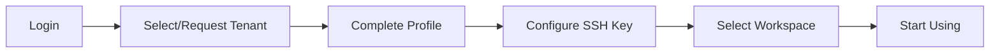
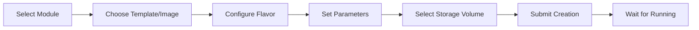

# Frequently Asked Questions (FAQ)

This document collects common questions and answers about using the Rune platform, organized by functional modules.

> 💡 Tip: Use `Ctrl+F` (Mac: `Cmd+F`) in your browser to quickly search for keywords to locate questions.

---

## Getting Started

### Q: How do I create a platform account?

**A:** There are two ways:
1. **Self-registration**: If the admin has enabled self-registration, click the "Register" link on the login page and fill in username, password, email, and other information to complete registration
2. **Admin creation**: Contact the platform admin to manually create an account in **BOSS → IAM → User Management**

> 💡 Tip: Self-registration is disabled by default. The admin needs to enable "Allow user self-registration" in **BOSS → Settings → Platform Settings**.

### Q: What should I do after first login?

**A:** Typical flow for first login:



1. **Select tenant**: If you have been assigned a tenant, enter directly from the tenant selection page; otherwise contact the admin for assignment
2. **Complete profile**: Fill in phone number, email, and other information in **Console → IAM → Profile**
3. **Configure SSH Key**: Add your public key in **Console → IAM → SSH Key** for connecting to development environments later
4. **Configure API Key**: If you need API access to the platform, create a token in **Console → IAM → API Key**

### Q: What is a tenant? How do I select a tenant?

**A:** A Tenant is the resource isolation unit of the platform, similar to the concept of an "organization" or "team." A user can belong to multiple tenants, but can only operate under one tenant at a time.

You need to switch tenants in the following scenarios:
- Select on the tenant selection page during login
- After login, click the avatar in the top-right corner → Switch Tenant

> ⚠️ Note: Resources between different tenants are completely isolated, including workspaces, instances, quotas, members, etc. Switching tenants will refresh permissions and resource lists.

### Q: How do I create my first workspace?

**A:** Requires the **Tenant Admin** role:
1. Go to **Console → Rune → Workspaces**
2. Click "Create Workspace"
3. Fill in name, description, and select the target cluster
4. Configure resource quotas (CPU, memory, GPU limits)
5. Click "Create"

> 💡 Tip: A workspace is essentially a wrapper around a Kubernetes Namespace. Each workspace has independent resource quotas and member permissions.

### Q: What browsers does the platform support?

**A:**

| Browser | Minimum Version | Recommended |
|---------|----------------|:---:|
| Chrome | 90+ | ✅ |
| Firefox | 90+ | ✅ |
| Edge | 90+ | ✅ |
| Safari | 15+ | ✅ |
| IE | — | ❌ Not supported |

> ⚠️ Note: The platform is designed for desktop use. Mobile devices (screen width < 768px) have limited functionality and only support basic viewing operations.

### Q: How do I switch the interface language?

**A:** Click the language icon (🌐 globe icon) on the right side of the top bar, and select **Chinese** or **English**. The language preference is saved to your account settings and will take effect automatically on next login.

---

## Authentication and Security

### Q: After login, I'm redirected to a blank page or 404?

**A:** Common reasons:

| Reason | Solution |
|--------|----------|
| Account has no tenant assigned | Contact admin to assign a tenant in the BOSS portal |
| The assigned tenant has been disabled | Contact admin to verify tenant status |
| First login requires completing profile info | Follow the on-screen prompts to complete the information |
| Browser cache residue | Clear browser cache and retry |

### Q: I get "CAPTCHA error" during login?

**A:** CAPTCHA codes are valid for approximately **5 minutes**. Click the CAPTCHA image to refresh and re-enter. If failures persist:
1. Clear browser cookies
2. Verify case sensitivity of the input
3. Verify system clock accuracy (CAPTCHA verification may depend on timestamps)

### Q: How do I reset my password?

**A:** There are two ways:
- **Self-service reset**: Click "Forgot Password" on the login page, receive a verification code via your registered phone number or email, then reset
- **Admin reset**: Contact the admin to select the user in **BOSS → IAM → User Management** → Reset Password

> ⚠️ Note: If both phone number and email are no longer valid, only the admin can perform the password reset.

### Q: How do I set up MFA (Multi-Factor Authentication)?

**A:** In **Console → IAM → Security Settings**:
1. Click "Enable MFA"
2. Scan the QR code using Google Authenticator, Microsoft Authenticator, or another TOTP app
3. Enter the 6-digit verification code to complete binding
4. **Be sure to save the recovery codes** — you'll need them if you lose your device

### Q: I lost my MFA device and can't log in?

**A:** Self-recovery is not possible after losing an MFA device. Contact the platform admin to unbind MFA in **BOSS → IAM → User Management**. After that, the user can log in again and re-bind MFA.

### Q: What's the difference between an API Key and a JWT Token?

**A:**

| Feature | JWT Token | API Key |
|---------|-----------|---------|
| How to obtain | Returned by login endpoint | Manually created in Console |
| Use case | Automatically carried by browser | Scripts / programmatic API calls |
| Expiration | Short-lived (hours) | Customizable (days/months/years) |
| Refresh method | Automatically refreshed | Create a new one after expiration |
| Header format | `Authorization: Bearer eyJhbG...` | `Authorization: Bearer sk-xxxx...` |

### Q: How long does a login session last?

**A:** JWT Token expiration is configured by the platform admin, typically **2-24 hours**. After token expiration, the frontend will automatically redirect to the login page. Frequent users can enable "Keep me logged in" in preferences to extend the validity period.

### Q: Does the platform support SSO (Single Sign-On)?

**A:** It depends on the deployment configuration. Admins can configure LDAP, OAuth2, and other external authentication sources in **BOSS → Settings → Platform Settings**. Once configured, users can log in directly with their enterprise accounts.

---

## Resource Management

### Q: How do I create an instance (inference/development/fine-tuning)?

**A:** Select the corresponding module in **Console → Rune**:
1. **Inference Service**: Select "Inference Services" → New → Choose template/image → Configure Flavor → Deploy
2. **Development Environment**: Select "Development Environment" → New → Choose JupyterLab template → Configure resources → Create
3. **Model Fine-tuning**: Select "Model Fine-tuning" → New → Configure training parameters, dataset, base model → Start



### Q: What if GPU resources are insufficient?

**A:** Troubleshooting and solutions:
1. **Check quotas**: View current quota usage in **Console → Rune → Workspace Quotas**
2. **Check resource pools**: Confirm there are available GPUs in the target cluster/resource pool
3. **Optimize usage**: Stop unnecessary instances to free up resources
4. **Request expansion**: Contact the admin to increase tenant or workspace quotas in the BOSS portal

> 💡 Tip: When development environments are idle, it's recommended to use the "Stop" function to pause instances and free GPU resources. Stopped instances don't consume GPU quotas, and data is preserved when resumed.

### Q: What types of storage volumes are available? How do I choose?

**A:**

| Storage Type | Use Case | Characteristics |
|-------------|----------|-----------------|
| **SSD High-speed Storage** | Model training, frequent read/write | High IOPS, smaller capacity |
| **HDD Large-capacity Storage** | Dataset storage, archiving | Large capacity, low cost |
| **Shared Storage (NFS)** | Multi-instance data sharing | Supports ReadWriteMany (RWX) |

When creating a storage volume, you need to specify: capacity, storage class (StorageClass), and access mode. After creation, it can be mounted during instance creation.

### Q: How do I resolve "insufficient quota"?

**A:** "Insufficient quota" means that the current workspace or tenant's resource usage has reached the limit. Check:
1. **Workspace quota**: Console → Rune → Workspace Quotas → View CPU/Memory/GPU usage
2. **Tenant quota**: BOSS → Rune → Tenant Management → View tenant-level quota
3. Clean up unnecessary instances and storage volumes to free used quota
4. Contact the admin to increase quota

### Q: How should I choose a Flavor?

**A:** Flavors define the hardware resource allocation for instances:

| Flavor Example | CPU | Memory | GPU | Use Case |
|----------------|-----|--------|-----|----------|
| `small-cpu` | 2 cores | 4 GiB | None | Small data processing, lightweight development |
| `medium-cpu` | 4 cores | 16 GiB | None | Model inference (CPU mode) |
| `gpu-1-a100` | 8 cores | 32 GiB | 1×A100 | Model inference, small-scale fine-tuning |
| `gpu-4-a100` | 32 cores | 128 GiB | 4×A100 | Large model fine-tuning, distributed training |
| `gpu-8-a100` | 64 cores | 256 GiB | 8×A100 | Large-scale training |

> 💡 Tip: If unsure which to choose, start with a smaller spec for a trial run and adjust based on actual resource usage. GPU resources are scarce — please release them promptly after use.

---

## Model Operations

### Q: How do I register an inference service to the AI Gateway?

**A:**
1. Confirm the instance is Running in **Console → Rune → Inference Services**
2. Enter instance details → "Gateway Registration" tab
3. Click "Register to Gateway," fill in model name and path
4. Select access level (public/private)
5. After successful registration, you can test calls in **Console → ChatApp**

### Q: How do I select a dataset for model fine-tuning?

**A:** Fine-tuning tasks require mounting dataset storage:
1. First upload or create a dataset in **Console → Moha → Datasets**
2. When creating a fine-tuning task, select the dataset storage volume and specify the mount path
3. In the training configuration, set the data path to the corresponding mount path

> ⚠️ Note: The dataset format must match the training framework's requirements. Common formats include JSON Lines (.jsonl), CSV, Parquet, etc.

### Q: What is model decryption?

**A:** Some encrypted model files need to be decrypted before deployment. Click the "Decrypt" button on the instance detail page and enter the decryption key. The decryption operation only applies to the current instance and does not affect the original model files.

### Q: How do I use experiment tracking?

**A:** Experiment tracking is used to record and compare hyperparameters, metrics, and artifacts from model training:
1. Use the SDK provided by the platform in your training code to log metrics (loss, accuracy, etc.)
2. View all experiment records in **Console → Rune → Experiment Tracking**
3. Supports multi-experiment comparison, chart visualization, and artifact download

### Q: How do I use the evaluation feature?

**A:** In **Console → Rune → Model Evaluation**:
1. Select the model instance to evaluate
2. Configure the evaluation dataset and evaluation metrics
3. Start the evaluation task
4. View score details and reports on the results page

---

## Moha Model Hub

### Q: How do I operate model repositories via Git?

**A:** Moha repositories support standard Git operations:
```bash
# Clone repository
git clone https://platform.example.com/api/moha/organizations/{org}/models/{repo}.git

# Configure LFS (large file support)
git lfs install
git lfs track "*.bin" "*.safetensors" "*.gguf"

# Commit and push
git add .
git commit -m "upload model weights"
git push origin main
```

> 💡 Tip: Authentication uses platform username + API Key (or password). It's recommended to use Git Credential Helper to cache credentials.

### Q: LFS large file upload failed?

**A:** Common reasons for LFS upload failures:
1. **File too large**: Single file exceeds server limit (typically 50GB), contact admin to adjust
2. **Network interruption**: LFS uploads don't support resume after interruption, you need to re-push. Use a wired network if possible
3. **Git LFS not installed**: Run `git lfs install` and verify `.gitattributes` is configured correctly
4. **Authentication failure**: Verify the API Key has not expired

### Q: How do I push container images to the platform?

**A:**
```bash
# Log in to the image registry
docker login registry.platform.example.com -u <username> -p <api-key>

# Tag the image
docker tag my-image:latest registry.platform.example.com/{org}/my-image:v1.0

# Push
docker push registry.platform.example.com/{org}/my-image:v1.0
```

After pushing, you can manage visibility and description information in **Console → Moha → Container Images**.

### Q: How do I deploy a Spaces application?

**A:** Spaces is used to deploy interactive AI applications such as Gradio/Streamlit:
1. Create a space in **Console → Moha → Spaces**
2. Upload application code (via Git or web page)
3. Configure metadata in `README.md` (runtime, dependencies, etc.)
4. The platform automatically builds and deploys; once complete, you can access it via URL

### Q: How do I manage Organizations?

**A:** Organizations are the top-level unit in Moha for managing repositories and members:
- Create organization: **Console → Moha → Organizations** → New
- Add members: Enter organization details → Member Management → Add
- Permission control: Organization admins can manage all repositories; regular members can access based on repository visibility

### Q: How do I set repository visibility?

**A:**

| Visibility | Description |
|------------|-------------|
| **Public** | All logged-in users can view and clone |
| **Private** | Only organization members can access |

Modify in repository details → Settings → Visibility.

> ⚠️ Note: After changing a public repository to private, already cloned local copies will still work, but pull/push will no longer be possible (unless the user is added as an organization member).

---

## ChatApp AI Chat

### Q: How do I use a model in ChatApp?

**A:**
1. Confirm the inference service is deployed and registered to the AI Gateway
2. Go to **Console → ChatApp → Experience** page
3. Select an available model in the model selector
4. Start chatting

### Q: Streaming response is not working?

**A:** Troubleshooting steps:
1. Confirm that `stream` support is enabled in the channel configuration
2. Confirm the browser has no plugins installed that block SSE (Server-Sent Events)
3. Check if network proxies/WAF are blocking long-lived connections
4. Check if the backend inference service supports streaming output

### Q: How do I configure Token rate limiting?

**A:** Token rate limiting is configured in **BOSS → Gateway → API Key** or **Console → ChatApp → Token**:
- **RPM** (Requests Per Minute): Maximum requests per minute
- **TPM** (Tokens Per Minute): Maximum token consumption per minute
- **Total quota**: Total tokens the Token can consume; becomes invalid once used up

> 💡 Tip: Not setting RPM/TPM means no rate limiting. For production environments, it's recommended to set reasonable rate limits to prevent a single user from consuming too many resources.

### Q: What model parameters can be adjusted?

**A:** ChatApp debug mode supports adjusting the following parameters:

| Parameter | Range | Description |
|-----------|-------|-------------|
| `temperature` | 0.0 - 2.0 | Sampling temperature; higher values produce more random results |
| `top_p` | 0.0 - 1.0 | Nucleus sampling threshold |
| `max_tokens` | 1 - model limit | Maximum number of generated tokens |
| `frequency_penalty` | -2.0 - 2.0 | Frequency penalty |
| `presence_penalty` | -2.0 - 2.0 | Presence penalty |

---

## BOSS Admin Portal

### Q: How do I register a new cluster?

**A:** In **BOSS → Rune → Cluster Management**:
1. Click "Register Cluster"
2. Fill in cluster name and API Server address
3. Upload or paste the kubeconfig file
4. Configure scheduler parameters (optional)
5. Click "Register" — the system will automatically verify connectivity

> ⚠️ Note: Before registration, ensure the platform server can access the cluster's API Server. The `?dry-run=true` parameter is supported to validate configuration first.

### Q: How do I upload an application template?

**A:** In **BOSS → Rune → System Template Market**:
1. Click "Upload Template"
2. Select a Helm Chart package (`.tgz` format)
3. Fill in template name, description, icon, and other metadata
4. Set visibility (system-level / tenant-level)
5. After upload, you can manage Chart versions

### Q: How do I configure Channels?

**A:** Channels define how API requests are routed to LLM backends:
1. Go to **BOSS → Gateway → Channel Management**
2. Click "Create Channel"
3. Configure the backend address (inference service URL)
4. Set the supported model list
5. Configure credentials (if the backend requires authentication)
6. Set weight and priority (multi-channel load balancing)

### Q: How do I set up content moderation?

**A:** In **BOSS → Gateway → Content Moderation**:
1. **Create dictionary**: Add sensitive words or batch import
2. **Create policy**: Select moderation type (input moderation / output moderation), associate dictionaries
3. **Set priority**: Multiple policies are executed in priority order
4. When sensitive words are matched, the system blocks the request and returns an error

### Q: How do I clean up audit logs?

**A:** In **BOSS → Gateway → Audit Logs**:
- Manual cleanup: Click the "Clean Up" button and set the cleanup time range
- Automatic cleanup: Configure retention days, and the system automatically cleans up expired records

### Q: How do I change the platform Logo and name?

**A:**
1. Go to **BOSS → Settings → Platform Settings**
2. Upload a new Logo image
3. Modify the platform name and description
4. Save and refresh the page for changes to take effect

### Q: How do I configure a dynamic dashboard?

**A:**
1. Go to **BOSS → Settings → Dynamic Dashboard**
2. Configure the Grafana/Prometheus data source address
3. Select or customize dashboard panels
4. Users will see the corresponding monitoring charts on the Console homepage

---

## Troubleshooting

### Q: Instance stays in "Pending" status for a long time after creation?

**A:** Common causes and solutions:

| Cause | How to Diagnose | Solution |
|-------|----------------|----------|
| Insufficient cluster resources | Check instance events for `Insufficient` keyword | Change Flavor or free up other instances |
| Image pull failure | Check events for `ImagePullBackOff` error | Verify image address and credential configuration |
| Storage volume not bound | Check events for PVC-related errors | Verify storage volume status and StorageClass availability |
| Scheduler restrictions | Check events for `Unschedulable` | Verify node labels and resource pool configuration |
| Quota exceeded | Check events for `exceeded quota` | Increase quota or free up resources |

**How to view events**: Instance details → "Events" tab → View Kubernetes event list

### Q: Inference service returns 502 after deployment?

**A:** 502 means the gateway cannot connect to the backend service. Troubleshooting steps:
1. Go to instance details → Check if Pod status is Running
2. View Pod logs to confirm the service has started successfully and is listening on the port
3. Verify the service port matches the instance configuration (Ingress/Service)
4. The service may still be loading the model right after startup — wait 1-5 minutes and retry
5. Contact the admin to check cluster Ingress Controller and gateway configuration

### Q: SSH connection to development environment fails?

**A:**
1. **Verify SSH Key is added**: Confirm your public key exists in Console → IAM → SSH Key
2. **Verify instance is Running**: The instance must be in Running status
3. **Verify connection info**: Get the correct SSH address and port from the "Access Endpoints" section in instance details
4. **Check network**: Confirm your local network can reach the platform's SSH port (usually a non-standard port)
5. **Debug connection**: Use `ssh -v user@host -p port` to view detailed logs

### Q: File upload fails or progress is stuck?

**A:** File upload troubleshooting:


| Symptom | Cause | Solution |
|---------|-------|----------|
| Progress stuck at 0% | Network failure or authentication error | Check network, refresh page and retry |
| Progress stuck at a percentage | Unstable network causing chunk upload interruption | Check network stability, re-upload |
| Upload complete but file not visible | Backend processing (especially for large files) | Wait a few minutes then refresh |
| Error 413 | File exceeds server size limit | Contact admin to adjust Nginx limits |
| Error 403 | No upload permission | Verify role permissions |

> 💡 Tip: When uploading large files, keep the browser tab open and don't navigate to other pages. For files over 10GB, it's recommended to use command-line tools for uploading.

### Q: Log viewer shows "No Data"?

**A:**
1. **Check time range**: Was there an instance running during the queried time range?
2. **Check log source**: Select the correct Pod / Container
3. **Check Loki service**: Contact the admin to confirm the Loki log service is running normally and properly configured
4. **Check label selector**: Verify namespace, pod, and other filter conditions are correct

### Q: Fine-tuning task failed — how do I view the error reason?

**A:** In **Console → Rune → Model Fine-tuning** list, click the corresponding task to enter the detail page:
- **Events tab**: Kubernetes event list, including OOM (Out of Memory), image pull failures, and other system-level errors
- **Logs tab**: Standard output from the training container, including data loading errors, parameter configuration errors, code exceptions, etc.
- **Status info**: `status.phase` and `status.conditions` record the final failure reason

Common failure reasons:

| Error | Cause | Solution |
|-------|-------|----------|
| `OOMKilled` | GPU memory or system memory insufficient | Increase Flavor or reduce batch_size |
| `ImagePullBackOff` | Image doesn't exist or no permission | Verify image address and credentials |
| `CrashLoopBackOff` | Training code fails to start | Check logs to debug code errors |
| `DeadlineExceeded` | Exceeded maximum runtime | Increase timeout configuration or optimize training |

### Q: Files not visible inside instance after mounting storage volume?

**A:**
1. Verify the mount path is correct (**case-sensitive**)
2. Check if files were uploaded to the correct sub-path of the storage volume
3. Enter the instance terminal and run `ls -la <mount-path>` to verify
4. Verify the storage volume status is `Bound`
5. If it's a shared storage volume, verify no other instance has an exclusive lock on it

### Q: Page displays abnormally or layout is broken?

**A:**
1. Clear browser cache (`Ctrl+Shift+Delete`)
2. Hard refresh the page (`Ctrl+Shift+R`)
3. Verify the browser version meets minimum requirements
4. Disable browser extensions (especially ad blockers and dark mode plugins)
5. If using system scaling, try restoring to 100% zoom

### Q: Build/deploy operation reports "Timeout" error?

**A:**
1. Check if the cluster status is normal (BOSS → Rune → Cluster Management → View cluster health status)
2. Large image builds may take longer — increase the timeout setting accordingly
3. Verify network connectivity (can the cluster pull external dependencies and images?)
4. Check cluster logs to confirm if there are node-level issues

---

## More Help

If the FAQ above didn't resolve your issue:

1. **Browse documentation**: Browse the detailed descriptions of each module in this documentation site
2. **Check API documentation**: Refer to the [API Overview](./api-overview.md) to verify API calls are correct
3. **Check permission documentation**: Refer to [Permission Design in Detail](./permissions.md) to confirm permission configuration
4. **Contact admin**: Reach the platform admin through internal communication channels
5. **Submit a ticket**: If the platform has a ticketing system deployed, submit a technical support request via ticket

> 💡 Tip: When submitting an issue, please attach: screenshots of the problem, browser console error messages (F12 → Console), and the steps to reproduce. This will help technical staff locate the issue faster.
