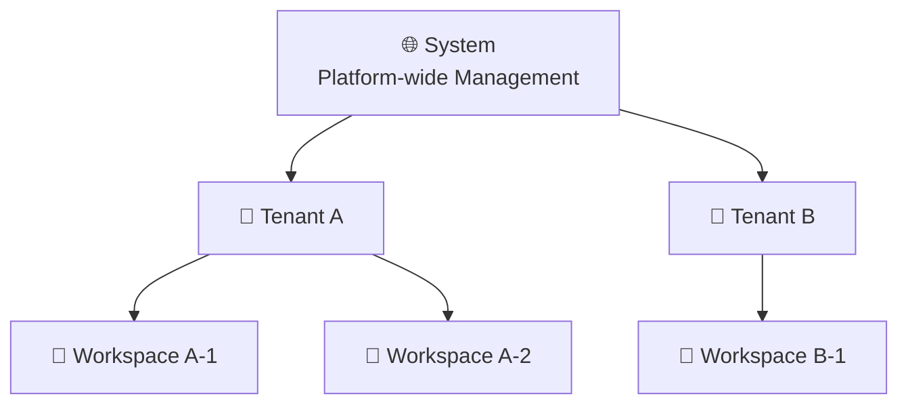
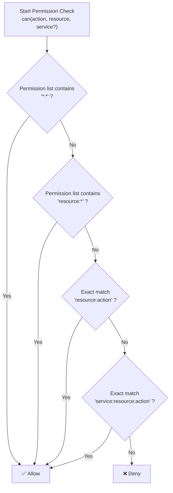
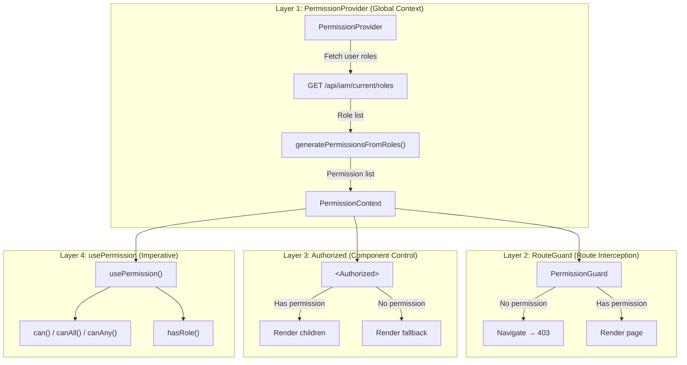

# Permission Design in Detail

Rune Console adopts a **three-level scope + expression matching** permission model, and the frontend implements UI-level access control through four layers of mechanisms. This document provides a detailed explanation of each component of the permission system.

> 💡 Tip: Frontend permissions are only used to optimize user experience (hiding/disabling UI elements for unauthorized operations). **The real security barrier is always implemented by the backend API**. Frontend and backend permissions are loosely coupled — the frontend only cares about "whether there is permission," not how the backend determines it.

---

## Permission Model Overview

```mermaid
graph TB
    subgraph Permission Model
        direction TB
        S["System Scope"]
        T["Tenant Scope"]
        W["Workspace Scope"]
        S --> T --> W
    end

    subgraph Permission Expression
        Expr["[service:]&lt;resource&gt;:&lt;action&gt;"]
    end

    subgraph Frontend Permission Architecture
        direction TB
        PP["PermissionProvider"]
        PP --> RG["RouteGuard<br/>Route-level Interception"]
        PP --> AZ["&lt;Authorized&gt;<br/>Component-level Control"]
        PP --> HP["usePermission<br/>Hook Imperative"]
        PP --> NF["Navigation Menu Filtering"]
    end

    Permission Model --> Permission Expression --> Frontend Permission Architecture
```

### Design Principles

| Principle | Description |
|-----------|-------------|
| **Frontend = UI Optimization** | Reduce user confusion by hiding/disabling UI elements; not a security barrier |
| **Backend = Security Control** | All API requests are validated for permissions on the backend; unauthorized requests return `403` |
| **Loose Coupling** | Frontend only consumes permission results (`can` / `hasRole`), without participating in permission determination logic |
| **Least Privilege** | Users have no permissions by default; only explicitly granted permissions take effect |
| **On-demand Refresh** | Permissions are automatically re-fetched upon login, tenant/workspace switching, or role changes |

---

## Three-level Scope Model

The Rune permission system adopts a **System → Tenant → Workspace** three-level hierarchical structure. Permissions at a higher scope can override those at lower levels.



| Scope | Identifier | Description | Example |
|-------|------------|-------------|---------|
| **System** | No `tenant`, no `workspace` | Platform-wide permissions, can manage all tenants and resources | System admins can manage the entire platform in the BOSS portal |
| **Tenant** | Specified `tenant`, no `workspace` | Permissions limited to a specific tenant | Tenant admins can manage all workspaces under their tenant |
| **Workspace** | Specified `tenant` + `workspace` | Permissions limited to a specific workspace | Workspace admins can manage instances and members in that workspace |

> ⚠️ Note: System Admins automatically have full permissions across all tenants and workspaces. When `hasRole` detects a system admin, it directly returns `true` and skips scope matching.

### Scope Matching Logic

```typescript
// src/auth/authz/context.tsx - hasRole implementation
const hasRole = (role: string, scope?: RoleScope) => {
  // System admin is considered to have all roles
  const isSystemAdmin = state.roles.some(
    (r) => r.roles?.includes('admin') && !r.tenant && !r.workspace
  );
  if (isSystemAdmin) return true;

  return state.roles.some((r) => {
    if (!r.roles?.includes(role)) return false;
    if (scope?.tenant && r.tenant !== scope.tenant) return false;
    if (scope?.workspace && r.workspace !== scope.workspace) return false;
    if (!scope && (r.tenant || r.workspace)) return false;
    return true;
  });
};
```

#### Matching Examples

| Call | Meaning | Who Passes |
|------|---------|------------|
| `hasRole('admin')` | Check for system-level admin | System admin only |
| `hasRole('admin', { tenant: 'acme' })` | Check for admin of tenant acme | System admin + acme tenant admin |
| `hasRole('developer', { tenant: 'acme' })` | Check for developer in tenant acme | System admin + acme developer |
| `hasRole('admin', { tenant: 'acme', workspace: 'ws-1' })` | Check for workspace-level admin | System admin + that workspace admin |

---

## Permission Expression Syntax

Permissions are expressed as strings in the following format:

```
[service:]<resource>:<action>
```

### Components

| Part | Required | Description | Example Values |
|------|----------|-------------|----------------|
| `service` | Optional | Service prefix, used to distinguish different backend services | `compute`, `storage`, `ai` |
| `resource` | **Required** | Resource type | `workspace`, `instance`, `image`, `template`, `member`, `quota`, `volume` |
| `action` | **Required** | Operation type | `list`, `get`, `create`, `update`, `delete`, `*` |

### Expression Examples

| Expression | Meaning | Scenario |
|------------|---------|----------|
| `workspace:list` | List workspaces | View workspace list page |
| `workspace:create` | Create workspace | Show "Create Workspace" button |
| `workspace:get` | View workspace details | Enter workspace detail page |
| `workspace:delete` | Delete workspace | Show "Delete" button |
| `workspace:*` | All operations on workspace | Grant full workspace permissions |
| `instance:create` | Create instance | Show "Create Instance" entry |
| `instance:delete` | Delete instance | Show "Delete" action |
| `member:*` | All member management operations | Grant member management permissions |
| `compute:instance:create` | Create compute instance (with service) | Permission precisely scoped to a service dimension |
| `*:*` | All operations on all resources | System admin wildcard |

---

## Wildcard Matching Rules

Permission checking supports the `*` wildcard, with matching logic processed in the following priority order:



| Wildcard | Match Range | Description |
|----------|-------------|-------------|
| `*:*` | All operations on all resources | Highest permission, only system admin has this |
| `resource:*` | All operations on a specified resource | e.g., `instance:*` can perform all CRUD operations on instances |
| Exact match | A single specific operation | e.g., `instance:list` only allows viewing the instance list |

> 💡 Tip: The wildcard check is implemented in the `can` method of `PermissionProvider`, in the order: global wildcard → resource wildcard → exact match. Action-dimension wildcards (e.g., `*:list`) are not supported.

### Check Flow Source Code

```typescript
// src/auth/authz/context.tsx
const can = (action: string, resource: string, service?: string) => {
  // 1. Global wildcard
  if (state.permissions.includes('*:*')) return true;
  // 2. Resource wildcard
  if (state.permissions.includes(`${resource}:*`)) return true;
  // 3. Exact match
  const permission = service
    ? `${service}:${resource}:${action}`
    : `${resource}:${action}`;
  return state.permissions.includes(permission);
};
```

---

## Role Definitions

### Role Overview

Rune predefines 4 roles, each with a fixed set of permissions within a specific scope:

| Role | Enum Value | Scope | Accessible Portal | Description |
|------|------------|-------|-------------------|-------------|
| **System Admin** | `admin` (no tenant/workspace) | System | BOSS + Console | Highest platform privilege |
| **Tenant Admin** | `admin` (with tenant) | Tenant | Console | Manage all resources within the tenant |
| **Developer** | `developer` | Tenant | Console | Can operate instances, read-only access to other resources |
| **Member** | `member` | Tenant | Console | View-only permissions |

### System Admin

- **Scope**: Global (no tenant/workspace restrictions)
- **Permissions**: `*:*` (all operations on all resources)
- **Description**: Has the highest platform privilege, can access the BOSS admin portal, can manage all tenants, clusters, and users

```typescript
// Condition: admin role + no tenant + no workspace
roleName === 'admin' && !role.tenant && !role.workspace
// → permissions: ['*:*']
```

### Tenant Admin

- **Scope**: Specified tenant
- **Permission List**:

| Permission Expression | Description |
|----------------------|-------------|
| `workspace:*` | All workspace operations (create/view/edit/delete) |
| `member:*` | All member management operations (add/remove/modify roles) |
| `quota:*` | All quota management operations (view/set quota limits) |
| `instance:*` | All instance operations (create/start-stop/delete/view logs) |
| `image:*` | All image operations (create/edit/delete) |
| `template:*` | All template operations (upload/edit/delete) |
| `volume:*` | All storage volume operations (create/mount/delete) |

```typescript
// Condition: admin role + has tenant + no workspace
roleName === 'admin' && role.tenant && !role.workspace
```

### Developer

- **Scope**: Specified tenant
- **Permission List**:

| Permission Expression | Description |
|----------------------|-------------|
| `workspace:list` | View workspace list |
| `workspace:get` | View workspace details |
| `instance:*` | All instance operations (create/start-stop/delete/view logs) |
| `image:list` | View image list |
| `image:get` | View image details |
| `template:list` | View template list |
| `template:get` | View template details |

```typescript
// Condition: developer role + has tenant
roleName === 'developer' && role.tenant
```

### Member

- **Scope**: Specified tenant
- **Permission List**:

| Permission Expression | Description |
|----------------------|-------------|
| `workspace:list` | View workspace list |
| `workspace:get` | View workspace details |
| `instance:list` | View instance list |
| `instance:get` | View instance details |
| `image:list` | View image list |
| `image:get` | View image details |

```typescript
// Condition: member role + has tenant
roleName === 'member' && role.tenant
```

---

## Role Permission Comparison Matrix

The table below summarizes the operation permissions for each role on each resource:

### Resource Operation Permissions

| Resource | Operation | System Admin | Tenant Admin | Developer | Member |
|----------|-----------|:---:|:---:|:---:|:---:|
| **workspace** | list / get | ✅ | ✅ | ✅ | ✅ |
| **workspace** | create / update / delete | ✅ | ✅ | ❌ | ❌ |
| **instance** | list / get | ✅ | ✅ | ✅ | ✅ |
| **instance** | create / update / delete | ✅ | ✅ | ✅ | ❌ |
| **instance** | stop / resume / exec / logs | ✅ | ✅ | ✅ | ❌ |
| **image** | list / get | ✅ | ✅ | ✅ | ✅ |
| **image** | create / update / delete | ✅ | ✅ | ❌ | ❌ |
| **template** | list / get | ✅ | ✅ | ✅ | ❌ |
| **template** | create / update / delete | ✅ | ✅ | ❌ | ❌ |
| **member** | list / get | ✅ | ✅ | ❌ | ❌ |
| **member** | create / update / delete | ✅ | ✅ | ❌ | ❌ |
| **quota** | list / get | ✅ | ✅ | ❌ | ❌ |
| **quota** | create / update / delete | ✅ | ✅ | ❌ | ❌ |
| **volume** | list / get | ✅ | ✅ | ❌ | ❌ |
| **volume** | create / update / delete | ✅ | ✅ | ❌ | ❌ |

### Feature Access Permissions

| Feature | System Admin | Tenant Admin | Developer | Member |
|---------|:---:|:---:|:---:|:---:|
| BOSS Admin Portal | ✅ | ❌ | ❌ | ❌ |
| Console | ✅ | ✅ | ✅ | ✅ |
| Inference Service Management | ✅ | ✅ | ✅ | ❌ |
| Model Fine-tuning | ✅ | ✅ | ✅ | ❌ |
| Development Environment | ✅ | ✅ | ✅ | ❌ |
| Experiment Tracking | ✅ | ✅ | ✅ | ❌ |
| Workspace Management | ✅ | ✅ | ❌ | ❌ |
| Member Management | ✅ | ✅ | ❌ | ❌ |
| Quota Management | ✅ | ✅ | ❌ | ❌ |
| Cluster Management | ✅ | ❌ | ❌ | ❌ |
| User Management | ✅ | ❌ | ❌ | ❌ |

---

## Frontend Permission Architecture

Frontend permission control is divided into **four layers**, covering different granularities from global to local:



### Layer 1: PermissionProvider — Global Permission Context

`PermissionProvider` is the root component of the permission system, wrapping the entire application. After user authentication succeeds, it automatically calls `GET /api/iam/current/roles` to fetch role information, then converts roles into a permission string list through `generatePermissionsFromRoles()`, and provides permission capabilities to child components via React Context.

```tsx
// src/app.tsx
<AuthnProvider>
  <PermissionProvider>
    <Router />
  </PermissionProvider>
</AuthnProvider>
```

**Methods Provided by Context**:

| Method | Signature | Description |
|--------|-----------|-------------|
| `can` | `(action, resource, service?) → boolean` | Check a single permission |
| `canAll` | `(checks: PermissionCheck[]) → boolean` | Check multiple permissions (all must be satisfied) |
| `canAny` | `(checks: PermissionCheck[]) → boolean` | Check multiple permissions (any one satisfied) |
| `hasRole` | `(role, scope?: RoleScope) → boolean` | Check if the user has a specified role |
| `refresh` | `() → Promise<void>` | Manually refresh permissions |
| `loading` | `boolean` | Whether permissions are currently loading |

### Layer 2: PermissionGuard — Route-level Interception

Use the `PermissionGuard` component to protect entire pages. If the user has no permission, it automatically redirects to the 403 page:

```tsx
// Protect a route for a single operation
<PermissionGuard action="create" resource="workspace">
  <WorkspaceCreatePage />
</PermissionGuard>

// Protect a route requiring multiple permissions (AND mode)
<PermissionGuard
  checks={[
    { action: 'list', resource: 'instance' },
    { action: 'list', resource: 'template' },
  ]}
  mode="all"
>
  <DeployPage />
</PermissionGuard>

// Protect a route requiring any permission (OR mode)
<PermissionGuard
  checks={[
    { action: 'create', resource: 'instance' },
    { action: 'create', resource: 'workspace' },
  ]}
  mode="any"
>
  <QuickCreatePage />
</PermissionGuard>
```

> 💡 Tip: `PermissionGuard` displays a `SplashScreen` full-screen loading animation while permissions are loading, to avoid briefly flashing the 403 page before permissions are determined.

### Layer 3: \<Authorized\> — Declarative Component-level Control

Use the `<Authorized>` component within pages for fine-grained control over the visibility of UI elements:

```tsx
{/* Single permission check — hide when unauthorized */}
<Authorized action="delete" resource="workspace">
  <DeleteButton />
</Authorized>

{/* With fallback — show disabled button when unauthorized */}
<Authorized action="edit" resource="instance" fallback={<DisabledButton />}>
  <EditButton />
</Authorized>

{/* Multiple permission check (AND) */}
<Authorized
  checks={[
    { action: 'create', resource: 'instance' },
    { action: 'list', resource: 'template' },
  ]}
>
  <DeployButton />
</Authorized>

{/* Multiple permission check (OR) */}
<Authorized
  checks={[
    { action: 'create', resource: 'instance' },
    { action: 'create', resource: 'workspace' },
  ]}
  mode="any"
>
  <QuickActionMenu />
</Authorized>

{/* Role check — visible to admins only */}
<Authorized role="admin" fallback={<NoPermissionView />}>
  <AdminPanel />
</Authorized>

{/* Role + scope check */}
<Authorized role="admin" roleScope={{ tenant: tenantId }}>
  <TenantSettingsButton />
</Authorized>
```

**Component Props**:

| Prop | Type | Description |
|------|------|-------------|
| `action` | `string` | Operation type |
| `resource` | `string` | Resource type |
| `service` | `string` | Service prefix (optional) |
| `checks` | `PermissionCheck[]` | Multiple permission check array |
| `mode` | `'all' \| 'any'` | Multiple permission judgment mode, default `'all'` |
| `role` | `string` | Role name (takes priority over action/resource checks) |
| `roleScope` | `RoleScope` | Role scope `{ tenant?, workspace? }` |
| `fallback` | `ReactNode` | Fallback UI when unauthorized, default `null` |
| `children` | `ReactNode` | Child components rendered when authorized |

### Layer 4: usePermission — Imperative Hook

Use the Hook in business logic for dynamic permission checks:

```tsx
import { usePermission } from 'src/auth/authz';

function InstanceToolbar({ tenant }: { tenant: string }) {
  const { can, canAll, canAny, hasRole } = usePermission();

  // Check a single permission
  const canCreate = can('create', 'instance');

  // Check a permission with service prefix
  const canCreateCompute = can('create', 'instance', 'compute');

  // Check multiple permissions (all must be satisfied)
  const canDeploy = canAll([
    { action: 'create', resource: 'instance' },
    { action: 'list', resource: 'template' },
  ]);

  // Check multiple permissions (any one satisfied)
  const canManage = canAny([
    { action: 'update', resource: 'instance' },
    { action: 'delete', resource: 'instance' },
  ]);

  // Check tenant admin role
  const isTenantAdmin = hasRole('admin', { tenant });

  // Check system admin role
  const isSystemAdmin = hasRole('admin');

  return (
    <Toolbar>
      {canCreate && <CreateButton />}
      {isTenantAdmin && <BatchDeleteButton />}
    </Toolbar>
  );
}
```

---

## Navigation Menu Filtering

Navigation menu items are configured with a `roles` attribute as a role whitelist. Users can only see menu items allowed by their roles. The Layout component filters the navigation based on user roles during rendering:

```tsx
// src/routes/navs/rune.tsx — Navigation menu configuration example
const runeNavItems = [
  {
    title: 'Workspaces',
    path: '/rune/workspaces',
    roles: [TenantRole.ADMIN, TenantRole.DEVELOPER],  // Visible to admins and developers only
  },
  {
    title: 'Inference Services',
    path: '/rune/inferences',
    roles: [TenantRole.ADMIN, TenantRole.DEVELOPER],  // Visible to admins and developers only
  },
  {
    title: 'Development Environments',
    path: '/rune/devenvs',
    roles: [TenantRole.ADMIN, TenantRole.DEVELOPER],  // Visible to admins and developers only
  },
  {
    title: 'Model Fine-tuning',
    path: '/rune/finetunes',
    roles: [TenantRole.ADMIN, TenantRole.DEVELOPER],  // Visible to admins and developers only
  },
  {
    title: 'Instance List',
    path: '/rune/instances',
    // No roles configured — visible to all roles
  },
];
```

**Filtering Logic**:

| Scenario | Behavior |
|----------|----------|
| Menu item has no `roles` configured | Visible to all users |
| Menu item has `roles` configured | Displayed only if user's role is in the list |
| System admin | All menu items are visible (`hasRole` always returns `true` for system admins) |
| BOSS admin portal menu | Wrapped by `<Authorized role="admin">` at the outer level, only system admins can enter |

---

## Permission Refresh Timing

The following events trigger permission re-fetching:

| Trigger Event | Description | Implementation |
|---------------|-------------|----------------|
| **Login success** | Initialize user permissions | `useEffect` monitors `authenticated` state changes |
| **Tenant switch** | Different tenants may have different roles | Triggers `refresh()` after tenant switch |
| **Workspace switch** | Workspace level may have independent permissions | Triggers `refresh()` after workspace change |
| **Role change** | Admin modified user roles | Notified by the admin operation or manual refresh |
| **Manual refresh** | User presses F5 to refresh the page | `PermissionProvider` remounts |
| **Logout** | Clear permission information | Clears roles and permissions when `authenticated = false` |

> ⚠️ Note: If an admin modifies user roles in the BOSS portal, the user side will not receive real-time notification. Users need to **refresh the page** or **switch tenants again** to get the latest permissions.

---

## Practical Scenario Guide

### Scenario 1: Granting Read-only Permissions to a User

**Requirement**: A user needs to view instance and image lists within a tenant, but should not be allowed any write operations.

**Solution**: Set the user as **Member** role in the target tenant.

```
Permissions the user will receive:
workspace:list, workspace:get    → Can view workspace list and details
instance:list, instance:get      → Can view instance list and details
image:list, image:get            → Can view image list and details
```

**Steps**:
1. Go to **Console → IAM → Member Management**
2. Click "Add Member" and select the target user
3. Select the role **Member**
4. Save

### Scenario 2: Allowing a User to Create and Manage Instances Independently

**Requirement**: A user needs to create, stop, and delete instances on their own, but does not need to manage workspaces or members.

**Solution**: Set the user as **Developer** role in the target tenant.

```
Permissions the user will receive:
workspace:list, workspace:get    → Can view workspaces (but cannot create/update/delete)
instance:*                       → All instance operations
image:list, image:get            → Can view images (but cannot create/update/delete)
template:list, template:get      → Can view templates (but cannot create/update/delete)
```

### Scenario 3: Making Someone a Tenant Admin

**Requirement**: A user needs to manage the entire tenant, including workspaces, members, quotas, instances, etc.

**Solution**: Set the user's role to **Tenant Admin** in the target tenant.

```
Permissions the user will receive:
workspace:*, member:*, quota:*, instance:*, image:*, template:*, volume:*
→ Can manage all resources under this tenant, but cannot access the BOSS admin portal
```

### Scenario 4: Troubleshooting Permission Inconsistencies

**Symptom**: A user reports "cannot see a certain button" or "the page shows 403."

**Troubleshooting Steps**:
1. Verify the user has selected the correct tenant (top-right avatar → Switch Tenant)
2. Verify the user's role in that tenant (IAM → Member Management → View member roles)
3. Cross-reference the role permission matrix above to confirm whether the role has the required permission
4. If the role was just modified, ask the user to **refresh the page**
5. If the backend returns 403 but the frontend shows permission granted, it indicates frontend-backend permission inconsistency — check the backend role configuration

---

## Best Practices

| Practice | Description |
|----------|-------------|
| 🔒 **Always validate permissions on the backend** | Frontend permissions are only for UI optimization; do not rely on the frontend for security control |
| 🎯 **Least privilege principle** | Assign users the minimum role that meets their needs; avoid over-authorization |
| 🔄 **Refresh on permission anomalies** | If permission inconsistencies are encountered, prompt users to refresh the page |
| 📋 **Role assignment auditing** | It is recommended to record role change history for security auditing |
| 🧪 **Use loading state** | Do not render UI elements requiring permission checks while permissions are loading, to avoid flickering |
| 🏗️ **Prefer declarative approach** | Prefer `<Authorized>` and `<PermissionGuard>`; only use `usePermission` when dynamic logic is needed |
| 📌 **Role checks take priority over permission checks** | The `role` attribute in `<Authorized>` takes priority over `action/resource`; avoid mixing them |
