# 平台架构

本文档全面介绍晓石 AI 平台（Rune Console）的整体技术架构，包括前后端设计、多租户模型、资源管理、认证授权、LLM 网关、存储体系与可观测性等核心模块。

---

## 总体平台架构

晓石 AI 平台是一个面向企业级 AI 工作负载的全栈管理平台，涵盖推理部署、模型微调、开发环境、模型仓库、LLM 网关等完整能力。整个平台采用前后端分离架构，前端为基于 React 的单页应用（SPA），后端由 5 个独立微服务域组成。

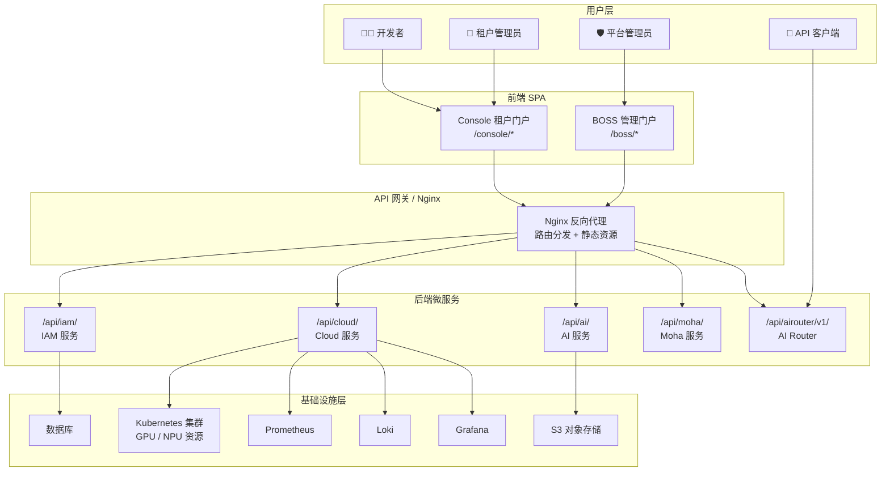

> 💡 提示: 前端通过 Nginx 反向代理与后端通信，所有 API 请求统一经过 `/api/` 路径前缀路由到对应的微服务。

---

## 双控制面架构

Rune Console 采用**单代码库、双控制面**设计，通过同一套 React 应用构建出两个完全独立的管理门户，各自拥有独立的路由树、导航配置和权限模型。

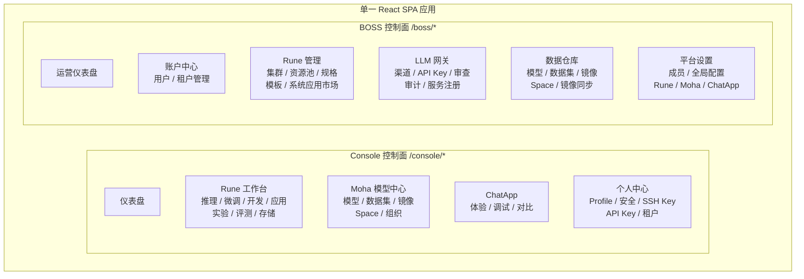

### Console（租户门户）

面向**工作空间运营人员**和**开发者**，提供日常 AI 工作负载管理能力：

| 模块 | 核心功能 | 目标用户 |
|------|---------|---------|
| **Rune** | 推理服务、微调训练、开发环境、应用部署、实验跟踪、模型评测、存储卷管理 | 开发者 |
| **Moha** | 模型仓库、数据集管理、镜像管理、Space 应用、组织管理 | 开发者 / 数据工程师 |
| **ChatApp** | AI 对话体验、Prompt 调试、多模型对比、Token 用量统计 | 所有用户 |
| **个人中心** | Profile 设置、安全配置（密码/MFA）、SSH 密钥、API Key、租户切换、主题设置 | 所有用户 |

### BOSS（管理门户）

面向**平台管理员**，提供平台级全局管理和运维能力：

| 模块 | 核心功能 | 目标用户 |
|------|---------|---------|
| **账户中心** | 用户 CRUD、租户 CRUD、成员角色分配 | 平台管理员 |
| **Rune 管理** | 集群纳管、资源池划分、GPU/NPU 规格管理、模板/产品管理、系统应用市场 | 平台管理员 |
| **LLM 网关** | 渠道配置、API Key 管理、内容审查策略、审计记录、服务注册、运营面板 | 平台管理员 |
| **数据仓库** | 平台级模型/数据集/镜像/Space 管理、镜像同步 | 平台管理员 |
| **平台设置** | 系统成员、全局配置（Rune/Moha/ChatApp/平台）、动态仪表盘 | 平台管理员 |

> ⚠️ 注意: Console 和 BOSS 虽共享代码库和组件系统，但路由树完全隔离，用户无法从一个门户直接跳转到另一个门户。权限校验在路由守卫和 API 层均独立执行。

---

## 多租户层级详解

平台采用 **平台 → 租户 → 区域/集群 → 工作空间 → 实例** 五级资源隔离模型，每层拥有明确的职责边界和数据隔离策略。

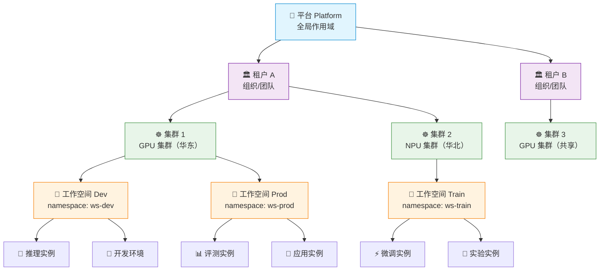

### 各层级职责与数据边界

#### 平台层（Platform）

- **作用域**：全局，整个晓石 AI 平台的最顶层
- **管理者**：系统管理员（System Admin）
- **数据边界**：全局用户库、全局租户列表、全局集群注册表、全局配置、系统级成员与角色
- **核心职责**：
  - 平台用户的创建与管理（可跨租户）
  - 集群的注册纳管与全局调度
  - 系统级模板与产品的发布
  - LLM 网关的全局策略配置（限速、缓存、CIDR 白名单等）
  - 平台级监控与运营面板

#### 租户层（Tenant）

- **作用域**：组织/团队级别
- **管理者**：租户管理员（Tenant Admin）
- **数据边界**：租户内的成员列表、工作空间列表、租户级配额、租户级密钥、Moha 仓库（模型/数据集/Space）; 不同租户之间数据完全隔离
- **核心职责**：
  - 管理租户内的成员和角色
  - 创建和管理工作空间
  - 分配租户配额到工作空间
  - 管理租户级 Moha 仓库与组织
  - 管理租户的 API Key（LLM 网关）

#### 区域/集群层（Region / Cluster）

- **作用域**：Kubernetes 集群级别
- **管理者**：系统管理员
- **数据边界**：集群的 kubeconfig 连接信息、集群节点与资源状态、资源池定义、规格/Flavor 配置、集群级配额分配
- **核心职责**：
  - 维持与 Kubernetes 集群的连接（kubeconfig 管理、dry-run 验证）
  - 资源池的划分（GPU/NPU/CPU 分区）
  - Flavor 规格管理（支持 NVIDIA、Ascend、Cambricon 等多供应商检测）
  - 集群级配额分配（GPU 卡数、CPU、内存上限）
  - K8s API 透传代理

> 💡 提示: 集群纳管时支持 dry-run 验证，系统会在不实际创建资源的情况下验证 kubeconfig 的有效性和集群连通性。

#### 工作空间层（Workspace）

- **作用域**：Kubernetes namespace 级别
- **管理者**：租户管理员 / 工作空间管理员
- **数据边界**：该 namespace 下的所有 K8s 资源（Pod、Service、Secret 等）、工作空间级配额、工作空间成员列表、实例列表
- **核心职责**：
  - 实例生命周期管理（创建/启动/停止/恢复/删除）
  - 配额的消费与追踪
  - 工作空间成员权限管理
  - 存储卷挂载到实例

#### 实例层（Instance）

- **作用域**：单个工作负载
- **管理者**：开发者
- **数据边界**：实例配置（Flavor/模板/参数）、实例状态（运行/停止/失败）、实例日志、实例监控指标、挂载的存储卷
- **实例类型**：

| 类型 | 说明 | 典型用途 |
|------|------|---------|
| **推理（Inference）** | 部署模型推理服务为 API | 模型上线服务化 |
| **微调（Finetune）** | 模型微调训练任务 | LoRA、全参数微调 |
| **开发环境（DevEnv）** | JupyterLab / VS Code 远程开发 | 交互式模型开发调试 |
| **应用（App）** | 自定义容器化应用 | Gradio / Streamlit 应用 |
| **实验（Experiment）** | 可追踪的训练实验 | 超参搜索、A/B 对比 |
| **评测（Evaluation）** | 模型性能评测 | 基准测试、对比评估 |

---

## 资源管理全流程

从集群纳管到开发者部署实例，涉及一系列由不同角色驱动的管理操作：

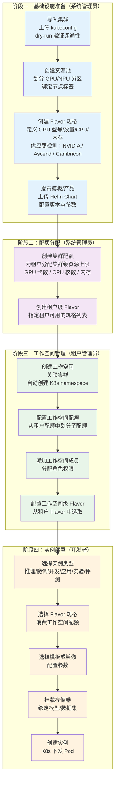

### Flavor 三级继承

Flavor（规格）采用集群 → 租户 → 工作空间三级继承模型：

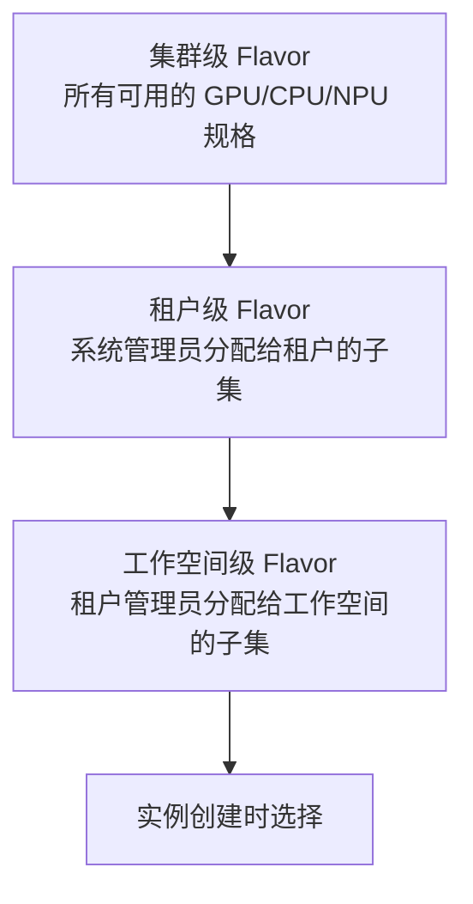

> ⚠️ 注意: 配额也遵循相同的三级继承模型。工作空间配额不能超过租户配额，租户配额不能超过集群可用资源总量。

---

## 后端微服务架构

后端由 5 个独立微服务域组成，各自拥有独立的数据库、独立的 API 路径前缀和明确的领域职责。

```mermaid
graph TB
    subgraph "前端 SPA"
        FE["Rune Console"]
    end

    subgraph "IAM 域 /api/iam/"
        IAM_Auth["认证模块<br/>登录/注册/登出/MFA/验证码"]
        IAM_User["用户管理<br/>CRUD/头像上传"]
        IAM_Tenant["租户管理<br/>CRUD/切换"]
        IAM_Member["成员与角色<br/>三级角色体系"]
        IAM_SSH["SSH 密钥管理"]
        IAM_Config["全局配置"]
    end

    subgraph "Cloud 域 /api/cloud/"
        Cloud_Cluster["集群管理<br/>CRUD/dry-run/K8s代理"]
        Cloud_WS["工作空间管理<br/>CRUD/namespace"]
        Cloud_Instance["实例管理<br/>创建/停止/恢复/解密"]
        Cloud_Flavor["Flavor 管理<br/>三级继承"]
        Cloud_Quota["配额管理<br/>三级继承"]
        Cloud_RP["资源池管理"]
        Cloud_Template["模板/产品管理<br/>Helm Chart"]
        Cloud_Monitor["监控/日志/指标<br/>Prometheus/Loki/Grafana"]
        Cloud_Gateway["LLM 网关<br/>服务注册"]
    end

    subgraph "AI 域 /api/ai/"
        AI_Volume["存储卷管理<br/>CRUD/S3 后端"]
        AI_S3["S3 文件代理<br/>上传/下载/删除"]
        AI_Job["存储任务<br/>Git/HuggingFace/ModelScope<br/>PythonEnv/Moha 同步"]
    end

    subgraph "Moha 域 /api/moha/"
        Moha_Repo["仓库管理<br/>模型/数据集/Space"]
        Moha_Git["Git 操作<br/>refs/commits/diff/reset"]
        Moha_Discussion["讨论/PR 系统"]
        Moha_Image["镜像注册中心<br/>扫描/标签"]
        Moha_Org["组织管理"]
        Moha_Mirror["镜像同步"]
        Moha_Fav["收藏/评分"]
    end

    subgraph "AI Router 域 /api/airouter/v1/"
        AR_Token["API Token 管理<br/>管理员+用户端"]
        AR_Channel["渠道管理<br/>LLM 路由规则"]
        AR_Audit["审计记录"]
        AR_Mod["内容审查<br/>日志/替换/Webhook/阻断<br/>词库管理"]
        AR_Stats["使用统计"]
        AR_Settings["全局设置<br/>限速/缓存/降级/CIDR"]
    end

    FE --> IAM_Auth
    FE --> Cloud_Cluster
    FE --> AI_Volume
    FE --> Moha_Repo
    FE --> AR_Token

    Cloud_Instance --> Cloud_Flavor
    Cloud_Instance --> Cloud_Quota
    Cloud_Instance --> Cloud_Template
    Cloud_Instance --> AI_Volume
    Cloud_Cluster -.->|K8s API 代理| Cloud_Instance

    AI_Job --> Moha_Repo
    AR_Channel -.->|路由转发| Cloud_Gateway
```

### 各微服务详解

#### 1. IAM 服务（`/api/iam/`）

身份认证与访问管理服务，是平台的安全基座。

| 能力 | 说明 |
|------|------|
| 认证 | 用户登录/注册/登出、JWT Token 签发与刷新、验证码、MFA（多因素认证） |
| 用户管理 | 用户 CRUD、头像上传、密码重置 |
| 租户管理 | 租户 CRUD、租户切换、租户选择 |
| 成员与角色 | 三级角色体系（系统级/租户级/工作空间级），权限列表生成 |
| SSH 密钥 | 公钥上传与管理，用于 Git 操作与开发环境 |
| 全局配置 | 平台级设定管理 |

#### 2. Cloud 服务（`/api/cloud/`）

计算资源与工作负载管理服务，是平台的核心调度引擎。

| 能力 | 说明 |
|------|------|
| 集群管理 | 集群 CRUD（含 dry-run 验证）、集群状态监控 |
| K8s 资源代理 | 任意 K8s API 透传，支持 Pod/Service/Secret 等资源操作 |
| 工作空间管理 | 工作空间 CRUD、自动关联 K8s namespace |
| 实例管理 | 全类型实例生命周期（创建/更新/删除/停止/恢复/解密） |
| Flavor 管理 | 三级 Flavor（集群/租户/工作空间），GPU 型号支持 NVIDIA、Ascend、Cambricon 等 |
| 配额管理 | 三级配额（集群/租户/工作空间），GPU 卡数/CPU/内存精确计量 |
| 资源池 | 集群资源分区管理 |
| 模板/产品 | 管理员产品、用户产品、系统产品，Helm Chart 版本管理 |
| 监控 | Pod 日志、Pod exec（终端）、Pod 指标、Prometheus 查询、Grafana 动态仪表盘 |
| 日志查询 | Loki 兼容的日志查询接口、WebSocket 日志流 |
| 服务注册 | LLM 网关的上游服务注册 |

#### 3. AI 服务（`/api/ai/`）

存储与数据管理服务，提供 S3 对象存储的抽象层。

| 能力 | 说明 |
|------|------|
| 存储卷管理 | 存储卷 CRUD（S3 后端、size、storageClass） |
| S3 文件代理 | 文件列表/上传/下载/删除的代理接口 |
| 存储任务 | 支持从多种来源同步数据：Git 仓库、HuggingFace Hub、ModelScope、Python 环境、Moha 仓库 |

#### 4. Moha 服务（`/api/moha/`）

模型仓库与资产管理服务，类似 HuggingFace Hub 的私有部署版本。

| 能力 | 说明 |
|------|------|
| 仓库管理 | 模型/数据集/Space 仓库的 CRUD，支持版本化 |
| Git 操作 | refs、contents、commits、diff、reset、revert 等完整 Git 操作 |
| 讨论/PR | 仓库内讨论与合并请求系统 |
| 镜像管理 | 容器镜像注册中心，支持镜像安全扫描与标签管理 |
| 组织管理 | 组织创建、成员管理、组织仓库 |
| 镜像同步 | 从外部镜像源（Docker Hub 等）同步镜像 |
| 社区功能 | 收藏、评分 |

#### 5. AI Router（`/api/airouter/v1/`）

LLM 网关服务，提供统一的大模型接入层。

| 能力 | 说明 |
|------|------|
| API Token | 管理员端 + 用户端 Token 管理，分级权限 |
| 渠道管理 | LLM 路由规则配置，模型匹配、优先级、降级 |
| 审计 | 全量请求审计记录 |
| 内容审查 | 四种审查模式（日志/替换/Webhook/阻断），自定义词库 |
| 使用统计 | Token 用量、请求次数、耗时等统计数据 |
| 全局设置 | 限速、缓存、渠道降级、路由偏好、CIDR 白名单 |

---

## 认证与授权流程

平台采用 JWT Token + 三级角色权限体系实现安全访问控制。

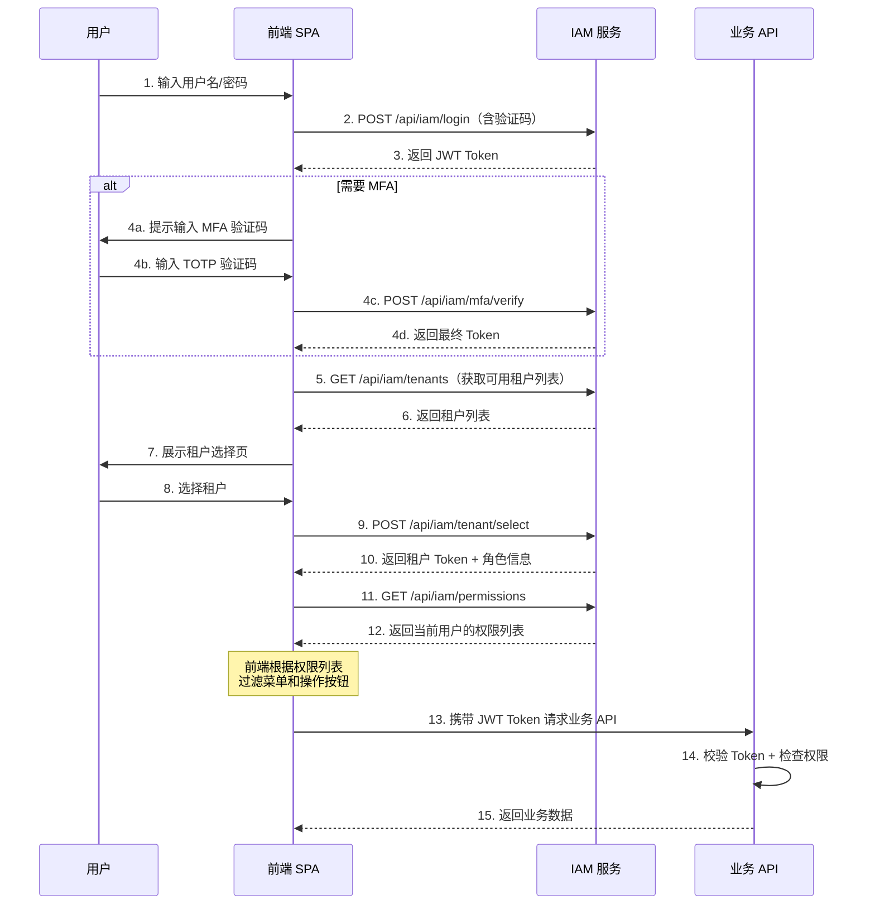

### 三级角色体系

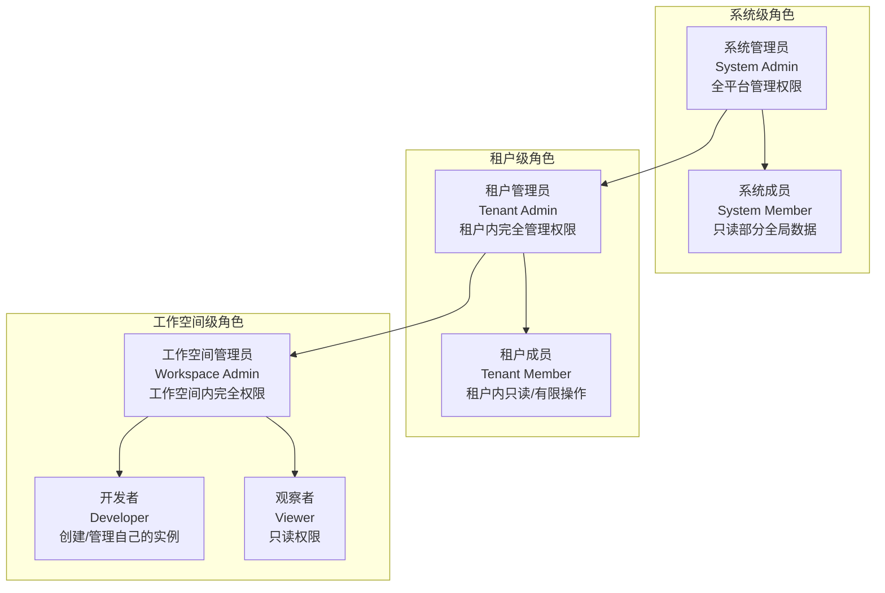

权限列表在用户选择租户后一次性生成，前端据此过滤：
- **菜单显隐** — 无权限的导航项不显示
- **操作按钮** — 无权限的操作按钮禁用或隐藏
- **路由守卫** — 无权限直接访问的路由重定向到 403

> 💡 提示: 用户在不同租户、不同工作空间可能拥有不同的角色。切换租户或工作空间时，权限列表会重新计算。

---

## LLM 网关请求路由

AI Router 提供统一的 LLM 接入网关，对外暴露 OpenAI 兼容的 API 接口，内部根据渠道配置将请求路由到对应的上游 LLM 服务。

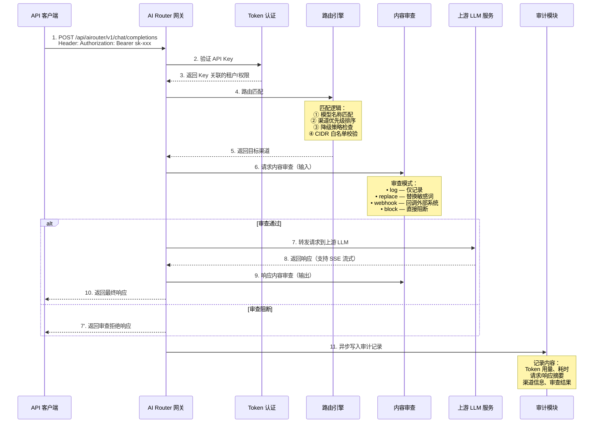

### 渠道配置要素

| 配置项 | 说明 |
|--------|------|
| 模型匹配 | 支持精确匹配和通配符，如 `gpt-4*`、`qwen-*` |
| 优先级 | 数字越大优先级越高，同模型多渠道时按优先级选择 |
| 降级策略 | 主渠道不可用时自动切换到备用渠道 |
| 限速 | 全局限速和每 Key 限速（QPM/TPM） |
| 缓存 | 相同请求缓存一定时间，降低上游压力 |
| 路由偏好 | 支持轮询、最低延迟、最低用量等策略 |
| CIDR 白名单 | 限制 API Key 的来源 IP |

---

## 前端架构

### 技术栈

| 技术 | 版本 | 用途 |
|------|------|------|
| **React** | 19 | UI 框架 |
| **TypeScript** | 5.x | 类型安全 |
| **Vite** | 6 | 构建工具 + 开发服务器 |
| **MUI (Material UI)** | 7 | UI 组件库 |
| **React Router** | 7 | 客户端路由 |
| **SWR** | 2.x | 服务端状态管理（数据缓存/重新验证） |
| **i18next** | 23.x | 国际化（中文/英文） |
| **Axios** | 1.x | HTTP 客户端 |

### 路由系统

前端采用 React Router 7 实现客户端路由，通过 `lazy()` 实现**按模块代码分割**，首屏只加载当前路由所需的代码。

```mermaid
graph TD
    Root["/"] --> Auth["/auth/*<br/>AuthLayout"]
    Root --> ConsoleTree["/console/*<br/>DashboardLayout"]
    Root --> BossTree["/boss/*<br/>DashboardLayout"]

    Auth --> Login["/auth/login"]
    Auth --> Register["/auth/register"]
    Auth --> Reset["/auth/reset-password"]
    Auth --> SelectTenant["/auth/select-tenant"]
    Auth --> MFA["/auth/mfa"]

    ConsoleTree --> CDash["/console/dashboard"]
    ConsoleTree --> CRune["/console/rune/*<br/>lazy loaded"]
    ConsoleTree --> CMoha["/console/moha/*<br/>lazy loaded"]
    ConsoleTree --> CChat["/console/chatapp/*<br/>lazy loaded"]
    ConsoleTree --> CIAM["/console/iam/*<br/>lazy loaded"]

    BossTree --> BDash["/boss/dashboard"]
    BossTree --> BIAM["/boss/iam/*<br/>lazy loaded"]
    BossTree --> BRune["/boss/rune/*<br/>lazy loaded"]
    BossTree --> BGW["/boss/gateway/*<br/>lazy loaded"]
    BossTree --> BMoha["/boss/moha/*<br/>lazy loaded"]
    BossTree --> BSet["/boss/settings/*<br/>lazy loaded"]

    style Auth fill:#ffebee
    style ConsoleTree fill:#e3f2fd
    style BossTree fill:#fce4ec
```

### 布局系统

平台使用三种布局模式适配不同场景：

| 布局 | 适用场景 | 结构 |
|------|---------|------|
| **AuthLayout** | 登录、注册、找回密码、MFA、租户选择 | 居中卡片 + 品牌背景 |
| **DashboardLayout** | Console 和 BOSS 的主要工作界面 | Header + Sidebar + Content 三栏布局 |
| **MinimalLayout** | 紧凑视图、嵌入式页面 | 仅 Content |

DashboardLayout 支持多种导航变体：

- **Vertical** — 标准左侧侧边栏导航
- **Horizontal** — 顶部水平导航栏
- **Mini** — 收起的迷你侧边栏（仅图标）

### 状态管理

前端状态管理采用**分层策略**：React Context 管理全局 UI 状态，SWR 管理服务端数据状态。

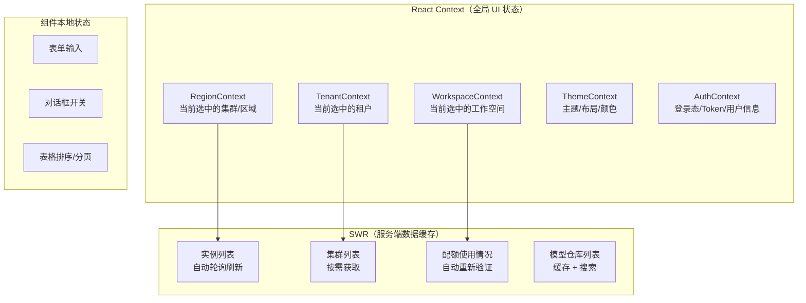

> 💡 提示: 切换集群（RegionContext）会清空工作空间列表和实例列表的 SWR 缓存，确保数据一致性。切换租户会触发页面级重载。

### 主题系统

平台内置丰富的主题定制能力：

| 配置项 | 选项 |
|--------|------|
| **颜色模式** | 浅色 / 深色 |
| **对比度** | 默认 / 高对比度 |
| **导航颜色** | 多种预设（深色、浅色、彩色） |
| **导航布局** | 垂直 / 水平 / 迷你 |
| **预设颜色** | 多组品牌色可选 |
| **字体大小** | 可调节 |
| **紧凑布局** | 开/关 |

---

## 存储架构

平台存储体系基于 S3 对象存储，通过 AI 服务提供统一的存储抽象层。

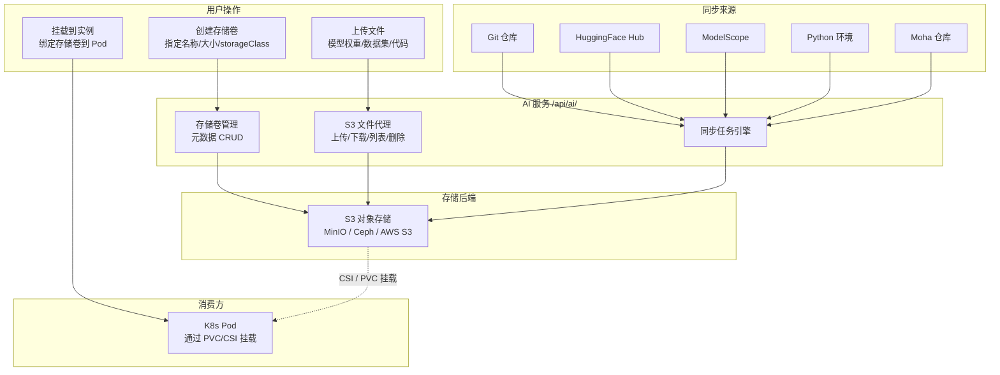

### 存储卷生命周期

1. **创建**：指定名称、容量和 storageClass，系统在 S3 上创建对应的 Bucket/Prefix
2. **上传数据**：通过 S3 文件代理接口上传模型文件、数据集等
3. **同步导入**：通过存储任务从 Git/HuggingFace/ModelScope 等来源批量同步
4. **挂载使用**：在创建实例时关联存储卷，Pod 启动时通过 CSI 驱动挂载
5. **删除**：卸载所有关联实例后，删除存储卷及底层 S3 数据

> ⚠️ 注意: 存储卷一旦挂载到运行中的实例，无法直接删除。需先停止或删除关联实例后才能操作。

---

## 可观测性架构

平台提供实例级、集群级和网关级的全方位可观测能力。

```mermaid
graph TB
    subgraph "数据采集层"
        Pod["K8s Pod<br/>应用指标 + 日志"]
        Node["K8s Node<br/>节点指标"]
        GW["AI Router<br/>请求指标"]
    end

    subgraph "数据存储层"
        Prom["Prometheus<br/>指标存储"]
        LokiDB["Loki<br/>日志存储"]
        AuditDB["审计数据库<br/>网关审计"]
    end

    subgraph "可视化层"
        Grafana["Grafana<br/>动态仪表盘"]
        LogUI["日志查询 UI<br/>Loki 查询"]
        LogStream["日志流<br/>WebSocket 实时推送"]
        AuditUI["审计面板<br/>网关运营数据"]
    end

    subgraph "前端展示"
        Dashboard["仪表盘页面"]
        InstanceDetail["实例详情页<br/>指标/日志/终端"]
        GWDash["网关运营面板<br/>用量/审计/时序图"]
    end

    Pod --> Prom
    Pod --> LokiDB
    Node --> Prom
    GW --> AuditDB
    GW --> Prom

    Prom --> Grafana
    LokiDB --> LogUI
    LokiDB --> LogStream
    AuditDB --> AuditUI

    Grafana --> Dashboard
    Grafana --> InstanceDetail
    LogUI --> InstanceDetail
    LogStream --> InstanceDetail
    AuditUI --> GWDash
```

### 三级可观测能力

#### 实例级

| 能力 | 数据源 | 说明 |
|------|--------|------|
| **Pod 指标** | Prometheus | GPU 利用率、显存使用、CPU、内存、网络 IO |
| **Pod 日志** | Loki | 容器标准输出/错误日志，支持关键词搜索 |
| **日志流** | WebSocket | 实时日志推送，类似 `kubectl logs -f` |
| **终端** | WebSocket (exec) | 直接进入 Pod 容器终端，类似 `kubectl exec` |
| **Grafana 面板** | Grafana API | 动态生成的实例级监控仪表盘 |

#### 集群级

| 能力 | 数据源 | 说明 |
|------|--------|------|
| **集群仪表盘** | Grafana | 节点总览、资源使用率、Pod 调度情况 |
| **日志查询** | Loki | 集群范围的日志检索，支持 LogQL |
| **资源监控** | Prometheus | GPU/NPU 池使用率、配额消耗趋势 |

#### 网关级

| 能力 | 数据源 | 说明 |
|------|--------|------|
| **使用记录** | AI Router DB | 每次 API 调用的详细记录（Token/耗时/模型/渠道） |
| **审计记录** | AI Router DB | 完整的请求/响应审计轨迹 |
| **运营面板** | AI Router 统计 API | 时序图表：QPM、Token 用量趋势、渠道分布、错误率 |

---

## 高可用考量

### 前端高可用

- **静态资源 CDN**：构建产物可部署到 CDN，Nginx 仅做反向代理
- **代码分割**：按路由 lazy 加载，首屏加载快，故障影响隔离
- **SWR 缓存**：网络闪断时展示缓存数据，恢复后自动重新验证
- **错误边界**：React Error Boundary 捕获组件崩溃，防止全局白屏

### 后端高可用

- **微服务独立部署**：5 个域独立部署和扩缩容，单一服务故障不影响全平台
- **无状态设计**：所有业务服务无状态，可水平扩展
- **JWT Token**：Token 自包含，IAM 短暂不可用时已登录用户不受影响
- **K8s 代理容错**：集群连接失败自动重试，dry-run 保护误操作

### 网关高可用

- **渠道降级**：主渠道故障自动切换备用渠道
- **限速保护**：全局限速 + 单 Key 限速，防止资源耗尽
- **缓存层**：减少上游 LLM 调用压力
- **异步审计**：审计日志异步写入，不阻塞主请求链路

### 存储高可用

- **S3 后端**：依赖 S3 对象存储的原生冗余（MinIO 纠删码 / AWS S3 多 AZ）
- **存储卷元数据**：数据库存储，支持备份恢复

---

## 上下文切换机制

在 Console 端用户操作资源前，需要切换到正确的上下文环境：

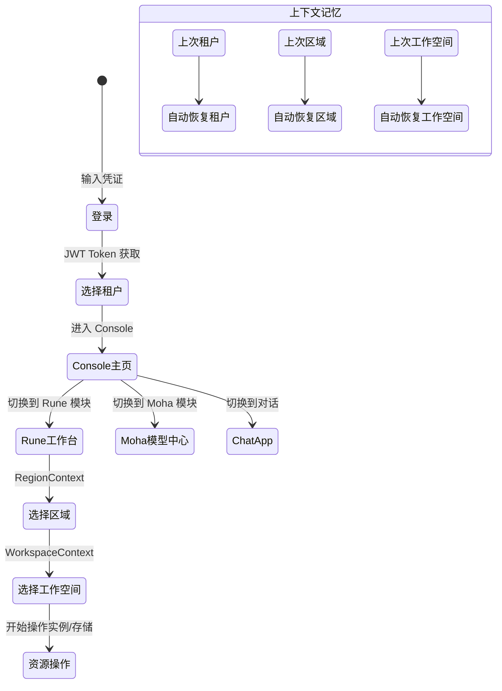

1. **租户选择** — 登录后在租户选择页选择目标租户，或通过顶部导航切换
2. **区域/集群选择** — 进入 Rune 工作台后，通过顶部区域选择器切换集群
3. **工作空间选择** — 选定集群后，通过工作空间选择器切换到目标工作空间

> 💡 提示: 系统会将您上次使用的租户、区域和工作空间持久化到本地存储，下次访问时自动恢复上下文。

---

## 技术架构总结

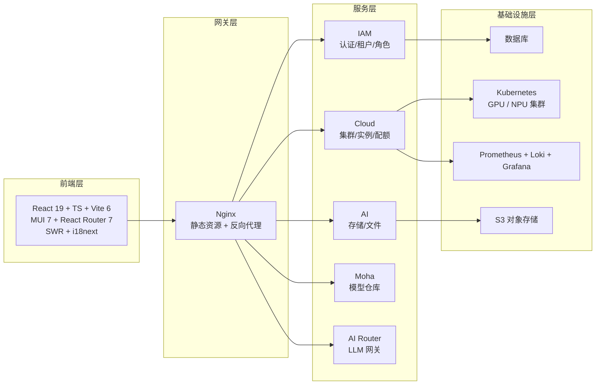

| 维度 | 关键设计 |
|------|---------|
| **双控制面** | 同一代码库生成 Console + BOSS 两个门户，路由隔离，权限独立 |
| **多租户** | 平台 → 租户 → 集群 → 工作空间 → 实例五级隔离 |
| **资源管理** | 配额/Flavor 三级继承，从集群到工作空间逐级精细化 |
| **异构算力** | 支持 NVIDIA GPU、Ascend NPU、Cambricon MLU 等多供应商 |
| **网关路由** | 模型匹配 + 优先级 + 降级 + 限速 + 缓存 + 审查的全链路 |
| **存储抽象** | S3 统一后端，支持多源同步（Git/HF/ModelScope/Moha） |
| **可观测性** | Prometheus 指标 + Loki 日志 + Grafana 面板 + WebSocket 实时流 |

---

## 下一步

- [术语表](./glossary.md) — 了解平台核心术语和概念定义
- [角色与权限](../auth/roles.md) — 深入了解三级权限体系
- [Console 概览](../console/) — 开始使用 Console 门户
- [快速上手](./quick-start.md) — 从零开始的操作指南
