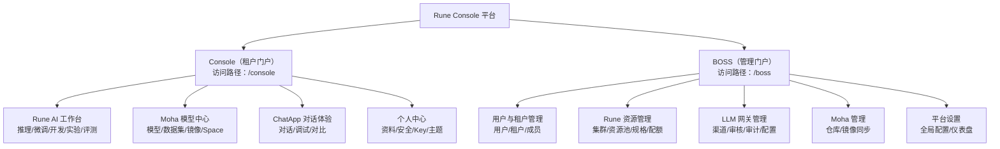

# 产品概述

## 什么是 Rune Console

**Rune Console** 是 **晓石AI（XiaoShi AI）** 推出的企业级 AI 平台统一操控中心。它为 AI 团队提供了从模型训练、微调、部署推理到在线对话体验的端到端工作流，并配备完善的多租户隔离、资源配额、权限体系和 LLM 统一网关，帮助企业安全、高效地管理 GPU/NPU 算力资源和 AI 模型资产。

Rune Console 由 **三大子产品** 和 **两大控制面** 组成，覆盖 AI 全生命周期中各类角色的需求。

---

## 三大子产品

### Rune — AI 工作台

Rune 是平台的核心计算引擎，面向 ML 工程师和数据科学家，提供丰富的 AI 工作负载管理能力：

| 功能模块 | 说明 | 典型使用场景 |
|---------|------|-------------|
| **推理服务** | 一键部署已训练好的模型，自动分配 GPU 资源，暴露 RESTful API 端点 | 部署 LLaMA、ChatGLM 等大语言模型提供在线推理 |
| **微调服务** | 基于预训练模型提交 SFT/LoRA 微调任务，跟踪训练指标 | 使用私有数据对基础模型进行领域微调 |
| **开发环境** | 启动 JupyterLab / VS Code Server / SSH 远程开发环境，支持 GPU 直连 | 交互式调试模型代码、数据探索 |
| **应用管理** | 部署和管理自定义 AI 应用（如 Web 演示、API 服务等） | 部署 Gradio/Streamlit 演示应用 |
| **实验管理** | 跟踪 ML 实验的参数、指标和产出物，对比不同实验 | 记录多轮超参搜索结果，选出最优配置 |
| **评测管理** | 对模型进行系统化的基准评测 | 使用标准评测集评估模型准确率/延迟 |
| **存储卷** | 提供 S3 兼容的持久化存储，可挂载到任意实例，内置文件管理器 | 存放模型权重、训练数据、Checkpoint |
| **应用市场** | 平台预置的应用模板库，支持一键部署 | 快速部署 vllm、TGI、LLaMA-Factory 等主流框架 |

> 💡 **提示**：所有工作负载类型（推理、微调、开发环境、应用、实验、评测）共享统一的部署流程：选择模板 → 配置参数 → 选择规格 → 提交部署。不同类型的差异体现在可选模板和参数配置上。

### Moha — 模型中心

Moha 是平台内置的 AI 资产仓库，提供类 HuggingFace 的模型/数据集/Space 管理体验，但面向企业私有部署：

| 功能模块 | 说明 | 典型使用场景 |
|---------|------|-------------|
| **模型管理** | Git 式版本控制，支持文件浏览、分支管理、Commit 历史、Pull Request | 管理和分发企业私有模型，控制模型版本迭代 |
| **数据集管理** | 数据集上传、版本管理、格式预览 | 管理训练和评测数据集 |
| **镜像仓库** | 容器镜像管理，支持安全扫描、可见性控制 | 管理自定义训练/推理容器镜像 |
| **Space** | 在线展示空间，支持 Gradio/Streamlit 等前端应用托管 | 打造模型体验 Demo 或交互式文档 |
| **组织管理** | 以组织为单位管理仓库和成员，支持角色分配 | 按团队/部门划分模型资产所有权 |
| **讨论与 PR** | 社区式讨论、代码审查与合并请求 | 模型版本评审和合并管理 |
| **镜像同步** | 从外部源（HuggingFace/ModelScope 等）自动同步模型与数据集 | 将公开模型自动同步到企业内网 |
| **收藏与评分** | 模型/数据集收藏和评分系统 | 帮助团队发现高质量的内部模型 |

> 💡 **提示**：Moha 的每一个仓库（模型/数据集/Space）都具有独立的 Git 仓库，支持 Git LFS 大文件存储，可通过 Web UI 或命令行操作。

### ChatApp — 对话体验

ChatApp 为业务人员和开发者提供即开即用的大模型对话窗口，无需编写任何代码即可体验已部署的 AI 模型：

| 功能模块 | 说明 | 典型使用场景 |
|---------|------|-------------|
| **AI 对话体验** | 选择模型和 API Key，与 AI 进行流式对话，支持深度思考（CoT） | 业务人员体验私有部署的大模型效果 |
| **对话调试** | 左侧参数面板 + 右侧对话区，实时调整 Temperature/TopP/MaxTokens 等参数 | 开发者调优 prompt 和参数以获得最佳输出 |
| **多模型对比** | 左右双栏并排对话，同一输入同时发送给两个模型，对比输出质量 | 评估不同模型（或不同版本）的回答质量 |
| **Token 管理** | 管理个人或团队的 API 访问令牌，设置用量限制和 IP 白名单 | 控制 API 调用频率和访问范围 |

> 💡 **提示**：ChatApp 的对话参数包括 Temperature（0-1.999）、Top P（0.1-1.0）、Max Tokens（0-32768）、System Prompt 和 Stop Words。还支持深度思考（Reasoning）模式，在流式响应中显示模型的推理链。

---

## 两大控制面

Rune Console 提供两个完全独立的管理界面，面向不同的用户群体和管理职责：

### Console — 租户门户

面向 **租户管理员、开发者和普通成员**。这是大多数用户的日常工作界面。

**核心职责**：
- 在分配的工作空间内部署和管理各类 AI 工作负载
- 管理模型、数据集等 AI 资产
- 通过 ChatApp 和 LLM Gateway API 体验和调用已部署的模型
- 管理个人账户信息、安全设置、API Key 和 SSH Key

**适用角色**：Tenant Admin、Developer、Member

### BOSS — 平台管理门户

面向 **平台管理员（System Admin）**。提供全局的平台运维和资源管理能力。

**核心职责**：
- 管理平台所有用户和租户的生命周期
- 管理 GPU/NPU 计算集群、资源池和 Flavor（硬件规格）
- 分配租户配额（GPU 数量、存储容量等）
- 管理 LLM 统一网关（渠道路由、内容审核、审计日志）
- 配置平台全局设置（登录方式、品牌、仪表盘等）

**适用角色**：仅 System Admin

### 职责矩阵

| 管理功能 | Console | BOSS |
|---------|:-------:|:----:|
| 部署推理/微调/开发环境 | ✅ | — |
| 管理模型/数据集/Space | ✅ | ✅（审计） |
| ChatApp 对话体验 | ✅ | — |
| 个人账户与安全设置 | ✅ | — |
| 工作空间 CRUD | ✅ | — |
| 用户注册与管理 | — | ✅ |
| 租户创建与配额分配 | — | ✅ |
| 集群纳管与资源池管理 | — | ✅ |
| Flavor（规格）管理 | — | ✅ |
| LLM 网关渠道配置 | — | ✅ |
| 内容审核策略 | — | ✅ |
| 审计日志查看 | — | ✅ |
| 平台全局设置 | — | ✅ |
| 动态仪表盘配置 | — | ✅ |

---

## 目标用户与使用场景

### ML 工程师 / 算法工程师

**典型操作**：
1. 在 Moha 上传私有模型 → 在 Rune 选择模型模板 → 部署推理服务 → 通过 API 调用
2. 提交微调任务 → 查看训练指标和日志 → 将微调后的模型注册到 Moha
3. 启动 JupyterLab 开发环境 → 挂载存储卷 → 交互式开发调试

**推荐使用**：Rune 工作台全部功能 + Moha 模型中心

### 数据科学家 / 数据工程师

**典型操作**：
1. 在 Moha 管理训练数据集 → 挂载到开发环境进行数据预处理
2. 提交实验任务 → 对比不同实验结果 → 选出最优配置实验
3. 使用评测功能对模型进行标准化评测

**推荐使用**：Moha 数据集管理 + 实验/评测 + 存储卷

### 平台管理员

**典型操作**：
1. 纳管 GPU 集群 → 创建资源池 → 定义 Flavor 规格 → 分配租户配额
2. 创建租户 → 邀请成员 → 分配角色
3. 配置 LLM 网关渠道 → 设置内容审核策略 → 监控 API 调用量

**推荐使用**：BOSS 全部功能

### 业务团队 / 产品经理

**典型操作**：
1. 通过 ChatApp 直接体验已部署的大模型
2. 使用对比模式评估不同模型的回答质量
3. 查看仪表盘了解模型用量和业务指标

**推荐使用**：ChatApp 对话体验 + 仪表盘

---

## 平台核心优势

| 优势 | 详细说明 |
|------|---------|
| **多租户隔离** | 平台 → 租户 → 工作空间三级隔离，每级独立的资源配额和成员权限，数据和资源互不干扰 |
| **GPU/NPU 智能调度** | 支持 NVIDIA GPU、华为 Ascend NPU、寒武纪 MLU 等多种加速卡，自动识别和调度 |
| **模型全生命周期** | 从模型开发、训练、微调到部署推理的端到端管理，模型版本基于 Git 管理 |
| **统一 LLM 网关** | 兼容 OpenAI API 格式的统一网关，支持多渠道路由、降级重试、限速、内容审核 |
| **灵活部署模板** | 应用市场预置主流框架模板（vLLM、TGI、LLaMA-Factory 等），也支持自定义 Helm Chart |
| **企业级安全** | RBAC 角色权限 + MFA 多因素认证 + API Key 管理 + IP 白名单 + 审计日志 |
| **内置文件管理** | S3 兼容对象存储，内置 Web 文件管理器支持上传/下载/预览/目录浏览 |
| **丰富的可观测性** | Prometheus 监控指标 + Loki 日志聚合 + 自定义仪表盘 + 事件流 |
| **中英双语** | 界面完整支持中文和英文切换，覆盖所有功能模块 |
| **开源技术栈** | 前端基于 React 19 + TypeScript + MUI 7 + Vite 6 构建，高性能现代化 |

---

## 平台能力总览

### 工作负载类型

| 类型 | 分类标识 | 说明 | 状态流转 |
|------|---------|------|---------|
| 推理服务 | `inference` | 模型在线推理部署 | Installed → Healthy / Unhealthy / Failed |
| 微调任务 | `tune` | 模型微调训练任务 | Installed → Healthy → Succeeded / Failed |
| 开发环境 | `im` | 交互式开发环境 | Installed → Healthy |
| 应用 | `app` | 自定义 AI 应用 | Installed → Healthy / Failed |
| 实验 | `experiment` | ML 实验追踪 | Installed → Healthy |
| 评测 | `evaluation` | 模型评测 | Installed → Healthy → Succeeded |

### 资源规格示例

| 规格名称 | CPU | 内存 | GPU | 适用场景 |
|---------|-----|------|-----|---------|
| cpu-4c8g | 4C | 8G | — | 数据处理、轻量任务 |
| gpu-a100-1 | 8C | 32G | 1× A100 40G | 中等模型推理 |
| gpu-a100-4 | 32C | 128G | 4× A100 80G | 大模型训练、推理 |
| gpu-a100-8 | 64C | 256G | 8× A100 80G | 超大模型分布式训练 |
| npu-910b-8 | 192C | 1.5T | 8× Ascend 910B | 国产化适配场景 |

> ⚠️ **注意**：实际可用规格取决于平台管理员在集群中配置的 Flavor，不同集群的可用规格可能不同。

---

## 环境要求

### 浏览器支持

| 浏览器 | 最低版本 | 推荐版本 |
|--------|---------|---------|
| Google Chrome | 90+ | 最新版 |
| Mozilla Firefox | 90+ | 最新版 |
| Microsoft Edge | 90+ | 最新版 |
| Safari | 15+ | 最新版 |
| Internet Explorer | ❌ 不支持 | — |

### 推荐屏幕分辨率

- **最佳**：1920 × 1080（全高清）及以上
- **最低**：1366 × 768
- **移动端**：支持基本浏览操作，完整功能请使用桌面浏览器

> 💡 **提示**：平台会在窄屏幕设备上显示「不适合移动端」提示，建议使用桌面设备进行日常操作。

---

## 下一步

| 推荐阅读 | 说明 |
|---------|------|
| [快速开始](./quick-start.md) | 从登录到部署第一个推理服务的完整指引 |
| [平台架构](./architecture.md) | 深入了解多租户架构、微服务和系统设计 |
| [术语表](./glossary.md) | 熟悉平台中的核心概念和术语 |
| [登录](../auth/login.md) | 了解登录流程和认证方式 |
| [推理服务](../console/rune/inference.md) | 直接查看推理服务的使用文档 |
