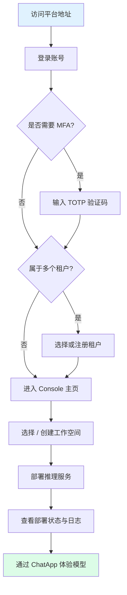
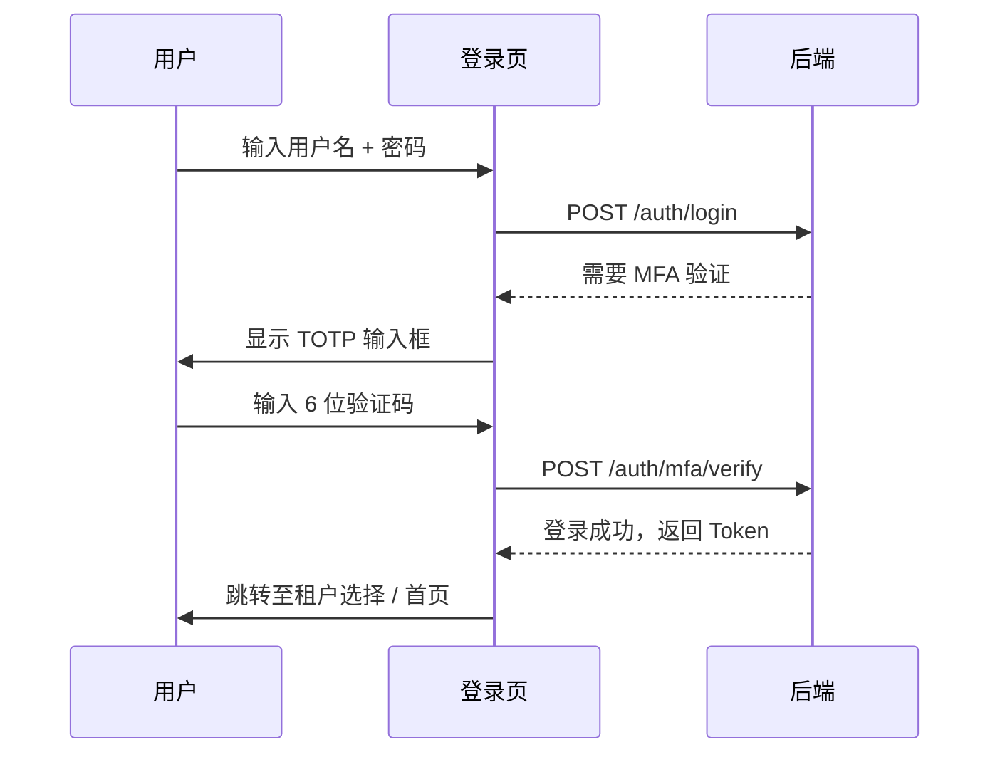
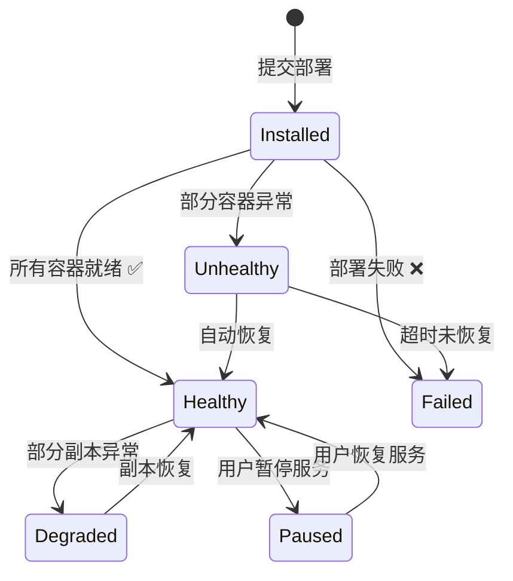

# 快速开始

本指南将带您从零开始，一步步完成 **登录 → 选择租户 → 熟悉界面 → 创建工作空间 → 部署推理服务 → 查看运行状态 → 体验 AI 对话** 的完整流程。即使您是第一次接触 Rune Console，也可以在 **15–30 分钟**内完成全部步骤。

---

## 全流程总览



---

## 前提条件

在开始之前，请确认您已满足以下条件：

| 条件 | 说明 |
|------|------|
| **浏览器** | Chrome ≥ 90、Firefox ≥ 88、Edge ≥ 90 或 Safari ≥ 15（推荐 Chrome 最新版） |
| **网络** | 能够访问平台域名（如 `https://your-domain/console`），确保无代理拦截 |
| **账号** | 已获取登录用户名和密码（由管理员分配或通过注册页面自行创建） |
| **MFA（可选）** | 若平台开启了多因素认证（MFA），请提前在手机上安装 **Google Authenticator**、**Microsoft Authenticator** 或其他兼容 TOTP 的应用 |

> 💡 提示: 如果您还没有账号，请联系平台管理员或访问注册页面 `/auth/register` 自助注册。注册流程详见 [注册账号](../auth/register.md)。

---

## Step 1：登录平台 {#step-login}

### 1.1 访问登录页

在浏览器地址栏输入平台地址，例如：

```
https://your-domain/console
```

系统会自动跳转到登录页面 `/auth/login`。


### 1.2 输入凭据

在登录表单中填写：

| 字段 | 说明 |
|------|------|
| **用户名** | 您的平台登录账号 |
| **密码** | 对应的登录密码 |

### 1.3 图形验证码

当平台检测到有安全风险时（例如多次登录失败、陌生 IP），登录表单下方会出现 **图形验证码**：

1. 查看验证码图片中显示的字符
2. 在输入框中正确填写验证码
3. 如果看不清，点击验证码图片即可 **刷新** 为新的验证码

> ⚠️ 注意: 验证码区分大小写，请仔细辨认。如果连续输入错误，系统可能暂时锁定登录，请等待几分钟后再尝试。


### 1.4 多因素认证（MFA / TOTP）

如果您的账户已绑定 MFA，输入用户名和密码后会进入 **MFA 验证页面**：

1. 打开手机上的 Authenticator 应用（如 Google Authenticator）
2. 找到 Rune Console 对应的条目
3. 输入当前显示的 **6 位动态验证码**（每 30 秒刷新一次）
4. 点击 **验证** 按钮完成登录



> 💡 提示: 如果您尚未绑定 MFA，但平台要求强制开启，系统会在首次登录时引导您扫描二维码完成绑定。请妥善保管恢复码，以防手机丢失。

> ⚠️ 注意: TOTP 验证码具有时效性（30 秒），请在验证码即将过期时等待下一个新码再输入，避免验证失败。

---

## Step 2：选择或创建租户 {#step-tenant}

### 2.1 什么是租户？

**租户（Tenant）** 是 Rune Console 中的顶层资源隔离单元。每个租户拥有独立的：

- 成员与角色权限
- 工作空间与资源配额
- 模型、数据集等资产
- 计费与用量统计

您可以把租户理解为一个 **"组织"** 或 **"团队"**。一个用户可以属于多个租户，但同一时间只能在一个租户下操作。

### 2.2 选择租户

如果您属于 **多个租户**，登录成功后系统会自动跳转到 **租户选择页面**：

1. 页面以列表形式展示您有权限访问的所有租户
2. 每个租户显示名称和描述信息
3. 点击目标租户即可进入


> 💡 提示: 如果您只属于一个租户，系统会 **自动跳过** 此步骤，直接进入控制台首页。

### 2.3 注册新租户

如果您是新用户，可能尚未加入任何租户。此时可以选择 **注册新租户**：

1. 在租户选择页面点击 **「注册新租户」** 按钮
2. 填写租户名称和描述
3. 提交后，您将自动成为该租户的 **管理员**
4. 系统随即跳转至控制台首页

> ⚠️ 注意: 注册新租户后需要平台管理员为该租户分配资源配额，否则您暂时无法创建工作空间或部署服务。请及时联系管理员。

---

## Step 3：熟悉 Console 布局 {#step-layout}

进入控制台后，您将看到如下整体布局：


### 3.1 顶部导航栏

顶部导航栏横贯整个页面，包含以下元素：

| 区域 | 说明 |
|------|------|
| **子产品标签页** | `Rune` · `Moha` · `ChatApp` 三个标签页，用于在子产品之间切换 |
| **语言切换** | 点击切换界面语言（中文 / English） |
| **主题切换** | 切换明亮 / 暗色主题 |
| **用户头像** | 点击展开下拉菜单，可访问个人中心、安全设置、切换租户、退出登录等 |

#### 三大子产品简介

- **Rune（AI 工作台）**：核心工作台，管理推理服务、微调任务、开发环境、实验、评测、应用等
- **Moha（模型中心）**：模型资产管理中心，管理模型、数据集、镜像、Spaces 等
- **ChatApp（对话体验）**：与已部署的 AI 模型进行对话交互，支持参数调优、模型对比等

### 3.2 左侧导航菜单

左侧导航菜单根据当前所在子产品动态变化：

**Rune 模块菜单示例：**

```
📊 仪表盘
📦 推理服务
🔧 微调服务
💻 开发环境
🧪 实验管理
📐 评测任务
🏪 应用市场
📁 存储卷
```

**Moha 模块菜单示例：**

```
🤖 模型管理
📊 数据集
🖼️ 镜像管理
🌐 Spaces
🏢 组织管理
```

### 3.3 工作空间选择器

在左侧菜单 **顶部**，有一个 **工作空间选择器**，由两个下拉选择框组成：

| 选择器 | 说明 |
|--------|------|
| **集群（Cluster）** | 选择您要操作的目标集群，不同集群拥有不同的计算资源 |
| **工作空间（Workspace）** | 在所选集群下，选择具体的工作空间 |

> 💡 提示: 工作空间是 Rune Console 中资源隔离和权限控制的基本单元。同一租户下可以创建多个工作空间，不同工作空间之间的服务和数据相互隔离。


---

## Step 4：选择或创建工作空间 {#step-workspace}

### 4.1 选择已有工作空间

如果管理员已经为您分配了工作空间，直接在工作空间选择器中下拉选择即可。

### 4.2 创建新工作空间

如果还没有工作空间，或者您希望创建一个新的独立空间：

1. 点击工作空间选择器旁的 **「+」** 按钮（或导航到工作空间管理页面）
2. 在弹出的创建表单中填写以下信息：

| 字段 | 必填 | 说明 | 校验规则 |
|------|------|------|----------|
| **名称** | ✅ | 工作空间的唯一标识 | 遵循 K8s 命名规范：仅允许小写字母 `a-z`、数字 `0-9` 和连字符 `-`；不能以连字符开头或结尾；最长 **63** 个字符 |
| **描述** | ❌ | 对该工作空间用途的简要说明 | 自由文本，可留空 |

3. 点击 **「创建」** 按钮
4. 创建成功后，工作空间选择器会自动切换到新建的工作空间

**名称示例：**

```
✅ 合法名称：my-workspace、team-a-dev、inference-prod-01
❌ 非法名称：My_Workspace（含大写和下划线）、-start-dash（以连字符开头）、workspace.test（含点号）
```

> ⚠️ 注意: 工作空间名称一旦创建 **不可修改**，请认真填写。名称将作为 K8s Namespace 的一部分，影响后续服务的 URL 路径。


---

## Step 5：部署第一个推理服务 {#step-deploy}

这是本教程的核心步骤。我们将完整演示如何从应用市场选择模板、配置参数并完成部署。

### 5.1 进入推理服务页面

1. 确认顶部标签页已切换到 **Rune**
2. 在左侧菜单点击 **「推理服务」**
3. 进入推理服务列表页面


### 5.2 发起部署

点击页面右上角的 **「部署」** 按钮，进入部署向导。

### 5.3 选择产品模板

部署的第一步是从 **应用市场（Marketplace）** 中选择一个产品模板：

- 模板以 **卡片（Card）** 形式展示，每张卡片包含：模板图标、名称、描述、类别标签
- 页面顶部有 **分类筛选器**，可按类别快速过滤：`全部` / `LLM 推理` / `向量数据库` / `图像生成` / `语音识别` 等
- 点击目标模板卡片进入配置页面


> 💡 提示: 如果您不确定选择哪个模板，推荐从 **vLLM** 或 **TGI（Text Generation Inference）** 开始，它们是最常用的 LLM 推理引擎。

### 5.4 配置基本信息

选择模板后进入配置页面，首先填写基本信息：

| 字段 | 必填 | 说明 |
|------|------|------|
| **名称** | ✅ | 实例名称，遵循 K8s 命名规范（小写字母、数字、连字符，最长 63 字符） |
| **描述** | ❌ | 本次部署的描述信息 |

### 5.5 选择模板版本

在 **版本选择器（VersionPopover）** 中选择要部署的模板版本：

- 下拉列表展示所有可用版本号（如 `v1.2.0`、`v1.1.3` 等）
- 通常建议选择 **最新稳定版**
- 不同版本可能对应不同的底层 Helm Chart 和默认参数

> 💡 提示: 版本号旁边可能会有标签标记，如 `latest`（最新）或 `recommended`（推荐），优先选择这些版本。

### 5.6 选择规格（Flavor）

**规格（Flavor）** 决定了服务实例的计算资源配置。选择页面以 **资源卡片** 形式展示：

| 规格类型 | 典型配置示例 | 适用场景 |
|----------|-------------|----------|
| **GPU 规格** | 1×A100 80GB、2×A100 80GB、4×A100 80GB | 大模型推理（7B、13B、70B 等） |
| **CPU 规格** | 4C8G、8C16G、16C32G | 轻量级服务或向量数据库 |

每张规格卡片显示：

- GPU 类型和数量（如 `NVIDIA A100 × 2`）
- CPU 核数和内存大小
- 可用库存状态


> ⚠️ 注意: 规格选择受 **工作空间配额** 限制。如果某个规格显示为灰色或不可选，说明当前工作空间的资源配额不足，请联系租户管理员调整配额。

### 5.7 配置动态参数

Rune Console 会根据 Helm Chart 中定义的 **JSON Schema** 自动生成参数配置表单（SchemaForm）。不同模板的参数各不相同，常见配置项包括：

| 参数 | 说明 | 示例值 |
|------|------|--------|
| **模型路径** | 模型文件在存储中的路径 | `/models/llama-2-7b-chat` |
| **最大序列长度** | 模型处理的最大 Token 数 | `4096` |
| **Tensor 并行数** | GPU 之间的并行切分数 | `2`（双卡时） |
| **量化方式** | 模型量化方法 | `awq` / `gptq` / `none` |
| **副本数** | 服务副本数 | `1` |

#### 表单模式与 JSON 编辑器切换

参数配置支持两种编辑模式，可通过页面上的 **切换按钮** 自由切换：

- **表单模式**（默认）：SchemaForm 自动渲染带有标签、描述和校验的表单控件，适合大多数用户
- **JSON 编辑器模式**：使用 Monaco Editor（VS Code 同款编辑器）直接编辑 JSON，适合高级用户或需要批量修改参数的场景

```json
{
  "model": {
    "path": "/models/llama-2-7b-chat",
    "maxSequenceLength": 4096,
    "tensorParallelSize": 2
  },
  "resources": {
    "replicas": 1
  }
}
```


> 💡 提示: 表单模式下，每个参数旁会有帮助图标 `ℹ️`，悬停可查看参数的详细说明和默认值。

### 5.8 挂载存储卷（可选）

如果您的模型文件存储在 **持久化存储卷（PVC）** 中，需要在部署时配置存储挂载：

1. 在部署表单中找到 **「存储挂载」** 部分
2. 点击 **「添加挂载」** 按钮
3. 选择已创建的存储卷
4. 指定挂载路径（如 `/models`）

| 字段 | 说明 |
|------|------|
| **存储卷** | 从下拉列表选择当前工作空间中已有的 PVC |
| **挂载路径** | 容器内的挂载路径，模型或数据将通过该路径访问 |
| **读写模式** | 只读 `ReadOnly` 或读写 `ReadWrite` |

> 💡 提示: 如果您还没有存储卷，需要先前往 **Rune → 存储卷** 页面创建，或者使用 Moha 模型管理中的模型引用功能。

### 5.9 配置环境变量（可选）

部分服务可能需要额外的环境变量配置：

1. 在部署表单中找到 **「环境变量」** 部分
2. 点击 **「添加变量」** 按钮
3. 输入键值对

```
HUGGING_FACE_HUB_TOKEN = hf_xxxxxxxxxxxx
CUDA_VISIBLE_DEVICES   = 0,1
```

### 5.10 提交部署

所有参数确认无误后：

1. 点击页面底部的 **「提交」** 按钮
2. 系统开始创建推理服务实例
3. 页面自动跳转至 **实例详情页**
4. 初始状态为 `Installed`，等待容器拉取镜像和启动



> ⚠️ 注意: 首次部署可能需要较长时间（5–15 分钟），因为系统需要拉取容器镜像。后续部署如果镜像已缓存，启动速度会显著加快。

---

## Step 6：查看部署状态和日志 {#step-status}

部署提交后，系统自动跳转到 **实例详情页面**，该页面包含多个标签页，提供全方位的运行监控。

### 6.1 概览标签页（Overview）

概览标签页是实例详情的默认页面，包含两大核心组件：

#### ServiceInfoCard — 服务信息卡片

展示服务的关键概要信息：

| 信息项 | 说明 |
|--------|------|
| **名称** | 服务实例名称 |
| **状态** | 当前运行状态（`Healthy` / `Unhealthy` / `Failed` / `Degraded` / `Paused`） |
| **访问端点** | 服务的 API 访问地址（Endpoint URL） |
| **资源规格** | 使用的 GPU/CPU 规格信息 |
| **模板版本** | 对应的产品模板和版本号 |
| **创建时间** | 服务创建的时间戳 |

#### InstancePodList — 容器实例列表

展示该服务下所有容器（Pod）的运行详情：

| 列 | 说明 |
|----|------|
| **Pod 名称** | 容器名称标识 |
| **状态** | `Running`、`Pending`、`CrashLoopBackOff`、`ImagePullBackOff` 等 |
| **重启次数** | 容器重启的累计次数 |
| **运行时长** | 容器已运行的时长 |
| **节点** | 容器所在的物理/虚拟节点 |


### 6.2 监控标签页（Monitoring）

展示服务运行的实时和历史指标图表：

- **GPU 利用率**：显示各 GPU 的使用百分比
- **GPU 显存使用量**：已使用 / 总显存
- **CPU 使用率**：CPU 核心使用百分比
- **内存使用量**：内存消耗趋势图
- **网络流量**：入站 / 出站流量
- **请求吞吐量**：每秒请求数（RPS）
- **请求延迟**：P50 / P95 / P99 延迟分布

> 💡 提示: 您可以调整监控图表的时间范围（最近 15 分钟、1 小时、6 小时、24 小时、7 天等），以查看不同时间粒度的趋势。

### 6.3 日志标签页（Logging）

日志查看器（LogViewer）支持两种模式：

| 模式 | 说明 | 适用场景 |
|------|------|----------|
| **查询模式（Query）** | 按时间范围检索历史日志，支持关键词搜索和过滤 | 排查过去发生的问题 |
| **流式模式（Stream）** | 实时推送最新日志，类似 `kubectl logs -f` | 实时监控服务输出 |

日志操作技巧：

- 使用关键词搜索快速定位错误信息（如搜索 `error`、`OOM`、`CUDA`）
- 选择特定容器查看（如 `main` 容器或 `sidecar` 容器）
- 支持日志下载导出


### 6.4 事件标签页（Events）

展示与该实例相关的 Kubernetes 事件流：

- 镜像拉取事件（`Pulling image...`、`Successfully pulled image...`）
- 调度事件（`Scheduled to node xxx`）
- 健康检查事件
- 异常告警事件

> 💡 提示: 部署失败时，**事件标签页** 通常是排查问题的第一站点。重点关注 `Warning` 类型的事件。

### 6.5 暂停与恢复服务

Rune Console 支持 **暂停** 和 **恢复** 推理服务。暂停后，服务会释放计算资源（GPU/CPU），但保留配置信息，方便后续一键恢复。

- **暂停**：在实例详情页或列表页点击 **「暂停」** 按钮，系统通过设置 `values.global.paused = true` 来释放资源
- **恢复**：在已暂停的实例上点击 **「恢复」** 按钮，服务将重新分配资源并启动

> 💡 提示: 在不使用服务时暂停，可以有效节省 GPU 资源配额，将资源让给其他团队成员使用。

---

## Step 7：通过 ChatApp 体验模型 {#step-chatapp}

推理服务部署成功且状态变为 `Healthy` 后，您可以通过 **ChatApp** 子产品直接与模型进行对话交互。

### 7.1 进入 ChatApp

1. 点击顶部导航栏的 **「ChatApp」** 标签页
2. 进入对话体验页面

### 7.2 选择模型

在对话页面的顶部或侧面板中：

1. 点击 **模型选择下拉框**
2. 从列表中选择您刚刚部署的推理服务（列表展示当前租户下所有已部署且状态为 Healthy 的模型）
3. 选中后就可以开始对话


### 7.3 配置 API Key

ChatApp 需要通过 API Key 认证才能调用模型接口：

1. 在对话页面找到 **API Key** 选择器
2. 从下拉列表中选择已有的 API Key
3. 如果没有可用的 Key，前往 **个人中心 → API Key 管理** 创建

> ⚠️ 注意: API Key 具有权限范围，确保所选的 Key 有权限访问目标模型。

### 7.4 调整推理参数

在对话界面的侧面板中，您可以调整以下推理参数来控制模型输出行为：

| 参数 | 默认值 | 取值范围 | 说明 |
|------|--------|----------|------|
| **Temperature** | `0.7` | `0.0 – 2.0` | 控制输出随机性。值越小越确定（适合代码生成），值越大越多样（适合创意写作） |
| **Top P** | `1.0` | `0.0 – 1.0` | 核采样概率阈值。与 Temperature 配合使用，通常修改其中一个即可 |
| **Max Tokens** | `2048` | `1 – 模型最大值` | 单次回复的最大 Token 数。增大此值可获得更长的回答 |
| **System Prompt** | 空 | 自由文本 | 系统提示词，用于设定模型的角色和行为指令 |

**System Prompt 示例：**

```
你是一个专业的 AI 助手，擅长回答技术问题。
请用简洁准确的中文作答，适当使用代码示例。
```


### 7.5 开始对话

1. 在底部输入框中 **输入您的消息**
2. 点击 **发送** 按钮（或按 `Enter` 键）
3. 模型将以 **流式（Streaming）** 方式逐字返回回复
4. 回复完成后可以继续追问，形成多轮对话

### 7.6 深度思考模式

ChatApp 支持 **深度思考（Deep Thinking）** 功能（需要模型支持）：

1. 在对话界面找到 **「深度思考」** 开关
2. 开启后，模型会展示推理过程（Reasoning），类似于 "思考链" 输出
3. 可以通过 `reasoning_effort` 参数调节思考深度：
   - `low`：快速回答，减少思考步骤
   - `medium`：平衡模式
   - `high`：深度推理，适合复杂数学或逻辑问题

> 💡 提示: 深度思考模式会增加响应时间和 Token 消耗，建议仅在需要复杂推理时开启。

---

## 常见问题排查 {#troubleshooting}

### 登录相关

| 问题 | 可能原因 | 解决方法 |
|------|----------|----------|
| 无法访问登录页面 | 网络不通或域名解析失败 | 检查网络连接、DNS 配置，尝试 `ping your-domain` |
| 用户名或密码错误 | 凭据输入有误 | 确认大小写，尝试重置密码 |
| MFA 验证码无效 | 手机时间不同步 | 确保手机系统时间与网络时间一致（自动同步） |
| 账号被锁定 | 多次输入错误密码 | 等待锁定期结束（通常 15 分钟），或联系管理员解锁 |

### 部署相关

| 问题 | 可能原因 | 解决方法 |
|------|----------|----------|
| 无法选择规格 | 工作空间配额不足 | 联系租户管理员增加配额 |
| 部署后长时间 `Installed` | 镜像拉取缓慢或失败 | 查看事件标签页，确认镜像地址正确且网络可达 |
| 状态变为 `Failed` | 容器启动失败 | 查看日志标签页，常见原因：GPU 内存不足（OOM）、模型文件不存在 |
| 状态变为 `Unhealthy` | 健康检查失败 | 查看容器日志，确认服务端口和健康检查路径配置正确 |
| `CrashLoopBackOff` | 容器反复崩溃重启 | 检查日志中的错误信息，常见：CUDA 版本不匹配、模型加载失败 |

### ChatApp 相关

| 问题 | 可能原因 | 解决方法 |
|------|----------|----------|
| 模型列表为空 | 没有 Healthy 状态的推理服务 | 确认推理服务已成功部署且状态为 `Healthy` |
| 对话无响应 | API Key 无效或权限不足 | 更换 API Key 或联系管理员授权 |
| 响应被截断 | Max Tokens 设置过小 | 增大 Max Tokens 参数值 |
| 响应质量差 | 参数设置不合理 | 调整 Temperature（降低可提升准确度）、完善 System Prompt |

---

## 常用操作速查表

| 操作 | 入口路径 | 说明 |
|------|----------|------|
| 部署推理服务 | `Rune → 推理服务 → 部署` | 从市场模板部署新的推理服务 |
| 创建微调任务 | `Rune → 微调服务 → 创建` | 对基座模型进行指令微调 |
| 启动开发环境 | `Rune → 开发环境 → 启动` | 启动 JupyterLab / VS Code Server |
| 管理存储卷 | `Rune → 存储卷 → 创建` | 创建持久化存储用于模型和数据 |
| 上传模型 | `Moha → 模型 → 新建` | 上传或注册模型到模型中心 |
| 管理数据集 | `Moha → 数据集 → 新建` | 上传训练或评测数据集 |
| AI 对话体验 | `ChatApp → 对话体验` | 与已部署模型进行对话 |
| 模型对比 | `ChatApp → 对比评测` | 多模型并排对话对比 |
| 个人设置 | `右上角头像 → 个人中心` | 修改密码、绑定 MFA、管理 API Key |
| 切换租户 | `右上角头像 → 切换租户` | 在多个租户之间切换 |
| 切换主题 | `顶部导航栏 → 主题图标` | 明亮 / 暗色模式切换 |

---

## 后续推荐阅读

完成快速入门后，建议按照以下顺序继续深入学习：

| 章节 | 链接 | 说明 |
|------|------|------|
| 平台架构 | [平台架构总览](./architecture.md) | 了解多租户、集群、工作空间的层级关系和资源模型 |
| 核心概念 | [术语表](./glossary.md) | 熟悉平台中的专业术语和核心概念 |
| 推理服务 | [推理服务详细指南](../console/rune/inference.md) | 深入了解推理服务的高级配置、弹性伸缩和运维管理 |
| 微调任务 | [微调服务指南](../console/rune/finetune.md) | 学习如何对基座模型进行 LoRA / Full 微调 |
| 开发环境 | [开发环境指南](../console/rune/devenv.md) | 使用 JupyterLab 或 VS Code Server 进行交互开发 |
| 模型管理 | [模型中心](../console/moha/model.md) | 学习模型的上传、版本管理和共享 |
| 角色与权限 | [权限说明](../auth/roles.md) | 了解您的角色权限范围和权限申请流程 |
| API 参考 | [API 概览](../reference/api-overview.md) | 通过 API 编程式管理平台资源 |
| 常见问题 | [FAQ](../reference/faq.md) | 查阅常见问题与解答 |
