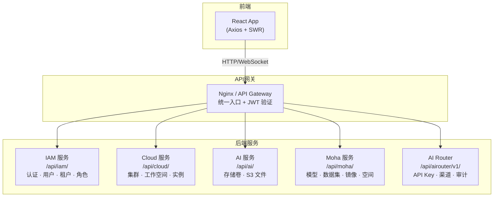
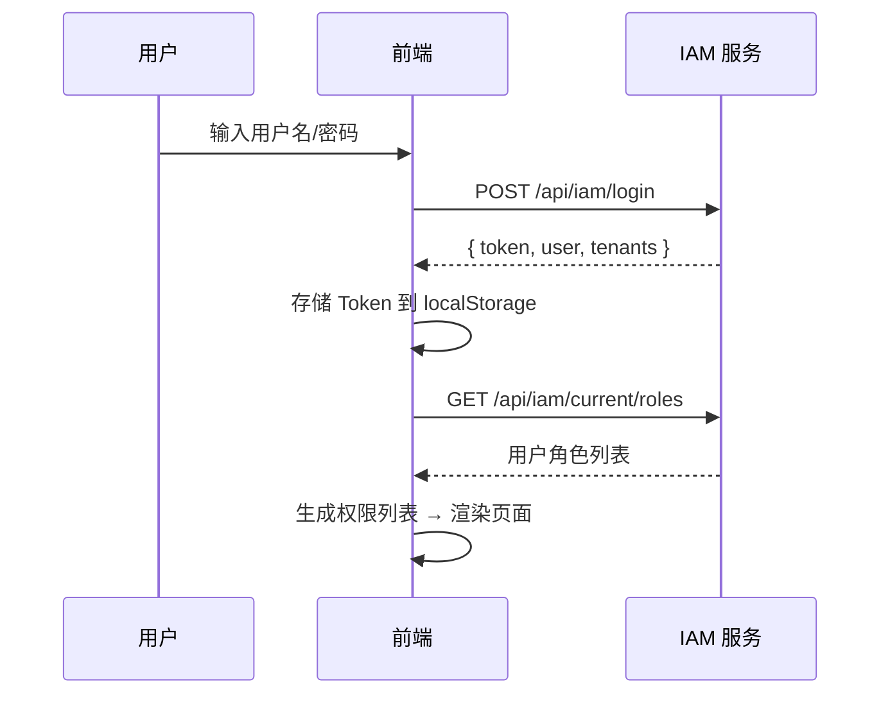

# API 服务层概览

Rune Console 前端通过 **5 个核心后端服务域 + 1 个文件代理** 与后端通信。所有请求基于 **Axios + SWR** 架构——每个 service 函数返回一个 `Request<T>` 配置对象，由 `useCacheFetch`（SWR 缓存读取）或 `useFetch`（手动触发写操作）驱动执行。

---

## 架构总览



### 请求架构流程

```mermaid
sequenceDiagram
    participant C as 前端组件
    participant S as Service 函数
    participant H as useCacheFetch / useFetch
    participant A as Axios 实例
    participant B as 后端 API

    C->>S: 调用 service 函数
    S-->>C: 返回 Request&lt;T&gt; 配置
    C->>H: 传入 Request&lt;T&gt;
    H->>A: 发送 HTTP 请求
    A->>A: 注入 Authorization / X-Tenant 等 Header
    A->>B: HTTP 请求
    B-->>A: JSON 响应
    A-->>H: 响应数据
    H-->>C: data / error / loading
```

---

## 认证与通用请求头

所有 API 请求需携带以下 Header：

| Header | 说明 | 示例值 | 必须 |
|--------|------|--------|:---:|
| `Authorization` | JWT 认证令牌 | `Bearer eyJhbGci...` | ✅ |
| `Content-Type` | 请求体格式 | `application/json` | ✅ |
| `X-Tenant` | 当前操作的租户 ID | `tenant-abc123` | 按需 |
| `X-Workspace` | 当前操作的工作空间 ID | `ws-dev-001` | 按需 |

> 💡 提示: JWT Token 通过登录接口 `POST /api/iam/login` 获取，存储在浏览器 `localStorage` 中。Token 过期后前端会自动重定向到登录页。

### 认证流程



---

## 错误响应格式

所有后端服务使用统一的错误响应格式：

```typescript
interface APIError {
  error?: string;       // 错误类型标识
  message: string;      // 可读的错误描述
  status?: 'Failure' | 'Success';  // 状态标识
  code?: string;        // 错误码
  reason?: string;      // 错误原因
}
```

### 常见 HTTP 状态码

| 状态码 | 含义 | 前端处理 |
|--------|------|---------|
| `200` | 请求成功 | 正常处理响应数据 |
| `201` | 创建成功 | 提示创建成功，刷新列表 |
| `204` | 删除成功（无响应体） | 提示删除成功，刷新列表 |
| `400` | 请求参数错误 | 显示错误信息，提示修正 |
| `401` | 未认证 / Token 过期 | 重定向到登录页 |
| `403` | 无权限 | 显示 403 页面 |
| `404` | 资源不存在 | 显示 404 页面 |
| `409` | 资源冲突（名称重复等） | 提示资源已存在 |
| `422` | 验证失败 | 显示字段级错误 |
| `429` | 请求频率超限 | 提示稍后重试 |
| `500` | 服务器内部错误 | 显示通用错误提示 |

### 错误响应示例

```json
{
  "status": "Failure",
  "message": "实例名称 'my-instance' 已存在",
  "reason": "AlreadyExists",
  "code": "409"
}
```

---

## 通用数据结构

### ObjectMeta — 对象元数据

所有 REST 资源对象的基础结构：

```typescript
interface ObjectMeta {
  id: string;                          // 唯一标识符
  name?: string;                       // 资源名称（唯一键）
  uid?: string;                        // 全局唯一 ID
  apiVersion?: string;                 // API 版本
  scopes?: Array<Scope>;               // 作用域信息
  resource?: string;                   // 资源类型
  resourceVersion?: number;            // 乐观锁版本号
  creationTimestamp?: Date;            // 创建时间（ISO 8601）
  deletionTimestamp?: Date;            // 删除时间（软删除标记）
  labels?: Record<string, string>;     // 标签
  annotations?: Record<string, string>;// 注解
  finalizers?: Array<string>;          // 终结器
  ownerReferences?: Array<OwnerReference>; // 所有者引用
  description?: string;               // 描述
  alias?: string;                      // 别名 / 显示名
}
```

> 💡 提示: K8s 原生资源使用 `ObjectMetadata` 类型（含 `namespace`、`kind` 等字段），平台自定义资源使用 `ObjectMeta` 类型（含 `id`、`scopes` 等字段）。两者结构略有差异但用途一致。

### K8s ObjectMetadata

K8s 代理层返回的资源使用标准 Kubernetes 元数据结构：

```typescript
interface ObjectMetadata {
  apiVersion?: string;
  kind?: string;
  name: string;
  namespace?: string;
  uid?: string;
  resourceVersion?: string;
  creationTimestamp?: Date;
  deletionTimestamp?: Date;
  labels?: Record<string, string>;
  annotations?: Record<string, string>;
  finalizers?: Array<string>;
  ownerReferences?: Array<OwnerReference>;
  description?: string;
  alias?: string;
  generateName?: string;
  clusterName?: string;
  selfLink?: string;
}
```

### Status 模式 — 资源状态

资源状态采用 `phase + conditions[]` 的模式：

```typescript
interface ObjectStatus {
  phase?: string;           // 当前阶段：Pending, Running, Succeeded, Failed, Unknown
  message?: string;         // 人类可读的状态消息
  conditions?: Condition[]; // 详细的条件列表
}

interface Condition {
  type: string;             // 条件类型，如 "Ready", "Available"
  status: string;           // "True", "False", "Unknown"
  lastTransitionTime?: Date;// 最后转换时间
  lastHeartbeatTime?: Date; // 最后心跳时间
  reason?: string;          // 机器可读原因，如 "ImagePullBackOff"
  message?: string;         // 人类可读消息
}
```

#### 常见 phase 值

| 资源类型 | 可能的 phase | 说明 |
|---------|-------------|------|
| Instance | `Pending` → `Running` → `Succeeded` / `Failed` | 实例生命周期 |
| StorageVolume | `Pending` → `Bound` → `Released` | 存储卷绑定状态 |
| Workspace | `Active` / `Terminating` | 工作空间状态 |

### 分页请求与响应

```typescript
// 请求参数
interface PageRequest {
  page?: number;           // 页码，从 1 开始（默认 1）
  size?: number;           // 每页条数（默认 20）
  continue?: string;       // 游标分页 token（K8s 风格）
  sort?: string;           // 排序字段，如 "creationTimestamp"，前缀 "-" 表示降序
  search?: string;         // 全文搜索
  fieldSelector?: string;  // 字段过滤，如 "status.phase=Running"
  labelSelector?: string;  // 标签过滤，如 "app=nginx,env=prod"
}

// 响应结构
interface Page<T> {
  page?: number;     // 当前页码
  size?: number;     // 每页条数
  total?: number;    // 总记录数
  continue?: string; // 下一页游标 token
  items?: Array<T>;  // 数据列表
}
```

> ⚠️ 注意: K8s 代理层 API（如 Pod、Service 等原生资源）使用 `continue` 游标分页；平台自定义 API（如租户、用户等）使用 `page/size` 数字分页。两种方式不可混用。

---

## IAM 域 `/api/iam/`

身份认证、用户管理、租户管理、角色管理、全局配置。

### 认证类

| 方法 | 端点 | 说明 | 请求体 / 参数 |
|------|------|------|-------------|
| `POST` | `/login` | 用户登录 | `{ username, password, captcha? }` |
| `POST` | `/logout` | 用户退出 | — |
| `POST` | `/register` | 用户注册 | `{ username, password, email?, phone? }` |
| `GET` | `/login-config` | 获取登录页配置 | — |
| `GET` | `/captcha` | 获取图形验证码 | 返回验证码 ID + 图片 |
| `POST` | `/verify-captcha` | 验证图形验证码 | `{ id, code }` |
| `POST` | `/reset-password` | 重置密码 | `{ token, newPassword }` |

### 当前用户 (Account)

| 方法 | 端点 | 说明 |
|------|------|------|
| `GET` | `/current/profile` | 获取当前用户信息 |
| `PATCH` | `/current/profile` | 更新当前用户信息 |
| `PUT` | `/current/password` | 修改密码 |
| `GET` | `/current/roles` | 获取当前用户所有角色 |
| `POST` | `/current/apikeys` | 创建 API Key |
| `GET` | `/current/apikeys` | 列出 API Key |
| `DELETE` | `/current/apikeys/{id}` | 删除 API Key |
| `POST` | `/current/sshkeys` | 添加 SSH Key |
| `GET` | `/current/sshkeys` | 列出 SSH Key |
| `DELETE` | `/current/sshkeys/{fingerprint}` | 删除 SSH Key |
| `POST` | `/init-mfa` | 初始化 MFA（返回 TOTP 密钥和二维码） |
| `POST` | `/enable-mfa` | 启用 MFA |
| `POST` | `/disable-mfa` | 禁用 MFA |
| `GET` | `/current/preferences` | 获取用户偏好设置 |
| `PUT` | `/current/preferences` | 更新用户偏好设置 |

### 用户管理（管理员）

| 方法 | 端点 | 说明 |
|------|------|------|
| `GET` | `/users` | 列出所有用户 |
| `POST` | `/users` | 创建用户 |
| `GET` | `/users/{name}` | 获取用户详情 |
| `PUT` | `/users/{name}` | 更新用户信息 |
| `DELETE` | `/users/{name}` | 删除用户 |
| `POST` | `/users/{name}/password` | 管理员重置用户密码 |
| `POST` | `/users/{name}/disable-mfa` | 管理员解绑用户 MFA |

### 租户管理

| 方法 | 端点 | 说明 |
|------|------|------|
| `GET` | `/tenants` | 列出所有租户 |
| `POST` | `/tenants` | 创建租户 |
| `GET` | `/tenants/{id}` | 获取租户详情 |
| `PUT` | `/tenants/{id}` | 更新租户信息 |
| `DELETE` | `/tenants/{id}` | 删除租户 |
| `POST` | `/tenant-register` | 用户自助注册租户 |

### 租户成员与角色

| 方法 | 端点 | 说明 |
|------|------|------|
| `GET` | `/tenants/{tenant}/members` | 列出租户成员 |
| `POST` | `/tenants/{tenant}/members` | 添加租户成员 |
| `GET` | `/tenants/{tenant}/members/{member}` | 获取成员信息 |
| `PUT` | `/tenants/{tenant}/members/{member}` | 更新成员角色 |
| `DELETE` | `/tenants/{tenant}/members/{member}` | 移除成员 |
| `GET` | `/tenants/{tenant}/roles` | 列出租户可用角色 |

### 系统成员与角色

| 方法 | 端点 | 说明 |
|------|------|------|
| `GET` | `/members` | 列出系统成员 |
| `PUT` | `/members/{member}` | 更新系统成员角色 |
| `DELETE` | `/members/{member}` | 移除系统成员 |
| `GET` | `/roles` | 列出系统角色 |

### 全局配置

| 方法 | 端点 | 说明 |
|------|------|------|
| `GET` | `/global-config` | 获取平台全局配置 |
| `PUT` | `/global-config` | 更新全局配置 |
| `POST` | `/logo/avatar` | 上传平台 Logo |

---

## Cloud 域 `/api/cloud/`

K8s 集群基础设施管理，包含三层路径结构。

### URL 路径结构

```
/api/cloud/
├── clusters/                                          # 集群级
│   └── {cluster}/
│       ├── resourcepools/                             # 资源池
│       ├── schedulers/                                # 调度器
│       ├── monitoring/                                # 集群监控
│       ├── logging/                                   # 集群日志
│       └── tenants/{tenant}/                          # 租户级
│           ├── workspaces/                            # 工作空间
│           │   └── {workspace}/
│           │       ├── instances/                     # 实例
│           │       ├── members/                       # 工作空间成员
│           │       ├── logging/                       # 工作空间日志
│           │       └── {group}/{version}/{resource}/  # K8s 资源代理
│           ├── quotas/                                # 租户配额
│           └── flavors/                               # Flavor
└── tenants/{tenant}/clusters/{cluster}/...            # 等效路径
```

### 集群管理

| 方法 | 端点 | 说明 |
|------|------|------|
| `GET` | `/clusters` | 列出所有集群 |
| `POST` | `/clusters` | 注册集群 |
| `GET` | `/clusters/{id}` | 获取集群详情 |
| `PUT` | `/clusters/{id}` | 更新集群配置 |
| `DELETE` | `/clusters/{id}` | 移除集群 |

> 💡 提示: 集群的创建/更新操作支持 `?dry-run=true` 参数，用于校验配置而不实际执行。

### 工作空间管理

| 方法 | 端点 | 说明 |
|------|------|------|
| `GET` | `.../workspaces` | 列出工作空间 |
| `POST` | `.../workspaces` | 创建工作空间 |
| `GET` | `.../workspaces/{id}` | 获取工作空间详情 |
| `PUT` | `.../workspaces/{id}` | 更新工作空间 |
| `DELETE` | `.../workspaces/{id}` | 删除工作空间 |

### 实例管理

实例（Instance）是 Rune 最核心的资源，覆盖推理服务、开发环境、模型微调三种类型。

| 方法 | 端点 | 说明 |
|------|------|------|
| `GET` | `.../instances` | 列出实例 |
| `POST` | `.../instances` | 创建实例 |
| `GET` | `.../instances/{id}` | 获取实例详情 |
| `PUT` | `.../instances/{id}` | 更新实例 |
| `DELETE` | `.../instances/{id}` | 删除实例 |
| `POST` | `.../instances/{id}/stop` | 停止实例 |
| `POST` | `.../instances/{id}/resume` | 恢复实例 |
| `POST` | `.../instances/{id}/decrypt` | 解密实例敏感信息 |
| `GET` | `.../instances/{id}/dashboard` | 获取实例仪表盘 |
| `GET` | `.../instances/{id}/metrics` | 获取实例指标 |
| `GET` | `.../instances/{id}/events` | 获取实例事件 |
| `GET` | `.../instances/{id}/logs` | 获取实例日志 |

#### 实例完整 URL 示例

```
GET /api/cloud/tenants/acme/clusters/gpu-cluster-1/workspaces/ws-dev/instances/my-inference
```

### Flavor（规格）管理

Flavor 定义了实例可用的硬件资源分配：

| 方法 | 端点 | 说明 |
|------|------|------|
| `GET` | `/clusters/{c}/flavors` | 集群级 Flavor 列表 |
| `GET` | `.../tenants/{t}/flavors` | 租户级 Flavor 列表 |
| `GET` | `.../workspaces/{w}/flavors` | 工作空间级 Flavor 列表 |
| `POST` | `/clusters/{c}/flavors` | 创建 Flavor |
| `PUT` | `/clusters/{c}/flavors/{id}` | 更新 Flavor |
| `DELETE` | `/clusters/{c}/flavors/{id}` | 删除 Flavor |

### 配额管理

| 方法 | 端点 | 说明 |
|------|------|------|
| `GET` | `/clusters/{c}/quotas` | 集群配额 |
| `GET` | `.../tenants/{t}/quotas` | 租户配额 |
| `GET` | `.../workspaces/{w}/quotas` | 工作空间配额 |
| `PUT` | `.../quotas/{id}` | 更新配额限制 |

### 资源池

| 方法 | 端点 | 说明 |
|------|------|------|
| `GET` | `/clusters/{c}/resourcepools` | 列出资源池 |
| `POST` | `/clusters/{c}/resourcepools` | 创建资源池 |
| `PUT` | `/clusters/{c}/resourcepools/{id}` | 更新资源池 |
| `DELETE` | `/clusters/{c}/resourcepools/{id}` | 删除资源池 |

### 应用模板 / 应用市场

| 方法 | 端点 | 说明 |
|------|------|------|
| `GET` | `/admin-products` | 管理员模板列表 |
| `GET` | `/products` | 用户端模板列表 |
| `GET` | `/system-products` | 系统内置模板 |
| `POST` | `/admin-products` | 上传新模板 |
| `PUT` | `/admin-products/{id}` | 更新模板 |
| `DELETE` | `/admin-products/{id}` | 删除模板 |
| `GET` | `/admin-products/{id}/versions` | 获取 Chart 版本列表 |
| `POST` | `/admin-products/{id}/versions` | 上传新版本 |

### LLM 网关服务注册

| 方法 | 端点 | 说明 |
|------|------|------|
| `GET` | `.../service-registrations` | 列出已注册的推理服务 |
| `POST` | `.../service-registrations` | 注册推理服务到网关 |
| `PUT` | `.../service-registrations/{id}` | 更新服务注册 |
| `DELETE` | `.../service-registrations/{id}` | 取消注册 |
| `PUT` | `.../service-registrations/{id}/access-level` | 更新访问级别（公开/私有） |

### K8s 资源代理

Cloud 域提供通用的 Kubernetes 资源代理接口：

```
GET/POST/PUT/PATCH/DELETE
  .../workspaces/{ws}/{group}/{version}[/namespaces/{ns}]/{resource}[/{name}]
```

**常用 K8s 资源访问**：

| 资源 | 路径示例 |
|------|---------|
| Pod | `.../core/v1/namespaces/{ns}/pods/{name}` |
| Service | `.../core/v1/namespaces/{ns}/services/{name}` |
| Deployment | `.../apps/v1/namespaces/{ns}/deployments/{name}` |
| PVC | `.../core/v1/namespaces/{ns}/persistentvolumeclaims/{name}` |
| Ingress | `.../networking.k8s.io/v1/namespaces/{ns}/ingresses/{name}` |

### 监控

| 方法 | 端点 | 说明 |
|------|------|------|
| `GET` | `/clusters/{c}/monitoring/dashboards` | 获取集群仪表盘列表 |
| `POST` | `/clusters/{c}/monitoring/query` | 执行监控查询 |
| `GET` | `/clusters/{c}/monitoring/dynamic-dashboards` | 动态仪表盘配置和数据 |

### 日志查询（Loki）

| 方法 | 端点 | 说明 | 协议 |
|------|------|------|------|
| `GET` | `.../logging/query` | 查询历史日志 | HTTP |
| `GET` | `.../logging/labels` | 获取日志标签 | HTTP |
| `GET` | `.../logging/series` | 查询日志序列 | HTTP |
| `GET` | `.../logging/stream` | **实时日志流** | **WebSocket** |

---

## AI 域 `/api/ai/`

存储卷管理与文件操作代理。

### 存储卷管理

| 方法 | 端点 | 说明 |
|------|------|------|
| `GET` | `.../storagevolumes` | 列出存储卷 |
| `POST` | `.../storagevolumes` | 创建存储卷 |
| `GET` | `.../storagevolumes/{id}` | 获取存储卷详情 |
| `PUT` | `.../storagevolumes/{id}` | 更新存储卷 |
| `DELETE` | `.../storagevolumes/{id}` | 删除存储卷 |
| `GET` | `.../storage-jobs` | 列出存储任务（导入/导出） |
| `POST` | `.../storage-jobs` | 创建存储任务 |

### S3 文件代理

通过代理层直接操作存储卷中的文件，无需直接访问 S3：

```
/api/ai/tenants/{tenant}/clusters/{cluster}/workspaces/{workspace}/storagevolumes/{sv}/files/
```

| 方法 | 端点 | 说明 |
|------|------|------|
| `GET` | `.../files/?prefix={path}` | 列出文件/目录 |
| `POST` | `.../files/upload` | 上传文件（multipart/form-data） |
| `GET` | `.../files/download?key={path}` | 下载文件 |
| `DELETE` | `.../files/?key={path}` | 删除文件 |

> ⚠️ 注意: 大文件上传使用 multipart 分片上传协议。浏览器页面必须保持打开，否则上传中断。超过 10GB 的文件推荐使用对象存储 CLI 工具（如 `s3cmd` 或 `mc`）直接上传。

---

## Moha 域 `/api/moha/`

AI 资产仓库管理：模型库、数据集、Space 应用、容器镜像。

### 仓库类型

| 类型标识 | 说明 | 路径前缀 |
|---------|------|---------|
| `models` | 模型仓库 | `/api/moha/organizations/{org}/models/{repo}/` |
| `datasets` | 数据集仓库 | `/api/moha/organizations/{org}/datasets/{repo}/` |
| `spaces` | Space 应用 | `/api/moha/organizations/{org}/spaces/{repo}/` |

### 仓库管理

| 方法 | 端点 | 说明 |
|------|------|------|
| `GET` | `/organizations/{org}/{type}` | 列出仓库 |
| `POST` | `/organizations/{org}/{type}` | 创建仓库 |
| `GET` | `/organizations/{org}/{type}/{repo}` | 获取仓库详情 |
| `PUT` | `/organizations/{org}/{type}/{repo}` | 更新仓库 |
| `DELETE` | `/organizations/{org}/{type}/{repo}` | 删除仓库 |
| `PUT` | `/organizations/{org}/{type}/{repo}/visibility` | 更新可见性 |
| `POST` | `/organizations/{org}/{type}/{repo}/like` | 收藏/取消收藏 |

### Git 文件操作

```
/api/moha/organizations/{org}/{type}/{repo}/
├── raw/{ref}/{file}           # 获取原始文件内容
├── readme                     # 获取 README
├── refs                       # 列出分支/标签
├── contents/{ref}/{file}      # 获取文件/目录内容（含元信息）
├── commits/{ref}/{file}       # 获取提交历史
├── commit/{ref}               # 获取 Commit Diff
├── upload/{ref}               # 上传文件
└── delete/{ref}/{file}        # 删除文件
```

> 💡 提示: 大模型权重文件（.bin, .safetensors 等）通过 Git LFS 存储。上传后需等待 LFS 索引完成（通常几分钟），刷新后才能看到完整文件。

### 容器镜像

| 方法 | 端点 | 说明 |
|------|------|------|
| `GET` | `/organizations/{org}/images` | 列出容器镜像 |
| `POST` | `/organizations/{org}/images` | 创建镜像记录 |
| `GET` | `/organizations/{org}/images/{image}` | 获取镜像详情 |
| `PUT` | `/organizations/{org}/images/{image}` | 更新镜像信息 |
| `DELETE` | `/organizations/{org}/images/{image}` | 删除镜像 |
| `PUT` | `/organizations/{org}/images/{image}/visibility` | 更新可见性 |
| `POST` | `/organizations/{org}/images/{image}/scan` | 触发镜像安全扫描 |

### 镜像同步

| 方法 | 端点 | 说明 |
|------|------|------|
| `GET` | `/mirrors` | 列出镜像同步任务 |
| `POST` | `/mirrors` | 创建同步任务（从外部源拉取） |
| `DELETE` | `/mirrors/{id}` | 取消同步任务 |

### 讨论与合并请求

| 方法 | 端点 | 说明 |
|------|------|------|
| `GET` | `.../discussions` | 列出讨论 |
| `POST` | `.../discussions` | 创建讨论 / 合并请求 |
| `GET` | `.../discussions/{id}` | 获取讨论详情 |
| `POST` | `.../discussions/{id}/comments` | 添加评论 |

### 组织管理

| 方法 | 端点 | 说明 |
|------|------|------|
| `GET` | `/organizations` | 列出组织 |
| `POST` | `/organizations` | 创建组织 |
| `GET` | `/organizations/{org}` | 获取组织详情 |
| `GET` | `/organizations/{org}/members` | 列出组织成员 |
| `POST` | `/organizations/{org}/members` | 添加成员 |
| `DELETE` | `/organizations/{org}/members/{member}` | 移除成员 |

---

## AI Router 域 `/api/airouter/v1/`

LLM 网关管理：API Key、渠道路由、审计、内容审核、用量统计、OpenAI 兼容接口。

### API Key / Token 管理

| 方法 | 端点 | 说明 |
|------|------|------|
| `GET` | `/tokens` | 管理员列出所有 Token |
| `POST` | `/tokens` | 管理员创建 Token |
| `GET` | `/tokens/{key}` | 获取 Token 详情 |
| `PUT` | `/tokens/{key}` | 更新 Token |
| `DELETE` | `/tokens/{key}` | 删除 Token |
| `GET` | `/me/tokens` | 当前用户的 Token 列表 |
| `POST` | `/me/tokens` | 当前用户创建 Token |
| `GET` | `/usage/records` | 用量记录查询 |

### 渠道（LLM 路由）

渠道定义了如何将 API 请求路由到具体的 LLM 后端：

| 方法 | 端点 | 说明 |
|------|------|------|
| `GET` | `/channels` | 列出渠道 |
| `POST` | `/channels` | 创建渠道 |
| `GET` | `/channels/{id}` | 获取渠道详情 |
| `PUT` | `/channels/{id}` | 更新渠道 |
| `DELETE` | `/channels/{id}` | 删除渠道 |
| `PUT` | `/channels/{id}/visibility` | 更新可见性 |

### 审计日志

| 方法 | 端点 | 说明 |
|------|------|------|
| `GET` | `/audit/records` | 查询审计记录 |
| `GET` | `/audit/records/{id}` | 获取单条审计详情 |
| `DELETE` | `/audit/cleanup` | 清理过期审计记录 |

### 内容审核

| 方法 | 端点 | 说明 |
|------|------|------|
| `GET` | `/moderation/policies` | 列出审核策略 |
| `POST` | `/moderation/policies` | 创建审核策略 |
| `PUT` | `/moderation/policies/{id}` | 更新审核策略 |
| `DELETE` | `/moderation/policies/{id}` | 删除审核策略 |
| `PUT` | `/moderation/policies/priority` | 调整策略优先级 |
| `GET` | `/moderation/dictionaries` | 列出敏感词库 |
| `POST` | `/moderation/dictionaries` | 创建词库 |
| `POST` | `/moderation/dictionaries/{id}/words` | 添加词条 |
| `DELETE` | `/moderation/dictionaries/{id}/words` | 删除词条 |
| `POST` | `/moderation/dictionaries/{id}/import` | 批量导入词条 |
| `GET` | `/moderation/dictionaries/{id}/export` | 导出词条 |

### OpenAI 兼容接口

AI Router 提供与 OpenAI API 兼容的聊天补全接口：

```
POST /api/airouter/v1/chat/completions
```

**请求体**（与 OpenAI API 兼容）：

```json
{
  "model": "deepseek-v3",
  "messages": [
    { "role": "system", "content": "你是一个有帮助的助手" },
    { "role": "user", "content": "你好" }
  ],
  "stream": true,
  "temperature": 0.7,
  "max_tokens": 2048
}
```

**认证方式**：使用 AI Router Token（`sk-` 前缀）

```bash
curl -X POST https://platform.example.com/api/airouter/v1/chat/completions \
  -H "Authorization: Bearer sk-xxxxxxxxxxxxxxxx" \
  -H "Content-Type: application/json" \
  -d '{
    "model": "deepseek-v3",
    "messages": [{"role": "user", "content": "你好"}],
    "stream": false
  }'
```

> 💡 提示: 此接口完全兼容 OpenAI SDK，可直接使用 `openai` Python 包，将 `base_url` 指向平台地址即可。

---

## WebSocket 端点

以下接口使用 WebSocket 协议，用于实时数据流：

| 端点 | 说明 | 参数 |
|------|------|------|
| `.../logging/stream` | 实时日志流（Loki） | `start`, `end`, `query` |
| `.../instances/{id}/exec` | 实例终端（交互式 Shell） | `container`, `command` |
| `.../pods/{name}/exec` | Pod 终端 | `container`, `command` |

### 日志流 WebSocket 示例

```javascript
const ws = new WebSocket(
  'wss://platform.example.com/api/cloud/.../logging/stream' +
  '?start=1708857600000000000&query={namespace="workspace-dev"}'
);

ws.onmessage = (event) => {
  const logEntry = JSON.parse(event.data);
  console.log(logEntry.values);  // [[timestamp, logLine], ...]
};
```

### Pod 终端 WebSocket

```javascript
const ws = new WebSocket(
  'wss://platform.example.com/api/cloud/.../pods/my-pod/exec' +
  '?container=main&command=/bin/bash'
);
```

---

## 响应类型映射（AI Router 特殊处理）

AI Router 域的后端返回结构与前端类型不同，需通过 `transformResponse` 做 DTO → 前端类型映射：

```typescript
// 后端返回的 Token DTO → 前端的 ApiKey 类型
export const listApiKeys = (): Request<Page<ApiKey>> => ({
  url: '/api/airouter/v1/tokens',
  method: 'GET',
  transformResponse: (data) => parseResponse(data, mapTokenToApiKey),
});
```

---

## 实际使用示例

### 示例 1：列出实例并分页

```bash
curl -X GET 'https://platform.example.com/api/cloud/tenants/acme/clusters/gpu-1/workspaces/dev/instances?page=1&size=20&sort=-creationTimestamp&search=inference' \
  -H 'Authorization: Bearer eyJhbGci...'
```

响应：

```json
{
  "page": 1,
  "size": 20,
  "total": 42,
  "items": [
    {
      "id": "inst-abc123",
      "name": "my-inference",
      "description": "DeepSeek 推理服务",
      "creationTimestamp": "2025-12-01T10:30:00Z",
      "status": {
        "phase": "Running",
        "conditions": [
          { "type": "Ready", "status": "True", "reason": "AllReplicasReady" }
        ]
      }
    }
  ]
}
```

### 示例 2：创建工作空间

```bash
curl -X POST 'https://platform.example.com/api/cloud/tenants/acme/clusters/gpu-1/workspaces' \
  -H 'Authorization: Bearer eyJhbGci...' \
  -H 'Content-Type: application/json' \
  -d '{
    "name": "ws-production",
    "description": "生产环境工作空间",
    "labels": { "env": "production" }
  }'
```

### 示例 3：查询实时日志

```bash
curl -X GET 'https://platform.example.com/api/cloud/.../logging/query?query={namespace="ws-dev",pod="my-pod"}&start=1708857600000000000&end=1708944000000000000&limit=100' \
  -H 'Authorization: Bearer eyJhbGci...'
```

### 示例 4：使用 OpenAI SDK 调用网关

```python
from openai import OpenAI

client = OpenAI(
    api_key="sk-xxxxxxxxxxxxxxxx",
    base_url="https://platform.example.com/api/airouter/v1"
)

response = client.chat.completions.create(
    model="deepseek-v3",
    messages=[
        {"role": "system", "content": "你是一个有帮助的助手。"},
        {"role": "user", "content": "什么是 Kubernetes？"}
    ],
    stream=True
)

for chunk in response:
    if chunk.choices[0].delta.content:
        print(chunk.choices[0].delta.content, end="")
```

---

## 速率限制

| 端点类型 | 限制 | 说明 |
|---------|------|------|
| 一般 API | 无硬性限制 | 由后端网关控制 |
| 登录接口 | 5 次/分钟 | 防止暴力破解 |
| AI Router Chat | 按 Token 配额 | 由管理员设置每个 Token 的每分钟请求数（RPM）和每分钟 Token 数（TPM） |
| 文件上传 | 单文件最大 10GB | 超过建议使用 CLI 工具 |

> ⚠️ 注意: 速率限制具体数值由平台管理员配置，不同部署环境可能不同。触发速率限制时后端返回 `429 Too Many Requests`。
