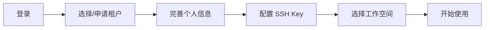
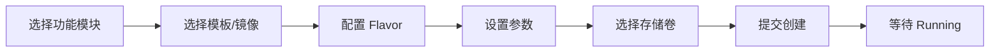

# 常见问题 FAQ

本文收集了 Rune 平台使用中的常见问题与解答，按功能模块分类。

> 💡 提示: 使用浏览器 `Ctrl+F`（Mac: `Cmd+F`）快速搜索关键词定位问题。

---

## 入门指南

### Q: 如何创建平台账号？

**A:** 有两种方式：
1. **自助注册**：如果管理员开启了自助注册功能，在登录页点击"注册"链接，填写用户名、密码、邮箱等信息完成注册
2. **管理员创建**：联系平台管理员在 **BOSS → IAM → 用户管理** 中手动创建账号

> 💡 提示: 自助注册功能默认关闭，需要管理员在 **BOSS → 设置 → 平台设置** 中开启"允许用户自助注册"。

### Q: 首次登录后应该做什么？

**A:** 首次登录的典型流程：



1. **选择租户**：如果已被分配租户，在租户选择页直接进入；否则联系管理员分配
2. **完善信息**：在 **Console → IAM → 个人中心** 补充手机号、邮箱等信息
3. **配置 SSH Key**：在 **Console → IAM → SSH Key** 添加公钥，便于后续连接开发环境
4. **配置 API Key**：如需通过 API 访问平台，在 **Console → IAM → API Key** 创建令牌

### Q: 什么是租户？如何选择租户？

**A:** 租户（Tenant）是平台的资源隔离单元，类似于"组织"或"团队"的概念。一个用户可以属于多个租户，但同一时间只能在一个租户下操作。

在以下场景需要切换租户：
- 登录时在租户选择页选择
- 登录后点击右上角头像 → 切换租户

> ⚠️ 注意: 不同租户之间的资源完全隔离，包括工作空间、实例、配额、成员等。切换租户后会刷新权限和资源列表。

### Q: 如何创建第一个工作空间？

**A:** 需要 **Tenant Admin** 角色：
1. 进入 **Console → Rune → 工作空间**
2. 点击"新建工作空间"
3. 填写名称、描述，选择目标集群
4. 配置资源配额（CPU、内存、GPU 限制）
5. 点击"创建"

> 💡 提示: 工作空间相当于 Kubernetes Namespace 的封装，每个工作空间有独立的资源配额和成员权限。

### Q: 平台支持哪些浏览器？

**A:**

| 浏览器 | 最低版本 | 推荐 |
|--------|---------|:---:|
| Chrome | 90+ | ✅ |
| Firefox | 90+ | ✅ |
| Edge | 90+ | ✅ |
| Safari | 15+ | ✅ |
| IE | — | ❌ 不支持 |

> ⚠️ 注意: 平台为桌面端设计，移动端（屏幕宽度 < 768px）功能受限，仅支持基本查看操作。

### Q: 界面语言如何切换？

**A:** 点击顶栏右侧的语言图标（🌐 地球图标），选择 **中文** 或 **English**。语言偏好会保存到个人账号设置中，下次登录自动生效。

---

## 认证与安全

### Q: 登录后直接跳转到空白页或 404？

**A:** 通常有以下原因：

| 原因 | 解决方式 |
|------|---------|
| 账号未分配任何租户 | 联系管理员在 BOSS 端分配租户 |
| 所在租户已被禁用 | 联系管理员确认租户状态 |
| 首次登录需补充信息 | 按页面提示完成信息填写 |
| 浏览器缓存残留 | 清除浏览器缓存后重试 |

### Q: 登录时提示"图形验证码错误"？

**A:** 图形验证码有效期约 **5 分钟**。点击验证码图片刷新后重新输入。如果频繁失败：
1. 清除浏览器 Cookie
2. 确认输入大小写是否正确
3. 确认系统时钟是否准确（验证码验证可能依赖时间戳）

### Q: 如何重置密码？

**A:** 有两种方式：
- **自助重置**：在登录页点击"忘记密码"，通过绑定的手机号或邮箱接收验证码后重置
- **管理员重置**：联系管理员在 **BOSS → IAM → 用户管理** 中选择用户 → 重置密码

> ⚠️ 注意: 如果手机号和邮箱均已失效，只能由管理员执行重置操作。

### Q: 如何设置 MFA（多因素认证）？

**A:** 在 **Console → IAM → 安全设置** 中：
1. 点击"启用 MFA"
2. 使用 Google Authenticator、Microsoft Authenticator 或其他 TOTP 应用扫描二维码
3. 输入 6 位验证码完成绑定
4. **务必保存恢复码**，设备丢失时需要恢复码

### Q: MFA 设备丢失无法登录？

**A:** MFA 设备丢失后无法自助恢复。联系平台管理员在 **BOSS → IAM → 用户管理** 中解绑 MFA，用户重新登录后可重新绑定。

### Q: API Key 和 JWT Token 有什么区别？

**A:**

| 特性 | JWT Token | API Key |
|------|-----------|---------|
| 获取方式 | 登录接口返回 | 在 Console 手动创建 |
| 使用场景 | 浏览器端自动携带 | 脚本 / 程序调用 API |
| 过期时间 | 较短（小时级） | 可自定义（天/月/年） |
| 刷新方式 | 自动刷新 | 过期后重新创建 |
| Header 格式 | `Authorization: Bearer eyJhbG...` | `Authorization: Bearer sk-xxxx...` |

### Q: 登录会话多久过期？

**A:** JWT Token 的过期时间由平台管理员配置，通常为 **2-24 小时**。Token 过期后前端会自动跳转到登录页。频繁操作的用户可以在偏好设置中开启"保持登录"以延长有效期。

### Q: 平台是否支持 SSO 单点登录？

**A:** 具体取决于部署配置。管理员可在 **BOSS → 设置 → 平台设置** 中配置 LDAP、OAuth2 等外部认证源。配置后用户可通过企业账号直接登录。

---

## 资源管理

### Q: 如何创建实例（推理/开发/微调）？

**A:** 在 **Console → Rune** 中选择对应功能模块：
1. **推理服务**：选择"推理服务" → 新建 → 选择模板/镜像 → 配置 Flavor → 部署
2. **开发环境**：选择"开发环境" → 新建 → 选择 JupyterLab 模板 → 配置资源 → 创建
3. **模型微调**：选择"模型微调" → 新建 → 配置训练参数、数据集、基座模型 → 启动



### Q: GPU 资源不够用怎么办？

**A:** 排查和解决方案：
1. **检查配额**：在 **Console → Rune → 工作空间配额** 查看当前配额使用率
2. **检查资源池**：确认目标集群/资源池还有可用 GPU
3. **优化使用**：停止不需要的实例释放资源
4. **申请扩容**：联系管理员在 BOSS 端提升租户或工作空间配额

> 💡 提示: 开发环境闲置时建议使用"停止"功能暂停实例，释放 GPU 资源。停止的实例不消耗 GPU 配额，恢复后数据不丢失。

### Q: 存储卷有哪些类型？如何选择？

**A:**

| 存储类型 | 适用场景 | 特点 |
|---------|---------|------|
| **SSD 高速存储** | 模型训练、频繁读写 | 高 IOPS，容量较小 |
| **HDD 大容量存储** | 数据集存储、归档 | 大容量，成本低 |
| **共享存储（NFS）** | 多实例共享数据 | 支持多读多写（RWX） |

创建存储卷时需指定：容量、存储类（StorageClass）、访问模式。创建后可在实例创建时挂载。

### Q: 提示"配额不足"怎么解决？

**A:** "配额不足"表示当前工作空间或租户的资源用量已达上限。检查：
1. **工作空间配额**：Console → Rune → 工作空间配额 → 查看 CPU/Memory/GPU 使用量
2. **租户配额**：BOSS → Rune → 租户管理 → 查看租户级配额
3. 清理不需要的实例和存储卷释放已用配额
4. 联系管理员扩大配额

### Q: Flavor 应该怎么选？

**A:** Flavor 定义了实例的硬件资源分配：

| Flavor 示例 | CPU | 内存 | GPU | 适用场景 |
|-------------|-----|------|-----|---------|
| `small-cpu` | 2 核 | 4 GiB | 无 | 小型数据处理、轻量开发 |
| `medium-cpu` | 4 核 | 16 GiB | 无 | 模型推理（CPU 模式） |
| `gpu-1-a100` | 8 核 | 32 GiB | 1×A100 | 模型推理、小规模微调 |
| `gpu-4-a100` | 32 核 | 128 GiB | 4×A100 | 大模型微调、分布式训练 |
| `gpu-8-a100` | 64 核 | 256 GiB | 8×A100 | 大规模训练 |

> 💡 提示: 不确定选哪个时，先选小规格试运行，再根据实际资源使用情况调整。GPU 资源稀缺，用完请及时释放。

---

## 模型操作

### Q: 如何将推理服务注册到 AI 网关？

**A:**
1. 在 **Console → Rune → 推理服务** 中确认实例已 Running
2. 进入实例详情 → "网关注册"标签
3. 点击"注册到网关"，填写模型名称、路径
4. 选择访问级别（公开/私有）
5. 注册成功后，在 **Console → ChatApp** 中即可测试调用

### Q: 模型微调如何选择数据集？

**A:** 微调任务需要挂载数据集存储：
1. 先在 **Console → Moha → 数据集** 中上传或创建数据集
2. 在创建微调任务时，选择数据集存储卷并指定挂载路径
3. 在训练配置中指定数据路径为对应的挂载路径

> ⚠️ 注意: 数据集需要与训练框架要求的格式一致。常见格式有 JSON Lines（.jsonl）、CSV、Parquet 等。

### Q: 模型解密是什么？

**A:** 某些加密的模型文件在部署前需要解密。在实例详情页点击"解密"按钮，输入解密密钥即可。解密操作仅对当前实例生效，不影响原始模型文件。

### Q: 实验追踪如何使用？

**A:** 实验追踪用于记录和比较模型训练的超参数、指标、产出物：
1. 在训练代码中使用平台提供的 SDK 记录指标（loss、accuracy 等）
2. 在 **Console → Rune → 实验追踪** 中查看所有实验记录
3. 支持多实验对比、图表可视化、产出物下载

### Q: 如何使用评估功能？

**A:** 在 **Console → Rune → 模型评估** 中：
1. 选择要评估的模型实例
2. 配置评估数据集和评估指标
3. 启动评估任务
4. 在结果页查看各项指标得分和详细报告

---

## Moha 模型库

### Q: 如何通过 Git 操作模型仓库？

**A:** Moha 仓库支持标准 Git 操作：
```bash
# 克隆仓库
git clone https://platform.example.com/api/moha/organizations/{org}/models/{repo}.git

# 配置 LFS（大文件支持）
git lfs install
git lfs track "*.bin" "*.safetensors" "*.gguf"

# 提交并推送
git add .
git commit -m "upload model weights"
git push origin main
```

> 💡 提示: 认证使用平台用户名 + API Key（或密码）。建议使用 Git Credential Helper 缓存凭据。

### Q: LFS 大文件上传失败？

**A:** LFS 上传失败的常见原因：
1. **文件过大**：单文件超过服务器限制（通常 50GB），联系管理员调整
2. **网络中断**：LFS 上传不支持断点续传，需重新推送。建议使用有线网络
3. **Git LFS 未安装**：执行 `git lfs install` 并确认 `.gitattributes` 配置正确
4. **认证失败**：确认 API Key 未过期

### Q: 容器镜像如何推送到平台？

**A:**
```bash
# 登录镜像仓库
docker login registry.platform.example.com -u <username> -p <api-key>

# 标记镜像
docker tag my-image:latest registry.platform.example.com/{org}/my-image:v1.0

# 推送
docker push registry.platform.example.com/{org}/my-image:v1.0
```

推送后在 **Console → Moha → 容器镜像** 中可管理可见性和描述信息。

### Q: Spaces 应用如何部署？

**A:** Spaces 用于部署 Gradio/Streamlit 等交互式 AI 应用：
1. 在 **Console → Moha → Spaces** 创建空间
2. 上传应用代码（通过 Git 或 Web 页面）
3. 配置 `README.md` 中的元数据（运行时、依赖等）
4. 平台自动构建并部署，完成后可通过 URL 访问

### Q: 组织（Organization）如何管理？

**A:** 组织是 Moha 中管理仓库和成员的顶层单元：
- 创建组织：**Console → Moha → 组织** → 新建
- 添加成员：进入组织详情 → 成员管理 → 添加
- 权限控制：组织管理员可管理所有仓库；普通成员可根据仓库可见性访问

### Q: 如何设置仓库的可见性？

**A:**

| 可见性 | 说明 |
|--------|------|
| **公开 (Public)** | 所有登录用户可查看和克隆 |
| **私有 (Private)** | 仅组织成员可访问 |

在仓库详情页 → 设置 → 可见性中修改。

> ⚠️ 注意: 将公开仓库改为私有后，已经克隆的本地副本仍然可用，但无法再次 pull/push（除非加入组织成员）。

---

## ChatApp 智能对话

### Q: 如何在 ChatApp 中使用模型？

**A:**
1. 确认推理服务已部署且注册到 AI 网关
2. 进入 **Console → ChatApp → 体验** 页面
3. 在模型选择器中选择可用模型
4. 开始对话

### Q: 流式响应（Streaming）不工作？

**A:** 排查步骤：
1. 确认渠道配置中已启用 `stream` 支持
2. 确认浏览器未安装阻止 SSE（Server-Sent Events）的插件
3. 检查网络代理/WAF 是否拦截了长连接
4. 查看后端推理服务是否支持流式输出

### Q: Token 限速（Rate Limiting）如何配置？

**A:** Token 限速在 **BOSS → 网关 → API Key** 或 **Console → ChatApp → Token** 中配置：
- **RPM**（Requests Per Minute）：每分钟最大请求数
- **TPM**（Tokens Per Minute）：每分钟最大 Token 消耗数
- **配额总量**：Token 可消耗的总 Token 数，用完即失效

> 💡 提示: 不设置 RPM/TPM 表示不限速。生产环境建议合理设置限速，避免单个用户占用过多资源。

### Q: 支持哪些模型参数调整？

**A:** ChatApp 调试模式支持调整以下参数：

| 参数 | 范围 | 说明 |
|------|------|------|
| `temperature` | 0.0 - 2.0 | 采样温度，越高结果越随机 |
| `top_p` | 0.0 - 1.0 | 核采样阈值 |
| `max_tokens` | 1 - 模型上限 | 最大生成 Token 数 |
| `frequency_penalty` | -2.0 - 2.0 | 频率惩罚 |
| `presence_penalty` | -2.0 - 2.0 | 存在惩罚 |

---

## BOSS 管理端

### Q: 如何注册新集群？

**A:** 在 **BOSS → Rune → 集群管理** 中：
1. 点击"注册集群"
2. 填写集群名称、API Server 地址
3. 上传或粘贴 kubeconfig 文件
4. 配置调度器参数（可选）
5. 点击"注册"，系统会自动验证连通性

> ⚠️ 注意: 注册前请确保平台服务器能访问集群的 API Server。支持 `?dry-run=true` 参数先验证配置。

### Q: 如何上传应用模板？

**A:** 在 **BOSS → Rune → 系统模板市场** 中：
1. 点击"上传模板"
2. 选择 Helm Chart 包（`.tgz` 格式）
3. 填写模板名称、描述、图标等元信息
4. 设置可见性（系统级 / 租户级）
5. 上传完成后可管理 Chart 版本

### Q: 渠道（Channel）如何配置？

**A:** 渠道定义了 API 请求如何路由到 LLM 后端：
1. 进入 **BOSS → 网关 → 渠道管理**
2. 点击"新建渠道"
3. 配置后端地址（推理服务的 URL）
4. 设置支持的模型列表
5. 配置密钥（如果后端需要认证）
6. 设置权重和优先级（多渠道负载均衡）

### Q: 内容审核如何设置？

**A:** 在 **BOSS → 网关 → 内容审核** 中：
1. **创建词库**：添加敏感词条或批量导入
2. **创建策略**：选择审核类型（输入审核 / 输出审核），关联词库
3. **设置优先级**：多策略时按优先级顺序执行
4. 命中敏感词后，系统会拦截请求并返回错误

### Q: 审计日志如何清理？

**A:** 在 **BOSS → 网关 → 审计日志** 中：
- 手动清理：点击"清理"按钮，设置清理时间范围
- 自动清理：配置保留天数，系统自动清理过期记录

### Q: 如何修改平台 Logo 和名称？

**A:**
1. 进入 **BOSS → 设置 → 平台设置**
2. 上传新的 Logo 图片
3. 修改平台名称和描述
4. 保存后刷新页面生效

### Q: 如何配置动态仪表盘？

**A:**
1. 进入 **BOSS → 设置 → 动态仪表盘**
2. 配置 Grafana/Prometheus 数据源地址
3. 选择或自定义仪表盘面板
4. 用户在 Console 首页即可看到对应的监控图表

---

## 故障排查

### Q: 实例创建后长时间处于 "Pending" 状态？

**A:** 常见原因及对策：

| 原因 | 排查方式 | 解决方案 |
|------|---------|---------|
| 集群资源不足 | 查看实例事件，查找 `Insufficient` 关键词 | 更换 Flavor 或释放其他实例 |
| 镜像拉取失败 | 查看事件中 `ImagePullBackOff` 错误 | 确认镜像地址和凭据配置 |
| 存储卷未绑定 | 查看事件中 PVC 相关错误 | 检查存储卷状态，确认 StorageClass 可用 |
| 调度器限制 | 查看事件中 `Unschedulable` | 确认节点标签和资源池配置 |
| 配额超限 | 查看事件中 `exceeded quota` | 扩大配额或释放资源 |

**查看事件方法**：实例详情 → "事件"标签页 → 查看 Kubernetes 事件列表

### Q: 推理服务部署后访问返回 502？

**A:** 502 表示网关无法连接到后端服务，排查步骤：
1. 进入实例详情 → 检查 Pod 状态是否为 Running
2. 查看 Pod 日志，确认服务是否已成功启动和监听端口
3. 确认服务端口与实例配置（Ingress/Service）一致
4. 实例刚启动时服务可能还在加载模型，等待 1-5 分钟后重试
5. 联系管理员检查集群 Ingress Controller 和网关配置

### Q: SSH 连接开发环境失败？

**A:**
1. **确认 SSH Key 已添加**：Console → IAM → SSH Key 中确认公钥存在
2. **确认实例 Running**：实例必须处于 Running 状态
3. **确认连接信息**：在实例详情页的"访问入口"中获取正确的 SSH 地址和端口
4. **检查网络**：确认本地网络能访问平台的 SSH 端口（通常非标准端口）
5. **调试连接**：使用 `ssh -v user@host -p port` 查看详细日志

### Q: 文件上传失败或进度卡住？

**A:** 文件上传问题排查：


| 症状 | 原因 | 解决 |
|------|------|------|
| 进度卡在 0% | 网络不通或认证失败 | 检查网络，刷新页面重试 |
| 进度卡在某个百分比 | 网络不稳定导致分片上传中断 | 检查网络稳定性，重新上传 |
| 上传完成但看不到文件 | 后端处理中（特别是大文件） | 等待几分钟后刷新 |
| 报错 413 | 文件超过服务器大小限制 | 联系管理员调整 Nginx 限制 |
| 报错 403 | 无上传权限 | 确认角色权限 |

> 💡 提示: 上传大文件时保持浏览器标签页打开，不要切换到其他页面。超过 10GB 的文件建议使用命令行工具上传。

### Q: 日志查看器显示"无数据"？

**A:**
1. **确认时间范围**：日志查询的时间范围内是否有实例运行
2. **确认日志源**：选择正确的 Pod / Container
3. **确认 Loki 服务**：联系管理员确认 Loki 日志服务运行正常且已正确配置
4. **检查标签选择器**：确认 namespace、pod 等筛选条件正确

### Q: 微调任务失败，如何查看错误原因？

**A:** 在 **Console → Rune → 模型微调** 列表中点击对应任务，进入详情页查看：
- **事件标签**：Kubernetes 事件列表，包含 OOM（内存溢出）、镜像拉取失败等系统级错误
- **日志标签**：训练容器的标准输出，包含数据加载错误、参数配置错误、代码异常等
- **状态信息**：`status.phase` 和 `status.conditions` 记录了最终失败原因

常见失败原因：

| 错误 | 原因 | 解决 |
|------|------|------|
| `OOMKilled` | GPU 显存或系统内存不足 | 增大 Flavor 或减小 batch_size |
| `ImagePullBackOff` | 镜像不存在或无权限 | 确认镜像地址和凭据 |
| `CrashLoopBackOff` | 训练代码启动失败 | 查看日志排查代码错误 |
| `DeadlineExceeded` | 超出最大运行时间 | 增大超时配置或优化训练 |

### Q: 存储卷挂载后实例内看不到文件？

**A:**
1. 确认挂载路径是否正确（**区分大小写**）
2. 文件是否上传到了存储卷的正确子路径
3. 进入实例终端执行 `ls -la <mount-path>` 确认
4. 确认存储卷状态为 `Bound`
5. 如果是共享存储卷，确认其他实例没有独占锁定

### Q: 页面显示异常或排版错乱？

**A:**
1. 清除浏览器缓存（`Ctrl+Shift+Delete`）
2. 硬刷新页面（`Ctrl+Shift+R`）
3. 确认浏览器版本满足最低要求
4. 禁用浏览器扩展（特别是广告屏蔽器和暗色模式插件）
5. 如果使用系统缩放，尝试恢复 100% 缩放比

### Q: 构建/部署操作报 "Timeout" 错误？

**A:**
1. 检查集群状态是否正常（BOSS → Rune → 集群管理 → 查看集群健康状态）
2. 大型镜像构建可能需要较长时间，适当增大超时设置
3. 确认网络连通性（集群能否拉取外部依赖和镜像）
4. 查看集群日志确认是否有节点级问题

---

## 更多帮助

如果以上 FAQ 未能解决您的问题：

1. **查看文档**：浏览本文档站的各功能模块详细说明
2. **查看 API 文档**：参考 [API 概览](./api-overview.md) 检查接口调用是否正确
3. **查看权限说明**：参考 [权限设计详解](./permissions.md) 确认权限配置
4. **联系管理员**：通过平台内部沟通渠道联系平台管理员
5. **提交工单**：如果平台部署了工单系统，通过工单提交技术支持请求

> 💡 提示: 提交问题时请附上：问题截图、浏览器控制台错误信息（F12 → Console）、操作步骤，这将帮助技术人员更快定位问题。
