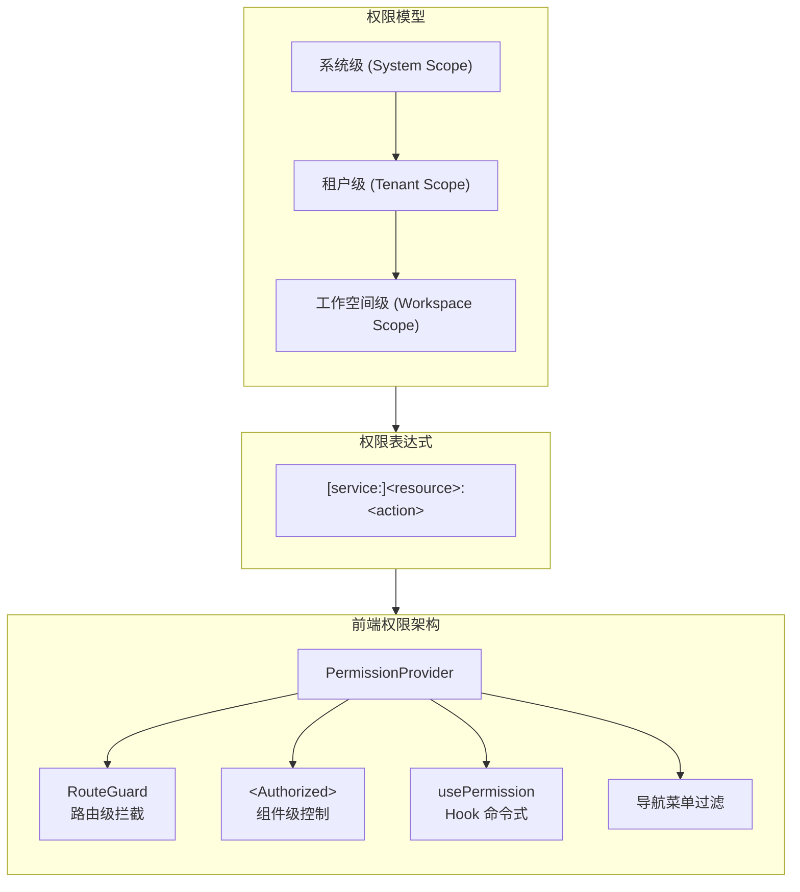
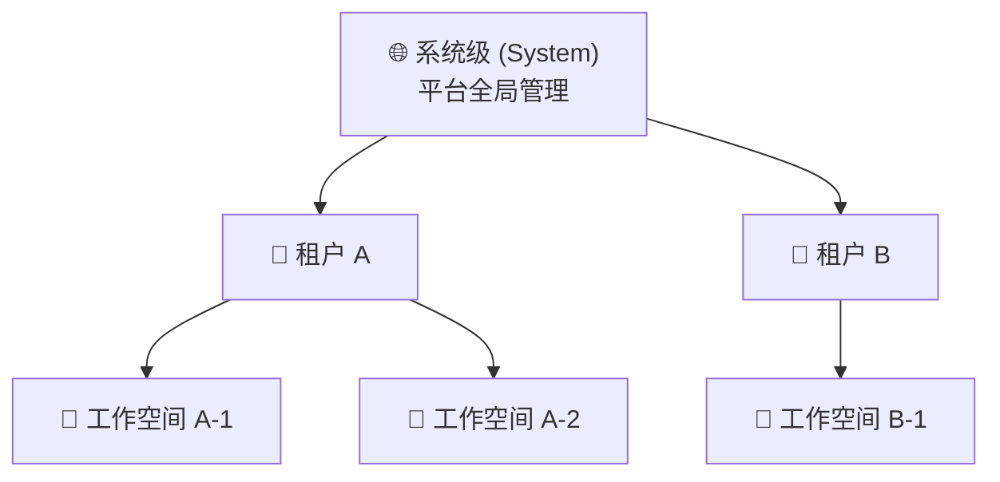
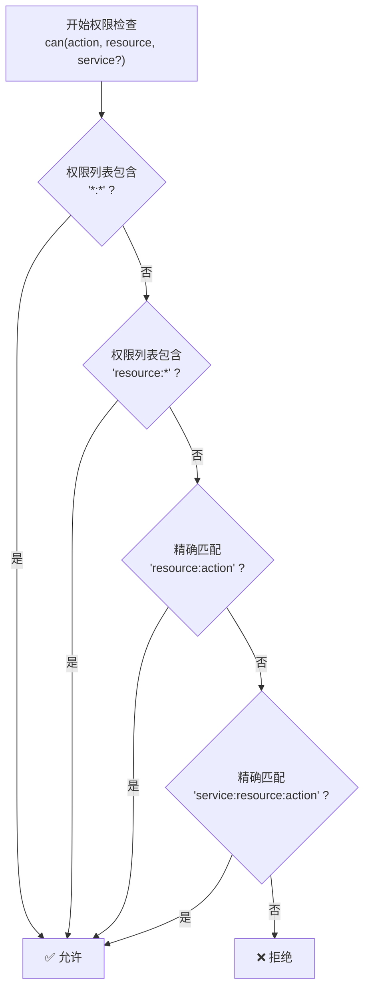
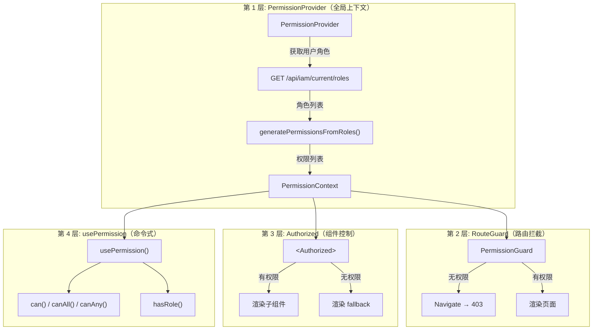

# 权限设计详解

Rune Console 采用 **三级作用域 + 表达式匹配** 的权限模型，前端通过四层机制实现 UI 级的权限控制。本文详细说明权限体系的各个组成部分。

> 💡 提示: 前端权限仅用于优化用户体验（隐藏/禁用无权操作的 UI），**真正的安全屏障始终由后端 API 实现**。前端权限和后端权限是松耦合的——前端只关心"有没有权限"，不关心后端如何判定。

---

## 权限模型总览



### 设计原则

| 原则 | 说明 |
|------|------|
| **前端 = UI 优化** | 通过隐藏/禁用 UI 元素减少用户困惑，不作为安全屏障 |
| **后端 = 安全控制** | 所有 API 请求均在后端校验权限，未通过返回 `403` |
| **松耦合** | 前端只消费权限结果（`can` / `hasRole`），不参与权限判定逻辑 |
| **最小权限** | 用户默认无权限，只有被明确授予的权限才会生效 |
| **按需刷新** | 登录、切换租户/工作空间、角色变更时自动重新获取权限 |

---

## 三级作用域模型

Rune 权限体系采用 **System → Tenant → Workspace** 三级层级结构。上级作用域的权限可以覆盖下级。



| 作用域 | 标识 | 说明 | 示例 |
|--------|------|------|------|
| **System** | 无 `tenant`、无 `workspace` | 平台全局权限，可管理所有租户和资源 | 系统管理员可在 BOSS 端管理整个平台 |
| **Tenant** | 指定 `tenant`，无 `workspace` | 限定在某个租户范围内的权限 | 租户管理员可管理本租户下所有工作空间 |
| **Workspace** | 指定 `tenant` + `workspace` | 限定在某个工作空间的权限 | 工作空间管理员可管理该工作空间的实例和成员 |

> ⚠️ 注意: 系统管理员（System Admin）自动拥有所有租户和工作空间的全部权限。当 `hasRole` 检测到系统管理员时，会直接返回 `true` 而跳过作用域匹配。

### 作用域匹配逻辑

```typescript
// src/auth/authz/context.tsx - hasRole 实现
const hasRole = (role: string, scope?: RoleScope) => {
  // 系统管理员视为拥有所有角色
  const isSystemAdmin = state.roles.some(
    (r) => r.roles?.includes('admin') && !r.tenant && !r.workspace
  );
  if (isSystemAdmin) return true;

  return state.roles.some((r) => {
    if (!r.roles?.includes(role)) return false;
    if (scope?.tenant && r.tenant !== scope.tenant) return false;
    if (scope?.workspace && r.workspace !== scope.workspace) return false;
    if (!scope && (r.tenant || r.workspace)) return false;
    return true;
  });
};
```

#### 匹配示例

| 调用方式 | 含义 | 谁能通过 |
|---------|------|---------|
| `hasRole('admin')` | 检查系统级管理员 | 仅系统管理员 |
| `hasRole('admin', { tenant: 'acme' })` | 检查租户 acme 的管理员 | 系统管理员 + acme 租户管理员 |
| `hasRole('developer', { tenant: 'acme' })` | 检查租户 acme 的开发者 | 系统管理员 + acme 开发者 |
| `hasRole('admin', { tenant: 'acme', workspace: 'ws-1' })` | 检查工作空间级管理员 | 系统管理员 + 该工作空间管理员 |

---

## 权限表达式语法

权限以字符串形式表达，格式如下：

```
[service:]<resource>:<action>
```

### 组成部分

| 部分 | 是否必须 | 说明 | 示例值 |
|------|---------|------|--------|
| `service` | 可选 | 服务前缀，用于区分不同后端服务 | `compute`、`storage`、`ai` |
| `resource` | **必须** | 资源类型 | `workspace`、`instance`、`image`、`template`、`member`、`quota`、`volume` |
| `action` | **必须** | 操作类型 | `list`、`get`、`create`、`update`、`delete`、`*` |

### 表达式示例

| 表达式 | 含义 | 场景 |
|--------|------|------|
| `workspace:list` | 列出工作空间 | 查看工作空间列表页 |
| `workspace:create` | 创建工作空间 | 展示"新建工作空间"按钮 |
| `workspace:get` | 查看工作空间详情 | 进入工作空间详情页 |
| `workspace:delete` | 删除工作空间 | 展示"删除"按钮 |
| `workspace:*` | 工作空间的全部操作 | 授予工作空间完整权限 |
| `instance:create` | 创建实例 | 展示"创建实例"入口 |
| `instance:delete` | 删除实例 | 展示"删除"操作 |
| `member:*` | 成员管理全部操作 | 授予成员管理权限 |
| `compute:instance:create` | 创建计算实例（带 service） | 精确限定服务维度的权限 |
| `*:*` | 所有资源的所有操作 | 系统管理员通配符 |

---

## 通配符匹配规则

权限检查支持 `*` 通配符，匹配逻辑按以下优先级处理：



| 通配符 | 匹配范围 | 说明 |
|--------|---------|------|
| `*:*` | 所有资源的所有操作 | 最高权限，仅系统管理员拥有 |
| `resource:*` | 指定资源的所有操作 | 如 `instance:*` 可执行实例的 CRUD 全部操作 |
| 精确匹配 | 一个具体操作 | 如 `instance:list` 仅允许查看实例列表 |

> 💡 提示: 通配符检查的源代码实现在 `PermissionProvider` 的 `can` 方法中，顺序为：全局通配 → 资源通配 → 精确匹配。不支持 action 维度的通配符（如 `*:list`）。

### 检查流程源码

```typescript
// src/auth/authz/context.tsx
const can = (action: string, resource: string, service?: string) => {
  // 1. 全局通配符
  if (state.permissions.includes('*:*')) return true;
  // 2. 资源通配符
  if (state.permissions.includes(`${resource}:*`)) return true;
  // 3. 精确匹配
  const permission = service
    ? `${service}:${resource}:${action}`
    : `${resource}:${action}`;
  return state.permissions.includes(permission);
};
```

---

## 角色定义

### 角色概览

Rune 预定义了 4 个角色，每个角色在特定作用域内拥有一组固定权限：

| 角色 | 枚举值 | 作用域 | 可访问端 | 说明 |
|------|--------|--------|---------|------|
| **系统管理员** | `admin`（无 tenant/workspace） | System | BOSS + Console | 平台最高权限 |
| **租户管理员** | `admin`（有 tenant） | Tenant | Console | 管理本租户所有资源 |
| **开发者** | `developer` | Tenant | Console | 可操作实例，只读查看其他资源 |
| **成员** | `member` | Tenant | Console | 仅查看权限 |

### 系统管理员 (System Admin)

- **作用域**：全局（无租户/工作空间限制）
- **权限**：`*:*`（所有资源的所有操作）
- **说明**：拥有平台最高权限，可访问 BOSS 管理端，可管理所有租户、集群、用户

```typescript
// 判定条件：admin 角色 + 无 tenant + 无 workspace
roleName === 'admin' && !role.tenant && !role.workspace
// → permissions: ['*:*']
```

### 租户管理员 (Tenant Admin)

- **作用域**：指定租户
- **权限列表**：

| 权限表达式 | 说明 |
|-----------|------|
| `workspace:*` | 工作空间全部操作（创建/查看/编辑/删除） |
| `member:*` | 成员管理全部操作（添加/移除/修改角色） |
| `quota:*` | 配额管理全部操作（查看/设置配额限制） |
| `instance:*` | 实例全部操作（创建/启停/删除/查看日志） |
| `image:*` | 镜像全部操作（创建/编辑/删除） |
| `template:*` | 模板全部操作（上传/编辑/删除） |
| `volume:*` | 存储卷全部操作（创建/挂载/删除） |

```typescript
// 判定条件：admin 角色 + 有 tenant + 无 workspace
roleName === 'admin' && role.tenant && !role.workspace
```

### 开发者 (Developer)

- **作用域**：指定租户
- **权限列表**：

| 权限表达式 | 说明 |
|-----------|------|
| `workspace:list` | 查看工作空间列表 |
| `workspace:get` | 查看工作空间详情 |
| `instance:*` | 实例全部操作（创建/启停/删除/查看日志） |
| `image:list` | 查看镜像列表 |
| `image:get` | 查看镜像详情 |
| `template:list` | 查看模板列表 |
| `template:get` | 查看模板详情 |

```typescript
// 判定条件：developer 角色 + 有 tenant
roleName === 'developer' && role.tenant
```

### 成员 (Member)

- **作用域**：指定租户
- **权限列表**：

| 权限表达式 | 说明 |
|-----------|------|
| `workspace:list` | 查看工作空间列表 |
| `workspace:get` | 查看工作空间详情 |
| `instance:list` | 查看实例列表 |
| `instance:get` | 查看实例详情 |
| `image:list` | 查看镜像列表 |
| `image:get` | 查看镜像详情 |

```typescript
// 判定条件：member 角色 + 有 tenant
roleName === 'member' && role.tenant
```

---

## 角色权限对比矩阵

下表汇总了每个角色在各资源上的操作权限：

### 资源操作权限

| 资源 | 操作 | System Admin | Tenant Admin | Developer | Member |
|------|------|:---:|:---:|:---:|:---:|
| **workspace** | list / get | ✅ | ✅ | ✅ | ✅ |
| **workspace** | create / update / delete | ✅ | ✅ | ❌ | ❌ |
| **instance** | list / get | ✅ | ✅ | ✅ | ✅ |
| **instance** | create / update / delete | ✅ | ✅ | ✅ | ❌ |
| **instance** | stop / resume / exec / logs | ✅ | ✅ | ✅ | ❌ |
| **image** | list / get | ✅ | ✅ | ✅ | ✅ |
| **image** | create / update / delete | ✅ | ✅ | ❌ | ❌ |
| **template** | list / get | ✅ | ✅ | ✅ | ❌ |
| **template** | create / update / delete | ✅ | ✅ | ❌ | ❌ |
| **member** | list / get | ✅ | ✅ | ❌ | ❌ |
| **member** | create / update / delete | ✅ | ✅ | ❌ | ❌ |
| **quota** | list / get | ✅ | ✅ | ❌ | ❌ |
| **quota** | create / update / delete | ✅ | ✅ | ❌ | ❌ |
| **volume** | list / get | ✅ | ✅ | ❌ | ❌ |
| **volume** | create / update / delete | ✅ | ✅ | ❌ | ❌ |

### 功能入口权限

| 功能 | System Admin | Tenant Admin | Developer | Member |
|------|:---:|:---:|:---:|:---:|
| BOSS 管理后台 | ✅ | ❌ | ❌ | ❌ |
| Console 控制台 | ✅ | ✅ | ✅ | ✅ |
| 推理服务管理 | ✅ | ✅ | ✅ | ❌ |
| 模型微调 | ✅ | ✅ | ✅ | ❌ |
| 开发环境 | ✅ | ✅ | ✅ | ❌ |
| 实验追踪 | ✅ | ✅ | ✅ | ❌ |
| 工作空间管理 | ✅ | ✅ | ❌ | ❌ |
| 成员管理 | ✅ | ✅ | ❌ | ❌ |
| 配额管理 | ✅ | ✅ | ❌ | ❌ |
| 集群管理 | ✅ | ❌ | ❌ | ❌ |
| 用户管理 | ✅ | ❌ | ❌ | ❌ |

---

## 前端权限架构

前端权限控制分为 **四层**，从全局到局部覆盖不同粒度：



### 第 1 层：PermissionProvider — 全局权限上下文

`PermissionProvider` 是权限体系的根组件，包裹整个应用。它在用户认证成功后自动调用 `GET /api/iam/current/roles` 获取角色信息，然后通过 `generatePermissionsFromRoles()` 将角色转换为权限字符串列表，通过 React Context 向子组件提供权限能力。

```tsx
// src/app.tsx
<AuthnProvider>
  <PermissionProvider>
    <Router />
  </PermissionProvider>
</AuthnProvider>
```

**Context 提供的方法**：

| 方法 | 签名 | 说明 |
|------|------|------|
| `can` | `(action, resource, service?) → boolean` | 检查单个权限 |
| `canAll` | `(checks: PermissionCheck[]) → boolean` | 检查多个权限（全部满足） |
| `canAny` | `(checks: PermissionCheck[]) → boolean` | 检查多个权限（任一满足） |
| `hasRole` | `(role, scope?: RoleScope) → boolean` | 检查是否拥有指定角色 |
| `refresh` | `() → Promise<void>` | 手动刷新权限 |
| `loading` | `boolean` | 权限是否正在加载中 |

### 第 2 层：PermissionGuard — 路由级拦截

用 `PermissionGuard` 组件保护整个页面。若无权限，自动重定向到 403 页面：

```tsx
// 保护单个操作的路由
<PermissionGuard action="create" resource="workspace">
  <WorkspaceCreatePage />
</PermissionGuard>

// 保护需要多个权限的路由（AND 模式）
<PermissionGuard
  checks={[
    { action: 'list', resource: 'instance' },
    { action: 'list', resource: 'template' },
  ]}
  mode="all"
>
  <DeployPage />
</PermissionGuard>

// 保护需要任一权限的路由（OR 模式）
<PermissionGuard
  checks={[
    { action: 'create', resource: 'instance' },
    { action: 'create', resource: 'workspace' },
  ]}
  mode="any"
>
  <QuickCreatePage />
</PermissionGuard>
```

> 💡 提示: `PermissionGuard` 在权限加载中时展示 `SplashScreen` 全屏加载动画，避免在权限未确定前短暂闪现 403 页面。

### 第 3 层：\<Authorized\> — 声明式组件级控制

在页面内部使用 `<Authorized>` 组件精细控制 UI 元素的显示/隐藏：

```tsx
{/* 单个权限检查 — 无权限时隐藏 */}
<Authorized action="delete" resource="workspace">
  <DeleteButton />
</Authorized>

{/* 带 fallback — 无权限时展示禁用按钮 */}
<Authorized action="edit" resource="instance" fallback={<DisabledButton />}>
  <EditButton />
</Authorized>

{/* 多权限检查（AND） */}
<Authorized
  checks={[
    { action: 'create', resource: 'instance' },
    { action: 'list', resource: 'template' },
  ]}
>
  <DeployButton />
</Authorized>

{/* 多权限检查（OR） */}
<Authorized
  checks={[
    { action: 'create', resource: 'instance' },
    { action: 'create', resource: 'workspace' },
  ]}
  mode="any"
>
  <QuickActionMenu />
</Authorized>

{/* 角色检查 — 仅管理员可见 */}
<Authorized role="admin" fallback={<NoPermissionView />}>
  <AdminPanel />
</Authorized>

{/* 角色 + 作用域检查 */}
<Authorized role="admin" roleScope={{ tenant: tenantId }}>
  <TenantSettingsButton />
</Authorized>
```

**组件 Props**：

| Prop | 类型 | 说明 |
|------|------|------|
| `action` | `string` | 操作类型 |
| `resource` | `string` | 资源类型 |
| `service` | `string` | 服务前缀（可选） |
| `checks` | `PermissionCheck[]` | 多权限检查数组 |
| `mode` | `'all' \| 'any'` | 多权限判断模式，默认 `'all'` |
| `role` | `string` | 角色名称（优先于 action/resource 检查） |
| `roleScope` | `RoleScope` | 角色作用域 `{ tenant?, workspace? }` |
| `fallback` | `ReactNode` | 无权限时的降级 UI，默认 `null` |
| `children` | `ReactNode` | 有权限时渲染的子组件 |

### 第 4 层：usePermission — 命令式 Hook

在业务逻辑中通过 Hook 进行动态权限判断：

```tsx
import { usePermission } from 'src/auth/authz';

function InstanceToolbar({ tenant }: { tenant: string }) {
  const { can, canAll, canAny, hasRole } = usePermission();

  // 检查单个权限
  const canCreate = can('create', 'instance');

  // 检查带 service 前缀的权限
  const canCreateCompute = can('create', 'instance', 'compute');

  // 检查多个权限（全部满足）
  const canDeploy = canAll([
    { action: 'create', resource: 'instance' },
    { action: 'list', resource: 'template' },
  ]);

  // 检查多个权限（任一满足）
  const canManage = canAny([
    { action: 'update', resource: 'instance' },
    { action: 'delete', resource: 'instance' },
  ]);

  // 检查租户管理员角色
  const isTenantAdmin = hasRole('admin', { tenant });

  // 检查系统管理员角色
  const isSystemAdmin = hasRole('admin');

  return (
    <Toolbar>
      {canCreate && <CreateButton />}
      {isTenantAdmin && <BatchDeleteButton />}
    </Toolbar>
  );
}
```

---

## 导航菜单过滤

导航菜单项通过 `roles` 属性配置角色白名单。用户仅能看到自己角色允许的菜单项。Layout 组件在渲染导航时根据用户角色进行过滤：

```tsx
// src/routes/navs/rune.tsx — 导航菜单配置示例
const runeNavItems = [
  {
    title: '工作空间',
    path: '/rune/workspaces',
    roles: [TenantRole.ADMIN, TenantRole.DEVELOPER],  // 仅管理员和开发者可见
  },
  {
    title: '推理服务',
    path: '/rune/inferences',
    roles: [TenantRole.ADMIN, TenantRole.DEVELOPER],  // 仅管理员和开发者可见
  },
  {
    title: '开发环境',
    path: '/rune/devenvs',
    roles: [TenantRole.ADMIN, TenantRole.DEVELOPER],  // 仅管理员和开发者可见
  },
  {
    title: '模型微调',
    path: '/rune/finetunes',
    roles: [TenantRole.ADMIN, TenantRole.DEVELOPER],  // 仅管理员和开发者可见
  },
  {
    title: '实例列表',
    path: '/rune/instances',
    // 未配置 roles — 所有角色可见
  },
];
```

**过滤逻辑**：

| 场景 | 行为 |
|------|------|
| 菜单项未配置 `roles` | 所有用户可见 |
| 菜单项配置了 `roles` | 用户角色在列表中才显示 |
| 系统管理员 | 所有菜单项可见（`hasRole` 对系统管理员始终返回 `true`） |
| BOSS 管理端菜单 | 外层由 `<Authorized role="admin">` 包裹，仅系统管理员可进入 |

---

## 权限刷新时机

以下事件会触发权限重新获取：

| 触发事件 | 说明 | 实现方式 |
|---------|------|---------|
| **登录成功** | 初始化用户权限 | `useEffect` 监听 `authenticated` 状态变化 |
| **切换租户** | 不同租户可能有不同角色 | 租户切换后触发 `refresh()` |
| **切换工作空间** | 工作空间级别可能有独立权限 | 工作空间变更后触发 `refresh()` |
| **角色变更** | 管理员修改了用户角色 | 由管理操作方通知或手动刷新 |
| **手动刷新** | 用户 F5 刷新页面 | `PermissionProvider` 重新挂载 |
| **退出登录** | 清空权限信息 | `authenticated = false` 时清空 roles 和 permissions |

> ⚠️ 注意: 如果管理员在 BOSS 端修改了用户角色，用户端不会实时收到通知。用户需要 **刷新页面** 或 **重新切换租户** 才能获取最新权限。

---

## 实际场景指南

### 场景 1：给用户只读权限

**需求**：某用户需要查看租户内的实例和镜像列表，但不允许任何写操作。

**方案**：将用户在目标租户中设为 **Member** 角色。

```
该用户将获得的权限：
workspace:list, workspace:get    → 可查看工作空间列表和详情
instance:list, instance:get      → 可查看实例列表和详情
image:list, image:get            → 可查看镜像列表和详情
```

**操作步骤**：
1. 进入 **Console → IAM → 成员管理**
2. 点击"添加成员"，选择目标用户
3. 角色选择 **Member**
4. 保存

### 场景 2：允许用户自主创建和管理实例

**需求**：某用户需要自行创建、停止、删除实例，但不需要管理工作空间和成员。

**方案**：将用户在目标租户中设为 **Developer** 角色。

```
该用户将获得的权限：
workspace:list, workspace:get    → 可查看工作空间（但不能增删改）
instance:*                       → 实例全部操作
image:list, image:get            → 可查看镜像（但不能增删改）
template:list, template:get      → 可查看模板（但不能增删改）
```

### 场景 3：将某人设为租户管理员

**需求**：某用户需要管理整个租户，包括工作空间、成员、配额、实例等。

**方案**：在目标租户中将用户角色设为 **Tenant Admin**。

```
该用户将获得的权限：
workspace:*, member:*, quota:*, instance:*, image:*, template:*, volume:*
→ 可管理该租户下的所有资源，但不能访问 BOSS 管理端
```

### 场景 4：权限不一致的排查

**现象**：用户反馈"看不到某个按钮"或"页面显示 403"。

**排查步骤**：
1. 确认用户当前选择的租户是否正确（右上角头像 → 切换租户）
2. 确认用户在该租户中的角色（IAM → 成员管理 → 查看成员角色）
3. 对照上方的角色权限矩阵，确认该角色是否具备所需权限
4. 如果角色刚被修改，提示用户 **刷新页面**
5. 如果后端返回 403 但前端显示有权限，说明前后端权限不一致，需检查后端角色配置

---

## 最佳实践

| 实践 | 说明 |
|------|------|
| 🔒 **始终在后端验证权限** | 前端权限仅为 UI 优化，不可依赖前端做安全控制 |
| 🎯 **最小权限原则** | 为用户分配满足需求的最小角色，避免过度授权 |
| 🔄 **权限异常时刷新** | 若遇到权限不一致，提示用户刷新页面 |
| 📋 **角色分配审计** | 建议记录角色变更历史，便于安全审计 |
| 🧪 **使用 loading 状态** | 权限加载中时不要渲染需要权限判断的 UI，避免闪烁 |
| 🏗️ **优先使用声明式** | 优先使用 `<Authorized>` 和 `<PermissionGuard>`，仅在需要动态逻辑时使用 `usePermission` |
| 📌 **角色检查优先于权限检查** | `<Authorized>` 中 `role` 属性优先于 `action/resource`，避免混用 |
